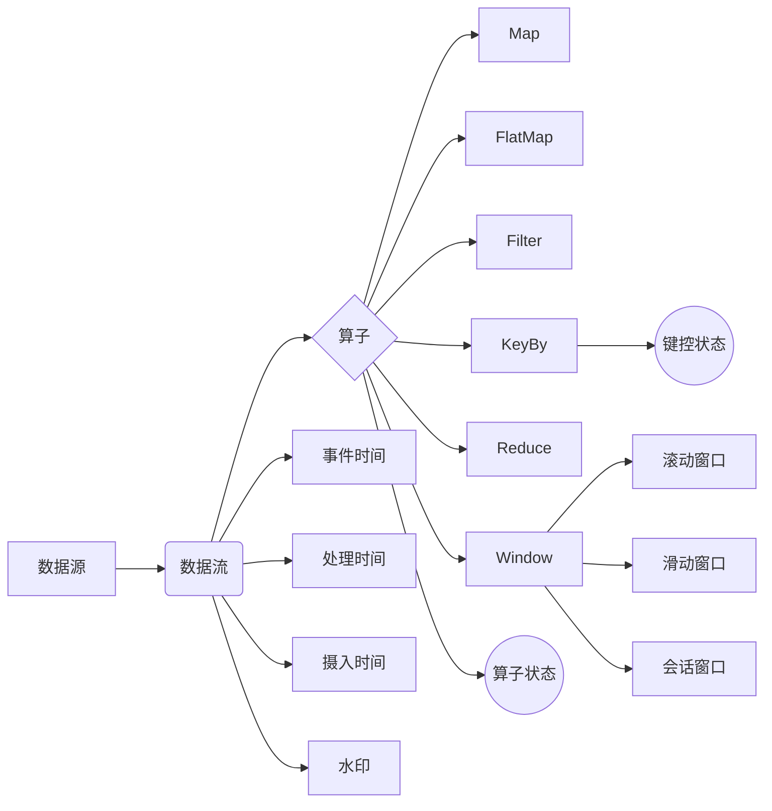
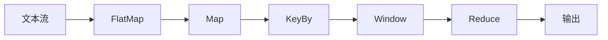

# 流处理 原理与代码实例讲解

## 1.背景介绍
### 1.1 流处理的定义与特点
流处理(Stream Processing)是一种实时处理连续的数据流的计算模式。与传统的批处理不同,流处理系统需要在数据到达时立即对其进行处理,从而实现对数据的实时分析和响应。流处理具有低延迟、高吞吐、持续计算等特点,适用于对时效性要求较高的场景,如实时监控、风险控制、异常检测等。

### 1.2 流处理的发展历程
流处理技术最早起源于20世纪60年代,但直到21世纪初,随着互联网的迅猛发展和数据量的爆发式增长,流处理才逐渐成为大数据领域的研究热点。近年来,流处理技术不断发展成熟,涌现出一批优秀的流处理框架,如Storm、Spark Streaming、Flink等,极大地推动了流处理在工业界的应用。

### 1.3 流处理的应用场景
流处理在诸多领域都有广泛的应用,典型的应用场景包括:
- 实时数据分析:如网站点击流日志分析、用户行为分析等。
- 实时风控与反欺诈:如金融交易实时监控、信用卡欺诈检测等。  
- 物联网数据处理:如传感器数据的实时分析、智能设备的状态监控等。
- 实时推荐与广告投放:根据用户的实时行为给出个性化推荐或投放广告。

## 2.核心概念与联系
### 2.1 数据流(Data Stream)
数据流是流处理的核心概念,可以看作是一个无界、实时、持续到达的数据序列。数据流中的每个数据项称为事件(Event),事件可以携带一个时间戳属性,表示事件的产生时间或到达流处理系统的时间。 

### 2.2 算子(Operator)
算子是流处理的基本单元,用于对数据流进行转换操作。常见的算子包括:
- Map:将数据流中的每个事件转换为另一个事件。
- FlatMap:将每个事件转换为0个、1个或多个事件。
- Filter:根据指定条件过滤事件。
- KeyBy:根据指定的键(Key)对数据流进行分区。
- Reduce:对每个键上的事件序列进行聚合。
- Window:在事件流上定义一个窗口,如滑动窗口、滚动窗口等,可在窗口上应用聚合操作。

### 2.3 状态(State)
由于流处理系统需要持续不断地处理数据,因此需要在算子中维护状态,用于保存计算过程中的中间结果,如聚合结果、 Bloom Filter等。根据状态的作用域,可分为算子状态和键控状态两类。

### 2.4 时间语义(Time Semantics) 
流处理中的时间语义决定了如何处理事件的时间戳,以及处理结果对准确性的要求。常见的时间语义有:
- 事件时间(Event Time):事件自身携带的生成时间戳。
- 处理时间(Processing Time):事件到达流处理系统被处理的时间。
- 摄入时间(Ingestion Time):事件进入流处理系统的时间。

### 2.5 水印(Watermark)
水印是一种衡量事件时间进展的机制,本质上是一个单调递增的时间戳,用于处理乱序事件。Watermark(t)表示时间戳 ≤ t 的事件都已经到达,之后流中不会再出现时间戳 ≤ t 的事件。

### 2.6 窗口(Window)
窗口是流处理中对无界数据流进行有界切分的手段,可以在窗口上定义聚合操作。常见的窗口类型有:
- 滚动窗口(Tumbling Window):固定大小、不重叠的窗口。
- 滑动窗口(Sliding Window):固定大小、可重叠的窗口。
- 会话窗口(Session Window):通过会话间隔划分的窗口。

下图展示了流处理的核心概念之间的关系:



## 3.核心算法原理具体操作步骤
流处理的核心是连续不断地接收数据事件,并实时地对事件进行转换和计算。下面以一个简单的WordCount为例,介绍流处理的基本步骤:

1. 数据源不断产生数据事件,如文本流,每个事件是一行单词。
2. 对文本流应用FlatMap算子,将每行文本按空格切分为多个单词。
3. 应用Map算子,将每个单词映射为(word, 1)的形式。
4. 使用KeyBy算子,以单词作为键对数据流进行分区。
5. 在每个单词的事件流上应用一个滚动窗口,窗口大小为10秒。
6. 对窗口内的事件应用Reduce算子,对相同单词的计数值求和,得到每个单词在10秒内出现的次数。
7. 将Reduce的结果持续输出到下游,如写入文件或数据库。

以上步骤可以表示为如下的DAG(有向无环图):



这个过程会持续进行,每隔10秒输出一次各单词的出现频次。在实际应用中,可以根据需求选择不同的算子组合和窗口类型,以实现更复杂的计算逻辑。

## 4.数学模型和公式详细讲解举例说明
流处理的数学模型可以用一组函数来描述,每个函数代表对数据流的一次转换。设数据流为S,转换操作为F,则流处理可以表示为:

$S_n = F_n(F_{n-1}(...F_1(S_0)...))$

其中,$S_0$表示原始数据流,$F_1$到$F_n$表示一系列的转换操作,$S_n$表示最终的输出流。

以WordCount为例,假设原始数据流$S_0$中的元素为一行行的文本,每个元素可以表示为一个字符串$s$。设$split$函数将字符串按空格切分为单词列表,$map$函数将每个单词映射为(word, 1),$keyBy$函数根据单词进行分区,$reduce$函数对每个单词的计数进行求和,则整个流处理可以表示为:

$$
\begin{aligned}
S_1 &= flatMap(S_0, split) \\
S_2 &= map(S_1, \lambda x:(x,1)) \\
S_3 &= keyBy(S_2, \lambda x:x[0]) \\
S_4 &= window(S_3, TumblingWindow(10s)) \\
S_5 &= reduce(S_4, \lambda x,y:(x[0],x[1]+y[1]))
\end{aligned}
$$

其中,$S_1$是分词后的单词流,$S_2$是映射后的(word, 1)流,$S_3$是按单词分区后的流,$S_4$是应用了滚动窗口的流,$S_5$是最终的单词计数结果流。

这种函数式的表示方法可以清晰地描述流处理的各个步骤,同时也易于推导流处理的一些性质,如数据流的时间边界、状态的一致性等。在实际的流处理系统中,还需要考虑更多的因素,如容错、水印、背压等,以保证流处理的正确性和高效性。

## 5.项目实践：代码实例和详细解释说明
下面以Java语言和Flink框架为例,给出WordCount的代码实现:

```java
StreamExecutionEnvironment env = StreamExecutionEnvironment.getExecutionEnvironment();

DataStream<String> text = env.socketTextStream("localhost", 9999);

DataStream<Tuple2<String, Integer>> counts = text
    .flatMap(new Splitter())
    .keyBy(value -> value.f0)
    .window(TumblingProcessingTimeWindows.of(Time.seconds(10)))
    .reduce(new Reducer());

counts.print();

env.execute("WordCount");

// 自定义的FlatMap函数,将文本行按空格切分为单词
public static class Splitter implements FlatMapFunction<String, Tuple2<String, Integer>> {
    @Override
    public void flatMap(String line, Collector<Tuple2<String, Integer>> out) {
        for (String word : line.split(" ")) {
            out.collect(new Tuple2<>(word, 1));
        }
    }
}

// 自定义的Reduce函数,对相同单词的计数求和
public static class Reducer implements ReduceFunction<Tuple2<String, Integer>> {
    @Override
    public Tuple2<String, Integer> reduce(Tuple2<String, Integer> value1, Tuple2<String, Integer> value2) {
        return new Tuple2<>(value1.f0, value1.f1 + value2.f1);
    }
}
```

这段代码的主要步骤如下:

1. 创建流处理执行环境`env`。
2. 通过`socketTextStream`创建一个Socket数据源,监听本地9999端口,接收文本流。
3. 对文本流应用自定义的`Splitter`函数,将每行文本按空格切分为(word, 1)的形式。
4. 使用`keyBy`算子对单词进行分区。
5. 在分区流上应用大小为10秒的滚动窗口。
6. 对窗口内的数据应用自定义的`Reducer`函数,对相同单词的计数求和。
7. 通过`print`算子将结果输出到控制台。
8. 调用`env.execute`启动流处理程序。

在实际运行时,需要先启动一个Socket服务器,不断往9999端口发送文本数据,如:

```shell
nc -lk 9999
```

然后运行WordCount程序,就可以实时看到每隔10秒输出一次各单词的出现频次。

这个例子展示了使用Flink进行流处理的基本步骤,实际的应用可以在此基础上进行扩展,加入更多的算子和复杂的计算逻辑,以满足不同的业务需求。

## 6.实际应用场景
流处理在多个领域都有广泛的应用,下面详细介绍几个典型的应用场景。

### 6.1 实时日志分析
互联网应用通常会生成大量的日志数据,如用户的点击行为、服务器的访问日志等。通过对这些日志的实时分析,可以及时发现系统的异常情况,快速定位和解决问题。

例如,对于一个电商网站,可以使用流处理实时统计各个页面的PV、UV等指标,监控用户的访问路径,分析用户的购买行为,从而优化网站的设计和推荐策略。当发现某个页面的错误率突然升高时,可以及时报警,尽快排查原因。

### 6.2 实时风控与反欺诈
在金融、电商等领域,实时识别和防范欺诈行为至关重要。传统的风控模型通常是离线训练的,无法应对快速变化的欺诈手段。而使用流处理,可以实时地将交易数据与用户行为数据进行关联分析,及时发现异常情况并阻断风险。

例如,对于一个在线支付系统,可以使用流处理实时检测交易的各种特征,如交易金额、频率、地理位置等,结合用户的历史行为,评估每笔交易的欺诈风险。当识别出高风险交易时,可以实时阻断交易或触发人工审核,从而降低欺诈带来的损失。

### 6.3 物联网数据处理
随着物联网设备的普及,海量的传感器数据不断产生,如何实时处理这些数据是一大挑战。流处理可以很好地应对物联网数据的特点,如数据量大、时效性强、种类多样等。

例如,在工业生产中,各种设备上安装的传感器会实时采集环境数据、设备状态等,通过流处理可以实时分析这些数据,监测设备的健康状况,预测可能发生的故障,优化能源使用,提高生产效率。当发现异常情况时,可以及时采取应对措施,避免事故发生。

### 6.4 实时