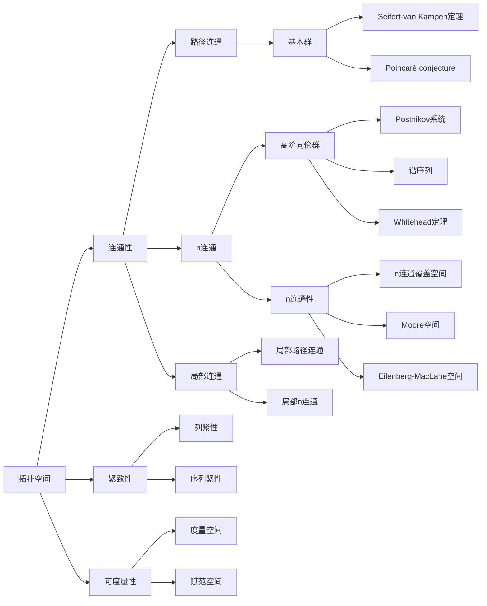

# 流形拓扑学理论与概念的实质：(n-1)连通空间的同伦分类

## 1. 背景介绍
### 1.1 拓扑学的起源与发展
#### 1.1.1 拓扑学的诞生
#### 1.1.2 拓扑学的早期发展
#### 1.1.3 现代拓扑学的崛起

### 1.2 流形拓扑学的研究意义
#### 1.2.1 流形在数学中的地位
#### 1.2.2 流形拓扑学在物理学中的应用
#### 1.2.3 流形拓扑学与其他数学分支的联系

## 2. 核心概念与联系
### 2.1 拓扑空间与连通性
#### 2.1.1 拓扑空间的定义
#### 2.1.2 连通性的概念
#### 2.1.3 路径连通与连通的关系

### 2.2 流形的定义与分类
#### 2.2.1 流形的定义
#### 2.2.2 流形的维数
#### 2.2.3 流形的分类

### 2.3 同伦论与同伦群
#### 2.3.1 同伦的概念
#### 2.3.2 基本群与高阶同伦群
#### 2.3.3 同伦等价与同伦不变量

### 2.4 (n-1)连通空间
#### 2.4.1 (n-1)连通空间的定义
#### 2.4.2 (n-1)连通空间的例子
#### 2.4.3 (n-1)连通空间的性质

## 3. 核心算法原理具体操作步骤
### 3.1 计算基本群的算法
#### 3.1.1 Seifert-van Kampen定理
#### 3.1.2 利用Seifert-van Kampen定理计算基本群
#### 3.1.3 基本群计算实例

### 3.2 计算高阶同伦群的方法
#### 3.2.1 Postnikov系统与同伦群的计算
#### 3.2.2 谱序列方法计算同伦群
#### 3.2.3 高阶同伦群计算实例

### 3.3 (n-1)连通空间的同伦分类算法
#### 3.3.1 Whitehead定理与(n-1)连通空间的同伦分类
#### 3.3.2 Postnikov塔与(n-1)连通空间的同伦分类
#### 3.3.3 (n-1)连通空间同伦分类实例

## 4. 数学模型和公式详细讲解举例说明
### 4.1 同伦群的数学模型
#### 4.1.1 环路空间与loop空间
#### 4.1.2 环路群与高阶环路群
#### 4.1.3 环路群与同伦群的关系

### 4.2 Postnikov系统的数学模型
#### 4.2.1 Postnikov系统的定义
#### 4.2.2 Postnikov系统的构造
#### 4.2.3 Postnikov系统与同伦群的关系

### 4.3 谱序列的数学模型
#### 4.3.1 谱序列的定义
#### 4.3.2 Serre谱序列与同伦群计算
#### 4.3.3 Atiyah-Hirzebruch谱序列与同调群计算

## 5. 项目实践：代码实例和详细解释说明
### 5.1 利用Seifert-van Kampen定理计算基本群的Python实现
#### 5.1.1 Seifert-van Kampen定理的Python表述
#### 5.1.2 基于Seifert-van Kampen定理的基本群计算Python代码
#### 5.1.3 基本群计算Python代码详解

### 5.2 利用Postnikov系统计算高阶同伦群的Matlab实现  
#### 5.2.1 Postnikov系统的Matlab表述
#### 5.2.2 基于Postnikov系统的高阶同伦群计算Matlab代码
#### 5.2.3 高阶同伦群计算Matlab代码详解

### 5.3 (n-1)连通空间同伦分类算法的C++实现
#### 5.3.1 Whitehead定理与Postnikov塔的C++表述 
#### 5.3.2 基于Whitehead定理与Postnikov塔的(n-1)连通空间同伦分类C++代码
#### 5.3.3 (n-1)连通空间同伦分类C++代码详解

## 6. 实际应用场景
### 6.1 流形拓扑学在物理学中的应用
#### 6.1.1 流形拓扑学与广义相对论  
#### 6.1.2 流形拓扑学与量子场论
#### 6.1.3 流形拓扑学在弦理论中的应用

### 6.2 流形拓扑学在机器学习中的应用
#### 6.2.1 流形学习与降维
#### 6.2.2 流形正则化与半监督学习
#### 6.2.3 流形上的优化算法

### 6.3 流形拓扑学在计算机视觉中的应用 
#### 6.3.1 流形上的图像分割
#### 6.3.2 流形上的特征提取与匹配
#### 6.3.3 流形上的三维重建

## 7. 工具和资源推荐
### 7.1 流形拓扑学的学习资源
#### 7.1.1 经典教材推荐
#### 7.1.2 在线课程推荐
#### 7.1.3 学术论文与综述推荐

### 7.2 流形拓扑学的常用工具
#### 7.2.1 计算同调群的工具：CHomP
#### 7.2.2 计算基本群的工具：GAP
#### 7.2.3 可视化流形的工具：ManifoldViewer

### 7.3 流形拓扑学的研究机构与学者
#### 7.3.1 国际知名的流形拓扑学研究机构
#### 7.3.2 活跃在流形拓扑学领域的知名学者
#### 7.3.3 流形拓扑学领域的重要学术会议

## 8. 总结：未来发展趋势与挑战
### 8.1 流形拓扑学的研究前沿
#### 8.1.1 高维流形的分类与刻画
#### 8.1.2 流形上的几何结构与动力系统
#### 8.1.3 流形上的微分算子与指标定理

### 8.2 (n-1)连通空间理论的拓展与应用
#### 8.2.1 (n-1)连通空间与高阶范畴
#### 8.2.2 (n-1)连通空间在物理学中的新应用
#### 8.2.3 (n-1)连通空间与人工智能的结合

### 8.3 流形拓扑学面临的挑战
#### 8.3.1 高维流形的计算复杂性
#### 8.3.2 流形上的几何结构与拓扑结构的协调
#### 8.3.3 流形拓扑学与其他数学分支的交叉融合

## 9. 附录：常见问题与解答
### 9.1 什么是拓扑等价与同胚？
### 9.2 流形上的微分形式与德拉姆上同调的关系是什么？
### 9.3 高阶同伦群的直观几何意义是什么？
### 9.4 (n-1)连通空间在低维拓扑中有哪些重要结果？
### 9.5 同伦论与K理论、调和分析等数学分支有何联系？

流形拓扑学是现代数学的一个重要分支，它融合了拓扑学、微分几何、代数拓扑等多个数学领域的思想和方法，在理论数学和应用数学中都有着广泛而深刻的影响。本文以(n-1)连通空间的同伦分类为切入点，系统地介绍了流形拓扑学的核心概念、理论基础、计算方法以及在物理学、机器学习、计算机视觉等领域的应用。

我们首先回顾了拓扑学的发展历史，特别是流形拓扑学的起源与演变，并阐述了流形拓扑学在数学和物理学中的重要地位。随后，我们系统地介绍了流形拓扑学的核心概念，包括拓扑空间、连通性、流形、同伦论、(n-1)连通空间等，并通过丰富的例子和直观的图示，帮助读者深入理解这些概念之间的内在联系。

在算法原理部分，我们重点介绍了计算基本群、高阶同伦群以及(n-1)连通空间同伦分类的经典算法，如Seifert-van Kampen定理、Postnikov系统、谱序列、Whitehead定理等，并通过具体的计算实例，展示了这些算法的实际应用。同时，我们还深入探讨了这些算法背后的数学模型，如环路空间、Postnikov塔、谱序列等，帮助读者从更高的视角理解这些算法的本质。

为了让读者更直观地理解这些算法的实现过程，我们给出了基于Python、Matlab、C++等编程语言的代码实例，并对关键步骤进行了详细的解释和说明。读者可以通过这些代码实例，加深对算法原理的理解，并学习如何将这些算法应用到实际问题中。

流形拓扑学在现代科学和工程中有着广泛的应用，我们重点介绍了它在物理学、机器学习、计算机视觉等领域的典型应用场景。通过这些应用实例，读者可以深入理解流形拓扑学的实用价值，并启发读者将流形拓扑学的思想和方法应用到其他领域中。

为了帮助读者进一步学习和研究流形拓扑学，我们推荐了一系列优秀的学习资源，包括经典教材、在线课程、学术论文等，并介绍了流形拓扑学领域的常用工具和重要的研究机构与学者。通过这些资源和工具，读者可以更全面、更深入地了解流形拓扑学的前沿动态和发展趋势。

最后，我们展望了流形拓扑学的未来发展方向和面临的挑战。高维流形的分类与刻画、流形上的几何结构与动力系统、(n-1)连通空间理论的拓展与应用等，都是当前流形拓扑学研究的热点问题。同时，流形拓扑学也面临着计算复杂性、不同数学分支融合等方面的挑战。展望未来，流形拓扑学必将与其他数学分支和应用领域进一步交叉融合，为科学和工程的发展提供更多的新思路和新方法。

总之，流形拓扑学是一个深刻而广阔的数学领域，它不仅具有重要的理论价值，而且在现代科学和工程中有着广泛的应用前景。通过本文的介绍和分析，希望读者能够对流形拓扑学的核心概念、理论基础、计算方法以及应用场景有一个系统而全面的了解，并为进一步学习和研究流形拓扑学奠定坚实的基础。

作者：禅与计算机程序设计艺术 / Zen and the Art of Computer Programming