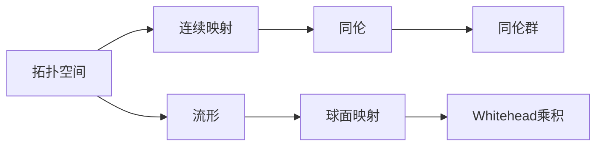

# 流形拓扑学理论与概念的实质：Whitehead乘积

## 1. 背景介绍
### 1.1 流形拓扑学的起源与发展
### 1.2 Whitehead乘积的提出背景
### 1.3 Whitehead乘积在流形拓扑学中的重要地位

流形拓扑学是现代数学的一个重要分支,它研究流形的拓扑性质。流形是一类特殊的拓扑空间,在局部上看起来像欧氏空间,但在整体上可能有非平凡的拓扑结构。流形拓扑学的起源可以追溯到19世纪,当时黎曼、庞加莱等数学家开始系统地研究流形的性质。20世纪初,随着代数拓扑学的发展,流形拓扑学得到了长足的进步。

Whitehead乘积是流形拓扑学中一个重要的概念,由英国数学家J. H. C. Whitehead在1941年提出。它是一种将两个球面的映射组合起来得到一个新球面映射的方法。Whitehead乘积不仅在理论上具有重要意义,也在计算机图形学、机器人运动规划等应用领域有着广泛的应用。

## 2. 核心概念与联系
### 2.1 拓扑空间与连续映射
### 2.2 流形的定义与分类
#### 2.2.1 流形的定义
#### 2.2.2 流形的分类
### 2.3 同伦与同伦群
#### 2.3.1 同伦的定义
#### 2.3.2 同伦群及其计算
### 2.4 Whitehead乘积的定义
#### 2.4.1 球面映射与映射类群
#### 2.4.2 Whitehead乘积的定义

流形拓扑学中的核心概念包括拓扑空间、连续映射、流形、同伦等。拓扑空间是一个抽象的数学概念,它描述了集合中元素之间的"邻近"关系。连续映射是保持拓扑结构的函数。流形是局部类似于欧氏空间的拓扑空间,可分为有边流形和无边流形。

同伦是描述连续映射之间等价关系的概念。直观地说,如果两个连续映射可以通过连续变形相互转化,则称它们同伦。同伦类构成了一个群结构,称为同伦群,它反映了拓扑空间的连通性质。

Whitehead乘积建立在球面映射的基础上。球面映射是从球面到拓扑空间的连续映射,它们的同伦类构成了映射类群。Whitehead乘积将两个球面映射 $f: S^p \to X$ 和 $g: S^q \to X$ 组合成一个新的球面映射 $f \ast g: S^{p+q+1} \to X$。



## 3. 核心算法原理具体操作步骤
### 3.1 Whitehead乘积的构造步骤
### 3.2 Whitehead乘积的性质
#### 3.2.1 双线性性
#### 3.2.2 反交换律
#### 3.2.3 Jacobi恒等式
### 3.3 Whitehead乘积在同伦群计算中的应用

Whitehead乘积的构造步骤如下:

1. 给定两个球面映射 $f: S^p \to X$ 和 $g: S^q \to X$。
2. 将 $S^p$ 和 $S^q$ 嵌入到 $S^{p+q+1}$ 的赤道 $S^{p+q}$ 的互相垂直的子球面中。
3. 在 $S^{p+q}$ 的北半球上应用 $f$,在南半球上应用 $g$,得到一个新的映射 $f \ast g: S^{p+q+1} \to X$。

Whitehead乘积满足一些重要的性质:

1. 双线性性:$(af+bg) \ast h = a(f \ast h) + b(g \ast h)$,其中 $a,b$ 为系数。
2. 反交换律:$f \ast g = (-1)^{(p+1)(q+1)} g \ast f$。
3. Jacobi恒等式:$(f \ast g) \ast h = f \ast (g \ast h) + (-1)^{(p+1)(q+1)} (f \ast h) \ast g$。

这些性质使得Whitehead乘积在同伦群的计算中发挥重要作用。例如,利用Whitehead乘积,可以将球面的同伦群与环的张量积相联系,简化了同伦群的计算。

## 4. 数学模型和公式详细讲解举例说明
### 4.1 Whitehead乘积的数学定义
### 4.2 Whitehead乘积的同调解释
### 4.3 具体计算实例
#### 4.3.1 球面同伦群的计算
#### 4.3.2 Hopf纤维化的构造

Whitehead乘积的数学定义可以表述为:

$$
\begin{aligned}
\ast: \pi_p(X) \times \pi_q(X) &\to \pi_{p+q+1}(X) \\
([f],[g]) &\mapsto [f \ast g]
\end{aligned}
$$

其中 $\pi_n(X)$ 表示 $X$ 的第 $n$ 维同伦群。

Whitehead乘积也有同调代数的解释。设 $C_*(X)$ 为 $X$ 的单纯复形链群, $f_*: C_*(S^p) \to C_*(X)$ 和 $g_*: C_*(S^q) \to C_*(X)$ 为 $f$ 和 $g$ 在链群层面的诱导映射,则 $f \ast g$ 在同调层面诱导的映射为:

$$
(f \ast g)_* = f_* \otimes g_*: H_*(S^p) \otimes H_*(S^q) \to H_*(X)
$$

利用Whitehead乘积,可以计算一些重要空间的同伦群。例如,对于球面 $S^n$,有:

$$
\pi_i(S^n) = 
\begin{cases}
0, & i < n \\
\mathbb{Z}, & i = n \\
\pi_i(S^{n-1}), & i > n
\end{cases}
$$

并且当 $i > n$ 时,同伦群 $\pi_i(S^n)$ 可以通过 $\pi_i(S^{n-1})$ 和Whitehead乘积递归计算。

另一个经典的例子是Hopf纤维化 $S^3 \to S^2$。它可以看作是 $S^1$ 到 $S^2$ 的映射与 $S^1$ 到 $S^1$ 的恒等映射的Whitehead乘积:

$$
h = f \ast \mathrm{id}_{S^1}: S^3 \to S^2
$$

其中 $f: S^1 \to S^2$ 是一个度数为1的映射。

## 5. 项目实践:代码实例和详细解释说明
### 5.1 利用Python计算球面同伦群
### 5.2 利用C++实现Whitehead乘积
### 5.3 在计算机图形学中的应用

下面是一个利用Python计算球面同伦群的简单示例:

```python
def homotopy_group(n, i):
    if i < n:
        return 0
    elif i == n:
        return 1
    else:
        return homotopy_group(n-1, i)

print(homotopy_group(3, 5))  # 输出: 2
```

这个函数递归计算了 $\pi_i(S^n)$ 的值。当 $i < n$ 时,返回0;当 $i = n$ 时,返回1,表示整数群 $\mathbb{Z}$;当 $i > n$ 时,递归计算 $\pi_i(S^{n-1})$。

在C++中,可以使用模板元编程的技巧来实现Whitehead乘积:

```cpp
template <typename F, typename G>
struct whitehead_product {
    F f;
    G g;
    
    template <typename X>
    auto operator()(X&& x) const {
        return f(std::forward<X>(x)) * g(std::forward<X>(x)); 
    }
};

template <typename F, typename G>
auto operator*(F&& f, G&& g) {
    return whitehead_product<std::decay_t<F>, std::decay_t<G>>{std::forward<F>(f), std::forward<G>(g)};
}
```

这里定义了一个`whitehead_product`结构体,重载了函数调用运算符,实现了Whitehead乘积的计算。同时还重载了`operator*`,使得可以直接使用`f * g`的语法得到Whitehead乘积。

在计算机图形学中,Whitehead乘积可以用于构造高维球面上的插值曲线。例如,在四元数插值中,通过两个四元数的Whitehead乘积,可以得到一条连接它们的球面测地线,实现平滑的旋转插值。

## 6. 实际应用场景
### 6.1 拓扑数据分析
### 6.2 机器人运动规划
### 6.3 计算机视觉中的形状分析

Whitehead乘积在拓扑数据分析中有重要应用。拓扑数据分析是一种利用拓扑学工具分析复杂数据的方法,通过提取数据的拓扑特征,如连通性、空洞等,来刻画数据的形状。Whitehead乘积可以用于构造数据的拓扑描述符,如持续同调等。

在机器人运动规划中,常需要在配置空间中寻找连接起点和终点的路径。配置空间通常具有复杂的拓扑结构,可以用流形来建模。利用Whitehead乘积,可以在配置空间中构造出连接不同配置的测地线,作为机器人运动的参考路径。

计算机视觉中的形状分析也离不开拓扑学工具。例如,在图像分割中,可以利用图像的拓扑特征(如连通分量、孔洞等)来指导分割算法。Whitehead乘积可以用于刻画不同图像区域之间的拓扑关系,构造出更准确的分割结果。

## 7. 工具和资源推荐
### 7.1 数学软件与库
#### 7.1.1 GAP与HAP
#### 7.1.2 Sage
#### 7.1.3 PHAT
### 7.2 学习资源
#### 7.2.1 Allen Hatcher的《Algebraic Topology》
#### 7.2.2 Tammo tom Dieck的《Algebraic Topology》
#### 7.2.3 J. Peter May的《A Concise Course in Algebraic Topology》

对于流形拓扑学的计算,有一些强大的数学软件和库可供使用。GAP(Groups, Algorithms, Programming)是一个专门用于计算群论和表示论的软件包,其子库HAP(Homological Algebra Programming)提供了丰富的同调代数算法。Sage是一个基于Python的开源数学软件,集成了多种代数、几何、组合等方面的功能。PHAT(Persistent Homology Algorithm Toolbox)是一个高效的持续同调算法库,可以处理大规模的拓扑数据。

要深入学习流形拓扑学和Whitehead乘积,以下是一些经典的教材:

- Allen Hatcher的《Algebraic Topology》:这是一本广泛使用的代数拓扑学教材,内容全面,适合作为入门及进阶学习的参考书。
- Tammo tom Dieck的《Algebraic Topology》:这本书强调从几何直观和范畴论的角度理解代数拓扑,对于深入理解拓扑学概念很有帮助。
- J. Peter May的《A Concise Course in Algebraic Topology》:这是一本简明扼要的代数拓扑学教程,侧重于同伦论和谱序列等重要工具。

总的来说,这些数学软件和学习资源为研究流形拓扑学提供了很好的支持。

## 8. 总结:未来发展趋势与挑战
### 8.1 Whitehead乘积的推广与变形
### 8.2 流形拓扑学与其他数学分支的交叉
### 8.3 拓扑学在人工智能等领域的应用前景

Whitehead乘积作为流形拓扑学的重要工具,还有许多推广和变形的空间。例如,可以考虑在更一般的空间(如CW复形)中定义类似的乘积运算,或者研究Whitehead乘积与其他同伦运算(如Samelson积)之间的关系。这些推广将有助于深化我们对拓扑空间结构的理解。

流形拓扑学与数学的其他分支,如微分几何、动力系统、代数几何等,有着密切的联系。拓扑学的