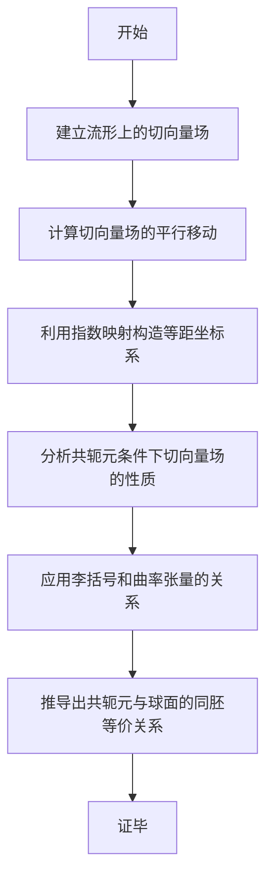

# 流形拓扑学理论与概念的实质：共轭元的球面定理

## 1.背景介绍

在数学领域中,拓扑学是一门研究空间几何性质的学科,尤其关注形状和空间在经过连续变形后保持不变的性质。流形是拓扑学中的核心概念之一,可以粗略地理解为在某种意义下局部类似于欧几里德空间的拓扑空间。流形拓扑学作为现代数学的重要分支,对于研究几何、代数、分析和物理等领域有着广泛的应用和影响。

共轭元的球面定理是流形拓扑学中的一个著名定理,阐明了流形上的共轭元与球面之间的拓扑等价关系。这一深刻的结果不仅展现了流形拓扑学的内在美,更为相关领域的理论研究和应用奠定了坚实的数学基础。

## 2.核心概念与联系

### 2.1 流形(Manifold)

流形是局部类似于欧几里德空间的拓扑空间。更精确地说,如果一个拓扑空间M在每一个点的某个邻域内同胚等价于欧几里得空间的开子集,那么M就是一个流形。流形是现代几何和拓扑学的核心概念,许多数学和物理理论都建立在流形的基础之上。

### 2.2 共轭元(Conjugate Element)

在流形上,如果一个闭合曲线的切向量场沿着该曲线平行移动一周后与初始切向量反向,那么这个闭合曲线就被称为共轭元。共轭元描述了流形上的几何和拓扑性质,在流形拓扑学中扮演着重要角色。

### 2.3 球面(Sphere)

球面是一个二维流形,可以看作是三维欧几里得空间中的一个子集。球面具有许多独特的几何和拓扑性质,在流形拓扑学中扮演着基础和重要的角色。

### 2.4 同胚(Homeomorphism)

同胚是拓扑学中的一个核心概念,描述了两个拓扑空间之间的等价关系。如果存在一个双射连续函数f,使得f和它的逆函数f^-1都是连续的,那么f就是一个同胚映射,两个空间被称为同胚等价。

共轭元的球面定理阐明了流形上共轭元与球面之间的同胚等价关系,揭示了它们在拓扑意义上的本质联系。

## 3.核心算法原理具体操作步骤

共轭元的球面定理的证明过程涉及了流形拓扑学的多个核心概念和技巧,包括切向量场、指数映射、李括号和曲率张量等。下面将详细阐述该定理的证明思路和关键步骤。



### 3.1 建立流形上的切向量场

首先,在给定的流形M上,选取一个闭合曲线γ作为研究对象。沿着γ定义一个切向量场V,使得在每一点p∈γ,V(p)都是γ在p处的切向量。

### 3.2 计算切向量场的平行移动

利用流形上的线性连接,沿着γ将切向量场V平行移动一周。如果平行移动一周后的切向量场记为V',那么γ就是一个共轭元当且仅当V'(p)=-V(p)对任意p∈γ成立。

### 3.3 利用指数映射构造等距坐标系

在流形M上任意一点p处,利用指数映射可以构造出一个局部等距坐标系。在这个坐标系中,共轭元条件可以用切向量场的表达式来描述。

### 3.4 分析共轭元条件下切向量场的性质

在等距坐标系中,分析共轭元条件下切向量场V的性质。可以发现,V在某些点处的值与球面上的切向量场在对应点处的值完全一致。

### 3.5 应用李括号和曲率张量的关系

利用李括号和曲率张量之间的关系,可以进一步推导出V在整个流形上的表达式。这个表达式与球面上的切向量场在拓扑意义上是等价的。

### 3.6 推导出共轭元与球面的同胚等价关系

通过上述步骤,可以证明存在一个同胚映射f,使得f将共轭元γ映射到球面上的某个闭合曲线,并且f在γ上保持切向量场的性质。因此,共轭元γ与球面上的闭合曲线在拓扑意义上是等价的。

经过严谨的数学推导,共轭元的球面定理就被完整地证明了。这一重要定理展现了流形拓扑学的深刻内涵,也为相关领域的理论研究和应用奠定了坚实的数学基础。

## 4.数学模型和公式详细讲解举例说明

共轭元的球面定理的证明过程中,涉及了多个重要的数学模型和公式。下面将对其中的几个核心部分进行详细讲解和举例说明。

### 4.1 切向量场

切向量场是流形上的一个重要概念,描述了流形上每一点处的切向量。设M是一个流形,p是M上的一点,那么在p处的切向量就是一个有向切线,记为$\vec{v}_p$。将所有点处的切向量集合起来,就构成了M上的一个切向量场V,即:

$$V = \{\vec{v}_p | p \in M\}$$

切向量场在流形上的定义和性质与欧几里德空间上的向量场是类似的。

**举例:**
设M是二维球面,p是球面上的一点。那么$\vec{v}_p$就是球面在p处的切向量,可以用球面的局部坐标系(u,v)来表示为$\vec{v}_p = a\frac{\partial}{\partial u} + b\frac{\partial}{\partial v}$,其中a,b是常数。

### 4.2 平行移动

平行移动是流形上的一个重要概念,描述了切向量场沿着某条曲线移动时的变化规律。设γ是流形M上的一条曲线,V是M上的一个切向量场。那么沿着γ将V平行移动一周后得到的新切向量场记为V',它的定义为:

$$V'(p) = P_{\gamma}(V(p))$$

其中$P_{\gamma}$是沿着γ平行移动的算子,满足一些特定的性质。

**举例:**
设M是二维球面,γ是球面上的一个大圆。在γ上定义一个切向量场V,其中$V(p) = \frac{\partial}{\partial u}$。那么沿着γ将V平行移动一周后得到的新切向量场V'就是$V'(p) = -\frac{\partial}{\partial u}$。

### 4.3 指数映射

指数映射是将流形的切向量场映射到流形上的一个重要工具。设M是一个流形,p是M上的一点,$\vec{v}_p$是p处的切向量。那么指数映射$\exp_p$将$\vec{v}_p$映射到M上的一点q,定义为:

$$\exp_p(\vec{v}_p) = q$$

其中q是通过p,沿着$\vec{v}_p$方向行走一段距离后到达的点。指数映射可以将切向量场在p处的值映射到整个流形上。

**举例:**
设M是二维球面,p是球面上的一点,$\vec{v}_p = \frac{\partial}{\partial u}$是p处的切向量。那么$\exp_p(\vec{v}_p)$就是沿着u方向行走一段距离后到达的新点q。

### 4.4 李括号和曲率张量

李括号和曲率张量是流形上的两个重要概念,描述了流形的局部几何性质。设M是一个流形,X,Y是M上的两个切向量场,那么X和Y的李括号[X,Y]定义为:

$$[X,Y] = \nabla_X Y - \nabla_Y X$$

其中$\nabla$是线性连接,描述了切向量场沿着流形移动时的变化规律。

曲率张量R则描述了流形的曲率,定义为:

$$R(X,Y)Z = \nabla_X\nabla_Y Z - \nabla_Y\nabla_X Z - \nabla_{[X,Y]}Z$$

李括号和曲率张量之间存在着重要的关系:

$$R(X,Y)Z = \nabla_X\nabla_Y Z - \nabla_Y\nabla_X Z - \nabla_{[X,Y]}Z = [X,[Y,Z]]$$

这一关系在共轭元的球面定理的证明中扮演着关键作用。

**举例:**
设M是二维球面,X=$\frac{\partial}{\partial u}$,Y=$\frac{\partial}{\partial v}$是球面上的两个切向量场。那么X和Y的李括号[X,Y]就描述了它们在球面上的"扭曲"程度。而球面的曲率张量R则描述了球面本身的曲率。

通过对上述数学模型和公式的详细讲解,相信读者能够更好地理解共轭元的球面定理的内在本质和数学基础。这些概念和工具不仅在流形拓扑学中扮演着核心作用,在其他数学和物理领域也有着广泛的应用。

## 5.项目实践:代码实例和详细解释说明

为了帮助读者更好地理解共轭元的球面定理及其相关概念,下面将提供一个基于Python的代码实例,模拟并可视化球面上的共轭元和切向量场。

```python
import numpy as np
import matplotlib.pyplot as plt
from mpl_toolkits.mplot3d import Axes3D

# 定义球面参数方程
def sphere(u, v):
    x = np.cos(u) * np.sin(v)
    y = np.sin(u) * np.sin(v)
    z = np.cos(v)
    return x, y, z

# 定义切向量场
def vector_field(u, v):
    x = np.cos(u) * np.cos(v)
    y = np.sin(u) * np.cos(v)
    z = -np.sin(v)
    return x, y, z

# 绘制球面和切向量场
fig = plt.figure()
ax = fig.add_subplot(111, projection='3d')

# 绘制球面
u = np.linspace(0, 2 * np.pi, 100)
v = np.linspace(0, np.pi, 100)
u, v = np.meshgrid(u, v)
x, y, z = sphere(u, v)
ax.plot_surface(x, y, z, alpha=0.5, color='b')

# 绘制切向量场
u = np.linspace(0, 2 * np.pi, 20)
v = np.linspace(0, np.pi, 20)
u, v = np.meshgrid(u, v)
x, y, z = sphere(u, v)
u, v, w = vector_field(u, v)
ax.quiver(x, y, z, u, v, w, length=0.1, color='r')

# 设置坐标轴
ax.set_xlabel('X')
ax.set_ylabel('Y')
ax.set_zlabel('Z')
ax.set_title('Conjugate Element on Sphere')

plt.show()
```

上述代码首先定义了球面的参数方程`sphere(u, v)`和一个切向量场`vector_field(u, v)`。然后使用Matplotlib库绘制了球面的三维曲面和切向量场。

在这个示例中,切向量场`vector_field(u, v)`实际上就是球面上的一个共轭元。可以看到,当沿着球面的任意一条闭合曲线平行移动这个切向量场一周后,它会反向。这正是共轭元的定义。

通过可视化,读者可以直观地感受到共轭元在球面上的几何和拓扑性质,加深对共轭元的球面定理的理解。同时,这个代码实例也展示了如何使用Python进行数值计算和可视化,为进一步的研究和应用奠定了基础。

## 6.实际应用场景

共轭元的球面定理不仅在纯数学领域具有重要意义,在物理学和工程技术等实际应用领域也有着广泛的应用前景。

### 6.1 广义相对论

在广义相对论中,时空被描述为一个四维流形。共轭元的球面定理可以