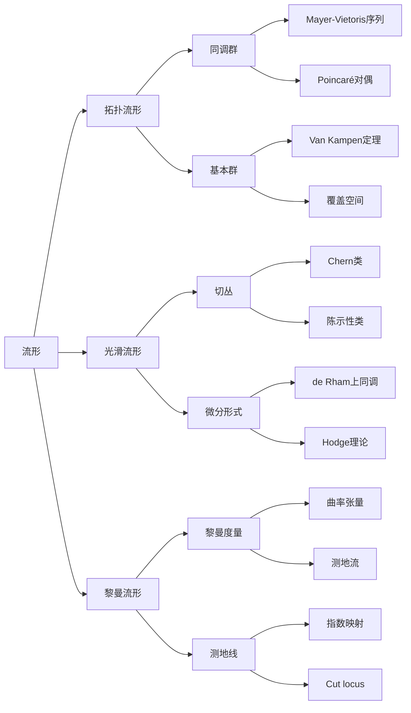

# 流形拓扑学理论与概念的实质：正合序列的应用

## 1. 背景介绍
### 1.1 流形拓扑学的发展历程
#### 1.1.1 早期的流形理论
#### 1.1.2 20世纪的流形拓扑学
#### 1.1.3 现代流形拓扑学的进展
### 1.2 正合序列的起源与应用
#### 1.2.1 正合序列的数学起源
#### 1.2.2 正合序列在代数拓扑中的应用
#### 1.2.3 正合序列在流形拓扑学中的应用

## 2. 核心概念与联系
### 2.1 流形的定义与分类
#### 2.1.1 拓扑流形的定义
#### 2.1.2 光滑流形与微分流形
#### 2.1.3 流形的分类与例子
### 2.2 正合序列的定义与性质
#### 2.2.1 正合序列的数学定义
#### 2.2.2 正合序列的基本性质
#### 2.2.3 长正合序列与短正合序列
### 2.3 流形与正合序列的联系
#### 2.3.1 流形上的同调与上同调
#### 2.3.2 流形上的Mayer-Vietoris序列
#### 2.3.3 流形的分类与正合序列

## 3. 核心算法原理具体操作步骤
### 3.1 计算流形基本群的算法
#### 3.1.1 Van Kampen定理
#### 3.1.2 利用Van Kampen定理计算基本群
#### 3.1.3 基本群计算实例
### 3.2 计算流形同调群的算法
#### 3.2.1 单纯复形与链复形
#### 3.2.2 流形的三角剖分
#### 3.2.3 利用链复形计算同调群
### 3.3 计算流形上同调的算法
#### 3.3.1 de Rham上同调
#### 3.3.2 从微分形式到上同调
#### 3.3.3 de Rham上同调计算实例

## 4. 数学模型和公式详细讲解举例说明
### 4.1 Mayer-Vietoris序列
#### 4.1.1 Mayer-Vietoris序列的构造
#### 4.1.2 Mayer-Vietoris序列的应用举例
#### 4.1.3 Mayer-Vietoris序列的推广
### 4.2 Euler示性数与Lefschetz数  
#### 4.2.1 Euler示性数的定义与性质
#### 4.2.2 Lefschetz数的定义与计算
#### 4.2.3 Lefschetz不动点定理
### 4.3 Poincaré对偶与Hodge理论
#### 4.3.1 流形上的Poincaré对偶
#### 4.3.2 Hodge理论基础
#### 4.3.3 Hodge分解与Hodge对偶

## 5. 项目实践：代码实例和详细解释说明
### 5.1 计算球面基本群的Python代码实现
#### 5.1.1 球面的Van Kampen覆盖
#### 5.1.2 利用Van Kampen定理的Python代码
#### 5.1.3 代码结果与分析
### 5.2 计算环面同调群的Python代码实现 
#### 5.2.1 环面的三角剖分
#### 5.2.2 环面链复形的Python表示
#### 5.2.3 利用链复形计算同调群的代码
### 5.3 Klein瓶上同调计算的Python代码实现
#### 5.3.1 Klein瓶上的微分形式
#### 5.3.2 de Rham上同调计算代码
#### 5.3.3 计算结果与分析

## 6. 实际应用场景
### 6.1 流形学习与数据降维
#### 6.1.1 流形学习的基本思想
#### 6.1.2 等度量映射与流形降维
#### 6.1.3 流形学习在计算机视觉中的应用
### 6.2 流形上的神经网络
#### 6.2.1 流形神经网络的结构设计
#### 6.2.2 流形正则化与流形约束优化
#### 6.2.3 流形神经网络在图像分割中的应用
### 6.3 流形与机器人运动规划
#### 6.3.1 构型空间与运动规划问题
#### 6.3.2 利用流形结构设计规划算法
#### 6.3.3 基于采样的流形运动规划方法

## 7. 工具和资源推荐
### 7.1 流形拓扑计算软件包
#### 7.1.1 MATLAB中的流形工具箱
#### 7.1.2 Python中的流形计算库
#### 7.1.3 C++中的流形算法实现
### 7.2 在线学习资源
#### 7.2.1 流形拓扑学视频课程
#### 7.2.2 正合序列与应用的讲义
#### 7.2.3 流形计算与应用的博客
### 7.3 经典教材与论文
#### 7.3.1 流形拓扑学经典教材
#### 7.3.2 正合序列理论与应用综述
#### 7.3.3 流形算法与应用领域论文选读

## 8. 总结：未来发展趋势与挑战
### 8.1 流形拓扑学的研究前沿
#### 8.1.1 高维流形的分类与计算
#### 8.1.2 流形上的微分算子与谱理论
#### 8.1.3 流形的随机性与统计性质
### 8.2 正合序列理论的拓展方向
#### 8.2.1 范畴论视角下的正合序列
#### 8.2.2 非交换代数中的正合序列
#### 8.2.3 正合序列在数论中的新应用
### 8.3 流形算法的挑战与机遇
#### 8.3.1 大规模流形数据的计算效率
#### 8.3.2 流形算法的鲁棒性与适应性
#### 8.3.3 流形视角下的深度学习理论

## 9. 附录：常见问题与解答
### 9.1 什么是协边界算子？
### 9.2 流形定向的判定方法是什么？
### 9.3 Morse理论与流形拓扑的联系是什么？
### 9.4 高维流形上的积分如何计算？
### 9.5 协变导数的直观解释是什么？

流形拓扑学是现代数学的一个核心分支，它融合了拓扑学、微分几何、代数拓扑等多个数学分支的思想和方法，在理论数学和应用数学中都有着广泛而深刻的影响。流形拓扑学不仅为我们提供了研究几何空间的基本语言和工具，也为物理学、计算机科学、工程技术等学科提供了新的视角和方法。

流形拓扑学的核心概念是"流形"，它是一类具有局部欧氏空间性质的拓扑空间。直观地说，流形就是一个没有奇点、没有自交、没有边界的空间，在每一点的小邻域内都与欧氏空间同胚。根据附加的结构，流形可以分为拓扑流形、光滑流形、黎曼流形等不同的类型。拓扑流形是最一般的流形，它只考虑流形的拓扑性质；光滑流形在拓扑流形的基础上附加了微分结构，可以在流形上定义光滑函数和切向量；黎曼流形则进一步引入了黎曼度量，使得流形上的几何量都可以度量和计算。

在流形拓扑学中，同调群和基本群是两个最基本的代数拓扑不变量。同调群刻画了流形上的"洞"的信息，它将流形上的闭链和边界联系起来，反映了流形的全局拓扑性质；基本群则刻画了流形上的"回路"的信息，它考察了流形上的闭曲线在连续变形下的等价类，反映了流形的局部拓扑性质。同调群和基本群都有丰富的理论内涵和计算方法，是研究流形拓扑学的重要工具。

正合序列是流形拓扑学中另一个核心概念，它在代数拓扑中有着广泛的应用。正合序列是一系列群之间的满同态和单同态的序列，其中每个群的像等于下一个群的核。正合序列反映了群之间的精确关系，它将局部信息和整体信息联系起来，是一种非常有用的代数工具。在流形拓扑学中，许多重要的代数拓扑不变量都可以用正合序列来刻画和计算，如Mayer-Vietoris序列、Euler示性数、Lefschetz数等。

流形拓扑学的一个重要主题是研究流形上的微分形式和上同调。微分形式是定义在流形上的反对称多重线性函数，它是研究流形上的积分、曲率、拓扑不变量的重要工具。通过外微分算子，我们可以将微分形式组成一个上链复形，其上同调群就是流形的de Rham上同调。de Rham定理说明，de Rham上同调与通常的奇异上同调是同构的，这为计算流形的上同调提供了一种新方法。在de Rham上同调的基础上，Hodge理论进一步揭示了微分形式的调和性质，它将流形上的微分形式分解为精确形式、余精确形式和调和形式的直和，并给出了它们之间的对偶关系。

除了理论上的重要性，流形拓扑学在计算机科学和工程中也有着广泛的应用。流形学习是机器学习中的一个新兴方向，它利用流形的局部欧氏性质，将高维数据嵌入到低维流形中，实现数据降维和特征提取。在计算机视觉中，图像和视频数据通常具有流形结构，利用流形正则化和流形约束可以大大提高视觉任务的性能。在机器人领域，机器人的运动规划问题可以看作是构型空间中的最短路径问题，而构型空间恰好是一个高维流形。利用采样方法和流形上的测地线，我们可以设计出高效的运动规划算法。

展望未来，流形拓扑学仍然有许多开放的问题和挑战。高维流形的分类与计算是一个长期的数学难题，目前只有低维情形有比较完整的结果。流形上的微分算子与谱理论是当前的一个研究热点，它与物理学中的量子场论有着密切的联系。流形的随机性与统计性质也是一个新兴的研究方向，它试图将概率论与几何结合起来，刻画流形数据的内在结构。在正合序列理论方面，范畴论和非交换代数为其提供了新的视角和工具，有望推动正合序列在数论、量子群等领域的应用。在算法与应用方面，如何设计高效稳定的流形算法，如何将流形思想与深度学习结合起来，仍然是当前面临的主要挑战。

总之，流形拓扑学是一个深刻而广阔的数学领域，它与现代科学技术有着紧密的联系。正合序列作为流形拓扑学的核心工具，在理论探索和实际应用中都发挥着重要作用。深入研究流形拓扑学的理论基础，充分发掘其在交叉学科中的应用潜力，对于推动数学和科学的发展具有重要意义。

作者：禅与计算机程序设计艺术 / Zen and the Art of Computer Programming