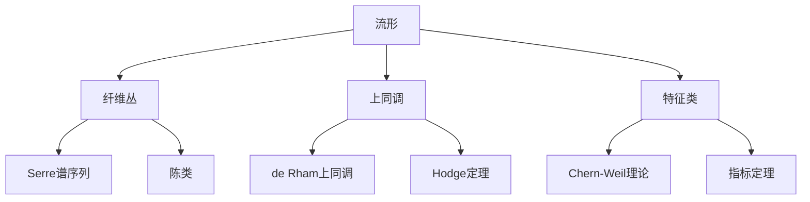

# 流形拓扑学理论与概念的实质：纤维丛上的谱序列及其应用

## 1. 背景介绍
### 1.1 流形拓扑学的起源与发展
### 1.2 流形拓扑学在数学和物理学中的重要性
### 1.3 纤维丛和谱序列的基本概念

## 2. 核心概念与联系  
### 2.1 流形的定义与分类
#### 2.1.1 拓扑流形
#### 2.1.2 光滑流形
#### 2.1.3 黎曼流形
### 2.2 纤维丛的定义与性质
#### 2.2.1 局部平凡性
#### 2.2.2 转移函数
#### 2.2.3 截面与连接
### 2.3 谱序列的定义与构造
#### 2.3.1 代数中的谱序列
#### 2.3.2 拓扑中的谱序列
#### 2.3.3 Serre谱序列与Atiyah-Hirzebruch谱序列

## 3. 核心算法原理具体操作步骤
### 3.1 计算纤维丛上的同调与上同调
#### 3.1.1 Mayer-Vietoris序列
#### 3.1.2 Leray-Serre谱序列
#### 3.1.3 Čech上同调与Čech-de Rham复形
### 3.2 计算流形上的特征类
#### 3.2.1 陈类与陈字符
#### 3.2.2 Pontryagin类与Pontryagin字符
#### 3.2.3 Stiefel-Whitney类

## 4. 数学模型和公式详细讲解举例说明
### 4.1 de Rham上同调与Hodge定理
### 4.2 Chern-Weil理论与Chern类
### 4.3 指标定理与Atiyah-Singer指标定理

## 5. 项目实践：代码实例和详细解释说明
### 5.1 使用Python计算流形的基本拓扑不变量
### 5.2 使用Mathematica计算纤维丛的陈类
### 5.3 使用MATLAB实现谱序列的计算

## 6. 实际应用场景
### 6.1 在物理学中的应用
#### 6.1.1 规范场论与纤维丛
#### 6.1.2 弦理论与Calabi-Yau流形
### 6.2 在工程学中的应用
#### 6.2.1 机器人运动规划与配置空间
#### 6.2.2 计算机视觉与图像流形

## 7. 工具和资源推荐
### 7.1 学习资源
#### 7.1.1 经典教材
#### 7.1.2 在线课程
#### 7.1.3 研究论文
### 7.2 计算工具
#### 7.2.1 计算机代数系统
#### 7.2.2 数值计算软件
#### 7.2.3 可视化工具

## 8. 总结：未来发展趋势与挑战
### 8.1 流形拓扑学的前沿研究方向
### 8.2 纤维丛与谱序列理论的拓展与应用
### 8.3 跨学科研究的机遇与挑战

## 9. 附录：常见问题与解答
### 9.1 如何理解流形的局部与整体性质？
### 9.2 纤维丛与向量丛有何区别？
### 9.3 谱序列收敛的条件是什么？

流形拓扑学是现代数学的一个重要分支,它融合了拓扑学、微分几何和代数拓扑等多个数学领域的思想和方法。流形拓扑学不仅在纯数学研究中占据着核心地位,也在理论物理、工程科学等应用领域发挥着重要作用。

流形拓扑学的核心概念是流形,它是一个局部类似于欧氏空间的拓扑空间。根据附加结构的不同,流形可以分为拓扑流形、光滑流形和黎曼流形等。在流形上,我们可以定义各种拓扑和几何不变量,如基本群、同调群、上同调群、特征类等,用来刻画流形的性质。

纤维丛是流形拓扑学中另一个重要的概念,它描述了两个空间之间的映射关系。纤维丛由三部分组成：底空间、纤维空间和投影映射。纤维丛的一个关键性质是局部平凡性,即在底空间的每个点的邻域上,纤维丛都与直积空间同胚。纤维丛的重要例子包括切丛、余切丛和主丛等。

谱序列是代数拓扑和同调代数中的一个强大工具,它提供了一种计算复杂代数对象的同调群的方法。谱序列由一系列分页组成,每一页都是一个微分分次模,通过微分和同调的作用,可以得到下一页。在流形拓扑学中,Serre谱序列和Atiyah-Hirzebruch谱序列被广泛应用于计算纤维丛的同调群和上同调群。

为了计算流形上的同调群和上同调群,我们通常使用一些标准的方法,如Mayer-Vietoris序列和Leray-Serre谱序列。这些方法基于流形的拓扑性质,如开覆盖、纤维丛结构等,将复杂的计算问题化归为更简单的子问题。另一方面,我们也可以使用Čech上同调和Čech-de Rham复形等工具,将同调群的计算转化为代数或微分方程的求解。

在流形上,我们还可以定义各种特征类,如陈类、Pontryagin类和Stiefel-Whitney类等。这些特征类反映了流形的微分拓扑性质,在几何拓扑和代数拓扑中有着重要的应用。特征类的定义通常基于纤维丛的联络和曲率形式,Chern-Weil理论提供了一种系统的方法来构造和计算这些特征类。

流形拓扑学中的许多重要结果都可以用数学模型和公式来精确表述。例如,de Rham定理建立了光滑流形上的de Rham上同调群与奇异上同调群之间的同构关系,Hodge定理进一步揭示了de Rham上同调群中调和形式的性质。Chern-Weil理论用微分形式的语言刻画了纤维丛的特征类,而Atiyah-Singer指标定理则将椭圆算子的解析指标与流形的拓扑指标联系起来。

在实际应用中,我们可以使用各种计算机工具来辅助流形拓扑学的研究。例如,Python等编程语言提供了丰富的库和模块,可以用来计算流形的基本拓扑不变量,如基本群、同调群等。Mathematica和MATLAB等数学软件则在符号计算和数值计算方面有着强大的功能,可以用来计算纤维丛的特征类和谱序列。

流形拓扑学在物理学和工程学中有着广泛的应用。在物理学中,规范场论和弦理论都与纤维丛理论密切相关。规范场可以看作是主丛上的联络,而弦理论中的额外维度通常被描述为Calabi-Yau流形。在工程学中,机器人的运动规划问题可以用配置空间流形上的路径来描述,而计算机视觉中的许多算法也基于图像流形的性质。

对于有志于学习和研究流形拓扑学的读者,我们推荐一些经典教材和在线课程,如 Milnor 的《Morse Theory》、Bott 和 Tu 的《Differential Forms in Algebraic Topology》等。此外,arxiv等学术预印本网站上也有大量关于流形拓扑学的最新研究论文。

展望未来,流形拓扑学仍然有许多开放的问题和研究方向。例如,流形上的Ricci流和几何化猜想、高维流形的分类问题、非交换几何与量子群的拓扑解释等,都是当前流形拓扑学的前沿课题。同时,纤维丛和谱序列理论也在不断发展和拓展,在motivic同调、p进上同调、巡回同调论等新兴领域中得到了广泛应用。

总之,流形拓扑学是一个深刻而又广阔的数学领域,它不仅揭示了空间的本质结构,也为其他学科的发展提供了重要的思想和工具。通过学习流形拓扑学的核心概念和方法,我们可以更好地理解自然界的几何规律,也可以为科学和工程的创新提供新的视角和路径。

作者：禅与计算机程序设计艺术 / Zen and the Art of Computer Programming