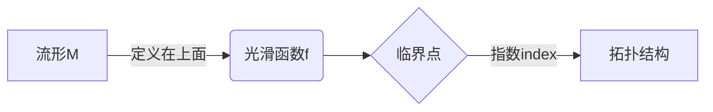

# 流形拓扑学：Morse理论的基本定理

## 1.背景介绍

流形拓扑学是研究流形的拓扑性质的一个数学分支。流形是一种在局部看起来像欧几里得空间的拓扑空间。流形广泛应用于物理学、微分几何、代数几何等领域。Morse理论是流形拓扑学中一个重要的工具,它研究了光滑函数在流形上的临界点,并将这些临界点与流形的拓扑不变量联系起来。

### 1.1 Morse理论的重要性

Morse理论为我们研究流形的拓扑性质提供了一种有力的工具。通过研究光滑函数在流形上的临界点,我们可以获得关于流形的重要拓扑信息,如贝塞尔数、欧拉特征数等。此外,Morse理论还在许多其他数学领域有着广泛的应用,如微分拓扑学、代数拓扑学、李群表示论等。

### 1.2 Morse理论的基本思想

Morse理论的基本思想是将一个流形分解为由临界点的不同指数决定的"手柄"。每个手柄对应着流形的一个拓扑不变量。通过计算每个手柄的指数,我们可以得到流形的拓扑不变量,如贝塞尔数和欧拉特征数。

## 2.核心概念与联系

### 2.1 流形

流形是一种在局部看起来像欧几里得空间的拓扑空间。更精确地说,一个流形是一个拓扑空间,它在每一点都有一个邻域,这个邻域与欧几里得空间的一个开子集同胚。流形的概念统一了许多重要的几何对象,如曲线、曲面、李群等。

### 2.2 临界点

在Morse理论中,我们研究的是光滑函数在流形上的临界点。一个点 $p$ 是函数 $f$ 在流形 $M$ 上的临界点,如果在 $p$ 处函数的全微分为零,即 $df_p=0$。临界点可以分为不同的指数,这个指数决定了临界点附近流形的拓扑结构。



### 2.3 Morse函数

Morse函数是一类特殊的光滑函数,它的所有临界点都是非退化的,即在临界点处,函数的Hesse矩阵是非奇异的。Morse理论主要研究Morse函数在流形上的性质。

### 2.4 拓扑不变量

拓扑不变量是指在同胚下保持不变的量,如欧拉特征数、贝塞尔数等。Morse理论的核心就是将流形的拓扑不变量与Morse函数的临界点联系起来。

## 3.核心算法原理具体操作步骤

Morse理论的核心算法可以概括为以下几个步骤:

1. **选择Morse函数**:在给定的流形 $M$ 上,选择一个适当的Morse函数 $f$。

2. **计算临界点及其指数**:计算 $f$ 在 $M$ 上的所有临界点,并计算每个临界点的指数。

3. **构造手柄分解**:根据临界点的指数,将流形 $M$ 分解为由不同指数的"手柄"组成的拓扑空间。

4. **计算拓扑不变量**:利用手柄分解,计算流形 $M$ 的拓扑不变量,如贝塞尔数、欧拉特征数等。

下面我们详细介绍这些步骤。

### 3.1 选择Morse函数

在Morse理论中,我们需要选择一个适当的Morse函数 $f$ 定义在流形 $M$ 上。一个好的Morse函数应该满足以下条件:

1. $f$ 是Morse函数,即所有临界点都是非退化的。
2. $f$ 的临界点数目有限。
3. 不同指数的临界点在函数值上是不同的,即 $f(p)\neq f(q)$ 如果 $p$ 和 $q$ 是不同指数的临界点。

在实践中,我们通常选择一些特殊的函数作为Morse函数,如高斯函数、高斯曲率函数等。

### 3.2 计算临界点及其指数

对于给定的Morse函数 $f$,我们需要计算它在流形 $M$ 上的所有临界点,并计算每个临界点的指数。

临界点的计算可以通过求解方程 $df=0$ 来完成。对于每个临界点 $p$,我们计算 $f$ 在 $p$ 处的Hesse矩阵 $H_p$。临界点的指数就是Hesse矩阵的负惯性指数,即 $H_p$ 中负特征值的个数。

我们将所有临界点按照指数从小到大排列,记为 $p_1,p_2,\ldots,p_k$,其中 $\text{index}(p_i)\leq \text{index}(p_{i+1})$。

### 3.3 构造手柄分解

根据临界点的指数,我们可以将流形 $M$ 分解为由不同指数的"手柄"组成的拓扑空间。具体做法如下:

1. 对于最小指数的临界点 $p_1$,在 $p_1$ 附近构造一个指数为 $\text{index}(p_1)$ 的手柄 $D^{\text{index}(p_1)}$。

2. 对于下一个临界点 $p_2$,在 $p_2$ 附近构造一个指数为 $\text{index}(p_2)$ 的手柄 $D^{\text{index}(p_2)}$,并将其以适当的方式附加到之前构造的手柄上。

3. 重复上一步,直到所有临界点都被处理完毕。

这个过程会产生一个新的拓扑空间 $X$,它与原始流形 $M$ 同胚。我们称这个过程为手柄分解。

手柄分解的关键在于,每个手柄都对应着流形的一个拓扑不变量。因此,通过计算每个手柄的指数,我们就可以得到流形的拓扑不变量。

### 3.4 计算拓扑不变量

最后一步是利用手柄分解计算流形 $M$ 的拓扑不变量。主要的拓扑不变量包括:

1. **贝塞尔数 (Betti numbers)**: 第 $i$ 个贝塞尔数 $b_i$ 等于指数为 $i$ 的手柄的个数。

2. **欧拉特征数 (Euler characteristic)**: 欧拉特征数 $\chi(M)$ 可以通过贝塞尔数计算,即 $\chi(M)=\sum_{i=0}^{\dim M}(-1)^ib_i$。

3. **同调群 (Homology groups)**: 同调群也可以通过手柄分解计算得到。

通过计算这些拓扑不变量,我们就获得了关于流形 $M$ 的重要拓扑信息。

## 4.数学模型和公式详细讲解举例说明

在上一节中,我们介绍了Morse理论的核心算法步骤。现在我们来详细讲解一些数学模型和公式。

### 4.1 临界点的指数

临界点的指数是Morse理论中一个关键概念。对于一个临界点 $p$,它的指数由函数 $f$ 在 $p$ 处的Hesse矩阵 $H_p$ 决定。

Hesse矩阵是函数 $f$ 的二阶偏导数组成的矩阵,即:

$$
H_p=\begin{pmatrix}
\frac{\partial^2f}{\partial x_1^2}(p) & \frac{\partial^2f}{\partial x_1\partial x_2}(p) & \cdots & \frac{\partial^2f}{\partial x_1\partial x_n}(p)\\
\frac{\partial^2f}{\partial x_2\partial x_1}(p) & \frac{\partial^2f}{\partial x_2^2}(p) & \cdots & \frac{\partial^2f}{\partial x_2\partial x_n}(p)\\
\vdots & \vdots & \ddots & \vdots\\
\frac{\partial^2f}{\partial x_n\partial x_1}(p) & \frac{\partial^2f}{\partial x_n\partial x_2}(p) & \cdots & \frac{\partial^2f}{\partial x_n^2}(p)
\end{pmatrix}
$$

临界点 $p$ 的指数定义为 $H_p$ 中负特征值的个数,记为 $\text{index}(p)$。

如果 $H_p$ 是非奇异的,即所有特征值都不为零,那么 $p$ 就是一个非退化的临界点。Morse理论主要研究这种非退化临界点。

### 4.2 手柄分解

手柄分解是Morse理论中另一个关键概念。它将一个流形分解为由不同指数的"手柄"组成的拓扑空间。

对于一个 $n$ 维流形 $M$,我们定义 $k$ 维手柄 $D^k$ 为单位球 $B^k$ 与边界球 $S^{k-1}$ 的笛卡尔积,即:

$$
D^k=B^k\times S^{n-k}
$$

手柄 $D^k$ 的指数就是 $k$。

在手柄分解过程中,我们从最小指数的临界点开始,在每个临界点附近构造一个与其指数相同的手柄,并将这些手柄以适当的方式附加在一起。最终得到的拓扑空间 $X$ 与原始流形 $M$ 同胚。

手柄分解的一个关键性质是,每个手柄都对应着流形的一个拓扑不变量。因此,通过计算每个手柄的指数,我们就可以得到流形的拓扑不变量。

### 4.3 贝塞尔数和欧拉特征数

贝塞尔数和欧拉特征数是流形拓扑学中两个重要的拓扑不变量。它们可以通过手柄分解直接计算得到。

对于一个 $n$ 维流形 $M$,第 $i$ 个贝塞尔数 $b_i$ 等于指数为 $i$ 的手柄的个数。换句话说,如果在手柄分解中有 $k_i$ 个指数为 $i$ 的手柄,那么 $b_i=k_i$。

欧拉特征数 $\chi(M)$ 可以通过贝塞尔数计算得到,公式如下:

$$
\chi(M)=\sum_{i=0}^n(-1)^ib_i
$$

例如,对于一个 $2$ 维球面 $S^2$,它的手柄分解包含一个指数为 $0$ 的手柄和一个指数为 $2$ 的手柄。因此,它的贝塞尔数为 $b_0=b_2=1$,其余 $b_i=0$。代入欧拉特征数公式,我们得到 $\chi(S^2)=1-0+1=2$,这与球面的欧拉特征数一致。

## 5.项目实践：代码实例和详细解释说明

为了更好地理解Morse理论,我们来看一个具体的代码实例。这个实例将计算一个二维流形的手柄分解和拓扑不变量。

我们将使用Python和NumPy库来实现这个例子。首先,我们定义一个Morse函数:

```python
import numpy as np

def morse_function(x, y):
    return x**4 + y**4 - x**2 - y**2
```

这是一个二元四次多项式函数,定义在 $\mathbb{R}^2$ 上。我们可以绘制这个函数的等高线图,观察它的临界点:

```python
import matplotlib.pyplot as plt
from matplotlib import cm

x = np.linspace(-2, 2, 100)
y = np.linspace(-2, 2, 100)
X, Y = np.meshgrid(x, y)
Z = morse_function(X, Y)

fig, ax = plt.subplots()
ax.contour(X, Y, Z, levels=np.linspace(-2, 2, 20), cmap=cm.coolwarm)
ax.set_xlabel('x')
ax.set_ylabel('y')
plt.show()
```


从等高线图中,我们可以看到这个函数有四个临界点,分别位于 $(0,0)$、$(1,1)$、$(-1,1)$ 和 $(1,-1)$。接下来,我们计算每个临界点的指数。

```python
def hessian(x, y):
    