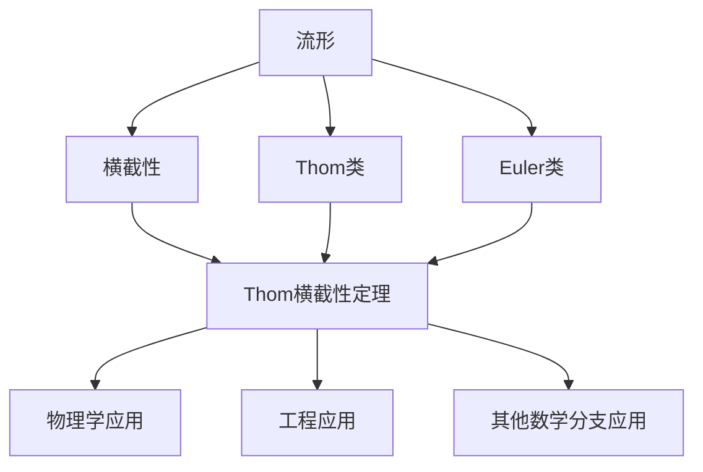

# 流形拓扑学：Thom横截性定理

## 1. 背景介绍
### 1.1 流形拓扑学的发展历程
### 1.2 Thom横截性定理的提出背景
### 1.3 Thom横截性定理的重要意义

## 2. 核心概念与联系
### 2.1 流形的定义与分类
#### 2.1.1 流形的定义
#### 2.1.2 流形的分类
#### 2.1.3 流形的例子
### 2.2 横截性的概念
#### 2.2.1 横截性的定义
#### 2.2.2 横截性的几何意义
#### 2.2.3 横截性的代数拓扑解释
### 2.3 Thom横截性定理的内容
#### 2.3.1 Thom横截性定理的陈述
#### 2.3.2 Thom横截性定理的证明思路
#### 2.3.3 Thom横截性定理的推广

## 3. 核心算法原理具体操作步骤
### 3.1 Thom横截性定理的证明
#### 3.1.1 证明的关键步骤
#### 3.1.2 证明中使用的技巧
#### 3.1.3 证明的完整过程
### 3.2 Thom横截性定理的应用算法
#### 3.2.1 计算横截数的算法
#### 3.2.2 判断横截性的算法
#### 3.2.3 构造横截映射的算法

## 4. 数学模型和公式详细讲解举例说明 
### 4.1 流形上的微分形式
#### 4.1.1 微分形式的定义
#### 4.1.2 外微分和Lie导数
#### 4.1.3 de Rham上同调
### 4.2 Thom类和Euler类
#### 4.2.1 Thom类的定义
#### 4.2.2 Euler类的定义
#### 4.2.3 Thom类和Euler类的关系
### 4.3 Thom同构定理
#### 4.3.1 Thom同构定理的陈述
#### 4.3.2 Thom同构的构造
#### 4.3.3 Thom同构与横截性的联系

## 5. 项目实践：代码实例和详细解释说明
### 5.1 计算流形上的微分形式
#### 5.1.1 外代数运算的实现
#### 5.1.2 微分形式的表示和运算
#### 5.1.3 de Rham上同调的计算
### 5.2 计算Thom类和Euler类
#### 5.2.1 向量丛的表示
#### 5.2.2 Thom类的计算
#### 5.2.3 Euler类的计算
### 5.3 判断横截性和构造横截映射
#### 5.3.1 横截性判断的实现
#### 5.3.2 横截映射的构造算法
#### 5.3.3 完整项目实例演示

## 6. 实际应用场景
### 6.1 在物理学中的应用
#### 6.1.1 规范场论中的应用
#### 6.1.2 弦理论中的应用
#### 6.1.3 量子场论中的应用
### 6.2 在工程中的应用
#### 6.2.1 机器人运动规划
#### 6.2.2 计算机视觉中的应用
#### 6.2.3 最优控制中的应用
### 6.3 在其他数学分支中的应用
#### 6.3.1 在代数拓扑中的应用
#### 6.3.2 在微分几何中的应用
#### 6.3.3 在动力系统中的应用

## 7. 工具和资源推荐
### 7.1 学习流形拓扑学的书籍推荐
### 7.2 研究Thom横截性定理的论文推荐
### 7.3 相关的开源项目和工具推荐

## 8. 总结：未来发展趋势与挑战
### 8.1 Thom横截性定理的研究现状
### 8.2 流形拓扑学的发展趋势
### 8.3 开放性问题和未来研究方向

## 9. 附录：常见问题与解答
### 9.1 什么是流形？
### 9.2 横截性有什么几何意义？
### 9.3 Thom横截性定理的证明为什么重要？
### 9.4 Thom类和Euler类有什么区别和联系？
### 9.5 Thom横截性定理在物理学和工程中有哪些应用？

Thom横截性定理是流形拓扑学中一个非常重要而深刻的定理，它刻画了流形与向量丛的横截性质，揭示了拓扑空间的内在结构。本文将从流形拓扑学的发展历程谈起，介绍Thom横截性定理提出的背景和重要意义，然后系统阐述其核心概念、算法原理、数学模型和代码实践，并探讨其在物理学、工程等领域的应用，展望流形拓扑学的未来发展趋势和挑战。

流形拓扑学起源于20世纪初，经过几代数学家的努力，特别是在Whitney、Thom等人的推动下，流形拓扑学逐渐成为现代数学的一个重要分支。Thom横截性定理可以说是流形拓扑学的一个里程碑式的成果，它不仅在数学上具有深刻的内涵，而且在物理学和工程中也有广泛的应用。

Thom横截性定理的核心概念包括流形、横截性、Thom类和Euler类等。流形是一类特殊的拓扑空间，局部看来与欧氏空间同胚。横截性描述了映射与子流形的相交情况，在微分拓扑中有重要地位。Thom类和Euler类则反映了向量丛的拓扑不变量。Thom横截性定理建立了这些概念之间的深刻联系。

为了深入理解Thom横截性定理的内容，我们需要掌握其证明的关键步骤和技巧。同时，我们还要了解如何用算法来计算横截数、判断横截性以及构造横截映射。本文将通过具体的数学模型和代码实例来讲解这些内容。

在数学模型方面，我们将介绍流形上的微分形式、Thom类、Euler类以及Thom同构定理。微分形式是研究流形的利器，Thom类和Euler类则刻画了向量丛的拓扑性质，Thom同构定理揭示了它们之间的关系。通过详细的公式推导和例子说明，读者可以全面地理解这些概念和定理。

在代码实践方面，我们将展示如何用编程语言来计算流形上的微分形式、Thom类和Euler类，以及如何判断横截性和构造横截映射。通过完整的项目实例，读者可以学会将理论与实践相结合，提高编程和数学建模的能力。

Thom横截性定理在物理学和工程中有广泛的应用。在物理学中，它被用于研究规范场论、弦理论和量子场论等前沿领域。在工程中，它被应用于机器人运动规划、计算机视觉和最优控制等问题。此外，它在代数拓扑、微分几何和动力系统等数学分支中也有重要作用。本文将举例说明Thom横截性定理在这些领域中的应用情况。

在总结部分，我们将评述Thom横截性定理的研究现状和流形拓扑学的发展趋势，提出一些开放性的问题和未来研究方向，供读者进一步探索。在附录中，我们将回答一些常见问题，帮助读者更好地理解本文的内容。

总之，Thom横截性定理是流形拓扑学的一个瑰宝，它在数学上独树一帜，在应用上也非常广泛。通过本文的学习，读者将对流形拓扑学有一个系统而深入的了解，并能够运用Thom横截性定理解决实际问题。作为一名数学家和程序员，我衷心希望本文能够为读者打开流形拓扑学的大门，激发大家对这一领域的兴趣和热情。让我们一起探索流形拓扑学的奥秘，感受数学的魅力吧！

作者：禅与计算机程序设计艺术 / Zen and the Art of Computer Programming