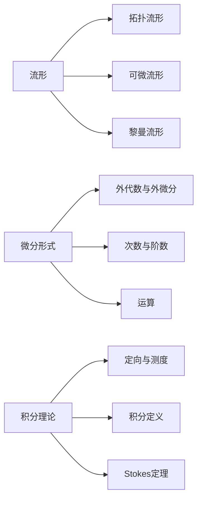

# 流形拓扑学：微分形式的积分

## 1. 背景介绍
### 1.1 流形拓扑学的发展历程
#### 1.1.1 早期的拓扑学研究
#### 1.1.2 现代流形拓扑学的兴起
#### 1.1.3 微分形式在流形拓扑学中的重要性
### 1.2 微分形式积分的意义
#### 1.2.1 揭示流形的几何与拓扑性质
#### 1.2.2 在物理学和工程学中的应用
#### 1.2.3 与其他数学分支的联系

## 2. 核心概念与联系
### 2.1 流形的定义与分类
#### 2.1.1 拓扑流形
#### 2.1.2 可微流形
#### 2.1.3 黎曼流形
### 2.2 微分形式的定义与性质
#### 2.2.1 外代数与外微分
#### 2.2.2 微分形式的次数与阶数
#### 2.2.3 微分形式的运算
### 2.3 流形上的积分理论
#### 2.3.1 流形上的定向与测度
#### 2.3.2 微分形式的积分定义
#### 2.3.3 Stokes定理与广义Stokes定理

## 3. 核心算法原理具体操作步骤
### 3.1 在流形上构造微分形式
#### 3.1.1 利用局部坐标表示微分形式
#### 3.1.2 利用分拆单位构造微分形式
#### 3.1.3 利用外代数运算构造微分形式
### 3.2 计算微分形式的外微分
#### 3.2.1 利用外微分算子计算
#### 3.2.2 利用坐标表示计算
#### 3.2.3 利用分拆单位计算
### 3.3 在流形上积分微分形式
#### 3.3.1 利用测度理论定义积分
#### 3.3.2 利用分块积分计算
#### 3.3.3 利用Stokes定理化简计算

## 4. 数学模型和公式详细讲解举例说明
### 4.1 外代数基本概念与运算公式
#### 4.1.1 外积的定义与性质
$v_1 \wedge v_2 \wedge \cdots \wedge v_k = \sum\limits_{\sigma \in S_k} \text{sgn}(\sigma) v_{\sigma(1)} \otimes v_{\sigma(2)} \otimes \cdots \otimes v_{\sigma(k)}$
#### 4.1.2 外代数的运算律
$\alpha \wedge (\beta + \gamma) = \alpha \wedge \beta + \alpha \wedge \gamma$
$(\alpha + \beta) \wedge \gamma = \alpha \wedge \gamma + \beta \wedge \gamma$
#### 4.1.3 外代数在微分形式中的应用
### 4.2 微分形式的坐标表示与运算公式
#### 4.2.1 微分形式在局部坐标下的表示
$\omega = \sum\limits_{i_1 < i_2 < \cdots < i_k} a_{i_1 i_2 \cdots i_k}(x) dx^{i_1} \wedge dx^{i_2} \wedge \cdots \wedge dx^{i_k}$
#### 4.2.2 微分形式的外微分公式
$d\omega = \sum\limits_{i=1}^n \frac{\partial a_{i_1 i_2 \cdots i_k}}{\partial x^i} dx^i \wedge dx^{i_1} \wedge dx^{i_2} \wedge \cdots \wedge dx^{i_k}$
#### 4.2.3 微分形式的积分公式
$\int_M \omega = \int_M \sum\limits_{i_1 < i_2 < \cdots < i_k} a_{i_1 i_2 \cdots i_k}(x) dx^{i_1} \wedge dx^{i_2} \wedge \cdots \wedge dx^{i_k}$
### 4.3 Stokes定理的数学表述与证明
#### 4.3.1 Stokes定理的一般形式
$\int_{\partial M} \omega = \int_M d\omega$
#### 4.3.2 低维情形的Stokes定理
- 格林公式：$\int_{\partial D} P dx + Q dy = \iint_D (\frac{\partial Q}{\partial x} - \frac{\partial P}{\partial y}) dxdy$
- 高斯公式：$\iint_{\partial \Omega} \mathbf{F} \cdot d\mathbf{S} = \iiint_{\Omega} \text{div} \mathbf{F} dV$
- 斯托克斯公式：$\int_{\partial S} \mathbf{F} \cdot d\mathbf{r} = \iint_{S} \text{rot} \mathbf{F} \cdot d\mathbf{S}$
#### 4.3.3 Stokes定理的证明思路

## 5. 项目实践：代码实例和详细解释说明
### 5.1 用Python的SymPy库进行微分形式的符号运算
#### 5.1.1 定义微分形式
#### 5.1.2 计算外微分
#### 5.1.3 进行坐标变换
### 5.2 用MATLAB进行流形上微分形式的数值积分
#### 5.2.1 生成流形网格
#### 5.2.2 计算微分形式在网格上的积分
#### 5.2.3 计算积分误差与收敛阶
### 5.3 用C++实现Stokes定理的数值验证
#### 5.3.1 定义流形的边界
#### 5.3.2 计算边界上的积分
#### 5.3.3 计算流形内部的外微分并积分
#### 5.3.4 比较两个积分结果

## 6. 实际应用场景
### 6.1 在电磁场理论中的应用
#### 6.1.1 麦克斯韦方程组的微分形式表述
#### 6.1.2 电磁场的势函数与规范对称性
#### 6.1.3 电磁场的拓扑性质与阿贝尔规范场论
### 6.2 在流体力学和气象学中的应用  
#### 6.2.1 速度场与涡量场的微分形式描述
#### 6.2.2 亥姆霍兹定理与无旋运动
#### 6.2.3 大气环流与天气系统的拓扑分析
### 6.3 在计算机图形学中的应用
#### 6.3.1 曲面参数化与纹理映射
#### 6.3.2 网格曲面的微分几何量计算
#### 6.3.3 基于微分形式的物理仿真

## 7. 工具和资源推荐
### 7.1 数学软件与库
- MATLAB
- Mathematica
- SymPy
- GeoPy  
### 7.2 开源项目与代码库
- MFEM: 有限元建模与仿真库
- PyDEC: 离散外微分几何计算库
- libigl: 几何处理算法库
### 7.3 学习资源与参考书目
- Differential Forms and Applications - Manfredo P. do Carmo
- Geometric Integration Theory - Steven G. Krantz
- Differential Forms: A Complement to Vector Calculus - Steven H. Weintraub

## 8. 总结：未来发展趋势与挑战
### 8.1 微分形式在人工智能与机器学习中的潜在应用
### 8.2 微分形式与分数阶微积分的结合
### 8.3 微分形式在高维数据分析与流形学习中的应用前景
### 8.4 微分形式理论的进一步完善与深入

## 9. 附录：常见问题与解答
### 9.1 微分形式与传统矢量分析的区别与联系
### 9.2 微分形式积分的物理意义解释
### 9.3 学习微分形式理论的先修知识要求
### 9.4 微分形式在考研与竞赛中的考点分析

作者：禅与计算机程序设计艺术 / Zen and the Art of Computer Programming