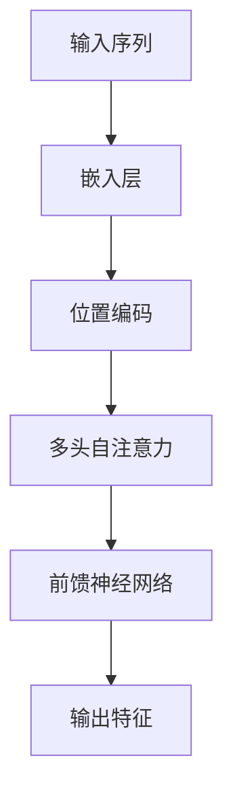
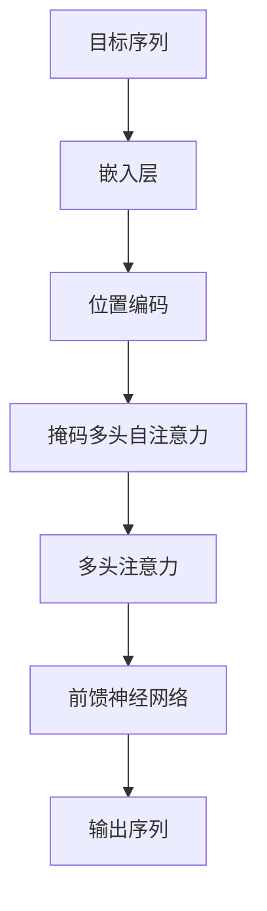

# 测试Transformer模型

## 1.背景介绍

Transformer模型自2017年由Vaswani等人提出以来，迅速成为自然语言处理（NLP）领域的主流模型。其独特的架构和强大的性能使其在机器翻译、文本生成、问答系统等多个任务中表现出色。本文将深入探讨Transformer模型的核心概念、算法原理、数学模型、实际应用及未来发展趋势，并提供详细的代码实例和工具资源推荐。

## 2.核心概念与联系

### 2.1 Transformer架构概述

Transformer模型的核心架构由编码器（Encoder）和解码器（Decoder）组成。编码器负责将输入序列转换为一组特征表示，解码器则根据这些特征表示生成输出序列。与传统的循环神经网络（RNN）不同，Transformer完全基于注意力机制（Attention Mechanism），无需序列化处理输入数据。

### 2.2 注意力机制

注意力机制是Transformer模型的核心创新之一。它允许模型在处理每个输入元素时，动态地关注输入序列中的其他元素，从而捕捉到更丰富的上下文信息。注意力机制的主要形式是自注意力（Self-Attention），它在编码器和解码器中都有广泛应用。

### 2.3 多头注意力

多头注意力（Multi-Head Attention）是对单一注意力机制的扩展。通过并行地执行多个注意力操作，模型可以从不同的子空间中提取信息，从而增强表示能力。每个头（Head）独立地执行注意力计算，最后将结果拼接并线性变换。

### 2.4 位置编码

由于Transformer模型不具备处理序列数据的内在顺序信息，位置编码（Positional Encoding）被引入以补充这一缺陷。位置编码通过向输入向量中添加位置信息，使模型能够感知输入序列的顺序。

## 3.核心算法原理具体操作步骤

### 3.1 编码器

编码器由多个相同的层（Layer）堆叠而成，每一层包括两个子层：多头自注意力机制和前馈神经网络（Feed-Forward Neural Network）。每个子层后面都跟有残差连接（Residual Connection）和层归一化（Layer Normalization）。



### 3.2 解码器

解码器的结构与编码器类似，但在多头自注意力机制之前增加了一个额外的多头注意力层，用于关注编码器的输出。此外，解码器的自注意力机制被掩码（Masking）以防止模型在生成序列时看到未来的信息。



## 4.数学模型和公式详细讲解举例说明

### 4.1 注意力机制公式

注意力机制的核心公式如下：

$$
\text{Attention}(Q, K, V) = \text{softmax}\left(\frac{QK^T}{\sqrt{d_k}}\right)V
$$

其中，$Q$、$K$、$V$分别表示查询（Query）、键（Key）和值（Value）矩阵，$d_k$是键向量的维度。

### 4.2 多头注意力公式

多头注意力的计算过程如下：

$$
\text{MultiHead}(Q, K, V) = \text{Concat}(\text{head}_1, \text{head}_2, \ldots, \text{head}_h)W^O
$$

其中，每个头的计算方式为：

$$
\text{head}_i = \text{Attention}(QW_i^Q, KW_i^K, VW_i^V)
$$

$W_i^Q$、$W_i^K$、$W_i^V$和$W^O$是可训练的权重矩阵。

### 4.3 位置编码公式

位置编码的计算方式如下：

$$
PE_{(pos, 2i)} = \sin\left(\frac{pos}{10000^{2i/d_{model}}}\right)
$$

$$
PE_{(pos, 2i+1)} = \cos\left(\frac{pos}{10000^{2i/d_{model}}}\right)
$$

其中，$pos$表示位置，$i$表示维度索引，$d_{model}$是模型的维度。

## 5.项目实践：代码实例和详细解释说明

### 5.1 环境准备

首先，确保安装了必要的Python库：

```bash
pip install torch transformers
```

### 5.2 Transformer模型实现

以下是一个简单的Transformer模型实现示例：

```python
import torch
import torch.nn as nn
from transformers import BertModel, BertTokenizer

class SimpleTransformer(nn.Module):
    def __init__(self, model_name='bert-base-uncased'):
        super(SimpleTransformer, self).__init__()
        self.bert = BertModel.from_pretrained(model_name)
        self.tokenizer = BertTokenizer.from_pretrained(model_name)
        self.fc = nn.Linear(self.bert.config.hidden_size, 2)  # 二分类任务

    def forward(self, text):
        inputs = self.tokenizer(text, return_tensors='pt', padding=True, truncation=True)
        outputs = self.bert(**inputs)
        cls_output = outputs.last_hidden_state[:, 0, :]
        logits = self.fc(cls_output)
        return logits

# 测试模型
model = SimpleTransformer()
text = ["Hello, how are you?", "I am fine, thank you!"]
logits = model(text)
print(logits)
```

### 5.3 代码解释

1. **环境准备**：安装必要的库，如`torch`和`transformers`。
2. **模型定义**：定义一个简单的Transformer模型，使用预训练的BERT模型作为编码器，并添加一个全连接层用于分类任务。
3. **前向传播**：在前向传播过程中，首先将输入文本进行分词和编码，然后通过BERT模型获取特征表示，最后通过全连接层得到分类结果。

## 6.实际应用场景

### 6.1 机器翻译

Transformer模型在机器翻译任务中表现出色。其并行处理能力和强大的上下文捕捉能力使其在多个语言对之间实现了高质量的翻译。

### 6.2 文本生成

Transformer模型在文本生成任务中也有广泛应用，如生成对话、自动写作等。其自注意力机制能够捕捉到长距离的依赖关系，从而生成连贯的文本。

### 6.3 问答系统

在问答系统中，Transformer模型能够理解复杂的问题并生成准确的答案。其强大的表示能力使其在多个问答数据集上取得了优异的成绩。

### 6.4 情感分析

Transformer模型在情感分析任务中也表现出色。通过对文本进行编码，模型能够捕捉到文本中的情感信息，从而实现高准确率的情感分类。

## 7.工具和资源推荐

### 7.1 预训练模型

- **BERT**：BERT是由Google提出的预训练模型，广泛应用于各种NLP任务。
- **GPT**：GPT是OpenAI提出的生成式预训练模型，擅长文本生成任务。
- **T5**：T5是Google提出的文本到文本框架，能够处理多种NLP任务。

### 7.2 开源库

- **Transformers**：由Hugging Face提供的开源库，支持多种预训练模型。
- **Fairseq**：由Facebook AI Research提供的开源库，支持多种NLP任务。

### 7.3 在线资源

- **Kaggle**：提供丰富的NLP数据集和竞赛。
- **Papers with Code**：提供最新的NLP研究论文和代码实现。

## 8.总结：未来发展趋势与挑战

Transformer模型在NLP领域取得了巨大的成功，但仍面临一些挑战和发展机遇。未来的发展趋势包括：

- **模型压缩**：Transformer模型通常非常大，如何在保证性能的前提下进行模型压缩是一个重要的研究方向。
- **多模态学习**：将Transformer模型应用于多模态数据（如图像、文本、音频）的融合和处理。
- **解释性**：提高Transformer模型的可解释性，使其决策过程更加透明和可理解。

## 9.附录：常见问题与解答

### 9.1 Transformer模型的训练时间为什么这么长？

Transformer模型通常包含大量的参数，训练时间较长。可以通过使用更强大的硬件（如GPU、TPU）和优化算法（如混合精度训练）来加速训练。

### 9.2 如何选择合适的预训练模型？

选择预训练模型时，应根据具体任务和数据集的特点进行选择。例如，BERT适用于需要强大表示能力的任务，GPT适用于文本生成任务。

### 9.3 Transformer模型是否适用于所有NLP任务？

虽然Transformer模型在许多NLP任务中表现出色，但并不适用于所有任务。对于一些特定任务，可能需要结合其他模型或方法来达到最佳效果。

---

作者：禅与计算机程序设计艺术 / Zen and the Art of Computer Programming