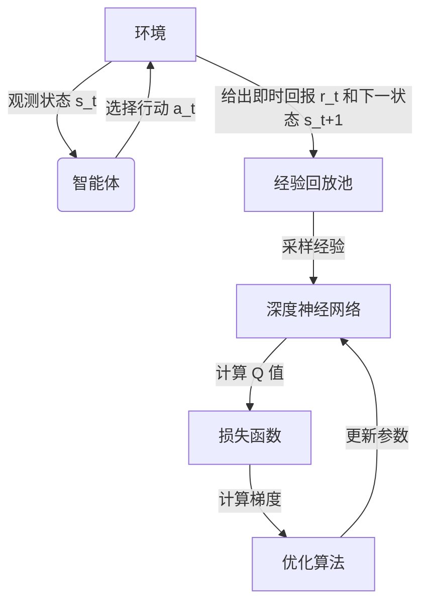

# 深度 Q-learning：DL、ML 和 AI 的交集

## 1. 背景介绍

在人工智能(AI)和机器学习(ML)领域,强化学习(Reinforcement Learning, RL)是一种重要的学习范式。与监督学习和无监督学习不同,强化学习的目标是通过与环境的交互来学习如何采取最优行动,从而最大化预期的累积回报。

Q-learning 是强化学习中最广为人知和最成功的算法之一。它是一种基于值的强化学习算法,旨在学习一个行为价值函数(Q 函数),该函数可以预测在给定状态下采取某个行动所能获得的预期长期回报。传统的 Q-learning 算法使用表格或其他参数化函数来近似 Q 函数,但是当状态空间和动作空间变大时,这种方法会遇到维数灾难的问题。

深度 Q-learning(Deep Q-Learning, DQN)通过利用深度神经网络来近似 Q 函数,从而克服了传统 Q-learning 算法的局限性。它将深度学习(Deep Learning, DL)的强大功能与 Q-learning 的理论优势相结合,成为强化学习领域的一个重要突破。

## 2. 核心概念与联系

### 2.1 Q-learning 基础

在 Q-learning 中,我们定义了一个 Q 函数 $Q(s, a)$,它表示在状态 $s$ 下采取行动 $a$ 所能获得的预期长期回报。Q-learning 算法的目标是通过与环境的交互,不断更新 Q 函数,使其逼近真实的 Q 值函数。

Q-learning 算法的核心更新规则如下:

$$Q(s_t, a_t) \leftarrow Q(s_t, a_t) + \alpha \left[ r_t + \gamma \max_{a} Q(s_{t+1}, a) - Q(s_t, a_t) \right]$$

其中:

- $\alpha$ 是学习率,控制新信息对 Q 值的影响程度。
- $\gamma$ 是折现因子,用于平衡当前回报和未来回报的权重。
- $r_t$ 是在时间步 $t$ 获得的即时回报。
- $\max_{a} Q(s_{t+1}, a)$ 是在下一个状态 $s_{t+1}$ 下,所有可能行动中 Q 值的最大值,代表了最优行动的预期长期回报。

### 2.2 深度神经网络

深度神经网络是一种强大的机器学习模型,它由多层神经元组成,能够从数据中自动学习特征表示。深度神经网络通常由输入层、隐藏层和输出层组成,每一层都由多个神经元构成,并通过权重矩阵进行连接。

在深度 Q-learning 中,我们使用深度神经网络来近似 Q 函数,即 $Q(s, a; \theta) \approx Q^*(s, a)$,其中 $\theta$ 表示网络的参数。通过训练,网络可以学习到一个良好的 Q 函数近似,从而指导智能体采取最优行动。

### 2.3 深度 Q-learning 算法

深度 Q-learning 算法将 Q-learning 的理论框架与深度神经网络的强大表示能力相结合。它的核心思想是使用一个深度神经网络来近似 Q 函数,并通过与环境的交互不断更新网络参数,使得网络输出的 Q 值逼近真实的 Q 值函数。

在深度 Q-learning 中,我们定义了一个损失函数,用于衡量网络输出的 Q 值与目标 Q 值之间的差距。目标 Q 值由 Q-learning 更新规则计算得到,即:

$$y_t = r_t + \gamma \max_{a'} Q(s_{t+1}, a'; \theta^-)$$

其中 $\theta^-$ 表示目标网络的参数,通常是一个滞后于主网络的副本,用于增加算法的稳定性。

然后,我们使用梯度下降法来最小化损失函数,从而更新主网络的参数 $\theta$,使得网络输出的 Q 值逼近目标 Q 值。



上图展示了深度 Q-learning 算法的工作流程。智能体与环境交互,将经验存储在经验回放池中。然后,从经验回放池中采样数据,输入到深度神经网络中计算 Q 值。通过与目标 Q 值的比较,计算损失函数并使用优化算法(如梯度下降)更新网络参数。

## 3. 核心算法原理具体操作步骤

深度 Q-learning 算法的具体操作步骤如下:

1. **初始化**:
   - 初始化深度神经网络的参数 $\theta$,作为主网络。
   - 初始化目标网络参数 $\theta^-$,将其设置为与主网络相同。
   - 初始化经验回放池 $D$,用于存储智能体与环境的交互经验。

2. **观测初始状态**:
   - 从环境中获取初始状态 $s_0$。

3. **交互循环**:
   - 对于每个时间步 $t$:
     1. **选择行动**:
        - 使用 $\epsilon$-贪婪策略从主网络输出的 Q 值中选择行动 $a_t$。
        - 或者,使用其他探索策略(如噪声策略)选择行动。
     2. **执行行动并观测结果**:
        - 在环境中执行选择的行动 $a_t$,获得即时回报 $r_t$ 和下一个状态 $s_{t+1}$。
     3. **存储经验**:
        - 将经验 $(s_t, a_t, r_t, s_{t+1})$ 存储到经验回放池 $D$ 中。
     4. **采样经验并更新网络**:
        - 从经验回放池 $D$ 中随机采样一批经验。
        - 计算目标 Q 值:
          $$y_j = r_j + \gamma \max_{a'} Q(s_{j+1}, a'; \theta^-)$$
        - 计算损失函数:
          $$L(\theta) = \mathbb{E}_{(s, a, r, s')\sim D}\left[(y - Q(s, a; \theta))^2\right]$$
        - 使用优化算法(如梯度下降)最小化损失函数,更新主网络参数 $\theta$。
     5. **更新目标网络**:
        - 每隔一定步骤,将主网络的参数 $\theta$ 复制到目标网络 $\theta^-$,以增加算法的稳定性。

4. **终止条件**:
   - 重复步骤 3 直到达到终止条件,如最大训练步数或收敛。

在实际应用中,还可以引入一些技巧来提高深度 Q-learning 算法的性能,例如:

- **Double DQN**: 使用两个独立的 Q 网络来解决过估计问题。
- **Prioritized Experience Replay**: 根据经验的重要性对经验进行重要性采样,提高学习效率。
- **Dueling Network**: 将 Q 值分解为状态值和优势函数,提高了网络的泛化能力。

## 4. 数学模型和公式详细讲解举例说明

在深度 Q-learning 算法中,我们使用深度神经网络来近似 Q 函数,即 $Q(s, a; \theta) \approx Q^*(s, a)$,其中 $\theta$ 表示网络的参数。我们的目标是通过训练,使得网络输出的 Q 值逼近真实的 Q 值函数。

为了实现这一目标,我们定义了一个损失函数,用于衡量网络输出的 Q 值与目标 Q 值之间的差距。目标 Q 值由 Q-learning 更新规则计算得到,即:

$$y_t = r_t + \gamma \max_{a'} Q(s_{t+1}, a'; \theta^-)$$

其中 $\theta^-$ 表示目标网络的参数,通常是一个滞后于主网络的副本,用于增加算法的稳定性。

然后,我们使用均方误差(Mean Squared Error, MSE)作为损失函数:

$$L(\theta) = \mathbb{E}_{(s, a, r, s')\sim D}\left[(y - Q(s, a; \theta))^2\right]$$

其中 $D$ 表示经验回放池,$(s, a, r, s')$ 是从经验回放池中采样的一个经验样本。

通过最小化损失函数,我们可以使网络输出的 Q 值逼近目标 Q 值。这可以通过梯度下降法来实现:

$$\theta \leftarrow \theta - \alpha \nabla_\theta L(\theta)$$

其中 $\alpha$ 是学习率,控制参数更新的步长。

为了计算梯度 $\nabla_\theta L(\theta)$,我们可以使用反向传播算法,将损失函数关于网络输出的梯度传递回网络的各个层,从而计算出网络参数的梯度。

让我们以一个简单的示例来说明这个过程。假设我们有一个具有单个隐藏层的深度神经网络,用于近似 Q 函数。网络的输入是状态 $s$,输出是 Q 值 $Q(s, a; \theta)$,其中 $\theta$ 包含了网络的所有参数。

对于一个样本 $(s, a, r, s')$,我们可以计算目标 Q 值:

$$y = r + \gamma \max_{a'} Q(s', a'; \theta^-)$$

然后,我们计算网络输出的 Q 值与目标 Q 值之间的均方误差:

$$L(\theta) = \frac{1}{2}(y - Q(s, a; \theta))^2$$

为了更新网络参数 $\theta$,我们需要计算损失函数关于 $\theta$ 的梯度:

$$\nabla_\theta L(\theta) = (Q(s, a; \theta) - y) \nabla_\theta Q(s, a; \theta)$$

其中 $\nabla_\theta Q(s, a; \theta)$ 可以通过反向传播算法计算得到。

最后,我们使用梯度下降法更新网络参数:

$$\theta \leftarrow \theta - \alpha (Q(s, a; \theta) - y) \nabla_\theta Q(s, a; \theta)$$

通过不断重复这个过程,网络参数 $\theta$ 将逐渐收敛,使得网络输出的 Q 值逼近真实的 Q 值函数。

## 5. 项目实践: 代码实例和详细解释说明

为了更好地理解深度 Q-learning 算法,我们将通过一个简单的示例来实现它。在这个示例中,我们将使用 PyTorch 库来构建深度神经网络,并在 OpenAI Gym 环境中训练智能体。

### 5.1 环境设置

我们将使用 OpenAI Gym 中的 CartPole-v1 环境,这是一个经典的控制问题,目标是通过水平移动推车来保持杆子直立。

```python
import gym
env = gym.make('CartPole-v1')
```

### 5.2 深度神经网络

我们定义一个简单的全连接神经网络来近似 Q 函数。网络的输入是当前状态,输出是每个可能行动的 Q 值。

```python
import torch
import torch.nn as nn

class DQN(nn.Module):
    def __init__(self, state_dim, action_dim):
        super(DQN, self).__init__()
        self.fc1 = nn.Linear(state_dim, 64)
        self.fc2 = nn.Linear(64, action_dim)

    def forward(self, x):
        x = torch.relu(self.fc1(x))
        x = self.fc2(x)
        return x
```

### 5.3 深度 Q-learning 算法实现

接下来,我们实现深度 Q-learning 算法的核心部分。

```python
import random
from collections import deque

class DQNAgent:
    def __init__(self, state_dim, action_dim):
        self.device = torch.device("cuda" if torch.cuda.is_available() else "cpu")
        self.q_net = DQN(state_dim, action_dim).to(self.device)
        self.target_q_net = DQN(state_dim, action_dim).to(self.device)
        self.target_q_net.load_state_dict(self.q_net.state_dict())
        self.optimizer = torch.optim.Adam(self.q_net.parameters(), lr=1e-3)
        self.replay_buffer = deque(maxlen=10000)
        self.epsilon = 1.0