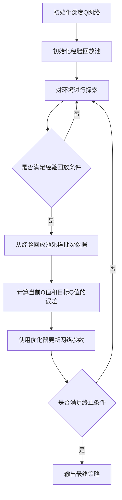

# 深度 Q-learning：在无人仓库中的应用

## 1.背景介绍

### 1.1 无人仓库的兴起

随着电子商务行业的蓬勃发展,物流配送中心的自动化程度越来越高。无人仓库(Automated Warehouse)作为一种先进的物流解决方案,已经被众多企业所采用。无人仓库通过引入自动导引车(AGV)、自动穿梭车(Shuttle)等智能设备,实现了货物的自动分拣、存储和运输,大幅提高了作业效率和精准度。

### 1.2 无人仓库面临的挑战

然而,在无人仓库的运营过程中,仍然存在一些亟待解决的问题和挑战:

- **动态路径规划**:由于仓库环境的复杂性,AGV需要根据实时状况动态调整行驶路径,以避免碰撞、拥堵等情况发生。
- **高效调度**:如何合理分配任务,使多个AGV协同作业,最大限度地发挥系统的整体运载能力。
- **能耗优化**:降低AGV的总体耗能,延长电池使用寿命,减少充电时间。

解决上述挑战,需要借助先进的人工智能算法,对无人仓库的整体运营进行智能优化和决策。

### 1.3 Q-learning在无人仓库中的应用

作为强化学习领域的经典算法,Q-learning已被成功应用于无人仓库的路径规划和调度优化。与其他算法相比,Q-learning具有以下优势:

- 不需要预先给定环境模型,可以通过与环境的互动来学习最优策略。
- 算法收敛性理论较为完善,在满足条件时可以收敛到最优策略。
- 算法相对简单,易于部署和实施。

然而,传统Q-learning在处理大规模、高维状态空间时,往往会遇到"维数灾难"的问题,导致算法收敛缓慢、甚至无法收敛。为了克服这一缺陷,深度Q-learning(Deep Q-learning)应运而生。

## 2.核心概念与联系 

### 2.1 Q-learning基本原理

Q-learning属于无模型的强化学习算法,其核心思想是通过与环境的互动,不断更新状态-行为值函数Q(s,a),最终得到最优策略π*。

具体来说,Q-learning算法由以下几个基本要素组成:

- **状态(State) s** :环境的一个静态表示
- **行为(Action) a** :智能体可以在当前状态下采取的行为
- **奖励(Reward) r** :环境给予智能体的反馈,用于评估行为的好坏
- **状态转移(State Transition)**: 智能体根据当前状态s采取行为a后,环境转移到新状态s'的概率
- **折扣因子(Discount Factor) γ**: 决定了智能体对未来奖励的重视程度

Q-learning的核心是通过不断更新Q(s,a)值,使其逼近最优Q*函数:

$$Q(s,a) \leftarrow Q(s,a) + \alpha[r + \gamma \max_{a'}Q(s',a') - Q(s,a)]$$

其中,α为学习率。当Q函数收敛时,根据Q(s,a)的最大值选取相应行为,即可得到最优策略π*。

### 2.2 深度Q-learning(Deep Q-learning)

传统Q-learning通过查表或函数拟合的方式来表示和更新Q值,当状态空间庞大时,查表存储成本高昂,函数拟合精度又难以保证。为了解决这一问题,深度Q-learning引入了深度神经网络来拟合Q函数。

深度Q网络(DQN)将当前状态s作为输入,通过卷积神经网络或全连接网络提取特征,最终输出各个行为a对应的Q(s,a)值。在与环境互动的过程中,不断更新网络参数,使得Q(s,a)值逼近最优Q*值。

```mermaid
graph LR
    A[当前状态s] --> B(特征提取网络)
    B --> C{Q值输出层}
    C --> D[Q(s,a1)]
    C --> E[Q(s,a2)]
    C --> F[Q(s,a3)]
```

深度Q-learning相比传统Q-learning的优势在于:

- 使用深度网络拟合Q函数,可以有效处理高维、大规模的状态空间
- 端到端的训练方式,无需人工设计特征,可以自动学习状态的高阶特征
- 利用GPU的并行计算能力,可以加速Q值的迭代更新过程

## 3.核心算法原理具体操作步骤

虽然深度Q-learning的核心思想简单,但在实际应用中,还需要一些改进策略来确保算法的收敛性和性能。以下是深度Q-learning在无人仓库中应用的具体算法流程:



1. **初始化深度Q网络和经验回放池**

   - 初始化一个深度神经网络,用于拟合Q函数,网络输入为当前状态s,输出为各行为对应的Q(s,a)值
   - 初始化一个经验回放池(Experience Replay Buffer),用于存储探索过程中的(s,a,r,s')转换

2. **与环境进行探索**

   - 对于当前状态s,使用ε-贪婪策略选取行为a:
     - 以概率ε随机选取一个行为(增加探索)
     - 以概率1-ε选取当前Q(s,a)值最大的行为(利用已有经验)
   - 执行选取的行为a,获得反馈奖励r和新状态s'
   - 将(s,a,r,s')转换存入经验回放池

3. **经验回放和网络训练**

   - 当经验回放池存储的样本数量超过一定值时,从中随机采样出一个批次的数据
   - 对于每个(s,a,r,s')样本,计算其目标Q值:
     $$
     y = r + \gamma \max_{a'}Q(s', a'; \theta^-)
     $$
     其中$\theta^-$为目标Q网络的参数,可定期从主Q网络复制得到,增加训练稳定性。
   - 使用均方误差损失函数计算当前Q网络输出的Q值与目标Q值之间的误差:
     $$
     L = \mathbb{E}_{(s,a,r,s')\sim D}[(y - Q(s, a; \theta))^2]
     $$
     其中D为经验回放池。
   - 使用优化器(如RMSProp、Adam等)根据误差梯度,更新Q网络的参数$\theta$。

4. **终止条件检查**

   - 若满足终止条件(如最大训练轮数、平均奖励达到阈值等),则输出最终的Q网络,得到最优策略$\pi^*$。
   - 否则,返回第2步,继续与环境进行探索。

需要注意的是,在实际应用中,上述算法流程还可以结合其他技术进行改进,例如:

- 使用Double DQN、Dueling DQN等变体算法,提高收敛速度和鲁棒性。
- 引入优先经验回放(Prioritized Experience Replay),加快重要转换的学习。
- 采用多步Bootstrap目标,提高数据效率。

## 4.数学模型和公式详细讲解举例说明

在深度Q-learning算法中,涉及到了一些重要的数学模型和公式,下面将对它们进行详细的讲解和举例说明。

### 4.1 马尔可夫决策过程(MDP)

强化学习问题通常建模为马尔可夫决策过程(Markov Decision Process, MDP),它是一个五元组$(S, A, P, R, \gamma)$:

- $S$是状态空间的集合
- $A$是行为空间的集合
- $P(s'|s,a)$是状态转移概率,表示在状态$s$执行行为$a$后,转移到状态$s'$的概率
- $R(s,a)$是奖励函数,表示在状态$s$执行行为$a$后获得的即时奖励
- $\gamma \in [0,1)$是折扣因子,用于权衡即时奖励和长期累积奖励

在无人仓库场景中,可以将AGV的位置、目标点位置等作为状态$s$,AGV的移动方向作为行为$a$,到达目标点的奖励设置为正值,否则为0或负值。

### 4.2 Q-learning更新公式

Q-learning算法的核心是通过贝尔曼方程对Q函数进行迭代更新:

$$Q(s_t, a_t) \leftarrow Q(s_t, a_t) + \alpha \left[r_t + \gamma \max_{a}Q(s_{t+1}, a) - Q(s_t, a_t)\right]$$

其中:

- $s_t$是当前状态
- $a_t$是在$s_t$状态下执行的行为
- $r_t$是执行$a_t$后获得的即时奖励
- $s_{t+1}$是执行$a_t$后转移到的新状态
- $\alpha$是学习率,控制新知识的学习速度
- $\gamma$是折扣因子,权衡即时奖励和长期累积奖励

通过不断更新Q值,最终可以得到最优Q函数$Q^*(s,a)$,对应的最优策略$\pi^*(s)$为:

$$\pi^*(s) = \arg\max_a Q^*(s, a)$$

以无人仓库为例,假设AGV当前位置为$(x_1, y_1)$,目标点位置为$(x_2, y_2)$,可以设置状态$s_t = (x_1, y_1, x_2, y_2)$。如果AGV向右移动一步,到达$(x_1+1, y_1)$,距离目标点距离减小,则给予正奖励;如果距离目标点距离加大,则给予负奖励或0奖励。通过不断更新Q值,AGV可以学习到一条最优路径,到达目标点。

### 4.3 深度Q网络(DQN)

传统Q-learning使用查表或函数拟合的方式来表示和更新Q值,当状态空间庞大时,查表存储成本高昂,函数拟合精度又难以保证。为了解决这一问题,深度Q-learning引入了深度神经网络来拟合Q函数。

具体来说,深度Q网络(DQN)将当前状态$s_t$作为输入,通过卷积神经网络或全连接网络提取特征,最终得到一个向量$Q(s_t, a; \theta)$,其中$\theta$为网络参数,向量的每个元素对应不同行为$a$的Q值。

在训练过程中,我们将目标Q值$y_t^{Q}$定义为:

$$y_t^Q = r_t + \gamma \max_{a'}Q(s_{t+1}, a'; \theta^-)$$

其中$\theta^-$为目标Q网络的参数,可定期从主Q网络复制得到,增加训练稳定性。

然后,使用均方误差损失函数计算当前Q网络输出的Q值与目标Q值之间的误差:

$$L_t(\theta_t) = \mathbb{E}_{(s,a,r,s')\sim D}\left[\left(y_t^Q - Q(s_t, a_t; \theta_t)\right)^2\right]$$

其中D为经验回放池。

使用优化器(如RMSProp、Adam等)根据误差梯度,更新Q网络的参数$\theta$:

$$\theta_{t+1} = \theta_t - \alpha \nabla_\theta L_t(\theta_t)$$

通过不断迭代上述过程,Q网络的参数将收敛到最优解,从而得到最优Q函数和相应的最优策略。

在无人仓库场景中,可以将AGV的位置、目标点位置等作为输入状态,使用卷积网络提取空间特征,全连接网络融合其他特征,最终输出各个移动方向的Q值,指导AGV选择最优路径。

## 5.项目实践:代码实例和详细解释说明

为了更好地理解深度Q-learning算法的实现细节,我们将基于PyTorch框架,提供一个在无人仓库场景下的代码示例。

### 5.1 环境构建

首