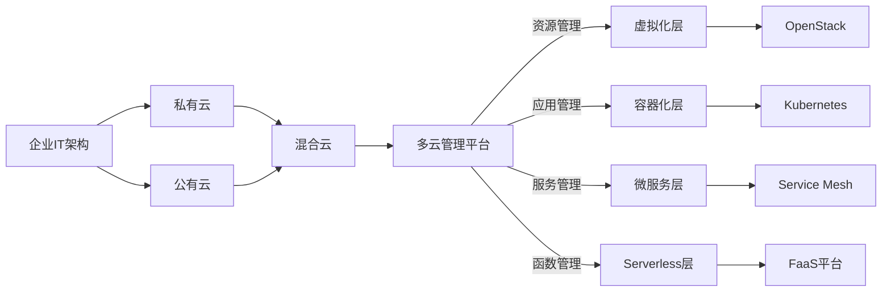

# 混合云与多云部署原理与代码实战案例讲解

## 1. 背景介绍
### 1.1 云计算的发展历程
#### 1.1.1 云计算1.0时代：以虚拟化为核心
#### 1.1.2 云计算2.0时代：以云原生为核心  
#### 1.1.3 云计算3.0时代：多云与混合云
### 1.2 企业上云面临的挑战
#### 1.2.1 业务系统庞杂，难以全面上云
#### 1.2.2 不同业务对云服务的需求差异大
#### 1.2.3 企业已有的IT资产和投入不容忽视
### 1.3 混合云与多云应运而生
#### 1.3.1 混合云的概念与特点  
#### 1.3.2 多云的概念与特点
#### 1.3.3 混合云与多云助力企业数字化转型

## 2. 核心概念与联系
### 2.1 私有云
#### 2.1.1 私有云的定义与特征
#### 2.1.2 私有云的部署模式
#### 2.1.3 私有云的优缺点分析
### 2.2 公有云
#### 2.2.1 公有云的定义与特征  
#### 2.2.2 公有云的服务模式：IaaS、PaaS、SaaS
#### 2.2.3 公有云的优缺点分析
### 2.3 混合云 
#### 2.3.1 混合云的定义与特征
#### 2.3.2 混合云的技术架构与部署模式  
#### 2.3.3 混合云的关键技术与挑战
### 2.4 多云
#### 2.4.1 多云的定义与特征
#### 2.4.2 多云的技术架构与部署模式
#### 2.4.3 多云的关键技术与挑战
### 2.5 混合云与多云的关系
#### 2.5.1 混合云与多云的区别与联系
#### 2.5.2 混合云与多云的融合趋势
#### 2.5.3 构建混合多云架构的意义

## 3. 核心算法原理具体操作步骤
### 3.1 虚拟化技术
#### 3.1.1 服务器虚拟化原理与实现
#### 3.1.2 网络虚拟化原理与实现
#### 3.1.3 存储虚拟化原理与实现  
### 3.2 容器化技术
#### 3.2.1 容器技术原理与架构
#### 3.2.2 Docker容器引擎工作原理
#### 3.2.3 Kubernetes容器编排平台原理 
### 3.3 微服务架构
#### 3.3.1 微服务架构原理与特点
#### 3.3.2 服务发现与注册原理
#### 3.3.3 服务网关原理与实现
### 3.4 Serverless架构
#### 3.4.1 Serverless架构原理 
#### 3.4.2 函数即服务(FaaS)原理与实现
#### 3.4.3 Serverless应用案例剖析

## 4. 数学模型和公式详细讲解举例说明
### 4.1 排队论模型在云计算资源调度中的应用
#### 4.1.1 排队论基本概念与理论
#### 4.1.2 云计算环境下的任务到达过程与服务时间分布  
#### 4.1.3 基于排队论的云计算资源调度算法
### 4.2 微积分在云计算成本优化中的应用
#### 4.2.1 云计算成本构成与计算
#### 4.2.2 边际成本与边际收益分析
#### 4.2.3 基于微积分的云计算成本优化模型 
### 4.3 运筹学在多云资源调度中的应用 
#### 4.3.1 多云环境下的资源调度问题建模
#### 4.3.2 整数规划模型与求解算法
#### 4.3.3 启发式算法在多云资源调度中的应用

## 5. 项目实践：代码实例和详细解释说明
### 5.1 基于OpenStack构建私有云平台
#### 5.1.1 OpenStack核心组件介绍
#### 5.1.2 OpenStack部署架构设计
#### 5.1.3 OpenStack关键服务配置与代码实现
### 5.2 基于Kubernetes构建容器云平台
#### 5.2.1 Kubernetes核心概念与架构
#### 5.2.2 Kubernetes集群部署与配置管理
#### 5.2.3 基于Kubernetes的微服务应用开发与部署
### 5.3 混合云环境下的应用迁移实践
#### 5.3.1 应用迁移评估与规划
#### 5.3.2 应用适配与重构实践
#### 5.3.3 混合云应用发布与运维管理
### 5.4 多云环境下的统一管理平台搭建
#### 5.4.1 多云管理平台需求分析与架构设计
#### 5.4.2 多云资源抽象与适配实现
#### 5.4.3 多云业务编排与自动化运维实现

## 6. 实际应用场景
### 6.1 电商行业混合云实践
#### 6.1.1 电商业务特点与云化诉求
#### 6.1.2 混合云架构设计与规划
#### 6.1.3 核心应用云化改造与实施
### 6.2 金融行业多云实践
#### 6.2.1 金融业务挑战与多云需求
#### 6.2.2 多云架构设计与规划
#### 6.2.3 核心系统多云改造与实施
### 6.3 制造行业混合云实践
#### 6.3.1 制造业数字化转型与云化需求
#### 6.3.2 工业互联网平台混合云架构设计
#### 6.3.3 生产制造系统云化改造与实施

## 7. 工具和资源推荐
### 7.1 云平台工具
#### 7.1.1 OpenStack
#### 7.1.2 Kubernetes
#### 7.1.3 VMware vSphere
### 7.2 多云管理平台
#### 7.2.1 RightScale
#### 7.2.2 CloudHealth
#### 7.2.3 Scalr
### 7.3 应用迁移工具
#### 7.3.1 AWS Server Migration Service
#### 7.3.2 Azure Site Recovery 
#### 7.3.3 CloudEndure
### 7.4 学习资源
#### 7.4.1 官方文档与教程
#### 7.4.2 在线课程与认证
#### 7.4.3 技术社区与博客

## 8. 总结：未来发展趋势与挑战
### 8.1 混合云与多云的发展趋势
#### 8.1.1 混合云与多云融合加速
#### 8.1.2 云边端协同计算兴起
#### 8.1.3 云原生成为主流范式
### 8.2 混合云与多云面临的挑战
#### 8.2.1 异构环境互通与管理
#### 8.2.2 数据隐私与安全合规
#### 8.2.3 应用架构与开发范式转变
### 8.3 展望未来
#### 8.3.1 混合云与多云成为常态
#### 8.3.2 云成为数字化转型的底座
#### 8.3.3 开发者将主导云的未来

## 9. 附录：常见问题与解答
### 9.1 如何选择适合的云服务提供商?
### 9.2 混合云与多云部署的成本如何评估?
### 9.3 传统应用如何实现平滑云化改造?
### 9.4 如何应对多云环境下的数据安全与合规挑战?
### 9.5 Serverless是否适合所有应用场景?

混合云与多云已经成为企业数字化转型的必由之路。一方面，企业需要充分利用已有的IT资产，另一方面也需要借助公有云的敏捷性和创新性，采用混合云架构成为平衡之道。同时，随着企业业务的发展，对不同云服务提供商的需求也日益增长，多云战略可以防止厂商锁定，获得最佳性价比。

混合云与多云环境下，采用先进的云计算技术至关重要。虚拟化、容器化、微服务、Serverless等技术，从基础设施到应用架构各个层次，为实现混合云与多云奠定了坚实基础。借助成熟的开源项目如OpenStack、Kubernetes等，企业可以自主搭建和掌控混合云环境。

构建统一的多云管理平台是管理混合云与多云的关键。通过对异构资源的抽象和适配，实现对各类云资源的统一纳管、调度与编排。利用应用迁移工具，实现传统应用到云平台的平滑迁移。同时，平台需要提供完善的监控、运维、安全等服务保障。

展望未来，混合云与多云将成为企业IT架构的常态。随着5G、IoT等新技术的发展，云边端协同计算将成为混合云的新形态。同时，Kubernetes正在成为混合云的操作系统，而Serverless架构进一步提升了应用的敏捷性。云原生已成为应用开发的主流范式。

面对混合云与多云的复杂性,开发者的角色至关重要。掌握云计算核心技术，开发云原生应用，构建多云管理平台，将成为开发者的必备技能。开发者将在混合云与多云时代扮演越来越重要的角色，主导云计算的未来发展。

作者：禅与计算机程序设计艺术 / Zen and the Art of Computer Programming