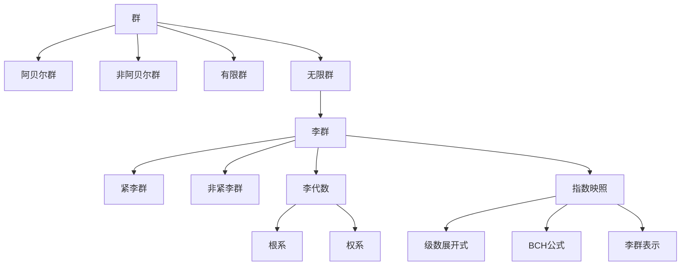

# 物理学中的群论：李群的指数映照

## 1. 背景介绍
### 1.1 群论在物理学中的重要性
### 1.2 李群的基本概念
### 1.3 指数映照的定义与意义

## 2. 核心概念与联系
### 2.1 群的定义与分类
#### 2.1.1 群的公理
#### 2.1.2 阿贝尔群与非阿贝尔群
#### 2.1.3 有限群与无限群
### 2.2 李群与李代数
#### 2.2.1 李群的定义
#### 2.2.2 李代数的定义
#### 2.2.3 李群与李代数的关系
### 2.3 指数映照的数学描述
#### 2.3.1 指数映照的定义
#### 2.3.2 指数映照的性质
#### 2.3.3 指数映照与李群的关系

## 3. 核心算法原理具体操作步骤
### 3.1 计算李群的生成元与结构常数
### 3.2 求解李代数的根系与权系
### 3.3 构造李群的指数映照
### 3.4 利用指数映照计算李群的表示

## 4. 数学模型和公式详细讲解举例说明
### 4.1 李群的数学模型
#### 4.1.1 李群的流形结构
#### 4.1.2 李群的无穷小生成元
#### 4.1.3 李群的结构常数
### 4.2 李代数的数学模型
#### 4.2.1 李代数的向量空间结构
#### 4.2.2 李代数的括号运算
#### 4.2.3 李代数的根系与权系
### 4.3 指数映照的数学公式
#### 4.3.1 指数映照的级数展开式
#### 4.3.2 BCH公式
#### 4.3.3 指数映照与李群表示的关系

## 5. 项目实践：代码实例和详细解释说明
### 5.1 用Python实现李代数的计算
#### 5.1.1 定义李代数的类
#### 5.1.2 实现李代数的括号运算
#### 5.1.3 求解李代数的根系与权系
### 5.2 用Mathematica构造李群的指数映照
#### 5.2.1 定义李群与李代数的符号
#### 5.2.2 计算指数映照的级数展开式
#### 5.2.3 验证指数映照的性质
### 5.3 用C++实现李群表示的计算
#### 5.3.1 定义李群表示的类
#### 5.3.2 实现李群表示的乘法
#### 5.3.3 利用指数映照计算李群表示

## 6. 实际应用场景
### 6.1 粒子物理中的规范场论
#### 6.1.1 规范场论的基本概念
#### 6.1.2 规范群与规范势
#### 6.1.3 指数映照在规范场论中的应用
### 6.2 凝聚态物理中的对称性分析
#### 6.2.1 晶体对称性的群论描述
#### 6.2.2 能带结构的对称性分析
#### 6.2.3 利用指数映照计算能带结构
### 6.3 量子计算中的量子门操作
#### 6.3.1 量子门操作的数学描述
#### 6.3.2 量子门操作的李群表示
#### 6.3.3 利用指数映照构造量子门电路

## 7. 工具和资源推荐
### 7.1 学习群论与李群的书籍
### 7.2 计算李群与李代数的软件包
### 7.3 研究李群与指数映照的学术论文

## 8. 总结：未来发展趋势与挑战
### 8.1 李群与指数映照的研究现状
### 8.2 李群与指数映照在物理学中的应用前景
### 8.3 李群与指数映照研究面临的挑战

## 9. 附录：常见问题与解答
### 9.1 李群与一般群有何区别？
### 9.2 指数映照为何在物理学中如此重要？
### 9.3 如何利用指数映照计算李群的表示？

群论作为现代数学的重要分支,在物理学中有着广泛而深刻的应用。群论所刻画的对称性概念,成为理解物理规律的一把钥匙。物理学的许多分支,如粒子物理、凝聚态物理、量子场论等,都离不开群论的数学工具。其中,李群及其指数映照更是物理学家的常用利器。

李群是一类特殊的连续群,它兼具群结构和微分流形结构。每一个李群,都对应着一个李代数,李代数反映了李群的局部性质。李群与李代数之间,存在着指数映照,它将李代数映射到李群。指数映照不仅是李群论的核心内容,也是物理学中经常用到的数学工具。

在粒子物理的规范场论中,规范对称性由规范群刻画,而规范势则对应着规范群的李代数。通过指数映照,我们可以将李代数映射到规范群,从而得到规范势的变换规律。在量子场论的微扰计算中,指数映照也是必不可少的工具,用于构造费曼传播子、顶点因子等。

在凝聚态物理中,晶体的对称性可以用空间群来描述。利用群论的方法,我们可以对晶体的能带结构进行对称性分析,得到简并能带的表示。而利用指数映照,我们可以方便地计算出这些表示,进而预言材料的电学、光学性质。

量子计算中的量子门操作,也可以用李群和李代数来刻画。任意的量子门电路,都对应着某个李群的表示。利用指数映照,我们可以将李代数的元素映射到李群,构造出所需的量子门电路。

可见,指数映照在物理学的多个领域都有重要应用。掌握指数映照的原理和计算方法,对于深入理解物理规律,具有重要意义。

在本文中,我们将系统地介绍群论与李群的基本概念,着重讲解指数映照的数学原理与计算方法。通过具体的物理应用实例,揭示指数映照在物理学中的重要作用。同时,我们还将介绍一些计算李群与李代数的数学软件包,为感兴趣的读者提供学习的资源。

李群与指数映照的研究,目前仍然是数学与物理的前沿领域。随着物理学的不断发展,李群与指数映照必将展现出更加广阔的应用前景。同时,如何将李群的结构与物理规律更加紧密地结合起来,如何发展出更加高效的计算方法,将是摆在物理学家与数学家面前的重要课题。

总之,群论与李群是物理学的数学基础,指数映照则是联系李群与物理学的桥梁。深入理解和运用指数映照,将有助于我们揭示物理世界的奥秘,推动物理学的发展。

作者：禅与计算机程序设计艺术 / Zen and the Art of Computer Programming