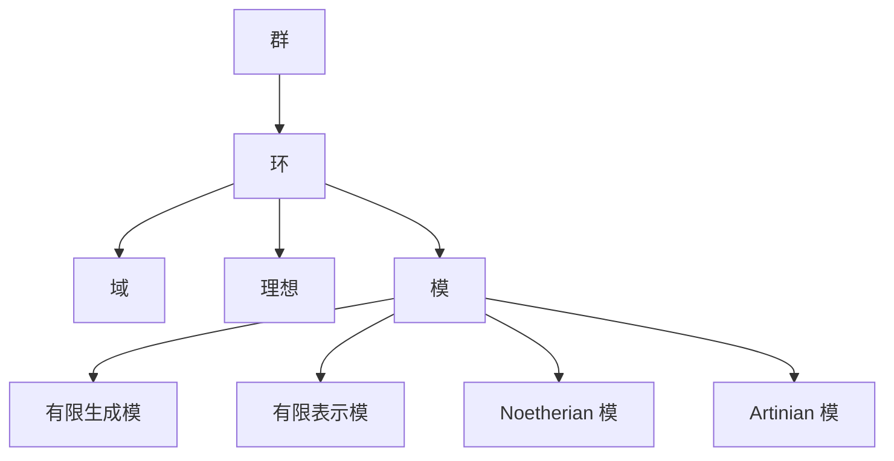

# 环与代数：关于代数的有限条件

## 1. 背景介绍
### 1.1 代数学的历史渊源
### 1.2 环论的产生与发展
### 1.3 代数的有限条件研究意义

## 2. 核心概念与联系
### 2.1 群、环、域的定义与关系
#### 2.1.1 群的定义与性质
#### 2.1.2 环的定义与性质  
#### 2.1.3 域的定义与性质
#### 2.1.4 群、环、域三者之间的关系
### 2.2 理想、模的概念
#### 2.2.1 左理想与右理想
#### 2.2.2 双边理想
#### 2.2.3 模的定义与性质
### 2.3 有限生成、有限表示、Noetherian 条件
#### 2.3.1 有限生成模的定义
#### 2.3.2 有限表示模的定义 
#### 2.3.3 Noetherian 条件的定义
#### 2.3.4 Artinian 条件的定义
### 2.4 核心概念之间的关系

## 3. 核心算法原理具体操作步骤
### 3.1 Gröbner 基的构造算法
#### 3.1.1 单项式的序
#### 3.1.2 多项式的除法
#### 3.1.3 Buchberger 算法
### 3.2 Hilbert 基定理的构造性证明
#### 3.2.1 单项式理想的有限生成性
#### 3.2.2 分解定理
#### 3.2.3 Hilbert 基定理的证明
### 3.3 模的直和分解算法
#### 3.3.1 投射模与内射模
#### 3.3.2 内射包络
#### 3.3.3 直和分解算法

## 4. 数学模型和公式详细讲解举例说明 
### 4.1 Noether 正规化引理
#### 4.1.1 Noether 正规化引理的陈述
#### 4.1.2 Noether 正规化引理证明
#### 4.1.3 正规化引理在代数几何中的应用
### 4.2 Hilbert-Samuel 多项式 
#### 4.2.1 首一化列与 Hilbert 函数
#### 4.2.2 Hilbert 多项式的存在性
#### 4.2.3 Hilbert-Samuel 多项式及其性质
### 4.3 Auslander-Buchsbaum 公式
#### 4.3.1 正合列与投射维数
#### 4.3.2 Auslander-Buchsbaum 公式
#### 4.3.3 正则环上模的投射维数

## 5. 项目实践：代码实例和详细解释说明
### 5.1 多项式环上 Gröbner 基的计算
#### 5.1.1 单项式序的实现
#### 5.1.2 多项式的表示
#### 5.1.3 Buchberger 算法的实现
### 5.2 有限域上线性码的编码与解码
#### 5.2.1 线性码的定义与性质
#### 5.2.2 生成矩阵与校验矩阵
#### 5.2.3 编码与解码算法
### 5.3 李代数的计算
#### 5.3.1 李括号的定义与性质
#### 5.3.2 自由李代数
#### 5.3.3 李代数的计算实例

## 6. 实际应用场景
### 6.1 代数几何中的应用
#### 6.1.1 代数簇与理想
#### 6.1.2 Hilbert 零点定理
#### 6.1.3 Gröbner 基在解方程组中的应用
### 6.2 编码理论中的应用
#### 6.2.1 纠错码与有限域
#### 6.2.2 循环码与生成多项式
#### 6.2.3 BCH 码与 Reed-Solomon 码
### 6.3 计算机代数中的应用
#### 6.3.1 符号计算的基本概念
#### 6.3.2 Gröbner 基的应用
#### 6.3.3 多项式的因式分解

## 7. 工具和资源推荐
### 7.1 数学软件
#### 7.1.1 Mathematica
#### 7.1.2 Maple
#### 7.1.3 MATLAB
### 7.2 计算机代数系统
#### 7.2.1 Singular
#### 7.2.2 Macaulay2 
#### 7.2.3 CoCoA
### 7.3 在线学习资源
#### 7.3.1 MathWorld
#### 7.3.2 arXiv
#### 7.3.3 MIT OpenCourseWare

## 8. 总结：未来发展趋势与挑战
### 8.1 非交换代数的研究
### 8.2 同调代数与 K 理论
### 8.3 量子群与量子代数
### 8.4 计算机科学中的新应用

## 9. 附录：常见问题与解答
### 9.1 为什么要研究代数的有限条件？
### 9.2 环论与数论、几何有什么联系？
### 9.3 计算机如何进行符号计算？
### 9.4 Gröbner 基的几何意义是什么？
### 9.5 代数在密码学中有哪些应用？

代数学是数学的一个重要分支，其中环论与模论更是代数学的核心内容。环论主要研究抽象代数结构"环"的性质，而模论则考察环上的线性作用。这两个理论都有着丰富的内容和深刻的洞见，成为现代数学的重要组成部分。

环作为一种代数结构，它一般性地刻画了数系统的基本运算性质。熟悉的整数环、多项式环等都是环的典型例子。对环进行分类和刻画是环论的重要课题，其中尤其重要的是考察环的有限性条件，如Noetherian 条件和 Artinian 条件。这些条件能够保证环上理想的一些良好性质，如有限生成性、升链条件和降链条件等。

模是环上的线性作用，可以看作是向量空间概念在环上的推广。模论主要考察模的结构，尤其是模的分解定理和同构定理。投射模和内射模是两类重要的模，它们有许多优良性质，在代数表示论和同调代数中有着广泛应用。

Gröbner 基理论是计算机代数的重要工具，它提供了一种有效计算多项式理想的方法。利用 Gröbner 基，我们可以解决多项式方程组、进行多项式的因式分解，以及研究代数簇的性质。Buchberger 算法是构造 Gröbner 基的经典算法，也是符号计算的核心算法之一。

Hilbert 基定理说明了多项式环上理想的有限生成性，是代数几何的重要基础。利用 Gröbner 基理论，我们可以给出 Hilbert 基定理的构造性证明。而 Hilbert 零点定理从根本上刻画了代数簇与理想之间的对应关系，揭示了代数几何的代数本质。

在编码理论中，环和模的概念也得到了充分运用。有限域上的线性码是编码理论的研究对象，而线性码实质上就是有限域上的线性空间，因此可以用模论的观点来考察。循环码是一类重要的线性码，它对应于多项式环上的主理想。生成多项式和校验多项式是刻画循环码的重要工具。

随着计算机科学的发展，环和模的理论在计算机代数、符号计算等领域得到了广泛应用。利用 Gröbner 基、Hilbert 级数等代数工具，我们可以有效进行符号计算和代数运算。而计算机代数系统如 Singular、Macaulay2 等，则为研究环和模提供了有力的软件支持。

展望未来，环和模的研究仍大有可为。非交换代数、量子群、量子代数等领域的发展，为环论与模论注入了新的活力。同调代数与 K 理论的思想，也为考察代数结构的范畴性质提供了新的视角。此外，环和模在编码理论、密码学、计算机科学等领域的应用，也是值得关注的研究方向。

总之，环与代数的有限性条件是一个内容丰富、思想深刻的研究主题。通过探索环和模的代数性质，我们能够加深对数系统的理解，并在众多数学分支和应用领域中获得启发。在未来的研究中，环论与模论必将展现出更加灿烂的光芒。

作者：禅与计算机程序设计艺术 / Zen and the Art of Computer Programming