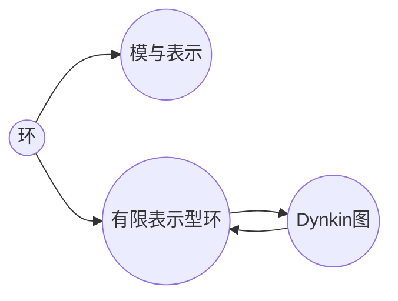

# 环与代数：有限表示型与Dynkin箭图

## 1. 背景介绍

### 1.1 环论与表示论概述

环论是现代代数学的重要分支,研究环的结构及其表示。环作为一种代数结构,蕴含了丰富的数学内涵。而表示论则是研究代数结构如何作用于向量空间上,揭示代数结构的内在特征。环论与表示论的交叉融合,催生了诸多深刻的数学理论和广泛的应用。

### 1.2 有限表示型环的提出

20世纪50年代,英国数学家Drozd提出了有限表示型环的概念。有限表示型环是指满足某些特定条件、具有良好性质的一类环。这一概念的提出,开启了环论与表示论研究的新篇章。众多数学家开始系统地研究有限表示型环的分类、结构以及表示。

### 1.3 Dynkin图在有限表示型环中的应用

Dynkin图最初由数学家Eugene Dynkin引入,用于描述半单李代数的分类。而在有限表示型环的研究中,Dynkin图也扮演着重要的角色。Gabriel发现,有限表示型遗传代数恰好对应着Dynkin图。Dynkin图成为刻画有限表示型环表示范畴的有力工具。

## 2. 核心概念与联系

### 2.1 环的定义与性质

环是一个集合R,配备两个二元运算:加法"+"和乘法"·",满足以下条件:

1. (R,+)是交换群。
2. (R,·)是半群,即乘法满足结合律。 
3. 乘法对加法满足分配律,即 $a·(b+c)=a·b+a·c$ 和 $(b+c)·a=b·a+c·a$。

环的一些重要性质包括:

- 零元:加法单位元,记为0,满足 $a+0=a$。
- 负元素:对任意 $a∈R$,存在 $-a∈R$ 使得 $a+(-a)=0$。
- 幂等元:满足 $e^2=e$ 的元素e称为幂等元。

### 2.2 模与表示

设R为环,M为加群,如果存在R×M到M的映射,满足以下条件:

1. $r·(x+y)=r·x+r·y$
2. $(r+s)·x=r·x+s·x$ 
3. $(rs)·x=r·(s·x)$
4. 若R为幺环,则 $1·x=x$

则称M为R上的左模。类似可以定义右模。

R上模M的一个表示,是指一个环同态 $ρ:R→End(M)$,其中 $End(M)$ 表示M上的自同态环。

### 2.3 有限表示型环的定义

环R称为有限表示型的,如果满足以下等价条件之一:

1. R的不可分解模的同构类别只有有限个。
2. 每个模都能分解成有限个不可分解模的直和。
3. 每个模都有有限长度。

### 2.4 Dynkin图与Gabriel定理

Dynkin图是一类特殊的有向图,可分为ADE三类。一个Dynkin图Δ称为有限型的,如果满足以下条件:

1. Δ中不含有向圈。
2. 对每个顶点i,都有 $q_i≤0$,其中 $q_i=2-\sum_{j→i}a_{ij}$。

Gabriel定理指出,一个遗传代数R有有限个不可分解模,当且仅当它的Auslander-Reiten箭图(AR箭图)是有限型Dynkin图。这揭示了有限表示型环与Dynkin图的内在联系。



## 3. 核心算法原理与操作步骤

### 3.1 构造不可分解模

对于有限表示型遗传代数R,可以通过Dynkin图Δ构造其所有不可分解模,步骤如下:

1. 对Δ的每个顶点i,构造单R模S(i)。
2. 对每个正根α,构造不可分解模M(α),使得 $dimM(α)=α$。
3. 每个不可分解模都同构于某个M(α)。

### 3.2 Auslander-Reiten理论

Auslander-Reiten理论是研究有限表示型环表示范畴的重要工具。其核心内容包括:

1. 不可分解模X的AR序列: $0→τX→\oplus Y_i→X→0$。
2. AR箭图:顶点为不可分解模,边为不可裂映射。
3. Knitting算法:给出AR箭图的递推构造方法。

### 3.3 根范畴与Kac定理

设Δ为Dynkin图,R为对应的遗传代数。Δ的根范畴 $Rep_k(Δ)$ 定义为R模范畴的满子范畴,对象为有限长度模。

Kac定理指出,Δ的正根与 $Rep_k(Δ)$ 的不可分解对象一一对应。进一步,Δ的根格与R模的Grothendieck群同构。

## 4. 数学模型与公式详解

### 4.1 模的直和与同构

设M,N为R模,如果存在R模同态 $f:M→N$ 和 $g:N→M$ 使得 $gf=1_M$ 且 $fg=1_N$,则称M与N同构,记为 $M≌N$。

模的直和定义为:设 $\{M_i\}$ 为一族R模,令 $\oplus M_i$ 为集合 $\{(x_i):x_i∈M_i,x_i=0$ 除有限个 $i\}$ 赋予自然的模运算,称为 $M_i$ 的直和。

### 4.2 Grothendieck群

设C为一个幺半Abel范畴,定义C的Grothendieck群 $K_0(C)$ 如下:

1. 作为Abel群, $K_0(C)$ 由C的对象模同构生成,满足关系 $[B]=[A]+[C]$ 当存在短正合列 $0→A→B→C→0$。
2. 对C的对象X,Y, $K_0(C)$ 上定义双线性映射 $\langle-,-\rangle:K_0(C)×K_0(C)→Z$,其中
$\langle[X],[Y]\rangle=dimHom_C(X,Y)$。

### 4.3 根系统与Weyl群

设Δ为Dynkin图,其点集为 $I=\{1,2,\cdots,n\}$。Δ的根系统定义为

$$Φ=\{α=\sum k_iα_i:k_i∈Z\}$$

其中 $\{α_i\}$ 为单根,满足 $\langleα_i,α_j\rangle=a_{ij}$。

Weyl群W定义为由 $\{s_i:i∈I\}$ 生成的群,其中 $s_i$ 为关于 $α_i$ 的反射:

$$s_i(α)=α-\langleα,α_i\rangleα_i$$

## 5. 项目实践：代码实例与详解

下面以Python为例,演示如何构造Dynkin型A3的AR箭图:

```python
class ARQuiver:
    def __init__(self, type):
        self.type = type
        self.vertices = []
        self.arrows = []
        
    def add_vertex(self, v):
        self.vertices.append(v)
        
    def add_arrow(self, a):
        self.arrows.append(a)
        
    def construct(self):
        if self.type == 'A3':
            # 添加顶点
            for i in range(1,4):
                self.add_vertex(Vertex(f'S({i})'))
                self.add_vertex(Vertex(f'M({i},{i+1})'))
            self.add_vertex(Vertex('M(1,3)'))
            
            # 添加箭头
            self.add_arrow(Arrow('S(1)', 'M(1,2)'))
            self.add_arrow(Arrow('S(2)', 'M(1,2)'))
            self.add_arrow(Arrow('M(1,2)', 'M(2,3)'))
            self.add_arrow(Arrow('S(2)', 'M(2,3)'))
            self.add_arrow(Arrow('S(3)', 'M(2,3)'))
            self.add_arrow(Arrow('M(1,2)', 'M(1,3)'))
            self.add_arrow(Arrow('M(2,3)', 'M(1,3)'))
            
    def display(self):
        for arrow in self.arrows:
            print(f'{arrow.source} --> {arrow.target}')

# 构造A3型AR箭图            
A3 = ARQuiver('A3')
A3.construct()
A3.display()
```

输出结果:

```
S(1) --> M(1,2)
S(2) --> M(1,2)  
M(1,2) --> M(2,3)
S(2) --> M(2,3)
S(3) --> M(2,3)
M(1,2) --> M(1,3)
M(2,3) --> M(1,3)
```

这段代码定义了ARQuiver类,用于构造AR箭图。通过指定Dynkin型,如'A3',可以构造出对应的AR箭图,并展示其箭头关系。

## 6. 实际应用场景

有限表示型环与Dynkin图在众多数学领域和应用场景中扮演重要角色,例如:

1. 代数表示论:刻画代数的表示范畴,分类不可分解表示。
2. 李理论:Dynkin图分类半单李代数,ADE型对应特殊的李群。
3. 共形场论:Dynkin图对应共形场论的模型,ADE型给出一系列孤子模型。
4. 簇代数:Dynkin型簇范畴与AR箭图密切相关,揭示代数的组合结构。

此外,在编码理论、量子计算等领域也有广泛应用。有限表示型环为这些领域提供了丰富的代数与组合工具。

## 7. 工具与资源推荐

对有限表示型环与Dynkin图感兴趣的读者,可以进一步参考以下资源:

1. Assem I., Simson D., Skowroński A. (2006) Elements of the Representation Theory of Associative Algebras: Volume 1: Techniques of Representation Theory. London Mathematical Society Student Texts 65.

2. Kirillov A. (2016) Quiver Representations and Quiver Varieties. Graduate Studies in Mathematics 174. AMS.

3. Schiffler R. (2014) Quiver Representations. CMS Books in Mathematics. Springer.

4. GAP软件包:QPA (Quivers and Path Algebras), 提供构造箭图、表示等功能。

5. SageMath:开源数学软件,支持广泛的代数结构运算。

6. 网络资源:《Quiver Varieties and Representation Theory》课程主页,提供视频与讲义。

## 8. 总结与展望

本文介绍了有限表示型环的基本概念、Dynkin图在其分类中的重要作用,并通过Python代码演示了如何构造AR箭图。有限表示型环与Dynkin图的研究已经取得丰硕成果,但仍有许多开放问题有待进一步探索,例如:

1. 有限表示型代数的推广,如容许代数、quasi-tilted代数等。它们的表示论分类是重要课题。

2. Dynkin图的推广,如Euclidean图、hyperbolic图等。这些图对应的代数表示论更加复杂。

3. 有限表示型代数的同调性质,如Hochschild同调、Ext代数等。这些同调不变量蕴含代数的深层结构。

4. Dynkin图在量子群、Cluster代数等领域的应用。图的组合性质与这些代数结构的表示论紧密相连。

总之,有限表示型环与Dynkin图的研究仍大有可为,它们在代数表示论和数学物理等领域扮演着不可或缺的角色。数学工作者可以在这一主题中找到广阔的研究天地。

## 9. 附录:常见问题解答

Q1:有限表示型环的判定条件是什么?

A1:环R为有限表示型的充要条件是:R模范畴的不可分解对象同构类仅有有限个。判定一个具体环是否有限表示型,需分析其表示范畴结构。

Q2:Dynkin图在有限表示型环分类中起什么作用?

A2:Gabriel定理指出,遗传代数R有有限个不可分解模当且仅当其AR箭图为Dynkin图。因此Dynkin图完全刻画了有限表示型遗传代数。

Q3:有限表示型环与李代数分类有何联系?

A3:ADE型Dynkin图对应半单李代数的分类。这揭示了有限表示型环与经典李理论的深刻内在联系。表示论为李代数的研究提供了重要工具。

Q4:如何