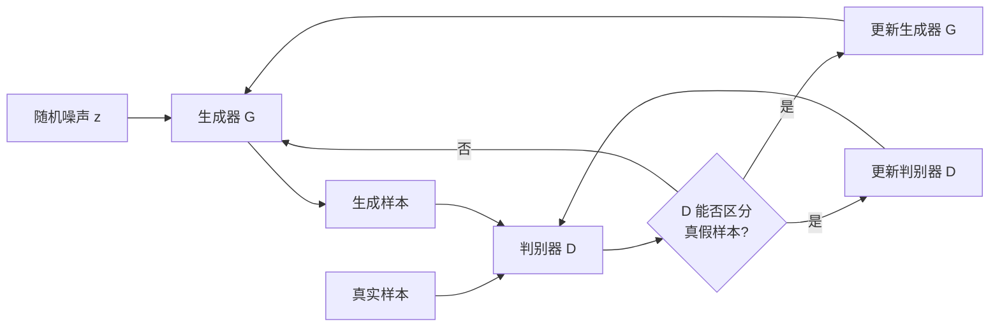

# 生成对抗网络GAN原理与代码实例讲解

## 1.背景介绍
### 1.1 生成对抗网络(GAN)的起源与发展
生成对抗网络(Generative Adversarial Networks, GANs)是近年来人工智能领域最具革命性的发明之一,由Ian Goodfellow等人于2014年提出。GAN的核心思想是通过两个神经网络(生成器和判别器)的对抗学习,从随机噪声中生成与真实数据分布相似的合成数据。自提出以来,GAN在图像生成、视频生成、语音合成、文本生成等领域取得了广泛应用和重大突破。

### 1.2 GAN的研究意义
GAN为无监督学习和生成式模型的研究开辟了新的方向。传统的生成式模型如VAE、RBM等很难生成高质量的逼真样本,而GAN生成的图像清晰度和多样性远超传统方法。此外,GAN还为半监督学习、迁移学习、域适应等提供了新的思路。GAN的对抗思想也被广泛应用到机器学习的其他领域,催生了对抗样本、对抗攻防等研究方向。可以说,GAN是深度学习领域近年来最重要的突破之一。

### 1.3 GAN面临的挑战
尽管GAN取得了巨大成功,但它的训练也面临诸多挑战:
1. 训练不稳定,容易出现模式崩溃、梯度消失等问题
2. 生成样本的多样性不足,容易出现模式塌缩现象  
3. 缺乏客观的评价指标来衡量生成样本的质量
4. 对超参数和网络结构较为敏感,调参难度大

为了解决这些问题,学术界提出了大量GAN改进版本,如WGAN、BEGAN、BigGAN等。如何进一步提高GAN的稳定性和性能,仍是一个亟待攻克的难题。

## 2.核心概念与联系
### 2.1 生成器(Generator) 
生成器是一个将随机噪声映射到数据空间的神经网络。其目标是骗过判别器,生成与真实数据分布尽可能相似的样本。生成器通常采用反卷积(Deconvolution)网络结构。

### 2.2 判别器(Discriminator)
判别器是一个二分类神经网络,用于区分输入数据是真实样本还是生成样本。其目标是最大化正确区分真假样本的概率。判别器通常采用卷积神经网络(CNN)结构。

### 2.3 对抗(Adversarial)
生成器和判别器通过互相博弈的方式进行训练,构成了一个二人零和博弈(Two-player zero-sum game)。生成器努力生成以假乱真的样本欺骗判别器,而判别器则努力提升自己区分真假样本的能力。双方在这个过程中不断进步,最终达到纳什均衡。

### 2.4 损失函数(Loss Function)
GAN的目标函数可以表示为判别器和生成器损失函数的差:
$$\min_G \max_D V(D,G) = \mathbb{E}_{x \sim p_{data}(x)}[\log D(x)] + \mathbb{E}_{z \sim p_z(z)}[\log (1-D(G(z)))]$$

其中$D(x)$表示判别器将样本$x$预测为真实样本的概率,$G(z)$表示生成器将随机噪声$z$映射为生成样本的过程。

### 2.5 GAN的训练过程



GAN通过交替训练生成器和判别器来进行学习:
1. 先固定生成器G,优化判别器D,提升其区分真假样本的能力
2. 再固定判别器D,优化生成器G,使其生成的样本更加逼真,骗过判别器
3. 重复上述两步,直到双方达到纳什均衡,生成器G生成的样本与真实数据分布一致

## 3.核心算法原理具体操作步骤
GAN的核心算法可以总结为以下步骤:

1. 初始化生成器G和判别器D的参数
2. 重复以下步骤,直到算法收敛:  
   a. 从真实数据分布 $p_{data}(x)$ 中采样一批真实样本 $\{x^{(1)}, \dots, x^{(m)}\}$  
   b. 从先验分布 $p_z(z)$ (通常为高斯分布或均匀分布)中采样一批随机噪声 $\{z^{(1)}, \dots, z^{(m)}\}$  
   c. 利用生成器G生成一批假样本 $\{\tilde{x}^{(1)}, \dots, \tilde{x}^{(m)}\}$, 其中 $\tilde{x}^{(i)} = G(z^{(i)})$  
   d. 利用判别器D对真实样本和生成样本进行二分类,得到其输出概率 $\{D(x^{(1)}), \dots, D(x^{(m)})\}$ 和 $\{D(\tilde{x}^{(1)}), \dots, D(\tilde{x}^{(m)})\}$  
   e. 基于步骤d的结果,计算判别器D的损失函数:
   $$\mathcal{L}_D = -\frac{1}{m} \sum_{i=1}^m [\log D(x^{(i)}) + \log (1-D(\tilde{x}^{(i)}))]$$
   f. 利用梯度上升法更新判别器D的参数,以最大化$\mathcal{L}_D$ 
   g. 从先验分布 $p_z(z)$ 中重新采样一批随机噪声 $\{z^{(1)}, \dots, z^{(m)}\}$
   h. 利用生成器G生成一批假样本 $\{\tilde{x}^{(1)}, \dots, \tilde{x}^{(m)}\}$, 其中 $\tilde{x}^{(i)} = G(z^{(i)})$
   i. 利用判别器D对生成样本进行二分类,得到其输出概率 $\{D(\tilde{x}^{(1)}), \dots, D(\tilde{x}^{(m)})\}$  
   j. 基于步骤i的结果,计算生成器G的损失函数:  
   $$\mathcal{L}_G = -\frac{1}{m} \sum_{i=1}^m \log D(\tilde{x}^{(i)})$$
   k. 利用梯度下降法更新生成器G的参数,以最小化$\mathcal{L}_G$

3. 输出训练后的生成器G和判别器D

可以看出,GAN通过交替优化生成器和判别器,使双方在对抗中不断进步,最终希望生成器能生成以假乱真的样本。这个过程可以看作是生成器与判别器博弈的过程,二者最终达到纳什均衡。

## 4.数学模型和公式详细讲解举例说明
### 4.1 GAN的目标函数
GAN的核心思想可以用一个二人零和博弈来描述。生成器G的目标是最小化下面的目标函数:

$$\min_G \mathbb{E}_{z \sim p_z(z)}[\log (1-D(G(z)))]$$

而判别器D的目标是最大化下面的目标函数:

$$\max_D \mathbb{E}_{x \sim p_{data}(x)}[\log D(x)] + \mathbb{E}_{z \sim p_z(z)}[\log (1-D(G(z)))]$$

将二者结合起来,就得到了GAN的完整目标函数:

$$\min_G \max_D V(D,G) = \mathbb{E}_{x \sim p_{data}(x)}[\log D(x)] + \mathbb{E}_{z \sim p_z(z)}[\log (1-D(G(z)))]$$

直观理解就是,判别器D努力最大化将真实样本预测为正例、将生成样本预测为负例的概率,而生成器G则努力最小化生成样本被判别器预测为负例的概率。

### 4.2 最优判别器与JS散度
Goodfellow证明,对于任意固定的生成器G,最优判别器D的形式为:

$$D^*_G(x) = \frac{p_{data}(x)}{p_{data}(x) + p_g(x)}$$

其中$p_g(x)$表示生成器G所定义的生成数据分布。将最优判别器$D^*_G$代入GAN目标函数并化简,可得:

$$\min_G V(D^*_G,G) = 2JS(p_{data} \| p_g) - 2\log 2$$

$JS(p_{data} \| p_g)$表示真实数据分布$p_{data}$与生成数据分布$p_g$之间的JS散度(Jensen-Shannon divergence)。可见,GAN的训练过程就是在最小化真实分布与生成分布之间的JS散度。当二者完全一致时,JS散度为0,此时GAN达到了全局最优。

### 4.3 GAN的损失函数与交叉熵
将最优判别器$D^*_G$代入判别器的目标函数,可得判别器的损失为:

$$\mathcal{L}_D = -\mathbb{E}_{x \sim p_{data}}\log D(x) - \mathbb{E}_{z \sim p_z}\log (1-D(G(z)))$$

可以看出,这实际上是判别器D将真实样本预测为正例、生成样本预测为负例时的交叉熵损失。直观理解就是,判别器D努力最小化真实样本被判错和生成样本被判错的概率。

类似地,将最优判别器$D^*_G$代入生成器的目标函数,可得生成器的损失为:

$$\mathcal{L}_G = -\mathbb{E}_{z \sim p_z}\log D(G(z))$$

这实际上是生成器G试图最小化生成样本被判别器预测为负例的概率。直观理解就是,生成器G努力"骗过"判别器,使其将生成样本误判为真实样本。

## 5.项目实践：代码实例和详细解释说明
下面我们用PyTorch实现一个简单的GAN,以生成MNIST手写数字图像为例。完整代码如下:

```python
import torch
import torch.nn as nn
import torch.optim as optim
from torch.autograd import Variable
from torchvision import datasets, transforms
import numpy as np
import matplotlib.pyplot as plt

# 定义生成器网络 G
class Generator(nn.Module):
    def __init__(self, input_size, hidden_size, output_size):
        super(Generator, self).__init__()
        self.map1 = nn.Linear(input_size, hidden_size)
        self.map2 = nn.Linear(hidden_size, hidden_size)
        self.map3 = nn.Linear(hidden_size, output_size)
        
    def forward(self, x):
        x = torch.tanh(self.map1(x))
        x = torch.tanh(self.map2(x))
        return torch.sigmoid(self.map3(x))
        
# 定义判别器网络 D  
class Discriminator(nn.Module):
    def __init__(self, input_size, hidden_size, output_size):
        super(Discriminator, self).__init__()
        self.map1 = nn.Linear(input_size, hidden_size)
        self.map2 = nn.Linear(hidden_size, hidden_size)
        self.map3 = nn.Linear(hidden_size, output_size)

    def forward(self, x):
        x = torch.tanh(self.map1(x))
        x = torch.tanh(self.map2(x))
        return torch.sigmoid(self.map3(x))

# 设置参数    
z_dim = 100  # 噪声维度
image_dim = 784  # 图像维度 28*28
hidden_dim = 256 # 隐藏层维度
batch_size = 32
epochs = 100
lr = 1e-3

# 加载MNIST数据集
transform = transforms.Compose([transforms.ToTensor(),
                                transforms.Normalize((0.5,), (0.5,))])
mnist = datasets.MNIST(root='./data', train=True, download=True, transform=transform)
dataloader = torch.utils.data.DataLoader(dataset=mnist, batch_size=batch_size, shuffle=True)

# 初始化生成器和判别器
G = Generator(input_size=z_dim, hidden_size=hidden_dim, output_size=image_dim)
D = Discriminator(input_size=image_dim, hidden_size=hidden_dim, output_size=1)

# 定义优化器
g_optimizer = optim.Adam(G.parameters(), lr=lr)
d_optimizer = optim.Adam(D.parameters(), lr=lr)

# 定义二值交叉熵损失
criterion = nn.BCELoss()

# 开始训