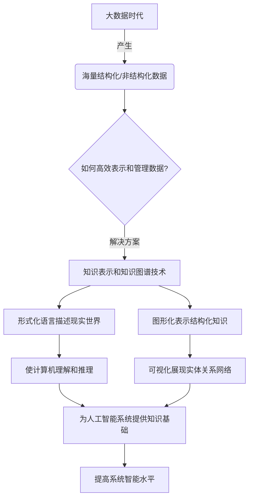
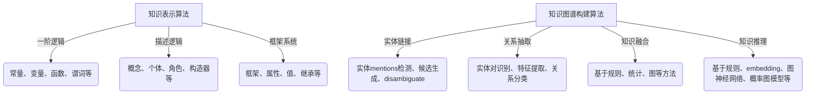

# 知识表示与知识图谱原理与代码实战案例讲解

## 1.背景介绍

在当今信息时代,数据和知识已经成为推动科技创新和商业发展的关键驱动力。随着互联网、物联网和人工智能技术的快速发展,海量的结构化和非结构化数据不断涌现。如何高效地表示和管理这些数据,以及从中提取有价值的知识,成为了一个亟待解决的问题。

知识表示(Knowledge Representation)和知识图谱(Knowledge Graph)应运而生,为解决这一问题提供了有力的理论基础和实践方法。知识表示旨在使用形式化的语言和数据结构来描述现实世界中的事物、概念及其之间的关系,从而使计算机能够理解和推理。而知识图谱则是一种将结构化知识以图形化的方式表示和存储的技术,可视化展现实体之间的关系网络。

知识表示和知识图谱在多个领域发挥着重要作用,例如自然语言处理、问答系统、推荐系统、决策支持系统等。它们为人工智能系统提供了所需的知识基础,使得机器能够更好地理解和推理,从而提高系统的智能水平。

### Mermaid 流程图

## 2.核心概念与联系

### 2.1 知识表示

知识表示(Knowledge Representation)是使用形式化的语言和数据结构来描述现实世界中的事物、概念及其之间的关系的过程。它是人工智能领域的一个重要分支,旨在使计算机能够理解和推理知识。

知识表示的核心概念包括:

- **实体(Entity)**: 表示现实世界中的事物或概念,如人物、地点、组织等。
- **关系(Relation)**: 描述实体之间的联系,如"出生于"、"工作于"等。
- **属性(Attribute)**: 描述实体的特征,如姓名、年龄、职位等。
- **逻辑推理(Logical Reasoning)**: 根据已有的知识和规则,推导出新的知识。
- **本体论(Ontology)**: 对某一领域概念及其相互关系的形式化描述。

知识表示通常采用一些形式化语言进行描述,如一阶逻辑、描述逻辑、框架系统等。这些语言提供了严格的语法和语义,使得知识可以被计算机理解和处理。

### 2.2 知识图谱

知识图谱(Knowledge Graph)是一种将结构化知识以图形化的方式表示和存储的技术。它由实体节点和关系边组成,可视化展现实体之间的关系网络。

知识图谱的核心概念包括:

- **实体节点(Entity Node)**: 表示现实世界中的事物或概念。
- **关系边(Relation Edge)**: 连接实体节点,描述实体之间的关系。
- **属性(Attribute)**: 描述实体节点的特征。
- **语义(Semantics)**: 赋予实体、关系和属性明确的含义。
- **推理(Reasoning)**: 基于已有知识,推导出新的知识。

知识图谱通常采用图数据库或三元组存储(如RDF)的方式进行存储和管理。它可以有效地表示复杂的知识结构,并支持基于图的查询和推理操作。

### 2.3 知识表示与知识图谱的关系

知识表示和知识图谱是密切相关的概念,它们共同构成了知识管理和推理的理论基础和实践方法。

知识表示提供了形式化语言和数据结构,用于描述现实世界中的实体、关系和属性,并支持逻辑推理。而知识图谱则是将这些结构化知识以图形化的方式表示和存储,便于可视化展现和分析。

知识表示为知识图谱提供了语义基础,确保了实体、关系和属性的明确含义。同时,知识图谱也为知识表示提供了一种高效的存储和管理方式,使得知识可以被计算机高效地处理和推理。

两者相辅相成,共同推动了人工智能系统的发展,为各种智能应用提供了所需的知识基础。

## 3.核心算法原理具体操作步骤

### 3.1 知识表示算法

知识表示算法旨在将现实世界中的知识转化为计算机可以理解和处理的形式。常见的知识表示算法包括:

#### 3.1.1 一阶逻辑(First-Order Logic)

一阶逻辑是一种形式化语言,用于描述事物、概念及其之间的关系。它包括以下核心元素:

- 常量(Constants): 表示特定的实体或对象。
- 变量(Variables): 表示任意的实体或对象。
- 函数(Functions): 将一个或多个实体映射到另一个实体。
- 谓词(Predicates): 描述实体之间的关系。
- 逻辑连接词(Logical Connectives): 如与(∧)、或(∨)、非(¬)、蕴含(→)等,用于构建复杂的逻辑表达式。
- 量词(Quantifiers): 如全称量词(∀)和存在量词(∃),用于描述对所有或某些实体的断言。

一阶逻辑提供了严格的语法和语义,可以用于表示和推理复杂的知识。但是,它也存在一些局限性,如难以表示不确定性和模糊性等。

#### 3.1.2 描述逻辑(Description Logic)

描述逻辑是一种基于一阶逻辑的知识表示形式,旨在描述概念(Classes)和个体(Individuals)之间的关系。它包括以下核心元素:

- 概念(Concepts): 表示一类实体或对象的集合。
- 个体(Individuals): 表示特定的实例或对象。
- 角色(Roles): 描述概念之间的关系。
- 构造器(Constructors): 用于定义复杂概念,如交集(⊓)、并集(⊔)、补集(¬)等。

描述逻辑提供了一种结构化和层次化的知识表示方式,适合于表示和推理基于分类的知识。它被广泛应用于本体论(Ontology)的构建和推理。

#### 3.1.3 框架系统(Frame Systems)

框架系统是一种基于对象的知识表示方法,它将知识组织成一系列相互关联的框架(Frames)。每个框架代表一个概念或对象,包含了该概念的属性(Slots)和值(Fillers)。

框架系统支持继承(Inheritance)机制,允许子框架从父框架继承属性和值。它还提供了默认值(Defaults)和例外处理(Exception Handling)机制,使得知识表示更加灵活和自然。

框架系统适合于表示结构化的、基于对象的知识,但在处理复杂的逻辑推理方面存在一定局限性。

### 3.2 知识图谱构建算法

知识图谱构建算法旨在从结构化和非结构化数据中提取实体、关系和属性,并将它们组织成一个统一的知识图谱。常见的知识图谱构建算法包括:

#### 3.2.1 实体链接(Entity Linking)

实体链接是将非结构化文本中的实体mentions与知识库中的实体entries相匹配的过程。它通常包括以下步骤:

1. **实体mentions检测**: 从文本中识别出潜在的实体mentions。
2. **候选实体生成**: 为每个实体mention生成一组候选实体entries。
3. **实体disambiguate**: 根据上下文信息,选择最可能的实体entry与实体mention相匹配。

常见的实体链接算法包括基于字符串相似度的方法、基于机器学习的方法等。

#### 3.2.2 关系抽取(Relation Extraction)

关系抽取是从非结构化文本中识别出实体之间的语义关系的过程。它通常包括以下步骤:

1. **实体对识别**: 从文本中识别出所有的实体对。
2. **特征提取**: 为每个实体对提取上下文特征,如词性、依存关系等。
3. **关系分类**: 根据特征,将实体对分类到预定义的关系类别中。

常见的关系抽取算法包括基于监督学习的方法(如最大熵模型、条件随机场等)、基于远程监督的方法、基于神经网络的方法等。

#### 3.2.3 知识融合(Knowledge Fusion)

知识融合是将来自多个异构数据源的知识整合到一个统一的知识图谱中的过程。它需要解决实体对齐、冲突解决和知识补全等问题。

常见的知识融合算法包括:

- **基于规则的方法**: 使用一系列手工定义的规则来解决冲突和补全知识。
- **基于统计的方法**: 利用统计模型和机器学习技术来学习数据源之间的映射关系,并进行知识融合。
- **基于图的方法**: 将异构知识源表示为图,然后使用图算法(如PageRank、SimRank等)进行实体对齐和知识融合。

#### 3.2.4 知识推理(Knowledge Reasoning)

知识推理是基于已有的知识和规则,推导出新的知识的过程。在知识图谱中,常见的推理算法包括:

- **基于规则的推理**: 使用一阶逻辑规则或者描述逻辑规则进行推理。
- **基于embedding的推理**: 将实体和关系映射到低维向量空间,然后在该空间中进行推理。
- **基于图神经网络的推理**: 利用图神经网络模型来学习实体和关系的表示,并进行推理。
- **基于概率图模型的推理**: 将知识图谱表示为概率图模型(如马尔可夫逻辑网络),然后进行概率推理。

### Mermaid 流程图

## 4.数学模型和公式详细讲解举例说明

### 4.1 知识表示数学模型

#### 4.1.1 一阶逻辑模型

一阶逻辑模型由一个解释(Interpretation)和一个结构(Structure)组成。

解释$I$定义为一个二元组$I = (D, \cdot^I)$,其中:

- $D$是一个非空集合,称为解释域(Domain of Interpretation)。
- $\cdot^I$是一个解释函数,将常量、函数和谓词映射到相应的元素、函数和关系。

结构$\mathcal{M}$定义为一个三元组$\mathcal{M} = (D, \Phi, \mathcal{R})$,其中:

- $D$是解释域。
- $\Phi$是一个函数集合,每个函数$f \in \Phi$将$D^n$映射到$D$,其中$n$是函数的元数。
- $\mathcal{R}$是一个关系集合,每个关系$R \in \mathcal{R}$是$D^n$的一个子集,其中$n$是关系的元数。

一阶逻辑公式在解释$I$和结构$\mathcal{M}$下的真值可以递归地定义。例如,对于原子公式$P(t_1, \ldots, t_n)$,其真值由以下公式给出:

$$
\mathcal{M} \models_I P(t_1, \ldots, t_n) \Leftrightarrow \langle t_1^I, \ldots, t_n^I \rangle \in P^I
$$

其中,$t_