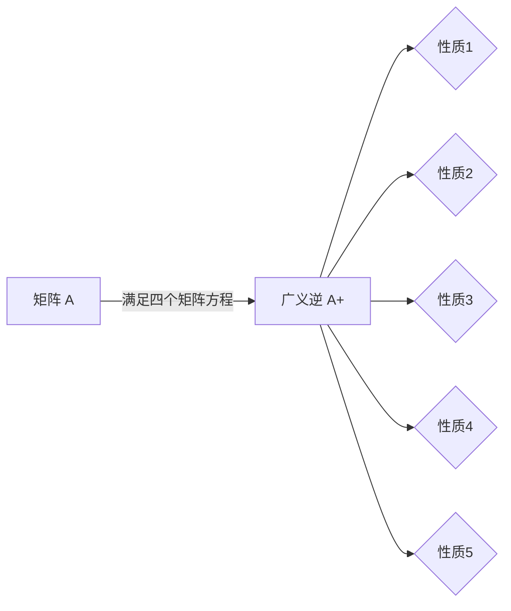
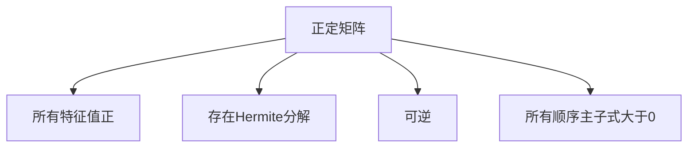
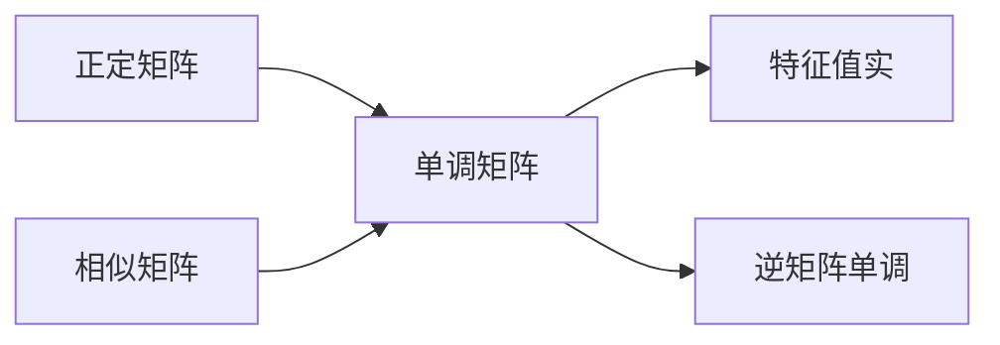
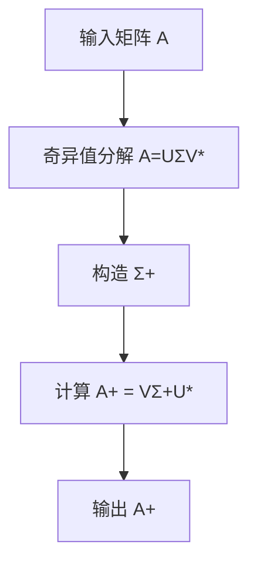
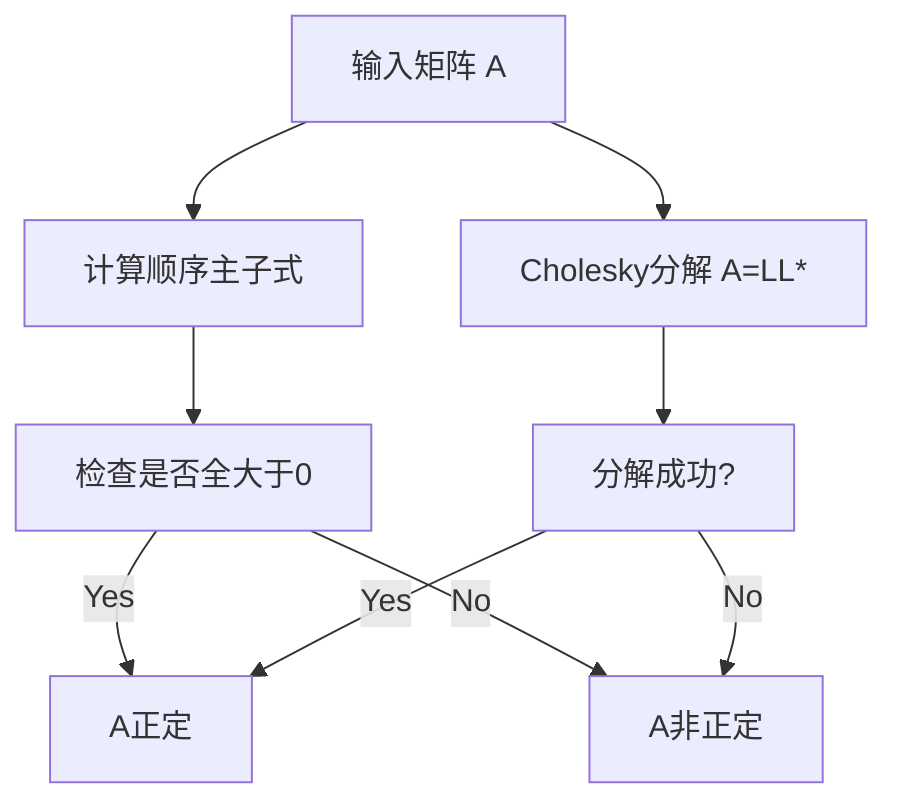
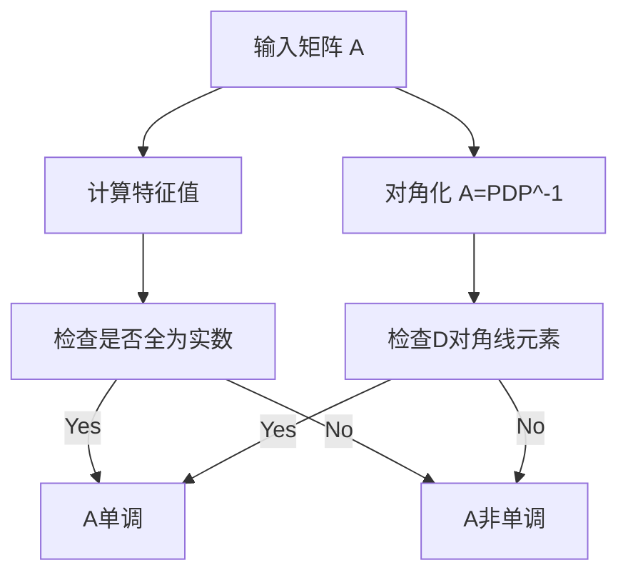

# 矩阵理论与应用：矩阵的广义逆正性与单调性

## 1.背景介绍

矩阵理论是线性代数的核心部分,在数学、物理、工程等诸多领域有着广泛的应用。矩阵的逆运算是矩阵理论中一个重要的概念,但并非所有矩阵都存在逆矩阵。为了解决这个问题,人们引入了广义逆的概念。

广义逆是指满足某些矩阵方程的矩阵,它在伪逆、最小范数解、总体最小二乘解等问题中扮演着重要角色。除了广义逆之外,矩阵的正性和单调性也是矩阵理论中的两个关键概念,它们对于研究矩阵的性质、判断方程解的存在性和唯一性等具有重要意义。

本文将系统地介绍矩阵的广义逆、正性和单调性等核心概念,阐述它们在理论和应用中的作用,并探讨相关的算法和应用实践。

## 2.核心概念与联系

### 2.1 广义逆

对于任意矩阵 $A \in \mathbb{C}^{m \times n}$,如果存在一个矩阵 $X \in \mathbb{C}^{n \times m}$ 满足以下四个矩阵方程:

$$
\begin{aligned}
AXA &= A \\
XAX &= X \\
(AX)^* &= AX \\
(XA)^* &= XA
\end{aligned}
$$

那么矩阵 $X$ 就被称为矩阵 $A$ 的广义逆,记作 $A^{+}$。广义逆具有以下性质:

1. 若 $A$ 可逆,则 $A^{+} = A^{-1}$;
2. $(A^{+})^{+} = A$;
3. $(AB)^{+} = B^{+}A^{+}$;
4. $(A^*)^{+} = (A^{+})^*$;
5. $AA^{+}A = A$, $A^{+}AA^{+} = A^{+}$.

广义逆在线性方程组、最小二乘问题、总范数最小化等问题中有着重要应用。

### 2.2 正性

一个矩阵 $A \in \mathbb{C}^{n \times n}$ 被称为正定的,如果对于任意非零向量 $x \in \mathbb{C}^n$,都有 $x^*Ax > 0$。类似地,如果 $x^*Ax \geq 0$,则 $A$ 为半正定矩阵。正定矩阵具有以下重要性质:

1. 所有特征值都是正实数;
2. 存在hermite矩阵 $Q$ ,使得 $A = Q^*\Lambda Q$,其中 $\Lambda$ 是对角线元素为 $A$ 的特征值的对角矩阵;
3. 可逆;
4. 所有顺序主子式都大于0。

正定矩阵的概念可以推广到无穷维情况,此时需要满足 $\langle Ax,x\rangle > 0$,其中 $\langle\cdot,\cdot\rangle$ 表示内积。

### 2.3 单调性

设 $A,B \in \mathbb{C}^{n \times n}$,如果对于任意 $X,Y \in \mathbb{C}^{n \times n}$,当 $X \geq Y$ 时,都有 $AXB \geq AYB$,那么矩阵 $A$ 就被称为 $B$-单调的。特别地,如果 $B=I$,则 $A$ 被称为单调矩阵。单调矩阵在矩阵理论和应用中扮演着重要角色,具有以下性质:

1. 正定矩阵是单调的;
2. 对于任意非奇异矩阵 $P$,矩阵 $P^{-1}AP$ 和 $A$ 同为单调矩阵或非单调矩阵;
3. 单调矩阵的所有特征值都是实数;
4. 单调矩阵的逆也是单调矩阵。

这三个概念在矩阵理论中有着紧密的联系。正定矩阵是单调矩阵的一个重要子集,而广义逆则为不可逆矩阵提供了一种"逆"的概念,有助于求解线性方程组等问题。

## 3.核心算法原理具体操作步骤

### 3.1 广义逆的计算

对于矩阵 $A \in \mathbb{C}^{m \times n}$,我们可以通过奇异值分解 (SVD) 来计算它的广义逆 $A^{+}$。具体步骤如下:

1. 对矩阵 $A$ 进行奇异值分解,得到 $A = U\Sigma V^*$,其中 $U \in \mathbb{C}^{m \times m}$、$V \in \mathbb{C}^{n \times n}$ 为酉矩阵,而 $\Sigma = \begin{bmatrix}\Sigma_r & 0 \\ 0 & 0\end{bmatrix}$,其中 $\Sigma_r = \mathrm{diag}(\sigma_1,\sigma_2,\ldots,\sigma_r)$,且 $\sigma_1 \geq \sigma_2 \geq \cdots \geq \sigma_r > 0$ 为矩阵 $A$ 的 $r$ 个正奇异值。

2. 构造矩阵 $\Sigma^{+} = \begin{bmatrix}\Sigma_r^{-1} & 0 \\ 0 & 0\end{bmatrix}$,其中 $\Sigma_r^{-1} = \mathrm{diag}(\sigma_1^{-1},\sigma_2^{-1},\ldots,\sigma_r^{-1})$。

3. 计算 $A^{+} = V\Sigma^{+}U^*$,即 $A^{+}$ 就是矩阵 $A$ 的广义逆。

该算法的时间复杂度为 $\mathcal{O}(mn^2)$,对于大规模矩阵计算会比较耗时。因此,人们还提出了一些快速算法,如基于 QR 分解的算法、基于 Cholesky 分解的算法等,在某些特殊情况下会更高效。

### 3.2 判断正定性

判断一个矩阵是否为正定矩阵,最常用的方法是考察它的所有顺序主子式是否全部大于0。具体步骤如下:

1. 计算矩阵 $A \in \mathbb{C}^{n \times n}$ 的所有顺序主子式,记为 $\Delta_1,\Delta_2,\ldots,\Delta_n$。

2. 检查 $\Delta_1,\Delta_2,\ldots,\Delta_n$ 是否全部大于0。如果是,则 $A$ 为正定矩阵;否则 $A$ 不是正定矩阵。

该算法的时间复杂度为 $\mathcal{O}(n^3)$,因为需要计算所有顺序主子式。

另一种更高效的方法是利用 Cholesky 分解,步骤如下:

1. 对矩阵 $A$ 进行 Cholesky 分解,尝试找到下三角矩阵 $L$,使得 $A = LL^*$。

2. 如果分解成功,则 $A$ 为正定矩阵;否则 $A$ 不是正定矩阵。

Cholesky 分解的时间复杂度为 $\mathcal{O}(n^3/3)$,比计算顺序主子式更高效。

### 3.3 判断单调性

判断一个矩阵是否为单调矩阵,最直接的方法是检查它的所有特征值是否全部为实数。具体步骤如下:

1. 计算矩阵 $A \in \mathbb{C}^{n \times n}$ 的特征值 $\lambda_1,\lambda_2,\ldots,\lambda_n$。

2. 检查 $\lambda_1,\lambda_2,\ldots,\lambda_n$ 是否全部为实数。如果是,则 $A$ 为单调矩阵;否则 $A$ 不是单调矩阵。

该算法的时间复杂度取决于特征值计算的方法,通常为 $\mathcal{O}(n^3)$。

另一种方法是利用矩阵的对角化,步骤如下:

1. 对矩阵 $A$ 进行对角化,即找到可逆矩阵 $P$ 和对角矩阵 $D$,使得 $A = PDP^{-1}$。

2. 检查对角矩阵 $D$ 的对角线元素是否全部为实数。如果是,则 $A$ 为单调矩阵;否则 $A$ 不是单调矩阵。

对角化的时间复杂度也为 $\mathcal{O}(n^3)$。

## 4.数学模型和公式详细讲解举例说明

在本节中,我们将详细讲解矩阵广义逆、正性和单调性的数学模型和公式,并给出具体的例子加深理解。

### 4.1 广义逆

对于矩阵 $A \in \mathbb{C}^{m \times n}$,如果存在一个矩阵 $X \in \mathbb{C}^{n \times m}$ 满足以下四个矩阵方程,那么 $X$ 就被称为 $A$ 的广义逆,记作 $A^{+}$:

$$
\begin{aligned}
AXA &= A \\
XAX &= X \\
(AX)^* &= AX \\
(XA)^* &= XA
\end{aligned}
$$

这四个方程被称为 Penrose 方程。我们来看一个具体的例子:

$$
A = \begin{bmatrix}
1 & 1 \\
0 & 1
\end{bmatrix}, \quad
A^{+} = \begin{bmatrix}
1 & -1 \\
0 & 1
\end{bmatrix}
$$

可以验证,矩阵 $A^{+}$ 确实满足 Penrose 方程,因此它就是 $A$ 的广义逆。

广义逆具有许多良好的性质,例如:

1. 若 $A$ 可逆,则 $A^{+} = A^{-1}$;
2. $(A^{+})^{+} = A$;
3. $(AB)^{+} = B^{+}A^{+}$;
4. $(A^*)^{+} = (A^{+})^*$;
5. $AA^{+}A = A$, $A^{+}AA^{+} = A^{+}$.

这些性质使得广义逆在线性方程组、最小二乘问题、总范数最小化等问题中有着重要应用。例如,对于线性方程组 $Ax=b$,如果 $A$ 是满秩矩阵,那么方程的解可以表示为 $x=A^{+}b$。

### 4.2 正性

一个矩阵 $A \in \mathbb{C}^{n \times n}$