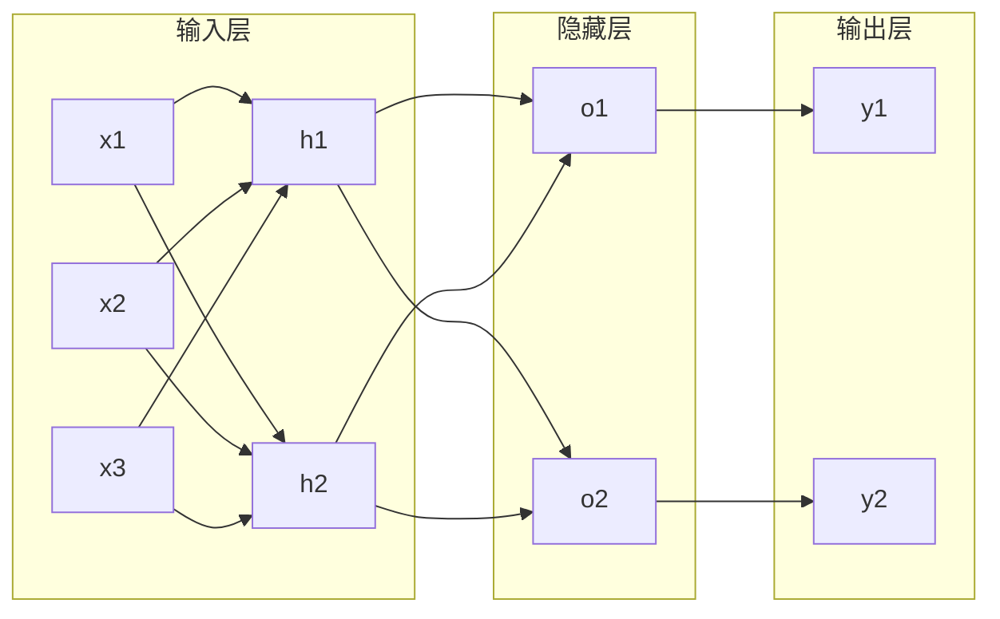

# 神经网络原理与代码实战案例讲解

## 1. 背景介绍

### 1.1 人工智能与机器学习的发展历程

人工智能(Artificial Intelligence, AI)自1956年达特茅斯会议提出以来,经历了从早期的符号主义到后来的连接主义和行为主义等不同的发展阶段。其中,以深度学习为代表的连接主义方法在近十几年取得了突破性的进展,成为当前人工智能的主流范式。

机器学习(Machine Learning, ML)作为实现人工智能的一种手段,其本质是通过数据驱动的方式来学习数据中蕴含的模式和规律,从而对未知数据进行预测或决策。按照学习方式的不同,机器学习可分为监督学习、无监督学习、半监督学习、强化学习等不同的类型。

### 1.2 神经网络的起源与发展

神经网络(Neural Network)是一种模拟生物神经系统结构和功能的数学模型,最早可追溯到1943年McCulloch和Pitts提出的M-P神经元模型。之后,Rosenblatt在1958年提出了感知机(Perceptron)模型,成为现代神经网络的雏形。

20世纪80年代,Rumelhart等人提出了反向传播(Backpropagation)算法,解决了多层感知机的训练问题,掀起了神经网络的第一次热潮。但由于当时的计算能力限制,以及Minsky等人提出的异或问题,神经网络的发展一度陷入低谷。

进入21世纪,得益于深度学习理论的突破、大数据和计算能力的飞速发展,以深度神经网络(Deep Neural Network, DNN)为代表的神经网络技术取得了长足的进步,在计算机视觉、语音识别、自然语言处理等领域不断刷新纪录,成为人工智能的核心技术之一。

## 2. 核心概念与联系

### 2.1 神经元模型

神经元(Neuron)是构成神经网络的基本单元,其结构通常包含输入、权重、激活函数和输出四个部分。下面是一个典型的神经元模型示意图:


其数学表达式为:

$$
y = f(\sum_{i=1}^{n} w_i x_i + b)
$$

其中,$x_i$为第$i$个输入,$w_i$为对应的权重,$b$为偏置项,$f$为激活函数,$y$为神经元的输出。

常见的激活函数包括:Sigmoid、Tanh、ReLU、Leaky ReLU、ELU等。它们的作用是引入非线性,增强网络的表达能力。

### 2.2 神经网络结构  

将多个神经元按照一定的连接方式组合在一起,就形成了神经网络。根据网络的层数和连接方式,神经网络可分为以下几类:

- 前馈神经网络(Feedforward Neural Network):各层神经元之间不存在环路,信号从输入层向输出层单向传播。
- 循环神经网络(Recurrent Neural Network):网络中存在反馈回路,可以处理序列数据。
- 卷积神经网络(Convolutional Neural Network):包含卷积层和池化层,主要用于图像识别等场景。
- 图神经网络(Graph Neural Network):每个神经元与图的节点对应,边代表节点间的关系,可以处理图结构数据。

下图是一个简单的三层全连接前馈神经网络示意图:



### 2.3 神经网络训练

神经网络通过训练来学习数据的特征表示。训练过程通常分为以下几个步骤:

1. 前向传播:输入数据通过网络计算输出。
2. 损失函数:衡量网络输出与真实标签之间的差异。
3. 反向传播:计算损失函数对各参数的梯度。
4. 参数更新:根据梯度下降等优化算法更新网络参数。

其中,反向传播是神经网络训练的核心,它利用链式法则递归计算损失函数对每一层参数的梯度,为参数更新提供了方向。

常用的损失函数有均方误差(MSE)、交叉熵(Cross Entropy)等,优化算法包括随机梯度下降(SGD)、Adam、RMSprop等。

## 3. 核心算法原理具体操作步骤

下面以反向传播算法为例,详细介绍神经网络的训练过程。考虑一个$L$层的前馈神经网络,反向传播算法的具体步骤如下:

1. 前向传播:
   
   对于第$l$层第$j$个神经元,其输入为$z_j^l$,激活值为$a_j^l$,则有:
   
   $$
   z_j^l = \sum_{k} w_{jk}^l a_k^{l-1} + b_j^l
   $$
   $$
   a_j^l = f(z_j^l)
   $$
   
   其中,$w_{jk}^l$为第$l-1$层第$k$个神经元到第$l$层第$j$个神经元的权重,$b_j^l$为第$l$层第$j$个神经元的偏置项。

2. 损失函数:
   
   假设损失函数为$J(w,b)$,其中$w,b$分别代表网络的权重和偏置参数。

3. 反向传播:
   
   令$\delta_j^l$表示第$l$层第$j$个神经元的误差项,即损失函数$J$对$z_j^l$的偏导数:
   
   $$
   \delta_j^l = \frac{\partial J}{\partial z_j^l}
   $$
   
   根据链式法则,可以得到误差项的递推公式:
   
   $$
   \delta_j^l = \sum_{k} w_{kj}^{l+1} \delta_k^{l+1} f'(z_j^l)
   $$
   
   其中,$f'(z_j^l)$为激活函数$f$在$z_j^l$处的导数。
   
   对于输出层$L$,误差项为:
   
   $$
   \delta_j^L = \frac{\partial J}{\partial a_j^L} f'(z_j^L)
   $$

4. 参数更新:
   
   根据误差项和激活值,可以计算损失函数对权重和偏置的梯度:
   
   $$
   \frac{\partial J}{\partial w_{jk}^l} = a_k^{l-1} \delta_j^l
   $$
   $$
   \frac{\partial J}{\partial b_j^l} = \delta_j^l
   $$
   
   然后利用梯度下降等优化算法更新参数:
   
   $$
   w_{jk}^l := w_{jk}^l - \alpha \frac{\partial J}{\partial w_{jk}^l}
   $$
   $$
   b_j^l := b_j^l - \alpha \frac{\partial J}{\partial b_j^l}
   $$
   
   其中,$\alpha$为学习率。

重复以上步骤,直到损失函数收敛或达到预设的迭代次数。

## 4. 数学模型和公式详细讲解举例说明

这里以一个简单的二分类问题为例,详细说明神经网络的数学模型和公式。

假设我们有一个二维的输入数据$\mathbf{x} = (x_1, x_2)$,期望输出为二分类标签$y \in {0, 1}$。构建一个单隐藏层的前馈神经网络,其中输入层有2个神经元,隐藏层有3个神经元,输出层有1个神经元。

1. 前向传播:

   输入层到隐藏层:
   
   $$
   z_1^1 = w_{11}^1 x_1 + w_{12}^1 x_2 + b_1^1 \\
   z_2^1 = w_{21}^1 x_1 + w_{22}^1 x_2 + b_2^1 \\
   z_3^1 = w_{31}^1 x_1 + w_{32}^1 x_2 + b_3^1
   $$
   
   隐藏层激活函数使用ReLU:
   
   $$
   a_j^1 = \max(0, z_j^1), j=1,2,3
   $$
   
   隐藏层到输出层:
   
   $$
   z_1^2 = w_{11}^2 a_1^1 + w_{12}^2 a_2^1 + w_{13}^2 a_3^1 + b_1^2
   $$
   
   输出层激活函数使用Sigmoid:
   
   $$
   \hat{y} = a_1^2 = \sigma(z_1^2) = \frac{1}{1 + e^{-z_1^2}}
   $$

2. 损失函数:
   
   使用交叉熵损失函数:
   
   $$
   J(w,b) = -[y \log \hat{y} + (1-y) \log (1-\hat{y})]
   $$

3. 反向传播:
   
   输出层误差项:
   
   $$
   \delta_1^2 = \frac{\partial J}{\partial z_1^2} = \hat{y} - y
   $$
   
   隐藏层误差项:
   
   $$
   \delta_j^1 = w_{1j}^2 \delta_1^2 \mathbf{1}_{z_j^1 > 0}, j=1,2,3
   $$
   
   其中,$\mathbf{1}_{z_j^1 > 0}$为示性函数,当$z_j^1 > 0$时取1,否则取0。

4. 参数更新:
   
   输出层权重梯度:
   
   $$
   \frac{\partial J}{\partial w_{1j}^2} = a_j^1 \delta_1^2, j=1,2,3
   $$
   
   输出层偏置梯度:
   
   $$
   \frac{\partial J}{\partial b_1^2} = \delta_1^2
   $$
   
   隐藏层权重梯度:
   
   $$
   \frac{\partial J}{\partial w_{jk}^1} = x_k \delta_j^1, j=1,2,3, k=1,2
   $$
   
   隐藏层偏置梯度:
   
   $$
   \frac{\partial J}{\partial b_j^1} = \delta_j^1, j=1,2,3
   $$
   
   利用梯度下降更新参数:
   
   $$
   w_{ij}^l := w_{ij}^l - \alpha \frac{\partial J}{\partial w_{ij}^l} \\
   b_j^l := b_j^l - \alpha \frac{\partial J}{\partial b_j^l}
   $$

以上就是一个简单的二分类神经网络模型的前向传播、损失函数、反向传播和参数更新的详细过程。实际应用中,神经网络的结构和规模会更加复杂,但其基本原理与以上介绍的内容一致。

## 5. 项目实践:代码实例和详细解释说明

下面我们使用Python的Numpy库来实现一个简单的三层全连接神经网络,并应用于MNIST手写数字识别任务。

```python
import numpy as np

# 激活函数及其导数
def sigmoid(z):
    return 1 / (1 + np.exp(-z))

def sigmoid_prime(z):
    return sigmoid(z) * (1 - sigmoid(z))

def relu(z):
    return np.maximum(0, z)

def relu_prime(z):
    return np.where(z > 0, 1, 0)

# 网络参数初始化
def init_params(layer_dims):
    params = {}
    for l in range(1, len(layer_dims)):
        params['W' + str(l)] = np.random.randn(layer_dims[l], layer_dims[l-1]) * 0.01
        params['b' + str(l)] = np.zeros((layer_dims[l], 1))
    return params

# 前向传播
def forward_propagation(X, params):
    cache = {}
    A = X
    L = len(params) // 2
    
    for l in range(1, L):
        A_prev = A
        W = params['W' + str(l)]
        b = params['b' + str(l)]
        Z = np.dot(W, A_prev) + b
        A = relu(Z)
        cache['A' + str(l-1)] = A_prev
        cache['Z' + str(l)] = Z
        
    W = params['W