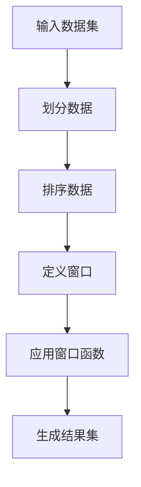

# 窗口函数 原理与代码实例讲解

## 1.背景介绍

在数据分析和处理领域,窗口函数是一种强大的SQL功能,可以对数据集进行复杂的分析和计算。它允许我们在查询中定义一个"窗口"或数据子集,并对该窗口内的数据执行聚合计算或其他操作。这种功能使我们能够在单个SQL查询中执行一些以前需要多个查询或复杂的代码才能完成的任务。

窗口函数在处理序列数据或跨越多行进行计算时特别有用。它们为分析和报告提供了极大的灵活性,可以应用于各种场景,如金融分析、统计学、数据仓库等。

## 2.核心概念与联系

### 2.1 窗口和分区

窗口函数的核心概念是"窗口"和"分区"。窗口定义了函数操作的数据范围,而分区则将数据划分为逻辑组。

- **窗口(Window)**: 窗口指定了函数应该计算的行集。它可以是整个结果集,也可以是基于某些条件或排序的部分行。
- **分区(Partition)**: 分区是根据一个或多个列值将数据划分为逻辑组。窗口函数将分别在每个分区上运行。

这两个概念紧密相连,并且通过`OVER`子句进行定义。`OVER`子句指定了窗口函数应该在哪些行上计算,以及如何对行进行分区。

### 2.2 排序和框架

除了窗口和分区外,窗口函数还可以利用排序和框架来控制计算范围和方式。

- **排序(Order By)**: 排序用于确定行在窗口内的逻辑顺序。这对于计算顺序敏感的函数(如`LEAD`、`LAG`等)非常重要。
- **框架(Frame)**: 框架进一步限制了窗口函数应该计算的行范围。它可以是整个分区、从起点到当前行的范围、从当前行到终点的范围,或者是一个基于当前行的移动范围。

通过组合这些概念,窗口函数可以执行各种复杂的数据转换和分析任务。

## 3.核心算法原理具体操作步骤

窗口函数的算法原理可以概括为以下几个步骤:

1. **划分数据**: 根据`PARTITION BY`子句将数据划分为逻辑组或分区。
2. **排序数据**: 如果指定了`ORDER BY`子句,则根据指定的排序键对每个分区内的数据进行排序。
3. **定义窗口**: 使用`OVER`子句定义窗口的范围和框架。
4. **应用窗口函数**: 对每个分区中的每一行应用指定的窗口函数,并根据窗口定义和排序对数据进行计算。
5. **生成结果集**: 将计算结果与原始数据集合并,生成最终的结果集。

这个过程可以用下面的Mermaid流程图来可视化:



需要注意的是,窗口函数的计算是在服务器端完成的,而不是在客户端。这意味着它们通常比使用客户端代码进行相同计算更有效。

## 4.数学模型和公式详细讲解举例说明

虽然窗口函数本身不涉及复杂的数学模型,但它们可以与各种聚合函数和分析函数结合使用,从而实现强大的数据分析功能。以下是一些常见的窗口函数及其相关公式:

### 4.1 排名函数

排名函数用于为分区内的行分配排名。常见的排名函数包括:

- `ROW_NUMBER()`: 为每个分区内的行分配连续的行号,从1开始。
  $$\text{ROW_NUMBER() OVER (PARTITION BY ... ORDER BY ...)}$$

- `RANK()`: 为每个分区内的行分配排名,排名可能会出现并列,并列的行将跳过下一个排名值。
  $$\text{RANK() OVER (PARTITION BY ... ORDER BY ...)}$$

- `DENSE_RANK()`: 为每个分区内的行分配排名,排名可能会出现并列,但不会跳过下一个排名值。
  $$\text{DENSE_RANK() OVER (PARTITION BY ... ORDER BY ...)}$$

### 4.2 分析函数

分析函数用于对分区内的数据进行统计分析,例如计算累计值、移动平均值等。常见的分析函数包括:

- `SUM()`: 计算分区内所有值的总和。
  $$\text{SUM(...) OVER (PARTITION BY ...)}$$

- `AVG()`: 计算分区内所有值的平均值。
  $$\text{AVG(...) OVER (PARTITION BY ...)}$$

- `COUNT()`: 计算分区内非NULL值的个数。
  $$\text{COUNT(...) OVER (PARTITION BY ...)}$$

- `MAX()/MIN()`: 计算分区内的最大/最小值。
  $$\text{MAX(...) OVER (PARTITION BY ...)}, \quad \text{MIN(...) OVER (PARTITION BY ...)}$$

### 4.3 移动窗口函数

移动窗口函数用于计算基于前面或后面几行的值。常见的移动窗口函数包括:

- `LEAD()/LAG()`: 获取分区内当前行的前面/后面指定偏移量的值。
  $$\text{LEAD(col, n, default_val) OVER (PARTITION BY ... ORDER BY ...)}, \quad \text{LAG(col, n, default_val) OVER (PARTITION BY ... ORDER BY ...)}$$

- `FIRST_VALUE()/LAST_VALUE()`: 获取分区内的第一个/最后一个值。
  $$\text{FIRST_VALUE(col) OVER (PARTITION BY ... ORDER BY ...)}, \quad \text{LAST_VALUE(col) OVER (PARTITION BY ... ORDER BY ...)}$$

### 4.4 框架示例

框架用于定义窗口函数应该计算的行范围。以下是一个使用`SUM()`函数和框架的示例:

```sql
SELECT
    product_name,
    order_date,
    revenue,
    SUM(revenue) OVER (
        PARTITION BY product_name
        ORDER BY order_date
        ROWS BETWEEN UNBOUNDED PRECEDING AND CURRENT ROW
    ) AS running_total
FROM orders;
```

在这个例子中,`SUM(revenue)`函数计算了每个产品的累计收入。`ROWS BETWEEN UNBOUNDED PRECEDING AND CURRENT ROW`框架指定了窗口范围从每个分区的第一行开始,到当前行结束。这样,`running_total`列将包含每个产品截止到当前日期的累计收入。

通过灵活组合窗口、分区、排序和框架,窗口函数可以实现各种复杂的数据分析任务。

## 5.项目实践:代码实例和详细解释说明

为了更好地理解窗口函数的使用,我们将通过一个实际项目案例来演示。假设我们有一个包含销售订单数据的表`orders`,其结构如下:

```sql
CREATE TABLE orders (
    order_id INT PRIMARY KEY,
    customer_name VARCHAR(50),
    product_name VARCHAR(50),
    order_date DATE,
    quantity INT,
    unit_price DECIMAL(10,2),
    revenue DECIMAL(10,2)
);
```

我们将使用窗口函数来执行以下任务:

1. 为每个客户计算累计收入
2. 计算每个产品的移动平均收入
3. 为每个客户的订单分配连续的行号
4. 找出每个客户最大的订单金额

### 5.1 为每个客户计算累计收入

```sql
SELECT
    customer_name,
    order_date,
    revenue,
    SUM(revenue) OVER (
        PARTITION BY customer_name
        ORDER BY order_date
        ROWS BETWEEN UNBOUNDED PRECEDING AND CURRENT ROW
    ) AS running_total
FROM orders;
```

在这个查询中,我们使用`SUM(revenue)`函数和`OVER`子句来计算每个客户的累计收入。

- `PARTITION BY customer_name`将数据按客户名称划分为不同的分区。
- `ORDER BY order_date`确保在每个分区内,行按照订单日期排序。
- `ROWS BETWEEN UNBOUNDED PRECEDING AND CURRENT ROW`框架指定了窗口范围从每个分区的第一行开始,到当前行结束。

因此,`running_total`列将包含每个客户截止到当前日期的累计收入。

### 5.2 计算每个产品的移动平均收入

```sql
SELECT
    product_name,
    order_date,
    revenue,
    AVG(revenue) OVER (
        PARTITION BY product_name
        ORDER BY order_date
        ROWS BETWEEN 2 PRECEDING AND CURRENT ROW
    ) AS moving_avg
FROM orders;
```

在这个查询中,我们使用`AVG(revenue)`函数和`OVER`子句来计算每个产品的移动平均收入。

- `PARTITION BY product_name`将数据按产品名称划分为不同的分区。
- `ORDER BY order_date`确保在每个分区内,行按照订单日期排序。
- `ROWS BETWEEN 2 PRECEDING AND CURRENT ROW`框架指定了窗口范围为当前行及其前面两行。

因此,`moving_avg`列将包含每个产品在当前日期及其前两个日期的移动平均收入。

### 5.3 为每个客户的订单分配连续的行号

```sql
SELECT
    customer_name,
    order_date,
    revenue,
    ROW_NUMBER() OVER (
        PARTITION BY customer_name
        ORDER BY order_date
    ) AS row_num
FROM orders;
```

在这个查询中,我们使用`ROW_NUMBER()`函数和`OVER`子句为每个客户的订单分配连续的行号。

- `PARTITION BY customer_name`将数据按客户名称划分为不同的分区。
- `ORDER BY order_date`确保在每个分区内,行按照订单日期排序。

因此,`row_num`列将包含每个客户订单的连续行号,从1开始。

### 5.4 找出每个客户最大的订单金额

```sql
SELECT
    customer_name,
    order_date,
    revenue,
    FIRST_VALUE(revenue) OVER (
        PARTITION BY customer_name
        ORDER BY revenue DESC
        ROWS BETWEEN UNBOUNDED PRECEDING AND UNBOUNDED FOLLOWING
    ) AS max_revenue
FROM orders;
```

在这个查询中,我们使用`FIRST_VALUE(revenue)`函数和`OVER`子句来找出每个客户最大的订单金额。

- `PARTITION BY customer_name`将数据按客户名称划分为不同的分区。
- `ORDER BY revenue DESC`确保在每个分区内,行按照收入金额降序排列。
- `ROWS BETWEEN UNBOUNDED PRECEDING AND UNBOUNDED FOLLOWING`框架指定了窗口范围为整个分区。

因此,`max_revenue`列将包含每个客户的最大订单金额。

通过这些示例,您应该能够更好地理解如何使用窗口函数来执行各种数据分析任务。窗口函数的强大之处在于它们可以在单个SQL查询中完成许多复杂的计算,从而提高了查询效率和可读性。

## 6.实际应用场景

窗口函数在各种领域都有广泛的应用,以下是一些常见的应用场景:

### 6.1 金融分析

在金融领域,窗口函数可用于计算累计收益、移动平均线、排名等指标。例如,投资组合经理可以使用窗口函数来跟踪每只股票的累计收益,并根据收益率对股票进行排名。

### 6.2 统计分析

统计学家和数据分析师可以利用窗口函数来计算移动平均值、百分位数、累计分布等统计指标。这些指标对于时间序列分析、异常值检测和其他统计任务非常有用。

### 6.3 数据仓库

在数据仓库中,窗口函数可用于生成报告和执行数据透视。例如,可以使用窗口函数来计算每个产品类别的累计销售额,或者为每个客户的订单分配连续的行号。

### 6.4 机器学习

在机器学习领域,窗口函数可用于特征工程和数据预处理。例如,可以使用窗口函数来计算时间序列数据的滚动平均值或滞后特征,这些特征对于预测任务非常有用。

### 6.5 游戏分析

在游戏分析中,窗口函数可用于跟踪玩家的排名、累计分数和其他游戏统计数据。这些数据对于游戏平衡、玩家留存和收入优化等任务非常重要。

### 6.6 Web分析

Web分析师可以使用窗口函数来分析用户行为,例如计算每个会话的页面浏览顺序、跟踪用户的累计访问次数等。这些信息对于优化网站体验和个性化内容非常有价值。

总的来说,窗口函数