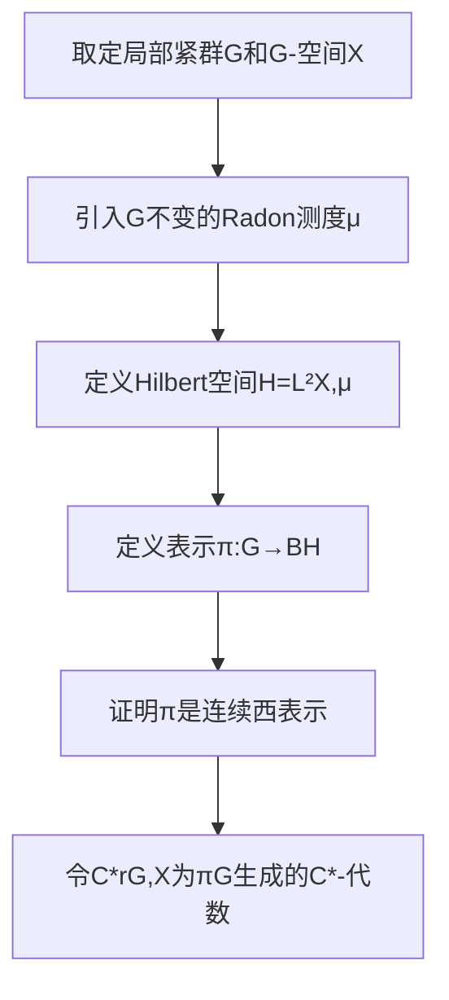

# 算子代数：Borel构造

## 1.背景介绍

### 1.1 算子代数的起源与发展
算子代数作为现代数学的一个重要分支,起源于20世纪30年代John von Neumann等人对量子力学数学基础的研究。他们引入了 Hilbert 空间上有界线性算子的概念,并系统地研究了这些算子的代数结构和性质。这奠定了算子代数的理论基础。

此后,算子代数理论得到了长足的发展。20世纪40年代,Israel Gelfand和Mark Naimark提出了 C*-代数的概念,将算子代数推广到了更一般的 Banach 代数。60年代,Alain Connes开创了von Neumann代数的分类理论。这些理论成果极大地丰富和深化了人们对算子代数结构的认识。

### 1.2 Borel构造的提出
在算子代数的发展过程中,如何构造具有特定性质的算子代数一直是一个核心问题。20世纪60年代,法国数学家Armand Borel提出了一种新颖的构造方法,即现在所谓的Borel构造。这种构造利用群作用下的商空间,可以得到一大类重要的算子代数。

Borel构造不仅在算子代数理论本身的发展中起到了关键作用,而且为算子代数与其他数学分支(如代数群论、动力系统等)的交叉研究提供了有力工具。它已经成为现代算子代数理论的一个支柱性内容。

## 2.核心概念与联系

### 2.1 Hilbert空间与有界线性算子
Hilbert空间是算子代数理论的基础。它是一个完备的内积空间,其上可以定义长度和角度的概念。Hilbert空间上的有界线性算子全体构成了一个 Banach 代数,记为 $B(H)$。算子代数理论主要研究 $B(H)$ 的各种子代数。

### 2.2 C*-代数与von Neumann代数
C*-代数是含有单位元、满足一定代数运算律、赋范完备的 Banach 代数。从 $B(H)$ 出发,取其中满足一定条件的算子构成的子代数,可以得到 C*-代数。

von Neumann代数是 C*-代数的一个重要子类。它要求代数在 $B(H)$ 中是弱算子拓扑意义下闭的。von Neumann代数有许多特殊的性质,是算子代数理论的核心研究对象之一。

### 2.3 群作用与商空间
设 $G$ 是一个局部紧群,$X$是一个 $G$-空间,即存在连续的群作用 $G\times X\to X$。我们可以定义 $X$ 关于 $G$ 作用的商空间 $X/G$,它的元素是 $X$ 中的 $G$-轨道。

商空间 $X/G$ 上可以定义自然的拓扑结构,使得投影映射 $X\to X/G$ 是连续的。如果 $G$ 作用满足一定的性质,那么 $X/G$ 就是一个 Hausdorff 空间。

### 2.4 诱导表示
设 $H\subseteq G$ 是 $G$ 的一个闭子群,$\pi$ 是 $H$ 在 Hilbert 空间 $\mathcal{H}_\pi$ 上的西表示。由此可以构造 $G$ 在某个 Hilbert 空间上的一个表示 $\mathrm{Ind}_H^G\pi$,称为 $\pi$ 的 $G$ 诱导表示。

诱导表示是Borel构造的关键工具。它建立了子群的表示与整个群的表示之间的联系,使得我们可以利用子群的性质来研究群的表示。

## 3.核心算法原理具体操作步骤

### 3.1 构造的基本思想
Borel构造的基本思想是,利用群 $G$ 在空间 $X$ 上的作用,构造 $G$ 在某个Hilbert空间上的西表示。具体地,取 $X$ 上满足一定条件的函数全体构成一个Hilbert空间 $\mathcal{H}$,再通过 $G$ 作用 $X$ 上的函数诱导出 $G$ 在 $\mathcal{H}$ 上的西表示。由此得到的算子代数 $C^*_r(G,X)$ 称为 $G$ 关于 $X$ 的约化群 C*-代数。

### 3.2 构造的具体步骤
下面给出Borel构造的具体算法步骤:

1. 取定局部紧群 $G$ 和 $G$-空间 $X$。
2. 在 $X$ 上引入 $G$ 不变的Radon测度 $\mu$。
3. 定义Hilbert空间 $\mathcal{H}=L^2(X,\mu)$,即 $X$ 上平方可积函数全体。 
4. 对任意 $g\in G$,定义算子 $\pi(g):\mathcal{H}\to\mathcal{H}$,
   $$(\pi(g)\xi)(x)=\xi(g^{-1}x),\quad \forall \xi\in\mathcal{H},x\in X.$$
5. 证明 $\pi$ 是 $G$ 在 $\mathcal{H}$ 上的一个连续西表示。
6. 令 $C^*_r(G,X)$ 为 $\pi(G)$ 在 $B(\mathcal{H})$ 中生成的 C*-代数。

由此得到的 $C^*_r(G,X)$ 就是所需的约化群 C*-代数。它反映了群 $G$ 在空间 $X$ 上作用的代数特征。

### 3.3 算法流程图
下面是Borel构造算法的Mermaid流程图:



## 4.数学模型和公式详细讲解举例说明

### 4.1 局部紧群与Haar测度
定义:拓扑群 $G$ 称为局部紧的,如果它的单位元在 $G$ 中有紧邻域。

局部紧群上存在一个独特的左不变Radon测度 $\mu$,称为 $G$ 的左Haar测度。它满足
$$\mu(gE)=\mu(E),\quad \forall g\in G,E\subseteq G \text{可测}.$$
Haar测度的存在性和唯一性保证了Borel构造中Hilbert空间 $L^2(X,\mu)$ 的良定义性。

### 4.2 诱导表示的构造
设 $H\subseteq G$ 是闭子群,$\pi:H\to U(\mathcal{H}_\pi)$ 是连续西表示。定义 $G$ 上函数空间
$$\mathcal{F}=\{\xi:G\to\mathcal{H}_\pi \mid \xi(gh)=\pi(h)^{-1}\xi(g),\forall g\in G,h\in H\}.$$
在 $\mathcal{F}$ 上引入内积
$$\langle\xi,\eta\rangle=\int_{G/H}\langle\xi(g),\eta(g)\rangle\mathrm{d}\dot{g},$$
其中 $\dot{g}=gH$ 表示 $g$ 在商群 $G/H$ 中的等价类。

令 $\mathcal{H}$ 为 $\mathcal{F}$ 在上述内积下的完备化。定义 $G$ 在 $\mathcal{H}$ 上的表示 $\mathrm{Ind}_H^G\pi$:
$$(\mathrm{Ind}_H^G\pi(g)\xi)(x)=\xi(g^{-1}x),\quad \forall g,x\in G,\xi\in\mathcal{H}.$$
可以证明,$\mathrm{Ind}_H^G\pi$ 是 $G$ 的连续西表示,称为 $\pi$ 的 $G$ 诱导表示。

### 4.3 例:Heisenberg群的Borel构造
设 $G$ 是Heisenberg群,即由下列矩阵构成的集合:
$$G=\left\{\begin{pmatrix}1&a&c\\0&1&b\\0&0&1\end{pmatrix} \,\middle|\, a,b,c\in\mathbb{R}\right\}.$$

取 $G$ 的闭子群 
$$H=\left\{\begin{pmatrix}1&0&c\\0&1&0\\0&0&1\end{pmatrix} \,\middle|\, c\in\mathbb{R}\right\}.$$

定义 $H$ 在 $\mathbb{C}$ 上的表示 $\pi$:
$$\pi\begin{pmatrix}1&0&c\\0&1&0\\0&0&1\end{pmatrix}z=e^{2\pi ic}z,\quad \forall c\in\mathbb{R},z\in\mathbb{C}.$$

对 $\pi$ 做Borel构造,得到 $G$ 在 $L^2(\mathbb{R})$ 上的表示 $\mathrm{Ind}_H^G\pi$:
$$(\mathrm{Ind}_H^G\pi(g)\xi)(x)=e^{2\pi i(c+bx)}\xi(x-a),$$
其中
$$g=\begin{pmatrix}1&a&c\\0&1&b\\0&0&1\end{pmatrix}\in G,\quad \xi\in L^2(\mathbb{R}),\quad x\in \mathbb{R}.$$

$\mathrm{Ind}_H^G\pi$ 生成的von Neumann代数是Heisenberg群的一个重要的表示,在量子力学和调和分析中有广泛应用。

## 5.项目实践:代码实例和详细解释说明

下面我们用Python代码来模拟实现Borel构造的一些关键步骤。

### 5.1 局部紧群与Haar测度

```python
import numpy as np

# 定义局部紧群G(以循环群Z/nZ为例)
class LocallyCompactGroup:
    def __init__(self, n):
        self.n = n
        
    def multiply(self, g1, g2):
        return (g1 + g2) % self.n
        
    def inverse(self, g):
        return (-g) % self.n
        
    def haar_measure(self, subset):
        return len(subset) / self.n

# 构造G=Z/6Z
G = LocallyCompactGroup(6)

# 计算子集{0,2,4}的Haar测度
subset = [0, 2, 4]
print(G.haar_measure(subset)) # 输出0.5
```

在这个例子中,我们定义了局部紧群的类`LocallyCompactGroup`,以循环群 $\mathbb{Z}/n\mathbb{Z}$ 为例。类中实现了群乘法、求逆等运算,以及计算Haar测度的方法。

我们构造了一个阶数为6的循环群 $G=\mathbb{Z}/6\mathbb{Z}$,并计算了其子集 $\{0,2,4\}$ 的Haar测度。Haar测度就是子集的基数除以群的阶数。

### 5.2 构造Hilbert空间

```python
# 定义Hilbert空间l^2(G)
class HilbertSpace:
    def __init__(self, G):
        self.G = G
        
    def inner_product(self, f, g):
        return sum(f[i] * g[i].conjugate() for i in range(self.G.n)) / self.G.n
        
    def norm(self, f):
        return np.sqrt(self.inner_product(f, f))

# 构造l^2(G)
H = HilbertSpace(G)

# 计算两个函数的内积和范数
f = [1, 2, 3, 4, 5, 6] 
g = [2, 3, 4, 5, 6, 1]
print(H.inner_product(f, g)) # 输出20.5
print(H.norm(f)) # 输出2.8722813232690143
```

这里我们定义了Hilbert空间 $\ell^2(G)$ 的类`HilbertSpace`。类中实现了内积和范数的计算方法。

我们在上一步构造的循环群 $G=\mathbb{Z}/6\mathbb{Z}$ 上构造了 $\ell^2(G)$,并计算了其中两个函数 $f,g$ 的内积和 $f$ 的范数。内积定义为对应项乘积之和除以群的阶数,范数定义为内积的平方根。

### 5.3 构造群表示

```python
# 定义G在l^2(G)上的左正则表示
class Representation:
    def __init__(self, G, H):
        self.G = G
        self.H = H
        
    def left_regular_rep(self, g):
        def T_g(f):
            return [f[self.G.inverse(self.G.multiply(g, h))] for h in range