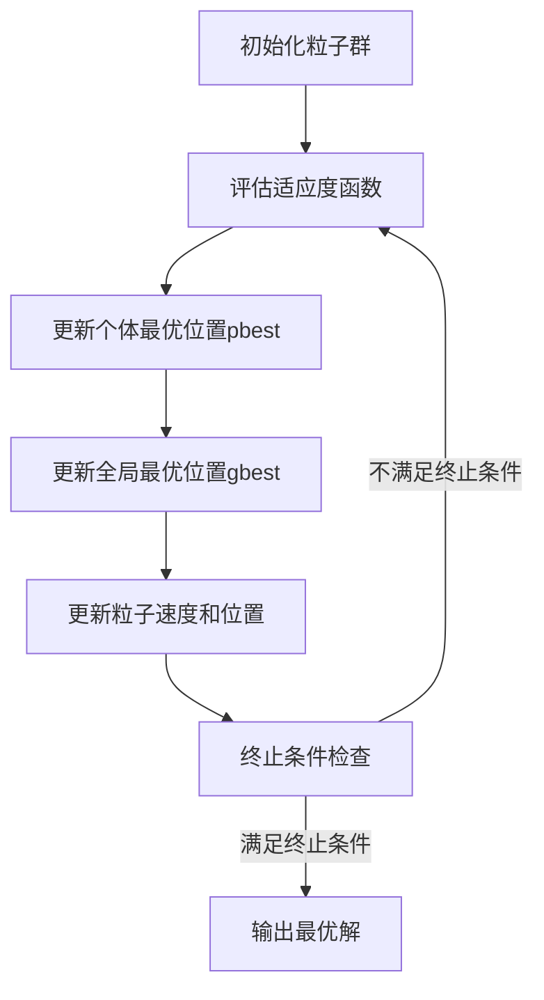

# 粒子群算法(Particle Swarm Optimization) - 原理与代码实例讲解

## 1. 背景介绍

粒子群优化算法(Particle Swarm Optimization, PSO)是一种基于群体智能的进化计算技术,由肯尼迪(Kennedy)和伊伯哈特(Eberhart)于1995年提出。该算法的灵感来源于鸟群捕食的群体行为,通过模拟鸟群的觅食行为来解决优化问题。在PSO算法中,每个潜在的解决方案都被看作是一个"粒子",这些粒子在搜索空间中飞行,并根据自身和群体的历史最优位置来调整自身的飞行轨迹,最终期望能够找到全局最优解。

PSO算法具有简单高效、易于实现、收敛速度快等优点,已被广泛应用于函数优化、神经网络训练、模糊系统控制、任务调度等多个领域。它不仅在连续空间优化问题上表现出色,而且在离散优化问题上也有良好的效果。

### 1.1 发展历史

粒子群算法的发展经历了以下几个主要阶段:

- 1995年:Kennedy和Eberhart在生物群体模拟的基础上提出了最初的粒子群优化算法。
- 1998年:Shi和Eberhart提出了惯性权重(Inertia Weight)的概念,使算法收敛性能得到改善。
- 2002年:Clerc和Kennedy提出了约束因子(Constriction Factor),进一步增强了算法的收敛性能。
- 2007年:Zhan等人提出了自适应粒子群优化算法(Adaptive PSO),使算法能够自动调节参数。
- 近年来:研究人员不断探索新的变体和混合算法,如量子粒子群算法、多种群粒子群算法等,以提高算法的性能和适应性。

### 1.2 优缺点分析

**优点:**

- 简单易懂,概念清晰,实现容易。
- 无需gradient信息,适用于非线性、非凸、非连续等复杂优化问题。
- 具有良好的全局搜索能力,能够快速收敛到全局最优解的附近。
- 算法具有并行性,易于实现并行计算。

**缺点:**

- 容易陷入局部最优,后期收敛速度较慢。
- 参数设置对算法性能影响较大,需要一定的经验和调试。
- 对于高维复杂问题,收敛性能可能不佳。

## 2. 核心概念与联系

### 2.1 粒子

在PSO算法中,每个潜在的解决方案都被看作是一个"粒子"。每个粒子都有自己的位置向量和速度向量,分别表示在搜索空间中的当前位置和飞行方向。

**位置向量:** 粒子在搜索空间中的坐标,对应一个可能的解。
**速度向量:** 粒子在搜索空间中的飞行方向和步长。

### 2.2 适应度函数

适应度函数(Fitness Function)用于评估每个粒子所对应解的优劣程度。在求解最小化问题时,适应度值越小,表示该解越优秀。

### 2.3 个体最优位置

每个粒子都会记录自身搜索过程中遇到的最优位置,称为个体最优位置(Personal Best Position, pbest)。

### 2.4 全局最优位置

整个粒子群中所有粒子的最优位置称为全局最优位置(Global Best Position, gbest)。

### 2.5 粒子更新策略

在每次迭代中,粒子根据自身和群体的历史最优位置来调整自身的飞行速度和位置,更新策略如下:

$$
v_{i}^{t+1} = w \times v_{i}^{t} + c_{1} \times r_{1} \times (pbest_{i}^{t} - x_{i}^{t}) + c_{2} \times r_{2} \times (gbest^{t} - x_{i}^{t})
$$

$$
x_{i}^{t+1} = x_{i}^{t} + v_{i}^{t+1}
$$

其中:
- $v_{i}^{t}$和$x_{i}^{t}$分别表示第i个粒子在第t次迭代时的速度和位置。
- $w$是惯性权重,用于控制粒子的惯性。
- $c_{1}$和$c_{2}$是加速常数,分别控制粒子向个体最优位置和全局最优位置的飞行趋势。
- $r_{1}$和$r_{2}$是[0,1]之间的随机数,用于增加算法的随机性。

### 2.6 算法流程图



## 3. 核心算法原理具体操作步骤

1. **初始化粒子群**
   - 随机生成一组粒子,每个粒子都有一个随机的初始位置和速度。
   - 设置算法参数,如粒子数量、最大迭代次数、惯性权重、加速常数等。

2. **评估适应度函数**
   - 对每个粒子所对应的解计算适应度函数值。

3. **更新个体最优位置pbest**
   - 对于每个粒子,将当前位置与其历史最优位置pbest进行比较。
   - 如果当前位置的适应度函数值更优,则更新pbest为当前位置。

4. **更新全局最优位置gbest**
   - 在整个粒子群中,找到具有最优适应度函数值的粒子。
   - 将该粒子的位置设置为全局最优位置gbest。

5. **更新粒子速度和位置**
   - 根据公式更新每个粒子的速度和位置。
   - 新的速度由三部分组成:
     - 惯性部分:惯性权重乘以上一次迭代的速度。
     - 认知部分:个体最优位置与当前位置的差值,乘以一个加速常数和随机数。
     - 社会部分:全局最优位置与当前位置的差值,乘以另一个加速常数和随机数。
   - 新的位置由上一次迭代的位置加上新的速度得到。

6. **终止条件检查**
   - 检查是否满足终止条件,如最大迭代次数或目标函数值达到阈值等。
   - 如果满足,则输出当前的全局最优位置gbest作为最优解。
   - 如果不满足,则返回步骤2,继续迭代。

## 4. 数学模型和公式详细讲解举例说明

### 4.1 粒子位置和速度更新公式

粒子群算法的核心是粒子位置和速度的更新公式,如下所示:

$$
v_{i}^{t+1} = w \times v_{i}^{t} + c_{1} \times r_{1} \times (pbest_{i}^{t} - x_{i}^{t}) + c_{2} \times r_{2} \times (gbest^{t} - x_{i}^{t})
$$

$$
x_{i}^{t+1} = x_{i}^{t} + v_{i}^{t+1}
$$

其中:

- $v_{i}^{t}$和$x_{i}^{t}$分别表示第i个粒子在第t次迭代时的速度和位置。
- $w$是惯性权重,用于控制粒子的惯性。
- $c_{1}$和$c_{2}$是加速常数,分别控制粒子向个体最优位置和全局最优位置的飞行趋势。
- $r_{1}$和$r_{2}$是[0,1]之间的随机数,用于增加算法的随机性。
- $pbest_{i}^{t}$是第i个粒子在第t次迭代时的个体最优位置。
- $gbest^{t}$是在第t次迭代时的全局最优位置。

这个公式由三部分组成:

1. **惯性部分:** $w \times v_{i}^{t}$
   - 惯性权重$w$控制了粒子保持当前速度方向的能力。
   - 较大的$w$值有利于全局搜索,较小的$w$值有利于局部搜索。

2. **认知部分:** $c_{1} \times r_{1} \times (pbest_{i}^{t} - x_{i}^{t})$
   - 这一部分使粒子朝向自身历史最优位置$pbest_{i}^{t}$移动。
   - $c_{1}$是认知加速常数,控制粒子向个体最优位置飞行的趋势。
   - $r_{1}$是随机数,增加算法的随机性。

3. **社会部分:** $c_{2} \times r_{2} \times (gbest^{t} - x_{i}^{t})$
   - 这一部分使粒子朝向整个群体的最优位置$gbest^{t}$移动。
   - $c_{2}$是社会加速常数,控制粒子向全局最优位置飞行的趋势。
   - $r_{2}$是随机数,增加算法的随机性。

通过这种更新策略,粒子在个体经验和群体经验的共同作用下,逐步向全局最优解靠拢。

### 4.2 参数设置

PSO算法的性能受到参数设置的影响,主要参数包括:

- **粒子数量:** 通常设置为20~50之间。过多的粒子会增加计算开销,过少的粒子可能导致算法陷入局部最优。
- **惯性权重$w$:** 通常设置为[0.8,1.2]之间的值。较大的$w$有利于全局搜索,较小的$w$有利于局部搜索。
- **加速常数$c_{1}$和$c_{2}$:** 通常设置为2,即$c_{1}=c_{2}=2$。这样可以平衡个体和社会行为的影响。
- **最大迭代次数:** 根据问题的复杂程度设置,通常设置为几百到几千次迭代。

### 4.3 收敛性分析

PSO算法的收敛性主要取决于以下几个因素:

1. **参数设置**
   - 合理的参数设置对算法的收敛性能至关重要。
   - 惯性权重$w$和加速常数$c_{1}$、$c_{2}$的值会影响算法的收敛速度和精度。

2. **初始化策略**
   - 初始粒子群的分布对算法的收敛性能有一定影响。
   - 合理的初始化策略可以提高算法的收敛速度和精度。

3. **终止条件**
   - 合理的终止条件可以避免算法过早停止或无谓的迭代。
   - 常用的终止条件包括最大迭代次数、目标函数值阈值等。

4. **适应度景观**
   - 优化问题的适应度景观(Fitness Landscape)对算法的收敛性能有重要影响。
   - 对于复杂的多峰值函数,PSO算法可能会陷入局部最优解。

为了提高PSO算法的收敛性能,研究人员提出了多种改进策略,如自适应参数调整、混合算法、多种群协同等。

### 4.4 算法复杂度分析

PSO算法的时间复杂度主要取决于以下几个因素:

1. **粒子数量$N$**
   - 每次迭代需要评估$N$个粒子的适应度函数值。

2. **维度$D$**
   - 粒子位置和速度向量的维度为$D$。
   - 更新粒子位置和速度的计算量与$D$成正比。

3. **迭代次数$T$**
   - 算法需要进行$T$次迭代。

综合以上因素,PSO算法的时间复杂度为$O(N \times D \times T)$。

在实际应用中,通常会采用一些优化策略来减少计算量,如并行计算、维度降低等。此外,对于特定的优化问题,可能存在更高效的求解方法。

## 5. 项目实践:代码实例和详细解释说明

下面是一个使用Python实现的基本粒子群优化算法示例,用于求解单峰值函数$f(x,y)=x^2+y^2$的最小值。

```python
import random
import math

# 定义目标函数
def objective_function(x, y):
    return x**2 + y**2

# 粒子群类
class Particle:
    def __init__(self, x, y, v_x,