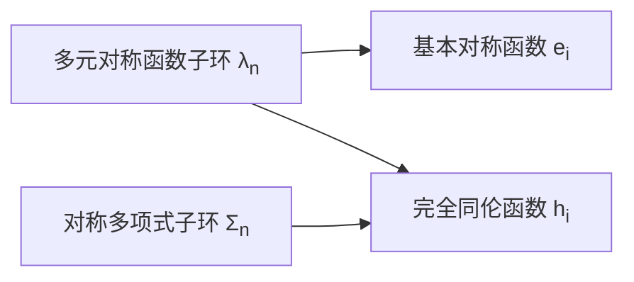
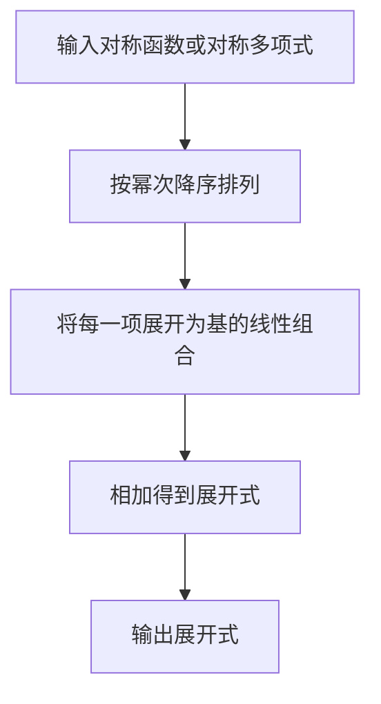

# 线性代数导引：多元对称函数子环和对称多项式子环

## 1.背景介绍

在线性代数和代数几何中,对称函数和对称多项式是一个重要的概念和研究领域。它们在数学、物理、计算机科学等多个领域都有着广泛的应用。本文将深入探讨多元对称函数子环和对称多项式子环的理论基础、核心概念、算法原理以及实际应用场景。

### 1.1 对称函数和对称多项式的定义

**对称函数**是指在任意交换变量的位置后,函数值保持不变的函数。形式上,如果一个函数$f(x_1,x_2,\ldots,x_n)$对于任意的置换$\sigma \in S_n$满足:

$$f(x_1,x_2,\ldots,x_n) = f(x_{\sigma(1)},x_{\sigma(2)},\ldots,x_{\sigma(n)})$$

则称$f$为一个$n$元对称函数。

**对称多项式**是指系数为对称函数的多项式。更精确地说,如果一个多项式$P(x_1,x_2,\ldots,x_n)$对于任意的置换$\sigma \in S_n$满足:

$$P(x_1,x_2,\ldots,x_n) = P(x_{\sigma(1)},x_{\sigma(2)},\ldots,x_{\sigma(n)})$$

则称$P$为一个$n$元对称多项式。

### 1.2 对称函数和对称多项式的重要性

对称函数和对称多项式在数学和应用数学中扮演着重要的角色。它们不仅在纯粹的代数和组合数学中有着深刻的理论意义,同时也在物理学、化学、计算机科学等领域有着广泛的应用。

例如,在量子力学中,对称函数被用于描述同种粒子的波函数;在invariant理论中,对称多项式被用于研究不变量;在密码学中,对称多项式可以用于构造加密函数;在组合数学中,对称函数和对称多项式与Young表示理论、Schubert多项式等有着密切的联系。

## 2.核心概念与联系

### 2.1 多元对称函数子环

设$R=K[x_1,x_2,\ldots,x_n]$为$n$元多项式环,其中$K$为某个域。我们定义$R$中所有对称函数的集合为:

$$\Lambda_n = \{f \in R \mid f\text{是}n\text{元对称函数}\}$$

不难证明,$\Lambda_n$对于加法和乘法封闭,因此它是$R$的一个子环,被称为$n$元对称函数子环。

### 2.2 对称多项式子环

类似地,我们定义$R$中所有对称多项式的集合为:

$$\Sigma_n = \{P \in R \mid P\text{是}n\text{元对称多项式}\}$$

$\Sigma_n$也是$R$的一个子环,被称为$n$元对称多项式子环。事实上,$\Sigma_n$是$\Lambda_n$的集合环,即$\Sigma_n$中的元素都可以表示为$\Lambda_n$中元素的有限线性组合。

### 2.3 基本对称函数

在研究$\Lambda_n$和$\Sigma_n$的性质时,一个关键问题是找到它们的一组基,即能够生成整个子环的有限个元素。经典的选择是使用基本对称函数(elementary symmetric functions)和完全同伦函数(complete homogeneous symmetric functions)。

对于$1 \leq i \leq n$,第$i$个基本对称函数$e_i$和第$i$个完全同伦函数$h_i$分别定义为:

$$e_i = \sum_{1\leq j_1<j_2<\cdots<j_i\leq n}x_{j_1}x_{j_2}\cdots x_{j_i}$$

$$h_i = \sum_{1\leq j_1\leq j_2\leq \cdots\leq j_i\leq n}x_{j_1}x_{j_2}\cdots x_{j_i}$$

可以证明,对于任意的$n$元对称函数$f$和$n$元对称多项式$P$,都可以用$e_i$和$h_i$的有限线性组合来表示。因此,$(e_1,e_2,\ldots,e_n)$是$\Lambda_n$的一组基,$(h_1,h_2,\ldots,h_n)$是$\Sigma_n$的一组基。

### 2.4 牛顿多项式和幂和函数

除了基本对称函数和完全同伦函数之外,牛顿多项式(Newton polynomials)和幂和函数(power sum symmetric functions)也是研究$\Lambda_n$和$\Sigma_n$时经常使用的一组基。

对于$1 \leq i \leq n$,第$i$个牛顿多项式$p_i$和第$i$个幂和函数$s_i$分别定义为:

$$p_i = \sum_{1\leq j_1<j_2<\cdots<j_i\leq n}(-1)^{i-1}(j_1+j_2+\cdots+j_i)x_{j_1}x_{j_2}\cdots x_{j_i}$$

$$s_i = \sum_{1\leq j\leq n}x_j^i$$

牛顿多项式和幂和函数之间存在着一些有趣的代数关系,例如:

$$p_i = \frac{1}{i}\sum_{j=1}^i(-1)^{i-j}s_je_{i-j}$$

这种关系在研究$\Lambda_n$和$\Sigma_n$的结构时非常有用。

## 3.核心算法原理具体操作步骤

### 3.1 对称函数的判定算法

判断一个给定的多元函数$f(x_1,x_2,\ldots,x_n)$是否为对称函数,是研究对称函数理论的基础。我们可以采用以下算法:

1) 构造$S_n$中的所有置换$\sigma$的列表$L$。
2) 对于$L$中的每一个置换$\sigma$,计算$f(x_{\sigma(1)},x_{\sigma(2)},\ldots,x_{\sigma(n)})$。
3) 如果所有的$f(x_{\sigma(1)},x_{\sigma(2)},\ldots,x_{\sigma(n)})$的值都相等,则$f$为对称函数;否则不是。

该算法的时间复杂度为$O(n!)$,对于较大的$n$值来说效率较低。更高效的算法需要利用对称函数的特殊性质,例如利用$f$的系数是否对称等。

### 3.2 对称多项式的判定算法

判断一个给定的多元多项式$P(x_1,x_2,\ldots,x_n)$是否为对称多项式,可以采用类似的算法:

1) 构造$S_n$中的所有置换$\sigma$的列表$L$。
2) 对于$L$中的每一个置换$\sigma$,计算$P(x_{\sigma(1)},x_{\sigma(2)},\ldots,x_{\sigma(n)})$。
3) 如果所有的$P(x_{\sigma(1)},x_{\sigma(2)},\ldots,x_{\sigma(n)})$的值都相等,则$P$为对称多项式;否则不是。

与对称函数的情况类似,该算法的时间复杂度为$O(n!)$,对于较大的$n$值来说效率较低。更高效的算法需要利用对称多项式的系数对称性质等。

### 3.3 对称函数和对称多项式的基的计算

给定一个对称函数$f$或对称多项式$P$,计算它在基本对称函数基或完全同伦函数基下的展开式,是一个重要的算法问题。我们可以采用以下算法:

1) 将$f$或$P$按照幂次降序排列,得到形如$\sum_{i=0}^da_ix^i$的表示,其中$a_i$是$n$元对称函数或对称多项式。
2) 对于每一个$a_i$,利用对称函数或对称多项式的定义,将它表示为基本对称函数或完全同伦函数的线性组合。
3) 将所有的线性组合相加,即得到$f$或$P$在所选基下的展开式。

该算法的时间复杂度取决于第2步的具体实现,通常为$O(n^d)$,其中$d$为$f$或$P$的最高次数。

利用牛顿多项式基或幂和函数基进行展开的算法原理类似,只是第2步的具体计算方式不同。

### 3.4 Jacobi-Trudi公式

Jacobi-Trudi公式给出了计算基本对称函数$e_i$和完全同伦函数$h_i$的一种高效方法。对于任意的$1 \leq i \leq n$,我们有:

$$e_i = \begin{vmatrix}
1 & 1 & 1 & \cdots & 1\\
h_1 & h_2 & h_3 & \cdots & h_i\\
0 & h_1 & h_2 & \cdots & h_{i-1}\\
\vdots & \vdots & \vdots & \ddots & \vdots\\
0 & 0 & 0 & \cdots & h_1
\end{vmatrix}$$

$$h_i = \begin{vmatrix}
1 & (-1)^1e_1 & (-1)^2e_2 & \cdots & (-1)^ie_i\\
0 & 1 & (-1)e_1 & \cdots & (-1)^{i-1}e_{i-1}\\
\vdots & \vdots & \vdots & \ddots & \vdots\\
0 & 0 & 0 & \cdots & 1
\end{vmatrix}$$

利用这些公式,我们可以高效地计算出$e_i$和$h_i$的值,从而得到对称函数或对称多项式在这两组基下的展开式。

Jacobi-Trudi公式的证明需要利用一些组合数学的技巧,这里不再赘述。总的来说,它为计算基本对称函数和完全同伦函数提供了一种优雅而高效的方法。

## 4.数学模型和公式详细讲解举例说明

在上一节中,我们已经介绍了一些与对称函数和对称多项式相关的重要公式,如基本对称函数和完全同伦函数的定义、牛顿多项式和幂和函数的定义、Jacobi-Trudi公式等。在这一节中,我们将进一步详细讲解这些公式的数学模型,并给出具体的例子加深理解。

### 4.1 基本对称函数和完全同伦函数

回顾一下基本对称函数$e_i$和完全同伦函数$h_i$的定义:

$$e_i = \sum_{1\leq j_1<j_2<\cdots<j_i\leq n}x_{j_1}x_{j_2}\cdots x_{j_i}$$

$$h_i = \sum_{1\leq j_1\leq j_2\leq \cdots\leq j_i\leq n}x_{j_1}x_{j_2}\cdots x_{j_i}$$

这两个定义实际上描述了对$n$个变量的所有长度为$i$的乘积项的求和。不同之处在于,对于$e_i$,我们要求下标是严格递增的;而对于$h_i$,下标只需要是非递减的。

例如,当$n=3$时,我们有:

$$e_1 = x_1 + x_2 + x_3$$
$$e_2 = x_1x_2 + x_1x_3 + x_2x_3$$
$$e_3 = x_1x_2x_3$$

$$h_1 = x_1 + x_2 + x_3$$
$$h_2 = x_1^2 + x_1x_2 + x_1x_3 + x_2^2 + x_2x_3 + x_3^2$$
$$h_3 = x_1^3 + x_1^2x_2 + x_1^2x_3 + x_1x_2^2 + x_1x_2x_3 + x_1x_3^2 + x_2^3 + x_2^2x_3 + x_2x_3^2 + x_3^3$$

从这些具体的例子中,我们可以清楚地看到$e_i$和$h_i$的区别和联