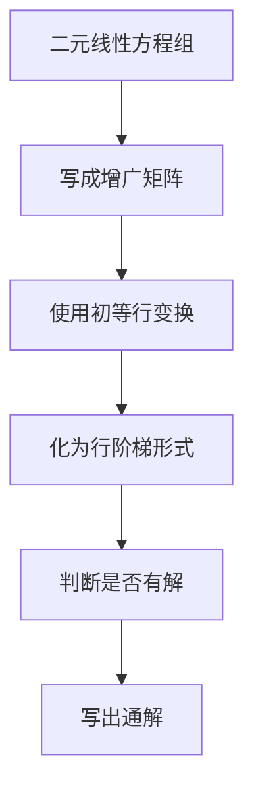
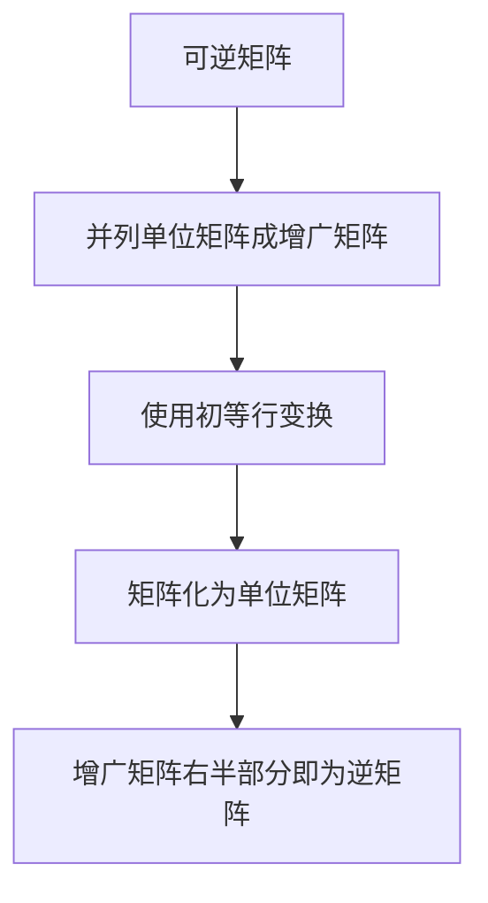

# 线性代数导引：方阵空间M2(R)

## 1.背景介绍

线性代数是一门研究向量空间理论的数学分支,是现代数学的基础之一。它在物理、工程、经济、计算机科学等诸多领域有着广泛的应用。其中,矩阵论是线性代数的核心内容之一。矩阵不仅能够简洁地表示线性变换,还能够高效地进行矩阵运算,从而解决许多实际问题。

在矩阵论中,我们通常研究的是一般的矩阵空间。然而,对于二阶实矩阵构成的矩阵空间M2(R)而言,它具有一些特殊的性质和应用,值得我们深入探讨。

## 2.核心概念与联系

### 2.1 矩阵和向量

矩阵是一种由有限多个数字或其他数学对象排列成的矩形阵列。矩阵中的每个元素可以用两个位置索引(行和列)来表示。

向量可以看作是一种特殊的矩阵,即只有一行或一列的矩阵。在M2(R)中,我们主要研究二维实向量。

### 2.2 线性变换

线性变换是一种将向量映射为另一个向量的函数,并且满足线性运算的可加性和数乘的可乘性。在M2(R)中,线性变换可以用2×2实矩阵来表示。

### 2.3 矩阵的代数运算

矩阵的代数运算包括加法、数乘和矩阵乘法等,它们都满足一定的运算规则和性质。这些运算为矩阵的理论研究和实际应用奠定了基础。

### 2.4 矩阵的初等变换

初等矩阵变换是指对矩阵进行某些特定的行变换或列变换,从而得到另一个矩阵。这些变换在求解线性方程组、求矩阵的秩和求矩阵的逆等问题中起着重要作用。

### 2.5 矩阵的秩

矩阵的秩是指矩阵中线性无关的行(列)向量的最大个数。秩的概念在线性方程组的解的理论和实际计算中都有重要应用。

## 3.核心算法原理具体操作步骤

### 3.1 求解二元线性方程组

在M2(R)中,我们可以使用高斯消元法来求解二元线性方程组。具体步骤如下:

1. 将线性方程组写成增广矩阵的形式。
2. 使用初等行变换将增广矩阵化为行阶梯形式。
3. 根据行阶梯形式,判断方程组是否有解,如果有解,写出通解。



### 3.2 求矩阵的逆

在M2(R)中,如果一个矩阵可逆,那么它就存在一个逆矩阵,使得矩阵与它的逆矩阵相乘得到单位矩阵。求逆矩阵的步骤如下:

1. 将矩阵和单位矩阵并列成一个增广矩阵。
2. 使用初等行变换将矩阵化为单位矩阵,同时对应地变换增广矩阵的右半部分。
3. 增广矩阵右半部分就是原矩阵的逆矩阵。



### 3.3 求矩阵的特征值和特征向量

对于M2(R)中的矩阵A,它的特征值和特征向量满足方程Av=λv,其中λ是特征值,v是对应的特征向量。求解步骤如下:

1. 构造矩阵A-λI,其中I是单位矩阵。
2. 求解|A-λI|=0,得到λ的值,即特征值。
3. 将特征值代入Av=λv,求解v,即特征向量。

```mermaid
graph TD
    A[矩阵A] --> B[构造A-λI]
    B --> C[求解|A-λI|=0]
    C --> D[得到特征值λ]
    D --> E[代入Av=λv]
    E --> F[求解特征向量v]
```

## 4.数学模型和公式详细讲解举例说明

### 4.1 矩阵的运算

对于M2(R)中的两个矩阵A和B,它们的运算规则如下:

1. 矩阵加法:

$$
A+B=\begin{bmatrix}
a_{11}+b_{11} & a_{12}+b_{12}\\
a_{21}+b_{21} & a_{22}+b_{22}
\end{bmatrix}
$$

2. 数乘:

$$
kA=\begin{bmatrix}
ka_{11} & ka_{12}\\
ka_{21} & ka_{22}
\end{bmatrix}
$$

3. 矩阵乘法:

$$
AB=\begin{bmatrix}
a_{11}b_{11}+a_{12}b_{21} & a_{11}b_{12}+a_{12}b_{22}\\
a_{21}b_{11}+a_{22}b_{21} & a_{21}b_{12}+a_{22}b_{22}
\end{bmatrix}
$$

例如,对于矩阵$A=\begin{bmatrix}1&2\\3&4\end{bmatrix}$和$B=\begin{bmatrix}5&6\\7&8\end{bmatrix}$,我们有:

$$
A+B=\begin{bmatrix}6&8\\10&12\end{bmatrix}
$$

$$
2A=\begin{bmatrix}2&4\\6&8\end{bmatrix}
$$

$$
AB=\begin{bmatrix}19&22\\43&50\end{bmatrix}
$$

### 4.2 矩阵的初等变换

在M2(R)中,矩阵的初等行变换有三种基本形式:

1. 对换两行:

$$
\begin{bmatrix}
a_{11} & a_{12}\\
a_{21} & a_{22}
\end{bmatrix}\xrightarrow{R_1\leftrightarrow R_2}
\begin{bmatrix}
a_{21} & a_{22}\\
a_{11} & a_{12}
\end{bmatrix}
$$

2. 用常数倍加到另一行:

$$
\begin{bmatrix}
a_{11} & a_{12}\\
a_{21} & a_{22}
\end{bmatrix}\xrightarrow{R_2\rightarrow R_2+kR_1}
\begin{bmatrix}
a_{11} & a_{12}\\
a_{21}+ka_{11} & a_{22}+ka_{12}
\end{bmatrix}
$$

3. 用常数倍替换一行:

$$
\begin{bmatrix}
a_{11} & a_{12}\\
a_{21} & a_{22}
\end{bmatrix}\xrightarrow{R_1\rightarrow kR_1}
\begin{bmatrix}
ka_{11} & ka_{12}\\
a_{21} & a_{22}
\end{bmatrix}
$$

通过有限次初等行变换,我们可以将任意矩阵化为行阶梯形式或对角矩阵形式,从而求解线性方程组或求矩阵的秩和逆等问题。

### 4.3 矩阵的行阶梯形式

矩阵的行阶梯形式是指矩阵的每一行都被化简为如下形式:

$$
\begin{bmatrix}
a_{11} & a_{12}\\
0 & a_{22}
\end{bmatrix}
$$

其中,对于每一行,从左到右第一个非零元素为1,且在它右边所有元素都为0。

行阶梯形式在求解线性方程组时起着关键作用。例如,对于增广矩阵:

$$
\begin{bmatrix}
1 & 2 & 5\\
3 & 4 & 11
\end{bmatrix}
$$

通过初等行变换,我们可以将它化为行阶梯形式:

$$
\begin{bmatrix}
1 & 2 & 5\\
0 & -2 & -5
\end{bmatrix}
$$

从而可以直接读出方程组的解为$x_1=5,x_2=-\frac{5}{2}$。

## 5.项目实践:代码实例和详细解释说明

为了更好地理解M2(R)中矩阵的运算和应用,我们可以使用Python中的NumPy库进行实践。下面是一个示例代码,演示了如何求解二元线性方程组和求矩阵的逆:

```python
import numpy as np

# 求解二元线性方程组
A = np.array([[1, 2], [3, 4]])
b = np.array([5, 11])
x = np.linalg.solve(A, b)
print("线性方程组的解为:", x)

# 求矩阵的逆
A = np.array([[1, 2], [3, 4]])
A_inv = np.linalg.inv(A)
print("矩阵的逆为:\n", A_inv)
```

输出结果:

```
线性方程组的解为: [ 5. -2.5]
矩阵的逆为:
 [[-2.   1. ]
 [ 1.5 -0.5]]
```

在这个示例中,我们首先构造了一个二元线性方程组的系数矩阵A和常数项向量b。然后,使用NumPy的linalg.solve()函数求解了该线性方程组,得到了解向量x。

接下来,我们再次构造了一个2×2矩阵A,并使用NumPy的linalg.inv()函数求出了它的逆矩阵A_inv。

通过这个示例,我们可以清楚地看到,在Python中使用NumPy库可以非常方便地进行矩阵运算和求解,为我们研究和应用M2(R)提供了强大的工具支持。

## 6.实际应用场景

M2(R)中的矩阵理论和运算在许多实际应用领域都有重要作用,例如:

1. **线性变换和旋转**:2×2矩阵可以表示二维平面上的线性变换,包括旋转、缩放和错切等。这在计算机图形学、机器人技术等领域有广泛应用。

2. **微分方程求解**:常系数二阶线性微分方程可以用2×2矩阵的特征值和特征向量来求解。这在物理、工程等领域中普遍存在。

3. **编码理论**:2×2矩阵可以用于构造一些线性编码,如海明码等,从而实现数据的检错和纠错功能,在通信和存储领域有重要应用。

4. **量子计算**:2×2矩阵在量子计算和量子信息领域也扮演着重要角色,可以表示量子比特的态矢和量子逻辑门等。

5. **游戏理论**:2×2矩阵广泛用于描述一些经典的两人零和游戏,如囚徒困境等,在经济学和博弈论中有应用。

总的来说,M2(R)虽然是一个相对简单的矩阵空间,但它在理论研究和实际应用中都有着重要地位和广阔前景。

## 7.工具和资源推荐

对于想要深入学习和研究M2(R)的读者,我推荐以下一些有用的工具和资源:

1. **线性代数教材**:如《线性代数及其应用》(Strang)、《线性代数导引》(Hefferon)等,这些经典教材对矩阵理论有深入的阐述。

2. **在线计算工具**:如WolframAlpha、Matlab在线工具等,可以方便地进行矩阵运算和可视化。

3. **开源数学软件**:如Python的NumPy、SciPy和Matplotlib库,可以高效地进行矩阵计算、建模和可视化。

4. **视频教程**:如MIT公开课的线性代数视频讲座,对矩阵理论有生动形象的讲解。

5. **在线社区**:如Mathematics Stack Exchange等,可以与其他学习者交流,解答疑难问题。

6. **应用案例分享**:如一些优秀的博客和论文,分享了矩阵理论在实际问题中的应用案例和技巧。

利用这些丰富的资源,相信大家一定能够掌握M2(R)的知识,并将其应用到各种实际问题中去。

## 8.总结:未来发展趋势与挑战

矩阵论作为线性代数的核心内容,在数学和应用科学领域都有着广