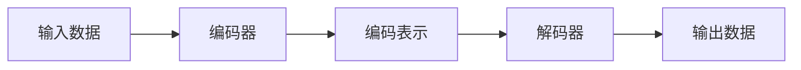
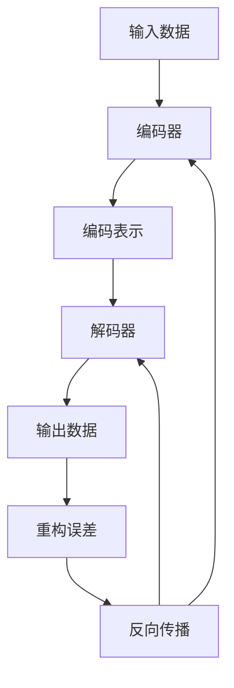

# 自动编码器 (Autoencoder) 原理与代码实例讲解

## 1.背景介绍

### 1.1 什么是自动编码器

自动编码器(Autoencoder)是一种无监督学习的人工神经网络,旨在学习高效的数据编码,使得输入数据可以通过神经网络压缩为低维编码表示,然后再从该编码重构出与原始输入数据尽可能接近的输出。自动编码器广泛应用于降维、特征学习、去噪、生成模型等领域。

### 1.2 自动编码器的发展历程

自动编码器最早可以追溯到上世纪80年代,当时被用于有效地减少网络连接的数量。随着深度学习的兴起,自动编码器获得了新的生命力,成为无监督特征学习和降维的有力工具。近年来,变分自动编码器、去噪自动编码器等新型自动编码器不断涌现,极大丰富了这一领域。

### 1.3 自动编码器的重要性

自动编码器在无监督学习中扮演着重要角色,能够从大量未标记数据中学习出有用的模式和特征表示。这种自动提取特征的能力使其成为处理高维数据的利器,在数据压缩、信息检索、异常检测等领域都有广泛应用。此外,自动编码器也是生成对抗网络、变分自动编码器等许多重要模型的基础组件。

## 2.核心概念与联系

### 2.1 自动编码器的基本结构

自动编码器由两部分组成:编码器(Encoder)和解码器(Decoder)。编码器将高维输入数据压缩为低维编码表示,解码器则尝试从该低维编码重构出原始输入数据。



### 2.2 自动编码器的训练目标

自动编码器的训练目标是最小化输入数据与输出数据之间的重构误差,使得输出数据尽可能接近原始输入。常用的重构误差度量包括均方误差、交叉熵等。

### 2.3 自动编码器与PCA的关系

自动编码器在一定程度上类似于主成分分析(PCA),都能实现数据的降维表示。但自动编码器更加通用和强大,能够学习出非线性的低维表示,而PCA仅限于线性变换。

### 2.4 自动编码器的变体

根据不同的应用场景和需求,自动编码器衍生出了多种变体,例如稀疏自动编码器、去噪自动编码器、变分自动编码器等,用于不同的任务,如降噪、生成模型等。

## 3.核心算法原理具体操作步骤

### 3.1 基本自动编码器的工作原理

1) 输入数据通过编码器映射为低维编码表示
2) 该低维编码表示作为输入传递给解码器
3) 解码器尝试从该编码重构出与原始输入数据尽可能接近的输出
4) 计算输入与输出之间的重构误差,通过反向传播算法优化编码器和解码器的参数,最小化重构误差



### 3.2 自动编码器的训练步骤

1) 初始化编码器和解码器的权重参数
2) 对于每个输入样本:
    a) 通过编码器将输入映射为编码表示
    b) 将编码表示输入解码器,获得重构输出
    c) 计算输入与重构输出之间的重构误差
3) 对所有样本的误差求和,得到总的重构误差
4) 通过反向传播算法计算梯度,更新编码器和解码器的参数以最小化重构误差
5) 重复2-4步骤,直至收敛或达到最大迭代次数

### 3.3 自编码器的正则化技术

为了防止自动编码器简单地学习身份映射,常采用一些正则化技术:

- 添加稀疏性约束,使得编码表示稀疏
- 对编码器的权重矩阵施加约束,如L1/L2正则化
- 对输入数据添加噪声,迫使自动编码器学习有意义的特征

## 4.数学模型和公式详细讲解举例说明

### 4.1 自动编码器的数学表示

设输入数据为 $\boldsymbol{x} \in \mathbb{R}^{d}$,编码器将其映射为编码表示 $\boldsymbol{z} = f(\boldsymbol{x}; \boldsymbol{\theta}_e)$,解码器则从编码表示重构输出 $\boldsymbol{\hat{x}} = g(\boldsymbol{z}; \boldsymbol{\theta}_d)$。

自动编码器的目标是最小化如下重构误差:

$$J(\boldsymbol{\theta}_e, \boldsymbol{\theta}_d) = \frac{1}{N}\sum_{i=1}^{N}L(\boldsymbol{x}^{(i)}, \boldsymbol{\hat{x}}^{(i)})$$

其中 $L$ 为某种损失函数,如均方误差 $L(\boldsymbol{x}, \boldsymbol{\hat{x}}) = \|\boldsymbol{x} - \boldsymbol{\hat{x}}\|_2^2$。$\boldsymbol{\theta}_e$ 和 $\boldsymbol{\theta}_d$ 分别为编码器和解码器的可学习参数。

### 4.2 自动编码器的正则化

为了获得良好的编码表示,常对自动编码器施加额外的正则化约束:

- 稀疏性约束: $\Omega(\boldsymbol{\rho}, \boldsymbol{\hat{\rho}}) = \sum_j\rho\log\frac{\rho}{\hat{\rho}_j} + (1-\rho)\log\frac{1-\rho}{1-\hat{\rho}_j}$
- 权重正则化: $\Omega_w = \lambda\|\boldsymbol{W}\|_p^p$

最终的优化目标是:

$$\min_{\boldsymbol{\theta}_e, \boldsymbol{\theta}_d} J(\boldsymbol{\theta}_e, \boldsymbol{\theta}_d) + \alpha\Omega(\boldsymbol{\rho}, \boldsymbol{\hat{\rho}}) + \beta\Omega_w$$

### 4.3 自动编码器的反向传播

对于给定的输入 $\boldsymbol{x}$,我们可以计算重构输出 $\boldsymbol{\hat{x}}$ 及其关于编码器和解码器参数的梯度:

$$\frac{\partial L}{\partial \boldsymbol{\theta}_d} = \frac{\partial L}{\partial \boldsymbol{\hat{x}}}\frac{\partial \boldsymbol{\hat{x}}}{\partial \boldsymbol{\theta}_d}, \quad \frac{\partial L}{\partial \boldsymbol{\theta}_e} = \frac{\partial L}{\partial \boldsymbol{\hat{x}}}\frac{\partial \boldsymbol{\hat{x}}}{\partial \boldsymbol{z}}\frac{\partial \boldsymbol{z}}{\partial \boldsymbol{\theta}_e}$$

利用这些梯度,我们可以通过随机梯度下降等优化算法来学习编码器和解码器的参数。

### 4.4 示例:用自动编码器进行图像去噪

假设我们有一批加噪的图像数据 $\{\boldsymbol{x}^{(i)}\}$,希望通过自动编码器将它们映射为干净的图像 $\{\boldsymbol{\hat{x}}^{(i)}\}$。我们可以将输入数据 $\boldsymbol{x}$ 看作是干净图像与噪声的叠加:

$$\boldsymbol{x} = \boldsymbol{x}_{clean} + \boldsymbol{noise}$$

自动编码器的目标是从 $\boldsymbol{x}$ 中恢复出 $\boldsymbol{x}_{clean}$,即最小化:

$$\min_{\boldsymbol{\theta}_e, \boldsymbol{\theta}_d} \frac{1}{N}\sum_{i=1}^{N}\|\boldsymbol{x}_{clean}^{(i)} - g(f(\boldsymbol{x}^{(i)}; \boldsymbol{\theta}_e); \boldsymbol{\theta}_d)\|_2^2$$

通过训练,自动编码器将学会从噪声图像中提取出干净图像的特征表示,并能较好地完成图像去噪任务。

## 5.项目实践:代码实例和详细解释说明

以下是使用PyTorch实现一个简单的自动编码器,对MNIST手写数字数据集进行无监督特征学习的代码示例:

```python
import torch
import torch.nn as nn
import torchvision.datasets as dsets

# 定义自动编码器模型
class Autoencoder(nn.Module):
    def __init__(self):
        super(Autoencoder, self).__init__()
        
        # 编码器
        self.encoder = nn.Sequential(
            nn.Linear(28 * 28, 512),
            nn.ReLU(),
            nn.Linear(512, 256),
            nn.ReLU(),
            nn.Linear(256, 128)
        )
        
        # 解码器
        self.decoder = nn.Sequential(
            nn.Linear(128, 256),
            nn.ReLU(),
            nn.Linear(256, 512),
            nn.ReLU(),
            nn.Linear(512, 28 * 28),
            nn.Sigmoid()
        )

    def forward(self, x):
        encoded = self.encoder(x)
        decoded = self.decoder(encoded)
        return decoded

# 加载MNIST数据集
train_dataset = dsets.MNIST(root='./data', train=True, download=True)
test_dataset = dsets.MNIST(root='./data', train=False, download=True)

# 定义数据加载器
train_loader = torch.utils.data.DataLoader(train_dataset, batch_size=128, shuffle=True)
test_loader = torch.utils.data.DataLoader(test_dataset, batch_size=128, shuffle=False)

# 实例化自动编码器模型
model = Autoencoder()

# 定义损失函数和优化器
criterion = nn.MSELoss()
optimizer = torch.optim.Adam(model.parameters(), lr=0.001)

# 训练模型
num_epochs = 20
for epoch in range(num_epochs):
    train_loss = 0.0
    for data in train_loader:
        inputs, _ = data
        inputs = inputs.view(-1, 28 * 28)
        inputs = inputs.to(torch.float32)
        
        outputs = model(inputs)
        loss = criterion(outputs, inputs)
        
        optimizer.zero_grad()
        loss.backward()
        optimizer.step()
        
        train_loss += loss.item() * inputs.size(0)
        
    train_loss = train_loss / len(train_loader.dataset)
    print(f'Epoch: {epoch+1}, Train Loss: {train_loss:.6f}')
```

代码解释:

1. 定义自动编码器模型,包括编码器和解码器两部分,编码器将28x28的MNIST图像压缩为128维编码,解码器则从该编码重构出28x28的图像。
2. 加载MNIST数据集,并定义数据加载器。
3. 实例化自动编码器模型,定义均方误差损失函数和Adam优化器。
4. 训练模型20个epoch,在每个epoch中,将输入图像馈送给自动编码器,计算重构输出与原始输入之间的均方误差损失,并通过反向传播更新模型参数。
5. 打印每个epoch的训练损失。

通过上述代码,我们可以在MNIST数据集上训练一个自动编码器模型,学习到手写数字图像的低维编码表示。这种无监督学习到的特征表示可用于下游的分类、聚类等任务。

## 6.实际应用场景

自动编码器由于其强大的特征学习能力,在许多领域都有广泛的应用:

### 6.1 数据压缩

利用自动编码器可以将高维数据压缩为低维编码,从而实现高效的数据压缩和存储。这种压缩方式相比传统的无损压缩算法更加紧凑,同时也保留了数据的主要特征。

### 6.2 异常检测

在训练自动编码器时,我们希望它能够精确地重构正常的输入数据。因此,对于异常数据,自动编码器将难以生成良好的重构,重构误差会相对较大。基于这一原理,我们可以利用自动编码器对异常数据进行检测。

### 6.3 去噪

自动编码器能够从嘈杂的输入数据中提取出干净的特征表示,因此可以用于图像、语音等信号的去噪任务。这种基于学习的去噪方法往往比传统的滤波方法效果更好。