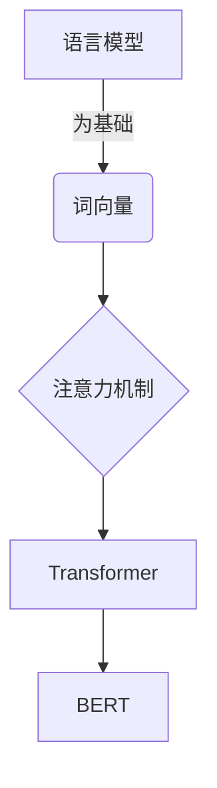

# 自然语言处理NLP原理与代码实例讲解

## 1.背景介绍

自然语言处理(Natural Language Processing, NLP)是人工智能领域的一个重要分支,旨在使计算机能够理解和生成人类自然语言。随着大数据时代的到来和深度学习技术的飞速发展,NLP已经渗透到我们生活的方方面面,比如智能语音助手、机器翻译、客户服务机器人、文本分类和情感分析等。

NLP技术的核心挑战在于自然语言的复杂性和多义性。与计算机语言不同,人类语言往往包含许多歧义、隐喻、俗语和上下文依赖性。因此,NLP需要综合运用多种技术,包括语言学、统计学、机器学习和深度学习等,才能够有效地处理自然语言。

## 2.核心概念与联系

在深入探讨NLP的算法和模型之前,我们先来了解一些核心概念和它们之间的联系:

### 2.1 语言模型(Language Model)

语言模型是NLP中一个基础概念,它用于计算一个句子或词序列出现的概率。语言模型广泛应用于机器翻译、语音识别、文本生成等任务中。常见的语言模型包括N-gram模型、神经网络语言模型等。

### 2.2 词向量(Word Embedding)

词向量是将词映射到一个连续的向量空间中,使得语义相似的词在向量空间中彼此靠近。词向量技术解决了传统one-hot编码的维度灾难问题,是深度学习在NLP领域取得突破性进展的关键因素之一。常见的词向量模型包括Word2Vec、GloVe等。

### 2.3 注意力机制(Attention Mechanism)

注意力机制是深度学习模型中一种重要机制,它允许模型在处理序列数据时,对不同位置的输入数据赋予不同的权重,从而更好地捕捉长距离依赖关系。注意力机制在机器翻译、阅读理解等任务中发挥着重要作用。

### 2.4 transformer

Transformer是一种全新的基于注意力机制的序列到序列模型,它完全摒弃了传统的RNN和CNN结构,使用多头自注意力机制来捕捉输入和输出之间的长距离依赖关系。Transformer模型在机器翻译、语言模型等任务中表现出色,是目前NLP领域的主流模型之一。

### 2.5 BERT

BERT(Bidirectional Encoder Representations from Transformers)是一种基于Transformer的预训练语言模型,它通过在大规模无标注语料库上预训练,学习到了丰富的语义和语法知识。BERT模型在下游NLP任务中表现出色,成为了NLP领域的里程碑式模型。

### 2.6 关系图

上述核心概念之间的关系可以用下面的流程图来概括:



## 3.核心算法原理具体操作步骤

接下来,我们将详细介绍NLP中几种核心算法的原理和具体操作步骤。

### 3.1 Word2Vec

Word2Vec是一种高效的词向量训练算法,包括CBOW(连续词袋)和Skip-gram两种模型。它们的目标是根据上下文词来预测目标词(CBOW)或根据目标词来预测上下文词(Skip-gram)。

Word2Vec算法的具体步骤如下:

1. 构建训练语料库,对语料库进行分词和预处理。
2. 初始化词向量矩阵,每个词对应一个随机向量。
3. 对于每个目标词窗口(CBOW)或目标词(Skip-gram),根据上下文词或目标词,预测目标词或上下文词。
4. 使用负采样或层序Softmax等技术加速训练。
5. 根据预测误差,使用随机梯度下降算法更新词向量矩阵。
6. 重复3-5步,直到收敛。

Word2Vec算法的优点是高效、可扩展,缺点是无法处理词以外的语义信息(如词性、语法等)。

### 3.2 BERT

BERT是一种基于Transformer的预训练语言模型,它的核心思想是通过在大规模无标注语料库上进行预训练,学习通用的语义和语法知识,然后将这些知识迁移到下游NLP任务中进行微调。

BERT预训练的具体步骤如下:

1. 构建大规模无标注语料库,对语料库进行分词和预处理。
2. 使用Masked LM和Next Sentence Prediction两个预训练任务。
3. 初始化BERT模型参数,包括Transformer编码器、词向量矩阵等。
4. 对每个输入序列,执行Masked LM和Next Sentence Prediction任务。
5. 根据预测误差,使用随机梯度下降算法更新BERT模型参数。
6. 重复4-5步,直到收敛。

BERT微调的步骤如下:

1. 加载预训练好的BERT模型参数。
2. 根据下游任务构造训练数据。
3. 在训练数据上微调BERT模型参数。
4. 在测试数据上评估模型性能。

BERT的优点是能够捕捉到丰富的上下文信息,缺点是计算开销较大。

### 3.3 序列到序列模型(Seq2Seq)

序列到序列模型是机器翻译、文本摘要等任务中常用的模型框架。它由编码器(Encoder)和解码器(Decoder)两部分组成,编码器将源序列编码为上下文向量,解码器根据上下文向量生成目标序列。

序列到序列模型的训练步骤如下:

1. 构建并预处理训练数据,包括源序列和目标序列。
2. 初始化编码器和解码器参数。
3. 对每个训练样本:
    - 编码器读入源序列,生成上下文向量。
    - 解码器根据上下文向量和前缀(前一时间步的输出),生成当前时间步的输出。
    - 计算当前时间步的损失函数。
4. 根据损失函数,使用随机梯度下降算法更新编码器和解码器参数。
5. 重复3-4步,直到收敛。

序列到序列模型的推理步骤如下:

1. 编码器读入源序列,生成上下文向量。
2. 解码器根据上下文向量和起始符号,生成第一个输出词。
3. 将第一个输出词作为前缀,生成第二个输出词,如此重复,直到生成终止符号。

常见的序列到序列模型包括基于RNN的模型(如LSTM)和基于Transformer的模型。

## 4.数学模型和公式详细讲解举例说明

在NLP中,数学模型和公式扮演着重要角色,让我们来详细讲解几个核心模型的数学原理。

### 4.1 N-gram语言模型

N-gram语言模型是基于统计学原理的语言模型,它的核心思想是根据前n-1个词来预测第n个词的概率。

对于一个长度为m的句子$S=\{w_1,w_2,...,w_m\}$,它的概率可以根据链式法则计算:

$$P(S)=\prod_{i=1}^{m}P(w_i|w_1,...,w_{i-1})$$

由于计算复杂度过高,N-gram模型通常使用马尔可夫假设,即一个词的概率只与前n-1个词相关:

$$P(w_i|w_1,...,w_{i-1})\approx P(w_i|w_{i-n+1},...,w_{i-1})$$

因此,句子概率可以近似为:

$$P(S)\approx\prod_{i=1}^{m}P(w_i|w_{i-n+1},...,w_{i-1})$$

N-gram模型的参数可以通过最大似然估计从训练语料库中学习得到。

### 4.2 Word2Vec

Word2Vec中的CBOW模型和Skip-gram模型都是基于神经网络的模型,它们的目标是最大化目标词和上下文词之间的条件概率。

对于CBOW模型,给定上下文词$Context(w)$,我们需要最大化目标词$w$的条件概率:

$$\max_{θ}\prod_{w\in Corpus}P(w|Context(w);θ)$$

其中,$θ$是模型参数,包括词向量矩阵和神经网络权重。

对于Skip-gram模型,给定目标词$w$,我们需要最大化上下文词$c$的条件概率:

$$\max_{θ}\prod_{w\in Corpus}\prod_{c\in Context(w)}P(c|w;θ)$$

上述优化目标通常使用负采样或层序Softmax等技术进行近似,从而加速训练过程。

### 4.3 Transformer

Transformer模型中的核心机制是自注意力(Self-Attention),它能够捕捉输入序列中任意两个位置之间的依赖关系。

给定一个长度为n的输入序列$X=\{x_1,x_2,...,x_n\}$,自注意力机制首先计算Query、Key和Value矩阵:

$$\begin{aligned}
Q&=XW^Q\\
K&=XW^K\\
V&=XW^V
\end{aligned}$$

其中,$W^Q,W^K,W^V$是可学习的权重矩阵。

然后,计算注意力权重矩阵:

$$Attention(Q,K,V)=softmax(\frac{QK^T}{\sqrt{d_k}})V$$

其中,$d_k$是缩放因子,用于防止内积过大导致的梯度饱和问题。

最后,将注意力权重矩阵与输入序列进行加权求和,得到自注意力的输出:

$$Attention(X)=Attention(Q,K,V)$$

多头自注意力(Multi-Head Attention)是将多个注意力头的输出进行拼接,从而捕捉不同的依赖关系:

$$MultiHead(Q,K,V)=Concat(head_1,...,head_h)W^O$$

其中,$head_i=Attention(QW_i^Q,KW_i^K,VW_i^V)$。

通过自注意力机制,Transformer能够有效地捕捉长距离依赖关系,从而在机器翻译等序列到序列任务中取得优异表现。

## 5.项目实践:代码实例和详细解释说明

为了帮助读者更好地理解NLP中的核心算法,我们提供了一些代码实例,并进行了详细的解释说明。这些代码实例使用Python和PyTorch框架实现。

### 5.1 Word2Vec实现

```python
import torch
import torch.nn as nn
import torch.optim as optim

# 定义Word2Vec模型
class Word2Vec(nn.Module):
    def __init__(self, vocab_size, embedding_dim):
        super(Word2Vec, self).__init__()
        self.embeddings = nn.Embedding(vocab_size, embedding_dim)
        self.linear1 = nn.Linear(embedding_dim, 128)
        self.linear2 = nn.Linear(128, vocab_size)

    def forward(self, inputs):
        embeds = self.embeddings(inputs)
        embeds = embeds.mean(dim=1)  # 对上下文词向量求平均
        out = self.linear1(embeds)
        out = torch.relu(out)
        out = self.linear2(out)
        log_probs = nn.functional.log_softmax(out, dim=1)
        return log_probs

# 训练Word2Vec模型
def train(model, data, epochs, lr):
    optimizer = optim.Adam(model.parameters(), lr=lr)
    for epoch in range(epochs):
        total_loss = 0
        for context, target in data:
            log_probs = model(context)
            loss = nn.functional.nll_loss(log_probs, target)
            optimizer.zero_grad()
            loss.backward()
            optimizer.step()
            total_loss += loss.item()
        print(f"Epoch {epoch+1}, Loss: {total_loss/len(data)}")
```

在上面的代码中,我们首先定义了Word2Vec模型,它包括一个嵌入层(Embedding)和两个全连接层。嵌入层将输入的词映射到词向量空间,然后对上下文词向量求平均,并通过两个全连接层预测目标词。

`train`函数实现了Word2Vec模型的训练过程。对于每个训练样本(上下文词和目标词),我们计算模型的预测概率,并使用负对数似然损失函数(NLL Loss)进行优化。

需要注意的是,上面的代码只是一个简化版本,实际应用中还需要考虑负采样、子采样等技术,以及更复杂的模型结构。

### 5.2 BERT实现

```python
import torch
import transformers

# 加载预训练BERT模型