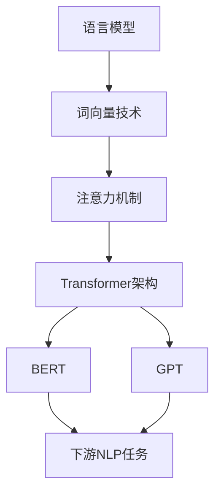

# 自然语言处理NLP原理与代码实例讲解

## 1.背景介绍

自然语言处理(Natural Language Processing, NLP)是人工智能领域的一个重要分支,旨在使计算机能够理解和生成人类语言。随着大数据时代的到来,以及深度学习算法的不断发展,NLP技术在各个领域得到了广泛应用,如机器翻译、智能问答系统、情感分析、自动文摘等。

NLP技术的发展历程可以追溯到20世纪50年代,最初的研究主要集中在基于规则的方法上。随后,统计自然语言处理方法开始流行,利用大规模语料库和机器学习算法来建模语言。进入21世纪后,随着深度学习技术的兴起,NLP领域取得了突破性进展,各种基于神经网络的模型不断问世,显著提高了语言理解和生成的性能。

## 2.核心概念与联系

在深入探讨NLP原理和代码实现之前,我们需要了解一些核心概念:

1. **语言模型(Language Model, LM)**: 语言模型是NLP的基础,它描述了一种语言中单词序列出现的概率分布。语言模型广泛应用于机器翻译、语音识别、文本生成等任务中。

2. **词向量(Word Embedding)**: 词向量是将单词映射到连续的向量空间中的一种技术,使得语义相似的单词在向量空间中彼此靠近。词向量是深度学习在NLP领域取得突破性进展的关键因素之一。

3. **注意力机制(Attention Mechanism)**: 注意力机制允许模型在处理序列数据时,动态地关注输入序列的不同部分,从而提高模型的性能。它在机器翻译、阅读理解等任务中发挥着重要作用。

4. **transformer**: Transformer是一种全新的基于注意力机制的序列到序列模型架构,它不依赖于循环神经网络(RNN)和卷积神经网络(CNN),在机器翻译、文本生成等任务中表现出色。

5. **BERT**: BERT(Bidirectional Encoder Representations from Transformers)是一种基于Transformer的预训练语言模型,它通过大规模无监督预训练,学习到了丰富的语义信息,在多个下游NLP任务中取得了state-of-the-art的性能。

6. **GPT**: GPT(Generative Pre-trained Transformer)是另一种基于Transformer的预训练语言模型,专注于生成式任务,如文本生成、机器翻译等。GPT-3是其最新版本,拥有惊人的175亿参数,展现出强大的语言生成能力。

上述概念相互关联、环环相扣,共同推动着NLP技术的发展。语言模型为NLP任务奠定了基础,词向量技术使得模型能够捕捉单词的语义信息,注意力机制赋予了模型动态关注能力,而Transformer和BERT等新型模型架构则在多个任务中取得了卓越表现。

## 3.核心算法原理具体操作步骤

### 3.1 语言模型

语言模型的目标是估计一个句子或文本序列的概率。形式化地,给定一个长度为n的单词序列$w_1, w_2, ..., w_n$,语言模型需要计算该序列的概率:

$$P(w_1, w_2, ..., w_n)$$

根据链式法则,上式可以分解为:

$$P(w_1, w_2, ..., w_n) = \prod_{i=1}^{n}P(w_i|w_1, ..., w_{i-1})$$

也就是说,我们需要计算每个单词在给定前面单词序列的条件概率。

统计语言模型通过从大规模语料库中统计n-gram计数来估计上述条件概率。例如,对于三元模型(n=3),我们有:

$$P(w_i|w_1, ..., w_{i-1}) \approx P(w_i|w_{i-2}, w_{i-1})$$

神经网络语言模型则通过训练神经网络来直接对条件概率建模。常见的神经网络语言模型包括基于RNN的模型(如LSTM语言模型)和基于Transformer的模型(如GPT)。

### 3.2 词向量

传统的one-hot表示将每个单词编码为一个高维稀疏向量,缺乏语义信息。词向量技术则将单词映射到一个低维连续的向量空间中,使得语义相似的单词在向量空间中彼此靠近。

词向量可以通过神经网络模型从大规模语料库中学习得到,常见的模型包括Word2Vec、GloVe等。以Word2Vec的CBOW模型为例,其目标是最大化给定上下文单词时,预测正确目标单词的概率:

$$\max_{\theta} \frac{1}{T}\sum_{t=1}^{T}\log P(w_t|context(w_t); \theta)$$

其中$\theta$为模型参数,包括词向量和神经网络权重;$context(w_t)$为单词$w_t$的上下文单词集合。

通过梯度下降优化上述目标函数,可以同时学习得到词向量和神经网络参数。学习到的词向量能够很好地捕捉单词的语义信息,从而为下游NLP任务提供有用的表示。

### 3.3 注意力机制

注意力机制最初被提出用于机器翻译任务,它允许模型在生成每个目标单词时,动态地关注输入序列的不同部分。

具体来说,给定一个长度为m的输入序列$\boldsymbol{x} = (x_1, x_2, ..., x_m)$和一个长度为n的输出序列$\boldsymbol{y} = (y_1, y_2, ..., y_n)$,在生成第i个输出单词$y_i$时,注意力机制首先计算一个注意力分布$\boldsymbol{\alpha}_i$:

$$\alpha_{i,j} = \frac{\exp(e_{i,j})}{\sum_{k=1}^{m}\exp(e_{i,k})}, \quad e_{i,j} = a(s_i, h_j)$$

其中$s_i$是解码器在时间步i的隐状态,$h_j$是编码器在时间步j的隐状态,函数$a$计算两个向量的相关性分数。

然后,注意力机制根据注意力分布$\boldsymbol{\alpha}_i$对编码器隐状态进行加权求和,得到一个注意力向量$c_i$:

$$c_i = \sum_{j=1}^{m}\alpha_{i,j}h_j$$

最后,解码器将注意力向量$c_i$和其隐状态$s_i$结合,预测输出单词$y_i$的概率分布:

$$P(y_i|y_1, ..., y_{i-1}, \boldsymbol{x}) = f(y_i, s_i, c_i)$$

其中$f$是一个非线性函数,通常为前馈神经网络或者简单的仿射变换。

注意力机制赋予了序列到序列模型动态关注输入的能力,大大提高了模型的表现。它不仅在机器翻译任务中发挥着关键作用,在其他NLP任务中也得到了广泛应用。

### 3.4 Transformer

Transformer是一种全新的基于注意力机制的序列到序列模型架构,它完全放弃了RNN和CNN,纯粹基于注意力机制对输入序列进行编码和解码。

Transformer的编码器由多个相同的层组成,每一层包括两个子层:多头自注意力机制和前馈神经网络。解码器的结构与编码器类似,不过它插入了一个额外的注意力子层,用于关注编码器的输出。

多头自注意力机制允许模型同时关注输入序列的不同表示子空间,它可以被形式化为:

$$\text{MultiHead}(Q, K, V) = \text{Concat}(head_1, ..., head_h)W^O$$
$$\text{where } head_i = \text{Attention}(QW_i^Q, KW_i^K, VW_i^V)$$

其中$Q$、$K$、$V$分别为查询(Query)、键(Key)和值(Value)矩阵,它们通过线性变换得到;$W_i^Q$、$W_i^K$、$W_i^V$是可学习的权重矩阵;$W^O$是另一个可学习的权重矩阵,用于将多个注意力头合并。

Transformer通过堆叠多个编码器层和解码器层,能够有效地捕获输入序列的长程依赖关系,并生成高质量的输出序列。它在机器翻译、文本生成等任务中表现出色,成为NLP领域的里程碑式模型。

### 3.5 BERT

BERT(Bidirectional Encoder Representations from Transformers)是一种基于Transformer的预训练语言模型,它通过大规模无监督预训练,学习到了丰富的语义信息,在多个下游NLP任务中取得了state-of-the-art的性能。

BERT的预训练过程包括两个任务:

1. **遮蔽语言模型(Masked Language Model, MLM)**: 随机遮蔽输入序列中的一些单词,要求模型预测这些被遮蔽单词。这个任务允许BERT双向地捕获上下文信息。

2. **下一句预测(Next Sentence Prediction, NSP)**: 判断两个句子是否相邻,用于捕获句子之间的关系。

通过上述两个预训练任务,BERT学习到了丰富的语义表示,可以广泛应用于下游NLP任务,如文本分类、阅读理解、命名实体识别等。只需在BERT的基础上添加一个输出层,并进行少量的任务特定微调,即可获得出色的性能。

BERT的出现极大地推动了NLP技术的发展,它的变体和后续工作层出不穷,如RoBERTa、ALBERT、XLNet等。这些模型在预训练数据、模型结构、训练策略等方面进行了改进,进一步提高了性能。

## 4.数学模型和公式详细讲解举例说明

在自然语言处理中,数学模型和公式扮演着重要的角色,它们为NLP任务提供了理论基础和计算框架。本节将详细讲解一些常见的数学模型和公式,并给出具体的例子说明。

### 4.1 n-gram语言模型

n-gram语言模型是统计自然语言处理中最基本的模型之一。它根据n-1个前导词来预测当前词的概率,可以形式化为:

$$P(w_i|w_1, ..., w_{i-1}) \approx P(w_i|w_{i-n+1}, ..., w_{i-1})$$

其中,n是n-gram的阶数。例如,当n=3时,我们有三元语言模型:

$$P(w_i|w_1, ..., w_{i-1}) \approx P(w_i|w_{i-2}, w_{i-1})$$

n-gram模型的优点是简单和高效,但它也存在一些缺陷,如数据稀疏问题和难以捕捉长程依赖关系。

为了估计n-gram概率,我们可以使用最大似然估计(Maximum Likelihood Estimation, MLE):

$$P(w_i|w_{i-n+1}, ..., w_{i-1}) = \frac{C(w_{i-n+1}, ..., w_i)}{C(w_{i-n+1}, ..., w_{i-1})}$$

其中,C(·)表示n-gram计数。

例如,给定语料库"the cat sat on the mat"和"the dog chased the cat",我们可以估计三元语言模型中的一些概率:

- $P(cat|the, \_ \_ \_ \_ \_ \_ \_ \_ \_ \_ \_ \_ \_ \_ \_ \_ \_ \_ \_ \_ \_ \_ \_ \_ \_ \_ \_ \_ \_ \_ \_ \_ \_ \_ \_ \_ \_ \_ \_ \_ \_ \_ \_ \_ \_ \_ \_ \_ \_ \_ \_ \_ \_ \_ \_ \_ \_ \_ \_ \_ \_ \_ \_ \_ \_ \_ \_ \_ \_ \_ \_ \_ \_ \_ \_ \_ \_ \_ \_ \_ \_ \_ \_ \_ \_ \_ \_ \_ \_ \_ \_ \_ \_ \_ \_ \_ \_ \_ \_ \_ \_ \_ \_ \_ \_ \_ \_ \_ \_ \_ \_ \_ \_ \_ \_ \_ \_ \_ \_ \_ \_ \_ \_ \_ \_ \_ \_ \_ \_ \_ \_ \_ \_ \_ \_ \_ \_ \_ \_