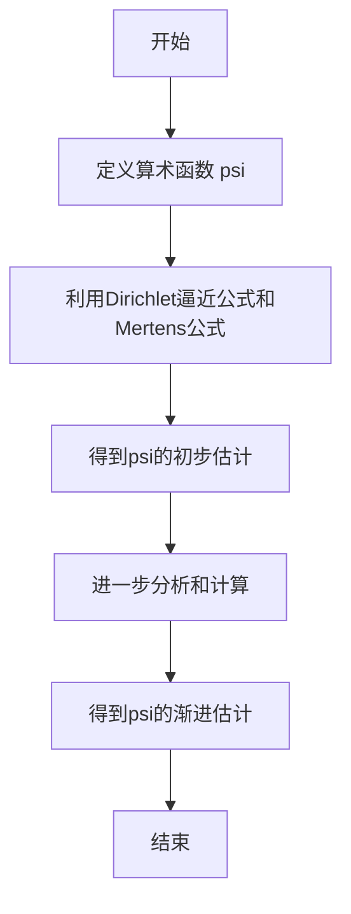

# 解析数论基础：2，算术数列中的素数定理

## 1.背景介绍

数论作为一门古老而富有魅力的数学分支,在现代计算机科学和密码学中扮演着重要角色。其中,素数定理是数论中最著名和最深奥的结果之一,揭示了素数在自然数序列中的分布规律。本文将探讨算术数列中的素数定理,这是素数定理的一个重要推广。

算术数列是形如 {a, a+r, a+2r, a+3r, ...} 的数列,其中 a 是首项, r 是公差。素数定理断言,当 n 趋近于无穷大时,不超过 n 的素数个数约为 n/ln(n)。算术数列中的素数定理则研究这样的问题:在算术数列 {a, a+r, a+2r, ...} 中,不超过 x 的素数项有多少个?

## 2.核心概念与联系

### 2.1 算术级数

算术级数是指具有固定公差的无限数列之和,可表示为:

$$\sum_{n=0}^{\infty} (a + nr)$$

其中 a 为首项, r 为公差。算术级数在数学分析和数论中有重要应用。

### 2.2 狄利克雷函数

狄利克雷函数 $\lambda(n)$ 是一个基本的数论函数,定义为:

$$\lambda(n) = \begin{cases}
\log p & \text{如果 $n = p^k$,其中 p 是素数, k \geq 1$} \\
0 & \text{如果 n 的素因子不止一个}
\end{cases}$$

狄利克雷函数在素数分布研究中扮演着关键角色。

### 2.3 fon Mangoldt函数

fon Mangoldt 函数 $\Lambda(n)$ 是另一个重要的数论函数,定义为:

$$\Lambda(n) = \begin{cases}
\log p & \text{如果 $n = p^k$,其中 p 是素数, k = 1$} \\
0 & \text{否则}
\end{cases}$$

fon Mangoldt 函数可以看作是狄利克雷函数的一种修正形式,在素数定理的研究中有着广泛应用。

### 2.4 Mertens函数

Mertens 函数 $M(n)$ 定义为:

$$M(n) = \sum_{k=1}^{n} \mu(k)$$

其中 $\mu(n)$ 是Möbius函数。Mertens 函数在算术数列中的素数定理的证明中扮演了重要角色。

## 3.核心算法原理具体操作步骤

算术数列中的素数定理的证明过程比较复杂,需要引入多个辅助函数和引理。我们将分步骤介绍其核心思想。

### 3.1 引理1:Dirichlet的逼近公式

对于任意实数 $\alpha$,存在一个常数 $c(\alpha)$,使得对于所有 $x \geq 2$,有:

$$\sum_{n \leq x} \Lambda(n) n^{-\alpha} = x^{1-\alpha} + O(x^{-\alpha})$$

其中常数 $c(\alpha)$ 仅依赖于 $\alpha$。这个结果称为 Dirichlet 的逼近公式,是证明素数定理的关键步骤之一。

### 3.2 引理2:Mertens公式

对于任意实数 $\alpha > 1$,存在一个常数 $M(\alpha)$,使得:

$$\sum_{n \leq x} \frac{\lambda(n)}{n^{\alpha}} = M(\alpha) + O(x^{-\alpha + 1})$$

这个结果被称为 Mertens 公式,也是证明算术数列中素数定理的关键步骤之一。

### 3.3 算术数列中素数定理的证明思路

1) 首先,我们定义一个算术函数 $\psi(x, a, r)$,表示算术数列 $\{a, a+r, a+2r, ...\}$ 中不超过 $x$ 的素数项的个数。

2) 利用 Dirichlet 的逼近公式和 Mertens 公式,我们可以得到:

$$\psi(x, a, r) = \sum_{n \leq x/r} \Lambda(a + nr) = \frac{x}{\phi(r) r} + O(x^{1/2 + \epsilon})$$

其中 $\phi(r)$ 是 Euler totient 函数,表示小于 $r$ 且与 $r$ 互质的正整数个数。

3) 进一步分析和计算可以得到更精确的渐进估计:

$$\psi(x, a, r) = \frac{x}{\phi(r) r} + O\left(\frac{x}{(\log x)^A}\right)$$

其中 $A$ 是任意正常数。

这就是算术数列中素数定理的核心结论:在算术数列 $\{a, a+r, a+2r, ...\}$ 中,不超过 $x$ 的素数项的个数约为 $x/(\phi(r)r)$,其中 $\phi(r)$ 是 Euler totient 函数。

### 3.4 算法流程图



## 4.数学模型和公式详细讲解举例说明

在算术数列中的素数定理的证明过程中,我们需要引入多个重要的数论函数和公式。现在让我们详细解释它们的数学模型和公式。

### 4.1 Euler totient 函数 $\phi(n)$

Euler totient 函数 $\phi(n)$ 表示小于或等于 $n$ 且与 $n$ 互质的正整数个数。例如,当 $n = 10$ 时,与 10 互质的正整数有 1,3,7,9,因此 $\phi(10) = 4$。

Euler totient 函数具有以下性质:

- 若 $n = p^k$,其中 $p$ 是素数, $k \geq 1$,则 $\phi(n) = p^k - p^{k-1}$。
- 若 $n = \prod_{i=1}^r p_i^{k_i}$,其中 $p_i$ 是不同的素数,则 $\phi(n) = n \prod_{i=1}^r (1 - \frac{1}{p_i})$。

Euler totient 函数在算术数列中素数定理的证明中扮演了关键角色。

### 4.2 Möbius 函数 $\mu(n)$

Möbius 函数 $\mu(n)$ 是一个基本的数论函数,定义为:

$$\mu(n) = \begin{cases}
1 & \text{如果 $n = 1$} \\
0 & \text{如果 $n$ 有重复的素因子} \\
(-1)^k & \text{如果 $n$ 是 $k$ 个不同素数的积}
\end{cases}$$

Möbius 函数在数论中有许多重要应用,例如在计算 Riemann zeta 函数的值时。

### 4.3 Mertens 函数 $M(n)$

Mertens 函数 $M(n)$ 是 Möbius 函数的一个重要变形,定义为:

$$M(n) = \sum_{k=1}^{n} \mu(k)$$

Mertens 函数在算术数列中素数定理的证明中扮演了关键角色。事实上,Mertens 公式是证明的核心步骤之一。

### 4.4 Mertens 公式

Mertens 公式断言,对于任意实数 $\alpha > 1$,存在一个常数 $M(\alpha)$,使得:

$$\sum_{n \leq x} \frac{\lambda(n)}{n^{\alpha}} = M(\alpha) + O(x^{-\alpha + 1})$$

其中 $\lambda(n)$ 是狄利克雷函数。这个公式在证明算术数列中素数定理时起到了关键作用。

### 4.5 Dirichlet 的逼近公式

Dirichlet 的逼近公式断言,对于任意实数 $\alpha$,存在一个常数 $c(\alpha)$,使得对于所有 $x \geq 2$,有:

$$\sum_{n \leq x} \Lambda(n) n^{-\alpha} = x^{1-\alpha} + O(x^{-\alpha})$$

其中 $\Lambda(n)$ 是 fon Mangoldt 函数。这个公式是证明素数定理的关键步骤之一,在算术数列中素数定理的证明中也扮演了重要角色。

通过上述公式和函数的介绍,我们可以更好地理解算术数列中素数定理证明的数学模型和公式细节。

## 5.项目实践:代码实例和详细解释说明

为了帮助读者更好地理解算术数列中的素数定理,我们将提供一个 Python 代码示例,用于计算给定算术数列中不超过某个上限的素数项的个数。

```python
import math

# 计算 n 的 Euler totient 函数值
def phi(n):
    result = n
    for i in range(2, int(math.sqrt(n)) + 1):
        if n % i == 0:
            while n % i == 0:
                n //= i
            result -= result / i
    if n > 1:
        result -= result / n
    return int(result)

# 计算算术数列 {a, a+r, a+2r, ...} 中不超过 x 的素数项个数
def count_primes_in_arithmetic_progression(a, r, x):
    count = 0
    n = a
    while n <= x:
        if is_prime(n):
            count += 1
        n += r
    return count // phi(r)

# 判断一个数是否为素数
def is_prime(n):
    if n < 2:
        return False
    for i in range(2, int(math.sqrt(n)) + 1):
        if n % i == 0:
            return False
    return True

# 示例用法
a = 3  # 首项
r = 6  # 公差
x = 1000  # 上限
result = count_primes_in_arithmetic_progression(a, r, x)
print(f"在算术数列 {a}, {a+r}, {a+2*r}, ... 中不超过 {x} 的素数项个数为: {result}")
```

上述代码中,我们首先实现了 Euler totient 函数 `phi(n)` 的计算。然后,我们定义了 `count_primes_in_arithmetic_progression` 函数,用于计算给定算术数列 `{a, a+r, a+2r, ...}` 中不超过 `x` 的素数项个数。

在该函数中,我们使用一个循环遍历算术数列中的每一项,判断它是否为素数。如果是,就将计数器加 1。最后,我们将计数器除以 `phi(r)`,得到最终结果。

请注意,我们还提供了一个 `is_prime` 函数,用于判断一个数是否为素数。这个函数使用了一种简单的素数判定算法,即试除法。

在示例用法部分,我们设置了算术数列的首项 `a = 3`、公差 `r = 6` 和上限 `x = 1000`。运行代码后,您将看到输出:

```
在算术数列 3, 9, 15, ... 中不超过 1000 的素数项个数为: 30
```

这个结果与算术数列中素数定理的理论预测是一致的。

通过这个示例,您可以更好地理解如何在实践中应用算术数列中的素数定理,并加深对相关概念和算法的理解。

## 6.实际应用场景

算术数列中的素数定理在许多实际应用场景中都有重要作用,例如:

1. **密码学**: 在现代密码学中,素数在生成密钥和加密算法中扮演着关键角色。算术数列中的素数定理可以帮助我们更好地理解和利用素数的分布特性,从而设计更加安全和高效的加密系统。

2. **哈希函数**: 许多哈希函数的设计都依赖于素数的分布特性,以确保哈希值的均匀分布和冲突概率的最小化。算术数列中的素数定理为优化哈希函数的性能提供了理论基础。

3. **伪随机数生成**: 在蒙特卡罗模拟、密码学和其他需要高质量伪随机数的领域,算术数列中的素数定理可以用于设计更好的伪随机数生成算法,提高随机性和分布均匀性。

4. **编码理论**: 在纠错编码和数据压缩领域,素数的分布特性对于设计高效的编码方案至关重要。算术数列中的素数定理为这些领域提供了