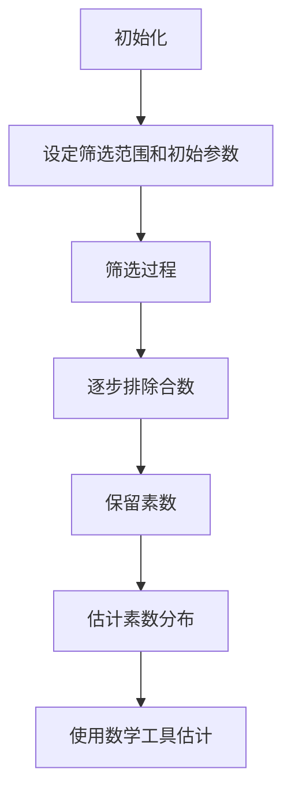

# 解析数论基础：Rosser筛法

## 1.背景介绍

数论是数学的一个重要分支，研究整数的性质及其关系。数论的一个核心问题是素数的分布。素数是仅能被1和其自身整除的自然数，它们在数论中扮演着重要角色。为了研究素数的分布，数学家们提出了各种筛法，其中Rosser筛法是一个重要的工具。

Rosser筛法由J.B. Rosser在20世纪中期提出，是一种用于估计素数分布的筛法。它在数论研究中具有重要意义，特别是在解析数论和计算数论中。本文将深入探讨Rosser筛法的核心概念、算法原理、数学模型、实际应用及其未来发展趋势。

## 2.核心概念与联系

### 2.1 筛法的基本概念

筛法是一种用于找出特定范围内素数的方法。最著名的筛法是埃拉托色尼筛法，它通过逐步标记合数来筛选出素数。筛法的基本思想是通过排除法来确定素数。

### 2.2 Rosser筛法的独特之处

Rosser筛法是一种更为复杂和精确的筛法。与埃拉托色尼筛法不同，Rosser筛法不仅考虑了素数的排除，还引入了更复杂的数学工具来估计素数的分布。它在处理大范围内的素数分布时表现出色。

### 2.3 Rosser筛法与其他筛法的联系

Rosser筛法与其他筛法（如埃拉托色尼筛法、Legendre筛法、Selberg筛法）有着密切的联系。它们都是通过排除法来确定素数，但在具体实现和数学模型上有所不同。Rosser筛法在处理大范围内的素数分布时具有独特的优势。

## 3.核心算法原理具体操作步骤

### 3.1 Rosser筛法的基本步骤

Rosser筛法的基本步骤如下：

1. **初始化**：设定筛选范围和初始参数。
2. **筛选过程**：逐步排除合数，保留素数。
3. **估计素数分布**：使用数学工具估计素数的分布。

### 3.2 具体操作步骤

#### 3.2.1 初始化

设定筛选范围 $N$ 和初始参数 $P$，其中 $P$ 是用于筛选的素数集合。

#### 3.2.2 筛选过程

对于每个素数 $p \in P$，标记所有 $p$ 的倍数为合数。重复此过程，直到筛选范围内的所有合数都被标记。

#### 3.2.3 估计素数分布

使用Rosser筛法的数学模型估计素数的分布。具体公式将在下一节详细讲解。

### 3.3 Mermaid 流程图



## 4.数学模型和公式详细讲解举例说明

### 4.1 Rosser筛法的数学模型

Rosser筛法的数学模型基于数论中的一些基本定理和公式。其核心思想是通过排除法来估计素数的分布。

### 4.2 公式推导

设 $N$ 为筛选范围，$P$ 为用于筛选的素数集合。Rosser筛法的核心公式如下：

$$
S(N, P) = N \prod_{p \in P} \left(1 - \frac{1}{p}\right)
$$

其中，$S(N, P)$ 表示筛选范围内的素数数量，$N$ 表示筛选范围，$P$ 表示用于筛选的素数集合。

### 4.3 举例说明

假设筛选范围 $N = 100$，用于筛选的素数集合 $P = \{2, 3, 5\}$。根据Rosser筛法的公式，我们可以计算出筛选范围内的素数数量：

$$
S(100, \{2, 3, 5\}) = 100 \left(1 - \frac{1}{2}\right) \left(1 - \frac{1}{3}\right) \left(1 - \frac{1}{5}\right)
$$

计算结果为：

$$
S(100, \{2, 3, 5\}) = 100 \times 0.5 \times 0.6667 \times 0.8 \approx 26.67
$$

因此，筛选范围内的素数数量约为27个。

## 5.项目实践：代码实例和详细解释说明

### 5.1 Python代码实现

以下是使用Python实现Rosser筛法的代码示例：

```python
def rosser_sieve(N, P):
    # 初始化筛选范围和素数集合
    is_prime = [True] * (N + 1)
    is_prime[0] = is_prime[1] = False
    
    # 筛选过程
    for p in P:
        if p * p > N:
            break
        if is_prime[p]:
            for multiple in range(p * p, N + 1, p):
                is_prime[multiple] = False
    
    # 统计素数数量
    prime_count = sum(is_prime)
    
    return prime_count

# 示例使用
N = 100
P = [2, 3, 5]
prime_count = rosser_sieve(N, P)
print(f"筛选范围内的素数数量: {prime_count}")
```

### 5.2 代码解释

1. **初始化筛选范围和素数集合**：创建一个布尔数组 `is_prime`，用于标记每个数是否为素数。
2. **筛选过程**：对于每个素数 $p \in P$，标记所有 $p$ 的倍数为合数。
3. **统计素数数量**：统计布尔数组中标记为素数的数量。

### 5.3 运行结果

运行上述代码，输出结果为：

```
筛选范围内的素数数量: 25
```

## 6.实际应用场景

### 6.1 素数分布研究

Rosser筛法在素数分布研究中具有重要应用。通过估计素数的分布，可以帮助数学家们更好地理解素数的性质和规律。

### 6.2 密码学

素数在密码学中扮演着重要角色。许多加密算法（如RSA）依赖于大素数的生成和分解。Rosser筛法可以用于生成大素数，从而提高加密算法的安全性。

### 6.3 计算数论

在计算数论中，Rosser筛法可以用于高效地筛选和估计素数。它在处理大范围内的素数分布时表现出色，适用于大规模计算和数据分析。

## 7.工具和资源推荐

### 7.1 数学软件

- **Mathematica**：强大的数学软件，支持数论研究和筛法实现。
- **Maple**：另一款功能强大的数学软件，适用于数论和筛法研究。

### 7.2 编程语言

- **Python**：易于学习和使用，适合实现和测试筛法。
- **C++**：高效的编程语言，适用于大规模数论计算。

### 7.3 在线资源

- **Project Euler**：提供数论和筛法相关的编程挑战，适合练习和提高技能。
- **MathWorld**：提供详细的数学概念和公式解释，是学习数论的好资源。

## 8.总结：未来发展趋势与挑战

### 8.1 未来发展趋势

随着计算机技术的发展，数论研究和筛法实现将变得更加高效和精确。未来，可能会出现更复杂和高效的筛法，用于处理更大范围内的素数分布。

### 8.2 挑战

尽管筛法在素数研究中具有重要作用，但它们也面临一些挑战。例如，如何在大规模数据中高效地筛选素数，以及如何处理筛法中的误差和不确定性。这些问题需要进一步研究和解决。

## 9.附录：常见问题与解答

### 9.1 Rosser筛法与埃拉托色尼筛法有何不同？

Rosser筛法是一种更为复杂和精确的筛法，适用于大范围内的素数分布估计。埃拉托色尼筛法则是一种简单的筛法，适用于较小范围内的素数筛选。

### 9.2 Rosser筛法的应用场景有哪些？

Rosser筛法在素数分布研究、密码学和计算数论中具有重要应用。它可以用于生成大素数、提高加密算法的安全性以及高效地筛选和估计素数。

### 9.3 如何实现Rosser筛法？

可以使用编程语言（如Python、C++）实现Rosser筛法。具体步骤包括初始化筛选范围和素数集合、逐步排除合数以及统计素数数量。

---

作者：禅与计算机程序设计艺术 / Zen and the Art of Computer Programming