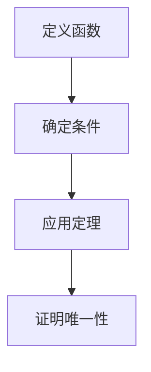

# 解析数论基础：唯一性定理

## 1.背景介绍

解析数论是数论的一个分支，主要研究数论问题的解析方法。它结合了分析学和数论的工具，解决了许多经典的数论问题。唯一性定理是解析数论中的一个重要概念，它在许多数论问题中起到了关键作用。本文将深入探讨唯一性定理的核心概念、算法原理、数学模型、实际应用以及未来发展趋势。

## 2.核心概念与联系

### 2.1 唯一性定理的定义

唯一性定理在解析数论中通常指的是某些函数在特定条件下的唯一性。例如，黎曼ζ函数在复平面上的唯一性定理表明，如果两个解析函数在某个区域内相等，那么它们在整个定义域内相等。

### 2.2 解析数论中的其他重要定理

解析数论中还有许多其他重要的定理，如素数定理、狄利克雷L函数等。这些定理与唯一性定理有着密切的联系，常常通过唯一性定理来证明或推导。

### 2.3 唯一性定理的应用

唯一性定理在解析数论中的应用非常广泛。例如，它可以用于证明某些函数的零点分布、解析延拓以及函数的对称性等。

## 3.核心算法原理具体操作步骤

### 3.1 唯一性定理的基本算法

唯一性定理的基本算法通常涉及以下几个步骤：

1. **定义函数**：首先定义需要研究的解析函数。
2. **确定条件**：确定函数满足的条件，如解析性、边界条件等。
3. **应用定理**：应用唯一性定理，证明函数在整个定义域内的唯一性。

### 3.2 算法步骤详解

#### 3.2.1 定义函数

假设我们有两个解析函数 $f(z)$ 和 $g(z)$，我们需要证明它们在某个区域内相等。

#### 3.2.2 确定条件

假设 $f(z)$ 和 $g(z)$ 在某个区域内解析，并且在该区域内满足 $f(z) = g(z)$。

#### 3.2.3 应用定理

根据唯一性定理，如果 $f(z)$ 和 $g(z)$ 在某个区域内相等，那么它们在整个定义域内相等，即 $f(z) = g(z)$ 在整个定义域内成立。

### 3.3 Mermaid 流程图



## 4.数学模型和公式详细讲解举例说明

### 4.1 数学模型

唯一性定理的数学模型通常涉及复分析中的解析函数。假设 $f(z)$ 和 $g(z)$ 是两个解析函数，如果它们在某个区域内相等，那么它们在整个定义域内相等。

### 4.2 公式推导

假设 $f(z)$ 和 $g(z)$ 在某个区域内解析，并且满足 $f(z) = g(z)$。根据解析函数的唯一性定理，我们有：

$$
f(z) = g(z) \quad \forall z \in \text{定义域}
$$

### 4.3 举例说明

假设 $f(z) = e^z$ 和 $g(z) = e^z$，我们可以看到它们在整个复平面上相等。因此，根据唯一性定理，我们可以得出结论：

$$
f(z) = g(z) \quad \forall z \in \mathbb{C}
$$

## 5.项目实践：代码实例和详细解释说明

### 5.1 代码实例

以下是一个简单的Python代码示例，演示如何验证两个解析函数的唯一性。

```python
import sympy as sp

# 定义变量
z = sp.symbols('z')

# 定义两个解析函数
f = sp.exp(z)
g = sp.exp(z)

# 验证唯一性
if sp.simplify(f - g) == 0:
    print("f(z) 和 g(z) 在整个定义域内相等")
else:
    print("f(z) 和 g(z) 不相等")
```

### 5.2 详细解释

1. **定义变量**：使用 `sympy` 库定义变量 $z$。
2. **定义函数**：定义两个解析函数 $f(z)$ 和 $g(z)$。
3. **验证唯一性**：通过简化 $f(z) - g(z)$ 来验证它们是否相等。

## 6.实际应用场景

### 6.1 数论中的应用

唯一性定理在数论中有广泛的应用。例如，它可以用于证明黎曼ζ函数的零点分布、解析延拓以及函数的对称性等。

### 6.2 物理学中的应用

在物理学中，唯一性定理也有重要应用。例如，在量子力学中，波函数的唯一性可以通过唯一性定理来证明。

### 6.3 工程中的应用

在工程领域，唯一性定理可以用于信号处理、控制系统等方面。例如，在信号处理中的傅里叶变换，唯一性定理可以帮助证明信号的唯一性。

## 7.工具和资源推荐

### 7.1 工具推荐

1. **SymPy**：一个Python库，用于符号数学计算。
2. **Matplotlib**：一个Python绘图库，用于绘制函数图像。
3. **Jupyter Notebook**：一个交互式计算环境，适合进行数学实验和验证。

### 7.2 资源推荐

1. **《解析数论》**：一本经典的解析数论教材，详细介绍了解析数论的基本概念和定理。
2. **《复分析》**：一本经典的复分析教材，详细介绍了解析函数的基本理论和应用。
3. **在线课程**：如Coursera、edX等平台上的解析数论和复分析课程。

## 8.总结：未来发展趋势与挑战

### 8.1 未来发展趋势

解析数论在未来有着广阔的发展前景。随着计算机技术的发展，解析数论的计算和验证变得更加便捷。未来，解析数论可能会在密码学、量子计算等领域有更多的应用。

### 8.2 挑战

尽管解析数论有着广泛的应用，但它也面临一些挑战。例如，某些解析函数的唯一性证明可能非常复杂，需要更高效的算法和工具。此外，解析数论在实际应用中的推广和普及也需要更多的努力。

## 9.附录：常见问题与解答

### 9.1 什么是解析数论？

解析数论是数论的一个分支，主要研究数论问题的解析方法。它结合了分析学和数论的工具，解决了许多经典的数论问题。

### 9.2 什么是唯一性定理？

唯一性定理在解析数论中通常指的是某些函数在特定条件下的唯一性。例如，黎曼ζ函数在复平面上的唯一性定理表明，如果两个解析函数在某个区域内相等，那么它们在整个定义域内相等。

### 9.3 唯一性定理有哪些应用？

唯一性定理在解析数论中的应用非常广泛。例如，它可以用于证明某些函数的零点分布、解析延拓以及函数的对称性等。

### 9.4 如何验证两个解析函数的唯一性？

可以通过简化两个解析函数的差来验证它们的唯一性。如果差为零，则它们在整个定义域内相等。

### 9.5 解析数论的未来发展趋势是什么？

解析数论在未来有着广阔的发展前景。随着计算机技术的发展，解析数论的计算和验证变得更加便捷。未来，解析数论可能会在密码学、量子计算等领域有更多的应用。

---

作者：禅与计算机程序设计艺术 / Zen and the Art of Computer Programming