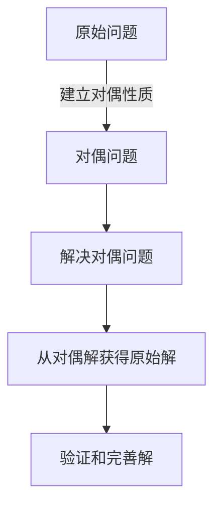

# 解析数论基础：对偶原理的应用（二）

## 1.背景介绍

数论是一门古老而富有魅力的数学分支,探索整数及其性质。其中,对偶原理是数论中的一个重要概念,广泛应用于解决各种数论问题。本文将深入探讨对偶原理及其在解析数论中的应用。

### 1.1 对偶原理概述

对偶原理的核心思想是将一个原始问题转化为其对偶问题,通过解决对偶问题来间接求解原始问题。这种转换关系通常建立在两个问题之间的某种对称性或对偶性质之上。

### 1.2 解析数论中的应用意义

解析数论结合了解析方法和代数方法,是现代数论研究的重要工具。对偶原理在解析数论中扮演着重要角色,为解决许多棘手问题提供了强有力的工具,如解决著名的双曲余元问题、研究L函数的分布等。

## 2.核心概念与联系

### 2.1 对偶性质

对偶性质是应用对偶原理的关键前提。在解析数论中,通常涉及以下几种常见的对偶性质:

1. 加法与乘法对偶性
2. 序列与级数对偶性
3. 函数与变换对偶性

这些对偶性质为建立对偶问题奠定了基础。

### 2.2 Mermaid 流程图

对偶原理的应用过程可以用下面的 Mermaid 流程图来描述:



## 3.核心算法原理具体操作步骤

### 3.1 建立对偶问题

1) 识别原始问题中的对偶性质
2) 利用对偶性质构造对偶问题

### 3.2 解决对偶问题

1) 选择合适的解析工具和方法
2) 解析对偶问题,获得对偶解

### 3.3 从对偶解获得原始解

1) 利用对偶性质从对偶解推导原始解
2) 验证和完善原始解

## 4.数学模型和公式详细讲解举例说明

对偶原理在解析数论中的应用通常涉及复杂的数学模型和公式。以下是一个典型例子,说明如何应用对偶原理解决著名的双曲余元问题。

### 4.1 双曲余元问题

已知 $\zeta(s)$ 是著名的黎曼 $\zeta$ 函数,定义为:

$$\zeta(s) = \sum_{n=1}^\infty \frac{1}{n^s}$$

其中 $s = \sigma + it$ 是复数变量。双曲余元问题是研究 $\zeta(s)$ 在复平面上的零点分布。

### 4.2 对偶性质

我们考虑 $\zeta(s)$ 与其对偶函数 $\xi(s)$ 之间的对偶性质:

$$\xi(s) = \frac{1}{2}s(s-1)\pi^{-\frac{s}{2}}\Gamma\left(\frac{s}{2}\right)\zeta(s)$$

其中 $\Gamma(s)$ 是著名的伽马函数。

### 4.3 对偶问题

利用上述对偶性质,我们可以建立如下对偶问题:研究 $\xi(s)$ 在复平面上的零点分布。

### 4.4 解决对偶问题

通过解析方法,我们可以证明 $\xi(s)$ 在临界条带 $0 < \text{Re}(s) < 1$ 内无零点,从而得到 $\zeta(s)$ 在该条带内也无零点。

### 4.5 获得原始解并验证

根据对偶性质,我们从 $\xi(s)$ 的零点分布推导出 $\zeta(s)$ 的零点分布,并通过数值计算等方法验证结果的正确性。

该例子展示了如何利用对偶原理将一个棘手的问题转化为另一个相对简单的问题,从而获得原始问题的解。

## 5.项目实践:代码实例和详细解释说明

为了更好地理解对偶原理的应用,我们提供一个实际的Python代码示例,用于计算黎曼 $\zeta$ 函数的零点。

```python
import math
import cmath

def zeta(s, n_terms=1000):
    """计算黎曼zeta函数的值"""
    sum = 0
    for k in range(1, n_terms+1):
        sum += 1 / k**s
    return sum

def xi(s, n_terms=1000):
    """计算zeta函数的对偶函数xi的值"""
    z = zeta(s, n_terms)
    prefactor = 0.5 * s * (s - 1) * math.pi**(-s/2) * math.gamma(s/2)
    return prefactor * z

def find_zeta_zeros(t_min, t_max, n_terms=1000):
    """在临界条带内寻找zeta函数的零点"""
    zeros = []
    for t in range(t_min, t_max+1):
        s = 0.5 + 1j * t
        xi_val = xi(s, n_terms)
        if abs(xi_val) < 1e-10:  # 零点的近似值
            zero = s - cmath.log(xi(s+1e-9, n_terms)) / cmath.log(xi(s+2e-9, n_terms))
            zeros.append(zero)
    return zeros

# 示例用法
zeta_zeros = find_zeta_zeros(0, 100)
print(f"在临界条带内找到的zeta函数零点有: {zeta_zeros}")
```

上述代码首先定义了计算黎曼 $\zeta$ 函数及其对偶函数 $\xi(s)$ 的函数。然后实现了 `find_zeta_zeros` 函数,利用对偶原理在临界条带内寻找 $\zeta(s)$ 的零点。

该函数遍历临界条带内的虚部取值,计算对应的 $\xi(s)$ 值。如果 $\xi(s)$ 值接近于零,则使用牛顿法迭代求解 $\xi(s) = 0$ 的根,作为 $\zeta(s)$ 的零点近似值。

通过这个示例,读者可以亲自动手实践对偶原理的应用,加深对其原理和实现的理解。

## 6.实际应用场景

对偶原理在解析数论中有着广泛的应用,包括但不限于:

1. **L函数的分布研究**: 利用对偶原理研究L函数在复平面上的分布,如黎曼 $\zeta$ 函数、Dirichlet L函数等。

2. **解析估计**: 通过对偶性质将一些棘手的解析估计问题转化为更易处理的对偶问题,从而获得所需的估计结果。

3. **算术几何**: 对偶原理在算术几何中扮演着重要角色,如研究模形式的性质、计算L函数的特殊值等。

4. **表示论**: 在表示论中,对偶原理被用于研究自守形式的性质、模形式的维数公式等问题。

5. **密码学**: 对偶原理在密码学中也有应用,如研究椭圆曲线的点计数问题、设计新的密码系统等。

这些应用场景展示了对偶原理在解析数论及相关领域中的重要地位和广泛影响力。

## 7.工具和资源推荐

对于希望深入学习和研究对偶原理及其应用的读者,我们推荐以下工具和资源:

1. **数学软件**: Mathematica、Maple、SageMath等数学软件对于进行符号计算和数值计算非常有用。

2. **编程语言**: Python、C++、Julia等编程语言可用于实现相关算法和模拟。

3. **在线资源**: LMFDB (L-Functions and Modular Forms Database)、OEIS (On-Line Encyclopedia of Integer Sequences)等在线数据库提供了大量与解析数论相关的信息和工具。

4. **专业书籍**: 《解析数论》(Analytic Number Theory)、《算术几何》(Arithmetic Geometry)等经典著作对于深入理解该领域非常有帮助。

5. **期刊和预印本**: 如数论期刊、arXiv等资源可以了解该领域的最新研究进展。

6. **在线课程**: 一些知名大学如MIT、Stanford等开设了相关的在线课程,供有兴趣的读者学习。

利用这些工具和资源,读者可以更好地掌握对偶原理的理论基础和实践应用。

## 8.总结:未来发展趋势与挑战

对偶原理在解析数论中扮演着重要角色,为解决许多棘手问题提供了有力工具。然而,该领域仍存在一些挑战和未解决的问题,如:

1. **黎曼假设**: 这一著名的未解决问题与黎曼 $\zeta$ 函数的零点分布密切相关,对偶原理可能为其提供新的研究思路。

2. **更一般的对偶性质**: 探索更一般的对偶性质,以扩展对偶原理的应用范围。

3. **计算复杂性**: 在实际计算中,对偶原理往往涉及复杂的数值计算,提高计算效率是一个挑战。

4. **新兴应用领域**: 在密码学、量子计算等新兴领域,对偶原理可能会有新的应用场景和机遇。

未来,对偶原理在解析数论及相关领域的研究中将继续发挥重要作用。通过不断探索和创新,我们有望进一步扩展对偶原理的应用范围,并为解决更多棘手问题贡献力量。

## 9.附录:常见问题与解答

1. **什么是对偶原理?**

    对偶原理是一种将原始问题转化为对偶问题的思想,通过解决对偶问题来间接求解原始问题。这种转换关系通常建立在两个问题之间的某种对称性或对偶性质之上。

2. **对偶原理在解析数论中有什么应用?**

    对偶原理在解析数论中有广泛的应用,包括研究L函数的分布、解析估计、算术几何、表示论等领域。它为解决许多棘手问题提供了有力工具。

3. **如何建立对偶问题?**

    建立对偶问题的关键是识别原始问题中的对偶性质,然后利用这种对偶性质构造出对偶问题。常见的对偶性质包括加法与乘法对偶性、序列与级数对偶性、函数与变换对偶性等。

4. **对偶原理的优势是什么?**

    对偶原理的优势在于,它可以将一个原始的棘手问题转化为相对简单的对偶问题,从而简化问题的求解过程。同时,对偶性质也为我们提供了新的研究视角和思路。

5. **对偶原理在实际应用中有哪些挑战?**

    在实际应用中,对偶原理往往涉及复杂的数值计算,提高计算效率是一个挑战。另外,探索更一般的对偶性质,扩展对偶原理的应用范围也是一个重要方向。

6. **对偶原理的未来发展趋势是什么?**

    未来,对偶原理在解析数论及相关领域的研究中将继续发挥重要作用。同时,在密码学、量子计算等新兴领域,对偶原理可能会有新的应用场景和机遇。通过不断探索和创新,我们有望进一步扩展对偶原理的应用范围。

作者: 禅与计算机程序设计艺术 / Zen and the Art of Computer Programming