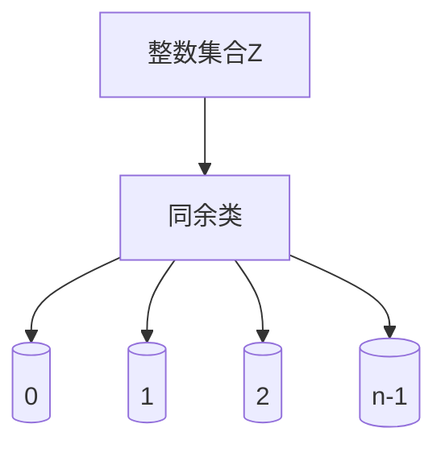

# 解析数论基础：(x)的表示式

## 1.背景介绍

数论是一门研究整数性质的古老数学分支。它涉及整数之间的关系、整数的表示方式以及整数在不同数学领域中的应用。在数论中,有一个基本概念叫做"(x)"的表示式,它广泛应用于密码学、计算机科学和其他领域。本文将深入探讨(x)的表示式的基础知识、原理和应用。

## 2.核心概念与联系

### 2.1 (x)的定义

(x)表示式是一种特殊的数学记号,用于表示"x除以n的余数"。其中,n是一个正整数,称为模数。具体来说,如果将x除以n,得到的商为q,余数为r,那么(x)的值就是r。用数学符号表示为:

$$
(x) = x - n\lfloor\frac{x}{n}\rfloor
$$

其中$\lfloor\frac{x}{n}\rfloor$表示将$\frac{x}{n}$的值向下取整。

### 2.2 同余的概念

(x)的表示式与同余的概念密切相关。如果两个整数x和y除以同一个正整数n所得的余数相同,那么我们说x和y关于模n同余,记作:

$$
x \equiv y \pmod{n}
$$

这里的$\pmod{n}$读作"模n"。同余关系具有传递性,即如果$x \equiv y \pmod{n}$且$y \equiv z \pmod{n}$,那么$x \equiv z \pmod{n}$。

### 2.3 同余类

对于任意一个正整数n,整数集合Z可以被划分为n个不相交的同余类,每个同余类由所有与某个特定整数k模n同余的整数组成。这些同余类通常记作[k]$_n$,其中k是同余类中的一个代表元素。



## 3.核心算法原理具体操作步骤

### 3.1 计算(x)的步骤

要计算(x)的值,可以按照以下步骤进行:

1. 将x除以n,得到商q和余数r
2. (x)的值就是r

用数学表达式表示为:

$$
(x) = x - n\lfloor\frac{x}{n}\rfloor
$$

其中$\lfloor\frac{x}{n}\rfloor$表示将$\frac{x}{n}$的值向下取整。

例如,计算(17)模7:

1. 17除以7,商为2,余数为3
2. 因此,(17)模7的值为3

### 3.2 同余运算

同余关系具有一些基本运算性质,这些性质对于理解和应用(x)的表示式非常重要。

1. 加法同余律:如果$a \equiv b \pmod{n}$且$c \equiv d \pmod{n}$,那么$a+c \equiv b+d \pmod{n}$。
2. 乘法同余律:如果$a \equiv b \pmod{n}$且$c \equiv d \pmod{n}$,那么$ac \equiv bd \pmod{n}$。
3. 幂同余律:如果$a \equiv b \pmod{n}$,那么对于任意非负整数k,有$a^k \equiv b^k \pmod{n}$。

这些同余运算规则为(x)的表示式在各种数学领域中的应用奠定了基础。

## 4.数学模型和公式详细讲解举例说明

### 4.1 欧拉判别准则

欧拉判别准则是一个重要的同余理论,它可以用来判断一个数是否为完全平方数。

定理:设n为一个正奇整数,如果存在一个整数x,使得$x^2 \equiv -1 \pmod{n}$,那么n就不是完全平方数。反之,如果对于任意整数x,都有$x^2 \not\equiv -1 \pmod{n}$,那么n就是一个完全平方数。

证明:

假设n是一个完全平方数,即$n=a^2$,其中a是一个正整数。对于任意整数x,我们有:

$$
x^2 \equiv (x+a)^2 - 2ax \pmod{n}
$$

由于$n=a^2$,所以$(x+a)^2 - 2ax$一定是n的倍数,因此$x^2$关于模n同余于0。这就说明如果n是完全平方数,那么对于任意整数x,都有$x^2 \not\equiv -1 \pmod{n}$。

反之,如果存在一个整数x,使得$x^2 \equiv -1 \pmod{n}$,那么n就不可能是完全平方数。因为如果n是完全平方数,那么根据上面的推导,对于任意整数x,都有$x^2 \not\equiv -1 \pmod{n}$,这与假设矛盾。

例如,对于n=21,我们可以找到一个整数x=4,使得$4^2 \equiv 16 \equiv -1 \pmod{21}$,因此根据欧拉判别准则,21不是完全平方数。

### 4.2 威尔逊定理

威尔逊定理是一个重要的同余定理,它给出了一个判断一个正整数n是否是素数的必要条件。

定理:设n是一个正整数,大于1。如果$(n-1)! \equiv -1 \pmod{n}$,那么n是一个素数。反之,如果$(n-1)! \not\equiv -1 \pmod{n}$,那么n就不是素数。

其中,$(n-1)!$表示阶乘,即$(n-1)! = 1 \times 2 \times 3 \times \cdots \times (n-1)$。

证明:

我们先证明,如果n是一个素数,那么$(n-1)! \equiv -1 \pmod{n}$。

由于n是素数,所以对于任意$1 \leq k \leq n-1$,k和n是互质的。根据欧拉定理,对于任意与n互质的整数a,我们有$a^{n-1} \equiv 1 \pmod{n}$。

将上式两边同乘以a,得到$a^n \equiv a \pmod{n}$。

将所有$1 \leq k \leq n-1$的上式相乘,可得:

$$
\begin{aligned}
1^n \times 2^n \times 3^n \times \cdots \times (n-1)^n &\equiv 1 \times 2 \times 3 \times \cdots \times (n-1) \pmod{n} \\
(n-1)! &\equiv (-1)^{n-1} \pmod{n}
\end{aligned}
$$

由于n是一个大于1的正整数,所以$(-1)^{n-1}$的值只能是1或-1。如果n是奇数,那么$(-1)^{n-1} = -1$;如果n是偶数,那么根据上面的推导过程,n就不可能是素数。因此,如果n是素数,那么$(n-1)! \equiv -1 \pmod{n}$。

反之,如果$(n-1)! \not\equiv -1 \pmod{n}$,那么根据上面的证明过程,n就不可能是素数。

威尔逊定理为判断一个大整数是否是素数提供了一个有效的方法,尽管在实际应用中,它的计算效率并不是很高。

## 5.项目实践:代码实例和详细解释说明

下面是一个Python代码示例,用于计算(x)的值和判断两个整数是否同余:

```python
def modulo(x, n):
    """
    计算(x)模n的值
    """
    return x - n * (x // n)

def is_congruent(x, y, n):
    """
    判断x和y是否关于模n同余
    """
    return modulo(x, n) == modulo(y, n)

# 示例用法
print(modulo(17, 7))  # 输出: 3
print(is_congruent(17, 24, 7))  # 输出: True
```

解释:

1. `modulo(x, n)`函数实现了计算(x)模n的算法。它首先使用整数除法`x // n`计算x除以n的商,然后将商乘以n,再从x中减去,得到的结果就是(x)模n的值。

2. `is_congruent(x, y, n)`函数用于判断x和y是否关于模n同余。它首先分别计算(x)模n和(y)模n的值,如果这两个值相等,则返回True,表示x和y同余;否则返回False,表示不同余。

3. 示例用法部分展示了如何使用这两个函数。第一个示例计算(17)模7的值,输出结果为3。第二个示例判断17和24是否关于模7同余,输出结果为True,因为(17)模7和(24)模7的值都是3。

这个代码示例体现了(x)的表示式在实际编程中的应用,可以作为学习和理解该概念的起点。

## 6.实际应用场景

(x)的表示式在许多领域都有重要应用,下面列举了一些典型的应用场景:

### 6.1 密码学

在密码学中,(x)的表示式被广泛应用于各种加密算法,如RSA加密、ElGamal加密等。这些加密算法通常涉及大整数的模运算,而(x)的表示式正是实现这些运算的基础。

### 6.2 哈希函数

许多哈希函数的设计都与(x)的表示式有关。例如,著名的MD5和SHA系列哈希函数都使用了模运算作为其核心组成部分。

### 6.3 伪随机数生成

在计算机科学中,生成高质量的伪随机数序列是一个重要问题。许多伪随机数生成器的设计都涉及到(x)的表示式和模运算。

### 6.4 编码理论

在编码理论中,同余关系被广泛应用于纠错码的设计和实现。例如,著名的Reed-Solomon码就是基于有限域上的多项式运算,而有限域的构造正是依赖于模运算和同余关系。

### 6.5 数论计算

(x)的表示式是数论计算的基础工具之一。许多数论问题,如整数分解、同余方程求解等,都需要使用(x)的表示式和同余运算。

## 7.工具和资源推荐

如果你希望进一步学习和探索(x)的表示式及其应用,以下是一些推荐的工具和资源:

### 7.1 数学软件

- MATLAB: 这个流行的数值计算软件包含了强大的符号计算能力,可以方便地进行同余运算和数论计算。
- Mathematica: 作为一款专业的符号计算软件,Mathematica提供了丰富的数论函数和工具,适合进行高级数论研究。
- SageMath: 这是一款开源的数学软件系统,集成了许多数论算法和库,可以用于教学和研究。

### 7.2 在线工具

- Wolfram Alpha: 这个在线计算引擎可以解答各种数学问题,包括同余运算和数论计算。
- NumberTheory.org: 这个网站提供了一系列在线工具,用于进行同余运算、素数测试等数论计算。

### 7.3 教程和书籍

- "An Introduction to the Theory of Numbers" by G.H. Hardy and E.M. Wright: 这本经典著作是数论入门的绝佳读物,内容全面且深入浅出。
- "Elementary Number Theory" by David M. Burton: 另一本优秀的数论教材,适合本科生和研究生学习。
- "A Course in Number Theory and Cryptography" by Neal Koblitz: 这本书将数论与密码学紧密结合,是学习密码学应用的理想选择。

## 8.总结:未来发展趋势与挑战

(x)的表示式是数论和计算机科学中的一个基础概念,它在密码学、编码理论、随机数生成等领域都有重要应用。随着科技的发展,这一概念的应用前景也将不断扩展。

未来,我们可以预期(x)的表示式在以下几个方向上会有进一步的发展:

1. **量子计算**:随着量子计算技术的不断进步,一些经典的加密算法可能会面临被破解的风险。因此,需要设计新的基于(x)的表示式和同余运算的量子密码系统,以确保数据的安全性。

2. **后量子密码学**:与量子计算相关,后量子密码学是一个新兴的研究领域,旨在开发能够抵御量子计算机攻击的加密算法。在这一领域中,(x)的表示式和同余运算将扮演重要角色。

3. **区块链技术**:区块链技术依赖于密码学原理