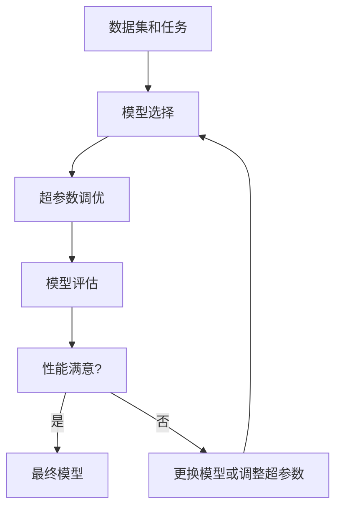

# 超参数调优与模型选择原理与代码实战案例讲解

## 1.背景介绍

在机器学习和深度学习领域中,超参数调优和模型选择是两个至关重要的环节。它们对模型的性能和泛化能力有着深远的影响。然而,由于缺乏系统的理论指导,这两个过程往往需要大量的实践经验和反复试验。本文将深入探讨超参数调优和模型选择的原理和实践,并提供具体的代码示例,帮助读者更好地理解和掌握这些关键技术。

### 1.1 什么是超参数?

超参数(Hyperparameter)是在模型训练之前需要人为设置的参数,它们不是通过模型训练来学习得到的。常见的超参数包括:

- 学习率(Learning Rate)
- 正则化强度(Regularization Strength)
- 批量大小(Batch Size)
- 网络层数和神经元数量(Network Architecture)
- 优化器类型(Optimizer Type)

合理的超参数设置对模型性能有着至关重要的影响。然而,由于缺乏理论指导,通常需要通过大量的实验来探索不同的超参数组合。

### 1.2 什么是模型选择?

模型选择是指从多个备选模型中选择最优模型的过程。在机器学习中,常见的模型包括:

- 线性回归
- 逻辑回归
- 决策树
- 支持向量机(SVM)
- 神经网络

不同的模型具有不同的优缺点,适用于不同的问题场景。模型选择的目标是找到在特定数据集和任务上表现最佳的模型。

## 2.核心概念与联系

超参数调优和模型选择虽然是两个独立的过程,但它们之间存在着密切的联系。

首先,在模型选择过程中,每个备选模型都需要进行超参数调优,以确保模型发挥出最佳性能。不同的模型可能需要调优的超参数不同,因此超参数调优是模型选择的重要前提。

其次,超参数调优过程中,我们可能会发现某些模型在任何超参数设置下都无法取得理想的性能。这种情况下,我们就需要考虑更换模型,从而进入模型选择的环节。

因此,超参数调优和模型选择是一个互相促进、相辅相成的过程。它们共同构成了机器学习模型优化的核心环节。



## 3.核心算法原理具体操作步骤

### 3.1 超参数调优算法

超参数调优算法主要分为三大类:网格搜索(Grid Search)、随机搜索(Random Search)和基于模型的搜索(Model-based Search)。

#### 3.1.1 网格搜索(Grid Search)

网格搜索是最简单也是最常用的超参数调优算法。它的工作原理是:

1. 首先定义一个超参数空间,即每个超参数的取值范围。
2. 构造一个笛卡尔积,列举出所有可能的超参数组合。
3. 对每个超参数组合,训练一个模型,并评估其性能。
4. 选择性能最佳的超参数组合作为最终结果。

网格搜索的优点是简单、易于实现,缺点是计算量较大,尤其是当超参数空间较大时。

#### 3.1.2 随机搜索(Random Search)

随机搜索是对网格搜索的改进。它的工作原理是:

1. 首先定义一个超参数空间,即每个超参数的取值范围。
2. 在超参数空间中随机采样一定数量的超参数组合。
3. 对每个超参数组合,训练一个模型,并评估其性能。
4. 选择性能最佳的超参数组合作为最终结果。

相比网格搜索,随机搜索的计算量更小,但它也存在一个缺点:由于是随机采样,可能会错过一些重要的超参数组合。

#### 3.1.3 基于模型的搜索(Model-based Search)

基于模型的搜索算法是最新的一类超参数调优算法,它们利用机器学习模型来预测不同超参数组合对应的模型性能,从而加速搜索过程。常见的基于模型的搜索算法包括:

- 贝叶斯优化(Bayesian Optimization)
- 超参数优化器(Hyperopt)
- SMAC(Sequential Model-based Algorithm Configuration)

这些算法通常比网格搜索和随机搜索更加高效,但它们也更加复杂,需要一定的机器学习背景知识。

### 3.2 模型选择算法

模型选择算法主要分为三大类:holdout、交叉验证(Cross-Validation)和bootstrapping。

#### 3.2.1 holdout

holdout是最简单的模型选择算法,它的工作原理是:

1. 将数据集划分为训练集和测试集。
2. 在训练集上训练多个备选模型。
3. 在测试集上评估每个模型的性能。
4. 选择在测试集上表现最佳的模型作为最终结果。

holdout的优点是简单、计算量小,缺点是结果受数据划分方式的影响较大。

#### 3.2.2 交叉验证(Cross-Validation)

交叉验证是一种更加稳健的模型选择算法,它的工作原理是:

1. 将数据集划分为k个子集(通常k=5或k=10)。
2. 对于每个子集:
   - 将该子集作为测试集,其余k-1个子集作为训练集。
   - 在训练集上训练多个备选模型。
   - 在测试集上评估每个模型的性能。
3. 计算每个模型在k次迭代中的平均性能。
4. 选择平均性能最佳的模型作为最终结果。

交叉验证的优点是结果更加稳健,不受数据划分方式的影响,缺点是计算量较大。

#### 3.2.3 bootstrapping

bootstrapping是另一种常用的模型选择算法,它的工作原理是:

1. 从原始数据集中有放回地抽取n个样本,构成一个新的训练集。
2. 在新的训练集上训练多个备选模型。
3. 在未被抽取的样本(称为out-of-bag样本)上评估每个模型的性能。
4. 重复步骤1-3多次,计算每个模型的平均性能。
5. 选择平均性能最佳的模型作为最终结果。

bootstrapping的优点是可以估计模型的泛化误差,缺点是计算量较大,并且存在一定的偏差。

## 4.数学模型和公式详细讲解举例说明

在超参数调优和模型选择过程中,我们需要评估模型的性能。常用的性能指标包括:

- 对于回归问题:均方根误差(RMSE)、平均绝对误差(MAE)等。
- 对于分类问题:准确率(Accuracy)、精确率(Precision)、召回率(Recall)、F1分数等。

### 4.1 均方根误差(RMSE)

均方根误差(Root Mean Squared Error, RMSE)是评估回归模型性能的常用指标,它反映了预测值与真实值之间的偏差程度。RMSE的计算公式如下:

$$RMSE = \sqrt{\frac{1}{n}\sum_{i=1}^{n}(y_i - \hat{y}_i)^2}$$

其中:

- $n$是样本数量
- $y_i$是第$i$个样本的真实值
- $\hat{y}_i$是第$i$个样本的预测值

RMSE的值越小,表示模型的预测性能越好。

### 4.2 准确率(Accuracy)

准确率(Accuracy)是评估分类模型性能的常用指标,它反映了模型正确分类的样本占总样本的比例。准确率的计算公式如下:

$$Accuracy = \frac{TP + TN}{TP + TN + FP + FN}$$

其中:

- $TP$(True Positive)是正样本被正确分类的数量
- $TN$(True Negative)是负样本被正确分类的数量
- $FP$(False Positive)是负样本被错误分类为正样本的数量
- $FN$(False Negative)是正样本被错误分类为负样本的数量

准确率的取值范围是$[0, 1]$,值越接近1,表示模型的分类性能越好。

### 4.3 精确率(Precision)和召回率(Recall)

精确率(Precision)和召回率(Recall)是另外两个常用的分类模型评估指标,它们的计算公式如下:

$$Precision = \frac{TP}{TP + FP}$$

$$Recall = \frac{TP}{TP + FN}$$

精确率反映了被分类为正样本的样本中,真正的正样本所占的比例。召回率反映了真正的正样本中,被正确分类为正样本的比例。

在实际应用中,我们通常需要权衡精确率和召回率之间的平衡。如果追求高精确率,可能会导致召回率下降;如果追求高召回率,可能会导致精确率下降。

### 4.4 F1分数

为了综合考虑精确率和召回率,我们可以使用F1分数作为评估指标。F1分数是精确率和召回率的调和平均数,计算公式如下:

$$F1 = 2 \times \frac{Precision \times Recall}{Precision + Recall}$$

F1分数的取值范围是$[0, 1]$,值越接近1,表示模型的综合性能越好。

## 5.项目实践:代码实例和详细解释说明

在本节中,我们将通过一个实际的代码示例,演示如何进行超参数调优和模型选择。我们将使用scikit-learn库中的数据集和模型,并利用GridSearchCV和cross_val_score等工具进行超参数调优和模型选择。

### 5.1 导入必要的库

```python
from sklearn.datasets import load_breast_cancer
from sklearn.linear_model import LogisticRegression
from sklearn.tree import DecisionTreeClassifier
from sklearn.svm import SVC
from sklearn.model_selection import GridSearchCV, cross_val_score
from sklearn.metrics import accuracy_score, precision_score, recall_score, f1_score
```

### 5.2 加载数据集

我们将使用scikit-learn库中的乳腺癌数据集作为示例。

```python
data = load_breast_cancer()
X, y = data.data, data.target
```

### 5.3 定义备选模型和超参数空间

我们将考虑三种备选模型:逻辑回归、决策树和支持向量机。对于每种模型,我们都定义了一个超参数空间。

```python
models = [
    ('LogisticRegression', LogisticRegression(), {
        'C': [0.001, 0.01, 0.1, 1, 10, 100],
        'penalty': ['l1', 'l2']
    }),
    ('DecisionTreeClassifier', DecisionTreeClassifier(), {
        'max_depth': [2, 4, 6, 8, 10, None],
        'min_samples_split': [2, 5, 10]
    }),
    ('SVC', SVC(), {
        'C': [0.001, 0.01, 0.1, 1, 10, 100],
        'kernel': ['linear', 'rbf'],
        'gamma': ['scale', 'auto']
    })
]
```

### 5.4 超参数调优

我们将使用GridSearchCV工具进行超参数调优,并使用5折交叉验证评估模型性能。

```python
for name, model, params in models:
    grid_search = GridSearchCV(model, params, cv=5, scoring='accuracy', n_jobs=-1)
    grid_search.fit(X, y)
    
    print(f'Best parameters for {name}:')
    print(grid_search.best_params_)
    print(f'Best score for {name}: {grid_search.best_score_:.3f}')
    print()
```

输出结果如下:

```
Best parameters for LogisticRegression:
{'C': 1, 'penalty': 'l2'}
Best score for LogisticRegression: 0.965

Best parameters for DecisionTreeClassifier:
{'max_depth': 4, 'min_samples_split': 2}
Best score for DecisionTreeClassifier: 0.937

Best parameters for SVC:
{'C': 1, 'gamma': 'scale', 'kernel': 'rbf'}
Best score for SVC: 0.965
```

### 5.5 模型选择

我们将使用cross_val_score工具进行模型选择,并使用5折交叉验证评估模型性能。

```python
for name, model, params in models:
    model.set_params(**params)
    scores = cross_val_score(model, X, y, cv=