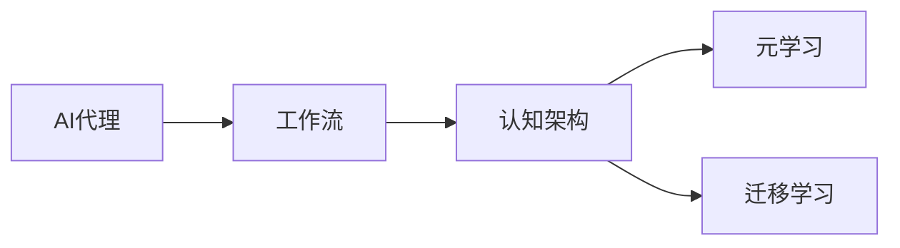

# 跨领域AI代理工作流模型：灵活应用于不同场景

## 1. 背景介绍

近年来,人工智能(AI)技术在各个领域取得了长足的进步,从自然语言处理到计算机视觉,从语音识别到机器人控制,AI正在深刻地改变着我们的生活和工作方式。然而,当前的AI系统大多是针对特定任务和特定领域设计开发的,缺乏通用性和灵活性。如何构建一个能够跨领域、跨任务灵活应用的AI系统,成为了业界关注的热点问题。

本文将介绍一种创新的跨领域AI代理工作流模型,旨在解决传统AI系统通用性差、适应性弱的问题。该模型借鉴了认知科学和心理学领域的理论,设计了一个模块化、可扩展的AI代理框架。通过动态组合不同的功能模块,AI代理可以灵活地适应不同的任务需求和应用场景。同时,该模型还引入了元学习和迁移学习等技术,使得AI代理能够快速学习新知识、掌握新技能。

### 1.1 人工智能发展现状

### 1.2 传统AI系统的局限性

### 1.3 构建通用AI系统的意义

## 2. 核心概念与联系

本节将介绍跨领域AI代理工作流模型涉及的核心概念,并阐述它们之间的联系。

### 2.1 AI代理

AI代理是指能够感知环境、做出决策并采取行动的自主智能体。与传统的AI系统不同,AI代理具有更强的自主性和适应性。它可以根据任务目标和环境状态,动态调整自身的行为策略。

### 2.2 工作流

工作流是指完成特定任务所需的一系列活动及其执行顺序。在跨领域AI代理模型中,工作流由多个功能模块组成,每个模块负责特定的子任务。通过灵活组合和编排这些模块,可以构建出适用于不同场景的AI代理。

### 2.3 认知架构

认知架构是一种模拟人类认知过程的计算模型。它通常包括感知、注意力、记忆、推理、决策等功能模块。跨领域AI代理模型借鉴了认知架构的设计理念,旨在赋予AI代理类似人类的认知能力。

### 2.4 元学习

元学习是一种让机器学会学习的方法。与传统的监督学习不同,元学习旨在学习一个通用的学习策略,使得模型能够快速适应新的任务和环境。在跨领域AI代理模型中,元学习被用来提升AI代理的学习效率和泛化能力。

### 2.5 迁移学习

迁移学习是一种利用已有知识来解决新问题的机器学习方法。它的核心思想是,将在一个领域学到的知识迁移到另一个相关领域,从而减少所需的训练数据和训练时间。跨领域AI代理模型使用迁移学习来实现跨任务、跨领域的知识复用。

下图展示了跨领域AI代理工作流模型的核心概念及其关系:

## 3. 核心算法原理具体操作步骤

本节将详细介绍跨领域AI代理工作流模型的核心算法原理,并给出具体的操作步骤。

### 3.1 模型总体架构

跨领域AI代理工作流模型采用了模块化的设计思路。整个系统由以下几个关键组件构成:

1. 感知模块:负责接收和处理来自环境的信息,如图像、文本、语音等。
2. 认知模块:包括注意力机制、工作记忆、长期记忆等,用于存储和管理AI代理的知识和经验。  
3. 决策模块:根据当前的任务目标和环境状态,选择最优的行动策略。
4. 执行模块:负责控制AI代理执行具体的动作,如移动、操作对象等。
5. 学习模块:利用元学习和迁移学习技术,不断更新和优化AI代理的知识和策略。

### 3.2 工作流动态组合算法

跨领域AI代理工作流模型的核心是一个动态组合算法,它可以根据任务需求,灵活地选择和组合不同的功能模块,形成适用于特定场景的工作流。该算法的主要步骤如下:

1. 任务分解:将复杂的任务分解为多个子任务,每个子任务对应一个功能模块。
2. 模块选择:根据子任务的类型和要求,从候选模块集合中选择最适合的模块。
3. 模块组合:将选定的模块按照一定的顺序和逻辑进行组合,形成完整的工作流。
4. 参数优化:对工作流中的各个模块进行参数调优,以达到最佳的性能。
5. 执行评估:在实际任务中执行组合后的工作流,并评估其性能。如果性能不满足要求,则返回步骤2,重新选择和组合模块。

### 3.3 元学习算法

为了提高AI代理的学习效率和泛化能力,跨领域AI代理工作流模型引入了元学习算法。元学习算法的目标是学习一个通用的学习策略,使得模型能够在少量样本的情况下快速适应新的任务。本模型采用了基于梯度的元学习算法MAML(Model-Agnostic Meta-Learning)。MAML的主要步骤如下:

1. 初始化一个通用的模型参数$\theta$。
2. 对于每一个任务$\mathcal{T}_i$,从其对应的数据集$\mathcal{D}_i$中采样一个小批量的数据$\mathcal{D}_{i}^{tr}$。
3. 在$\mathcal{D}_{i}^{tr}$上对模型进行一次或多次梯度下降,得到任务特定的参数$\theta_i'$:

$$
\theta_i' = \theta - \alpha \nabla_\theta \mathcal{L}_{\mathcal{T}_i}(f_\theta) 
$$

其中$\alpha$是学习率,$\mathcal{L}_{\mathcal{T}_i}$是任务$\mathcal{T}_i$的损失函数。

4. 在每个任务的测试集$\mathcal{D}_{i}^{ts}$上评估模型的性能,并计算元学习的损失函数:

$$
\mathcal{L}_{meta} = \sum_{\mathcal{T}_i \sim p(\mathcal{T})} \mathcal{L}_{\mathcal{T}_i}(f_{\theta_i'})
$$

5. 对元学习损失函数进行梯度下降,更新通用参数$\theta$:

$$
\theta \leftarrow \theta - \beta \nabla_\theta \mathcal{L}_{meta}
$$

其中$\beta$是元学习的学习率。

6. 重复步骤2-5,直到收敛。

### 3.4 迁移学习算法

除了元学习,跨领域AI代理工作流模型还使用了迁移学习算法来实现知识的跨任务、跨领域复用。本模型采用了基于特征表示的迁移学习方法,其核心思想是学习一个通用的特征提取器,将不同任务的数据映射到一个共享的特征空间,从而实现知识的迁移。具体步骤如下:

1. 在源任务上训练一个特征提取器$f_s(x;\theta_s)$,将输入数据$x$映射到特征空间。
2. 固定特征提取器的参数$\theta_s$,在目标任务上训练一个新的分类器或回归器$g_t(f_s(x);\theta_t)$。
3. 联合优化特征提取器和分类器/回归器的参数:

$$
\min_{\theta_s,\theta_t} \mathcal{L}_t(g_t(f_s(x;\theta_s);\theta_t),y_t) + \lambda \mathcal{L}_s(f_s(x;\theta_s),y_s)
$$

其中$\mathcal{L}_t$和$\mathcal{L}_s$分别是目标任务和源任务的损失函数,$\lambda$是平衡两个损失的权重系数。

4. 在目标任务的测试集上评估模型性能,如果不满足要求,则返回步骤3,继续优化。

## 4. 数学模型和公式详细讲解举例说明

本节将详细讲解跨领域AI代理工作流模型中涉及的关键数学模型和公式,并给出具体的例子说明。

### 4.1 马尔可夫决策过程(MDP)

马尔可夫决策过程是一种用于建模决策问题的数学框架。在MDP中,一个智能体(agent)在一个状态空间$\mathcal{S}$中与环境交互,执行动作$\mathcal{A}$,并获得奖励$\mathcal{R}$。MDP可以用一个五元组$(\mathcal{S},\mathcal{A},\mathcal{P},\mathcal{R},\gamma)$来表示:

- $\mathcal{S}$:状态空间,表示智能体所处的所有可能状态。
- $\mathcal{A}$:动作空间,表示智能体可以执行的所有可能动作。
- $\mathcal{P}$:状态转移概率矩阵,其中$\mathcal{P}(s'|s,a)$表示在状态$s$下执行动作$a$后转移到状态$s'$的概率。
- $\mathcal{R}$:奖励函数,其中$\mathcal{R}(s,a)$表示在状态$s$下执行动作$a$获得的即时奖励。
- $\gamma$:折扣因子,用于平衡即时奖励和长期奖励的重要性。

智能体的目标是学习一个最优策略$\pi^*$,使得期望的累积奖励最大化:

$$
\pi^* = \arg\max_\pi \mathbb{E}\left[\sum_{t=0}^{\infty} \gamma^t \mathcal{R}(s_t,a_t) | \pi \right]
$$

其中$s_t$和$a_t$分别表示第$t$步的状态和动作。

跨领域AI代理工作流模型可以看作是一个层次化的MDP,其中每个功能模块对应一个子MDP。通过解决这些子MDP,并将它们的策略组合起来,可以得到整个任务的最优策略。

### 4.2 Q-learning算法

Q-learning是一种常用的强化学习算法,用于解决MDP问题。Q-learning的核心思想是学习一个动作-值函数$Q(s,a)$,表示在状态$s$下执行动作$a$的期望累积奖励。Q-learning的更新公式如下:

$$
Q(s_t,a_t) \leftarrow Q(s_t,a_t) + \alpha \left[r_t + \gamma \max_{a} Q(s_{t+1},a) - Q(s_t,a_t)\right]
$$

其中$\alpha$是学习率,$r_t$是在状态$s_t$下执行动作$a_t$获得的即时奖励。

在跨领域AI代理工作流模型中,可以为每个功能模块设计一个Q-learning算法,分别学习其最优策略。然后,通过动态组合这些策略,可以得到整个任务的解决方案。

### 4.3 注意力机制

注意力机制是一种用于处理序列数据的技术,它可以自动学习输入序列中的重要信息,并赋予其更高的权重。在跨领域AI代理工作流模型中,注意力机制被用于增强感知模块和认知模块的性能。

给定一个输入序列$\mathbf{x}=\{x_1,\dots,x_T\}$和一个查询向量$\mathbf{q}$,注意力机制可以计算每个输入向量$x_i$的注意力权重$\alpha_i$:

$$
\alpha_i = \frac{\exp(f(\mathbf{q},x_i))}{\sum_{j=1}^T \exp(f(\mathbf{q},x_j))}
$$

其中$f(\cdot)$是一个注意力评分函数,用于计算查询向量和输入向量之间的相关性。常见的评分函数包括点积、拼接和感知机等。

有了注意力权重后,可以计算输入序列的加权和,得到一个上下文向量$\mathbf{c}$:

$$
\mathbf{c} = \sum_{i=1}^T \alpha_i x_i
$$

上下文向量$\mathbf{c}$可以看作是输入序列的一