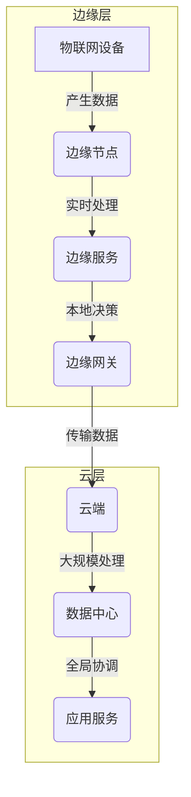

# 边缘计算 (Edge Computing)

## 1.背景介绍

在当今数据时代,随着物联网(IoT)、5G、人工智能(AI)等新兴技术的快速发展,海量的数据正在被产生。传统的云计算架构由于网络带宽、时延等限制,已经难以满足实时数据处理、低延迟计算等新兴需求。为了解决这一问题,边缘计算(Edge Computing)应运而生。

边缘计算是一种将计算资源靠近数据源的分布式计算范式,它将数据处理和存储任务从云端转移到网络边缘,靠近数据产生的位置。通过在网络边缘部署边缘节点,可以实现实时数据处理、低延迟响应、减少带宽占用等优势,满足了物联网、自动驾驶、增强现实等应用场景的需求。

## 2.核心概念与联系

边缘计算的核心概念包括:

1. **边缘节点(Edge Node)**:位于网络边缘的计算和存储设备,用于执行数据处理和分析任务。

2. **边缘网关(Edge Gateway)**:连接边缘节点和云端的网关设备,负责数据传输和协议转换。

3. **边缘服务(Edge Service)**:在边缘节点上运行的应用程序或服务,用于执行特定的计算或数据处理任务。

4. **云端(Cloud)**:提供大规模的计算、存储和网络资源,用于处理复杂的数据分析和管理任务。

边缘计算与云计算、物联网等技术密切相关,它们共同构建了一个分层的计算架构。边缘节点负责实时数据处理和本地决策,云端负责大规模数据存储、深度分析和全局协调。物联网设备产生海量数据,边缘节点对数据进行初步处理,然后将必要的数据传输到云端进行进一步分析和存储。



## 3.核心算法原理具体操作步骤

边缘计算的核心算法原理包括数据处理、任务调度和资源管理等方面。

### 3.1 数据处理算法

边缘节点需要对实时数据进行高效处理,常用的数据处理算法包括:

1. **流数据处理**:针对连续到达的数据流进行实时处理,如Apache Spark Streaming、Apache Flink等。

2. **复杂事件处理(CEP)**:从海量事件数据中发现有价值的事件模式,如Esper、Siddhi等。

3. **机器学习算法**:在边缘节点上部署轻量级的机器学习模型,实现实时数据分析和决策,如TensorFlow Lite、ONNX等。

### 3.2 任务调度算法

边缘计算系统需要合理调度任务在边缘节点和云端之间执行,常用的任务调度算法包括:

1. **基于时延的调度**:根据任务的时延要求,将任务分配到边缘节点或云端执行。

2. **基于能耗的调度**:考虑节点的能耗情况,将任务分配到能耗较低的节点执行。

3. **基于价值的调度**:根据任务的价值或优先级,将重要任务优先分配到边缘节点执行。

### 3.3 资源管理算法

边缘计算系统需要高效管理分布在边缘和云端的计算、存储和网络资源,常用的资源管理算法包括:

1. **虚拟化技术**:利用虚拟化技术在边缘节点上部署多个虚拟机或容器,实现资源隔离和共享。

2. **自动伸缩**:根据实时负载情况,自动扩展或缩减边缘节点的计算资源。

3. **数据缓存**:在边缘节点上缓存热数据,减少与云端的数据传输。

4. **负载均衡**:在多个边缘节点之间合理分配负载,避免资源浪费和单点故障。

## 4.数学模型和公式详细讲解举例说明

在边缘计算系统中,常用的数学模型和公式包括:

### 4.1 任务调度模型

假设有 $n$ 个任务 $T = \{t_1, t_2, \dots, t_n\}$,需要在 $m$ 个边缘节点 $E = \{e_1, e_2, \dots, e_m\}$ 和云端 $c$ 上执行。任务 $t_i$ 在边缘节点 $e_j$ 上执行的时延为 $d_{ij}$,在云端执行的时延为 $d_{ic}$。我们需要找到一种任务调度方案,使得所有任务的总时延最小化:

$$
\min \sum_{i=1}^{n} \sum_{j=1}^{m} x_{ij} d_{ij} + \sum_{i=1}^{n} y_i d_{ic}
$$

其中,决策变量 $x_{ij}$ 和 $y_i$ 分别表示任务 $t_i$ 是否分配到边缘节点 $e_j$ 和云端执行。该问题可以通过整数线性规划或启发式算法求解。

### 4.2 资源分配模型

假设有 $m$ 个边缘节点,每个节点 $e_j$ 的计算资源为 $r_j$,需要为 $n$ 个任务 $T = \{t_1, t_2, \dots, t_n\}$ 分配资源。任务 $t_i$ 在边缘节点 $e_j$ 上执行所需的计算资源为 $c_{ij}$,我们需要找到一种资源分配方案,使得所有任务的总资源需求最小化:

$$
\min \sum_{i=1}^{n} \sum_{j=1}^{m} c_{ij} x_{ij}
$$

$$
\text{s.t.} \quad \sum_{i=1}^{n} c_{ij} x_{ij} \leq r_j, \quad \forall j \in \{1, 2, \dots, m\}
$$

$$
\sum_{j=1}^{m} x_{ij} \leq 1, \quad \forall i \in \{1, 2, \dots, n\}
$$

其中,决策变量 $x_{ij}$ 表示任务 $t_i$ 是否分配到边缘节点 $e_j$ 执行。该问题可以通过整数线性规划或启发式算法求解。

### 4.3 网络带宽优化模型

在边缘计算系统中,边缘节点和云端之间需要传输大量数据,因此合理利用网络带宽非常重要。假设有 $m$ 个边缘节点,每个节点 $e_j$ 与云端之间的上行带宽为 $b_j$,需要为 $n$ 个任务 $T = \{t_1, t_2, \dots, t_n\}$ 传输数据。任务 $t_i$ 在边缘节点 $e_j$ 上执行需要向云端传输 $s_{ij}$ 单位的数据,我们需要找到一种任务调度方案,使得所有任务的总数据传输量最小化:

$$
\min \sum_{i=1}^{n} \sum_{j=1}^{m} s_{ij} x_{ij}
$$

$$
\text{s.t.} \quad \sum_{i=1}^{n} s_{ij} x_{ij} \leq b_j, \quad \forall j \in \{1, 2, \dots, m\}
$$

$$
\sum_{j=1}^{m} x_{ij} \leq 1, \quad \forall i \in \{1, 2, \dots, n\}
$$

其中,决策变量 $x_{ij}$ 表示任务 $t_i$ 是否分配到边缘节点 $e_j$ 执行。该问题可以通过整数线性规划或启发式算法求解。

## 5.项目实践:代码实例和详细解释说明

为了更好地理解边缘计算的实现,我们以一个基于Python的边缘计算框架EdgeX Foundry为例,介绍如何在边缘节点上部署边缘服务。

EdgeX Foundry是一个开源的边缘计算平台,提供了多种微服务,用于设备连接、数据收集、数据处理和数据传输等功能。它支持多种操作系统和硬件平台,可以轻松地在边缘节点上部署和运行。

### 5.1 安装EdgeX Foundry

首先,我们需要在边缘节点上安装EdgeX Foundry。以Ubuntu 20.04为例,可以使用以下命令进行安装:

```bash
# 安装Docker和Docker Compose
sudo apt-get update
sudo apt-get install -y docker.io docker-compose

# 下载EdgeX Foundry
git clone https://github.com/edgexfoundry/developer-scripts.git
cd developer-scripts/compose-builder

# 启动EdgeX Foundry
./compose-builder.sh up

# 验证EdgeX Foundry是否正常运行
curl http://localhost:48080/api/v2/ping
```

### 5.2 部署边缘服务

EdgeX Foundry提供了多种微服务,我们可以根据需求部署不同的服务。以部署一个简单的数据转发服务为例,该服务将从设备收集的数据转发到云端。

首先,我们需要创建一个Python文件`forwarder.py`,实现数据转发逻辑:

```python
import time
import requests

# EdgeX Foundry的数据接收端点
data_url = "http://localhost:48080/api/v2/event/device"

# 模拟从设备收集数据
def get_device_data():
    return {"temperature": 25.5, "humidity": 60.2}

# 将数据转发到EdgeX Foundry
def forward_data(data):
    headers = {"Content-Type": "application/json"}
    requests.post(data_url, json=data, headers=headers)

# 主循环
while True:
    device_data = get_device_data()
    forward_data(device_data)
    time.sleep(5)  # 每5秒转发一次数据
```

接下来,我们需要创建一个Docker镜像,将该服务打包到镜像中。创建一个`Dockerfile`文件:

```dockerfile
FROM python:3.9-slim

WORKDIR /app

COPY requirements.txt .
RUN pip install --no-cache-dir -r requirements.txt

COPY forwarder.py .

CMD ["python", "forwarder.py"]
```

构建Docker镜像:

```bash
docker build -t edge-forwarder .
```

最后,我们可以使用Docker Compose启动该服务:

```yaml
# docker-compose.yml
version: "3.7"

services:
  forwarder:
    image: edge-forwarder
    restart: always
    network_mode: host
```

```bash
docker-compose up -d
```

现在,边缘服务已经在边缘节点上运行,它会每5秒从模拟设备收集数据,并将数据转发到EdgeX Foundry。

## 6.实际应用场景

边缘计算广泛应用于以下场景:

1. **智能制造**:在工厂中部署边缘节点,实现实时数据采集、设备监控和预测性维护。

2. **自动驾驶**:在汽车上部署边缘节点,实现实时数据处理、路径规划和决策控制。

3. **智能城市**:在城市中部署边缘节点,实现交通监控、环境监测和公共设施管理。

4. **智能家居**:在家中部署边缘节点,实现家电控制、安全监控和能源管理。

5. **增强现实(AR)/虚拟现实(VR)**:在边缘节点上处理视频、图像和传感器数据,提供低延迟的增强现实/虚拟现实体验。

6. **视频分析**:在边缘节点上进行视频流实时分析,如人脸识别、行为检测等。

7. **医疗保健**:在医疗设备上部署边缘节点,实现实时数据监测和远程诊断。

## 7.工具和资源推荐

以下是一些常用的边缘计算工具和资源:

1. **EdgeX Foundry**:一个开源的边缘计算平台,提供了多种微服务用于设备连接、数据收集、数据处理和数据传输。

2. **AWS Greengrass**:亚马逊云服务(AWS)提供的边缘计算服务,可以在本地设备上运行AWS Lambda函数和Docker容器。

3. **Azure IoT Edge**:微软Azure云平台提供的边缘计算服务,可以在边缘设备上部署和运行容器化的应用程序。

4. **Google Cloud IoT Edge**:谷歌云平台提供的边缘计算服务