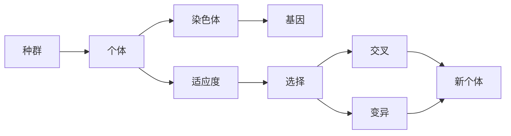

# 遗传算法(Genetic Algorithms) - 原理与代码实例讲解

## 1. 背景介绍
遗传算法（Genetic Algorithms，GA）是模拟生物进化过程的搜索算法，它由美国计算机科学家约翰·霍兰德（John Holland）在20世纪70年代初提出。遗传算法的设计灵感来源于达尔文的自然选择理论，通过模拟自然界中生物的遗传和进化机制来解决优化问题。遗传算法在多目标优化、机器学习、人工智能等领域有着广泛的应用。

## 2. 核心概念与联系
遗传算法的核心概念包括种群（Population）、个体（Individual）、基因（Gene）、染色体（Chromosome）、适应度（Fitness）、选择（Selection）、交叉（Crossover）和变异（Mutation）。这些概念相互联系，共同构成了遗传算法的基本框架。



## 3. 核心算法原理具体操作步骤
遗传算法的操作步骤通常包括初始化、评估、选择、交叉、变异和替换。以下是这些步骤的简要描述：

1. **初始化**：随机生成一个初始种群。
2. **评估**：计算每个个体的适应度。
3. **选择**：根据适应度选择个体进行繁殖。
4. **交叉**：选中的个体通过交叉产生后代。
5. **变异**：以一定的概率修改后代的某些基因。
6. **替换**：新一代个体替换旧个体，形成新的种群。

## 4. 数学模型和公式详细讲解举例说明
遗传算法的数学模型主要涉及适应度函数的定义。适应度函数用于评价个体的优劣，是遗传算法中最为关键的部分。适应度函数通常取决于问题本身，例如在优化问题中，适应度函数可能是需要最大化或最小化的目标函数。

$$
\text{Fitness}(x) = \text{ObjectiveFunction}(x)
$$

其中，$x$ 表示染色体编码的解。

## 5. 项目实践：代码实例和详细解释说明
在本节中，我们将通过一个简单的优化问题来展示遗传算法的代码实现。假设我们的目标是找到一个二进制字符串，使得其中1的数量最多。

```python
import random

# 个体类
class Individual:
    def __init__(self, length):
        self.chromosome = [random.choice([0, 1]) for _ in range(length)]
        self.fitness = self.calculate_fitness()

    # 计算适应度
    def calculate_fitness(self):
        return sum(self.chromosome)

# 遗传算法类
class GeneticAlgorithm:
    def __init__(self, population_size, chromosome_length, crossover_rate, mutation_rate, generations):
        self.population_size = population_size
        self.chromosome_length = chromosome_length
        self.crossover_rate = crossover_rate
        self.mutation_rate = mutation_rate
        self.generations = generations
        self.population = [Individual(chromosome_length) for _ in range(population_size)]

    # 选择过程
    def selection(self):
        # 轮盘赌选择
        fitness_sum = sum(individual.fitness for individual in self.population)
        selection_probs = [individual.fitness / fitness_sum for individual in self.population]
        return random.choices(self.population, weights=selection_probs, k=2)

    # 交叉过程
    def crossover(self, parent1, parent2):
        if random.random() < self.crossover_rate:
            crossover_point = random.randint(1, self.chromosome_length - 1)
            child1 = parent1.chromosome[:crossover_point] + parent2.chromosome[crossover_point:]
            child2 = parent2.chromosome[:crossover_point] + parent1.chromosome[crossover_point:]
            return Individual(self.chromosome_length), Individual(self.chromosome_length)
        else:
            return parent1, parent2

    # 变异过程
    def mutation(self, individual):
        for i in range(self.chromosome_length):
            if random.random() < self.mutation_rate:
                individual.chromosome[i] = 1 if individual.chromosome[i] == 0 else 0
        individual.fitness = individual.calculate_fitness()

    # 运行遗传算法
    def run(self):
        for generation in range(self.generations):
            new_population = []
            for _ in range(self.population_size // 2):
                parent1, parent2 = self.selection()
                child1, child2 = self.crossover(parent1, parent2)
                self.mutation(child1)
                self.mutation(child2)
                new_population.extend([child1, child2])
            self.population = new_population
            best_individual = max(self.population, key=lambda individual: individual.fitness)
            print(f"Generation {generation}: Best Fitness = {best_individual.fitness}")

# 参数设置
population_size = 100
chromosome_length = 10
crossover_rate = 0.7
mutation_rate = 0.01
generations = 50

# 运行遗传算法
ga = GeneticAlgorithm(population_size, chromosome_length, crossover_rate, mutation_rate, generations)
ga.run()
```

## 6. 实际应用场景
遗传算法在多个领域有着广泛的应用，包括但不限于：

- 优化问题：如旅行商问题（TSP）、调度问题、资源分配问题。
- 机器学习：特征选择、神经网络结构优化。
- 控制系统：自动控制参数调整。
- 生物信息学：基因数据分析、蛋白质结构预测。

## 7. 工具和资源推荐
- DEAP（Distributed Evolutionary Algorithms in Python）：一个易于使用的进化计算库。
- Pyevolve：一个用于遗传算法的Python库。
- GA Playground：一个在线遗传算法模拟器，用于教育和实验。

## 8. 总结：未来发展趋势与挑战
遗传算法作为一种启发式算法，在解决复杂优化问题方面显示出了巨大的潜力。未来的发展趋势可能包括与其他优化算法的结合、并行计算的应用以及在更多领域的实际应用。挑战则包括提高算法的效率、避免早熟收敛以及适应度函数的设计。

## 9. 附录：常见问题与解答
Q1: 遗传算法是否总能找到全局最优解？
A1: 不一定。遗传算法是一种启发式搜索算法，它能够找到很好的解，但不保证总是全局最优。

Q2: 遗传算法的计算效率如何？
A2: 遗传算法通常需要较多的计算资源，特别是在种群规模较大和问题复杂度较高时。但通过并行计算和算法优化，可以提高其效率。

Q3: 如何选择遗传算法的参数？
A3: 参数选择通常依赖于问题本身和经验。可以通过实验来调整交叉率、变异率和种群大小等参数，以获得最佳性能。

作者：禅与计算机程序设计艺术 / Zen and the Art of Computer Programming