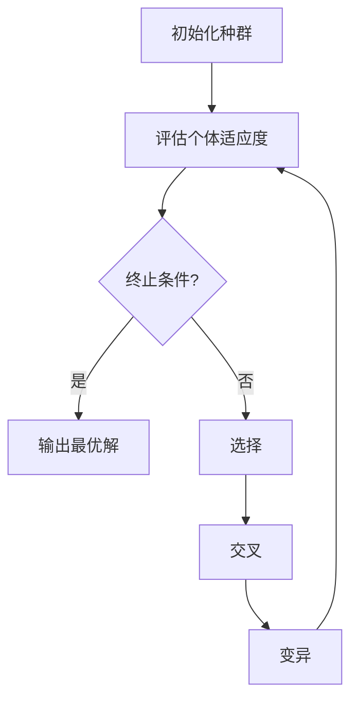

# 遗传算法(Genetic Algorithms) - 原理与代码实例讲解

## 1.背景介绍

### 1.1 什么是遗传算法?

遗传算法(Genetic Algorithms, GAs)是一种启发式搜索和优化技术,模拟了自然界中生物进化的过程。它属于一种进化算法,通过模拟自然选择和遗传机理,在问题的解空间中进行高效搜索,逐代寻找最优解或近似最优解。

遗传算法的思想源于查尔斯·达尔文的进化论,并由约翰·霍兰德在1960年代提出。它将待优化参数编码为染色体(个体),并通过选择、交叉和变异等遗传操作对种群进行进化,逐步找到最优解。

### 1.2 遗传算法的应用

遗传算法由于其鲁棒性、通用性和高效性,已广泛应用于多个领域,如:

- 组合优化问题(如旅行商问题、工作调度等)
- 机器学习和模式识别
- 计算机科学(如编译器代码优化、软件测试等)
- 工程设计(如电路布线、结构优化等)
- 生物信息学(如基因表达模式分析、蛋白质结构预测等)
- 经济和金融领域(如投资组合优化、风险管理等)

## 2.核心概念与联系

### 2.1 基本概念

1. **个体(Individual)**: 对问题的一个可能解的编码表示,通常采用二进制串或实数向量。
2. **种群(Population)**: 包含多个个体的集合。
3. **适应度(Fitness)**: 评估个体解的优劣程度,适应度值越高,表示个体越优秀。
4. **选择(Selection)**: 根据适应度值,从当前种群中选择个体,作为下一代种群的父母。
5. **交叉(Crossover)**: 从两个父母个体中随机选取部分编码,并交换形成新的子代个体。
6. **变异(Mutation)**: 对个体的编码随机改变某个位的值,增加种群的多样性。

### 2.2 遗传算法流程

遗传算法的基本流程如下所示:



1. **初始化种群**: 随机生成一定数量的个体,作为初始种群。
2. **评估个体适应度**: 计算每个个体的适应度值。
3. **终止条件检查**: 如果满足终止条件(如达到最大迭代次数或目标适应度),则输出当前最优解并结束;否则进行下一步。
4. **选择操作**: 根据适应度值,从当前种群中选择个体,作为下一代种群的父母。
5. **交叉操作**: 对选中的父母个体进行交叉,生成新的子代个体。
6. **变异操作**: 对子代个体进行变异,增加种群多样性。
7. **回到步骤2**,对新一代种群进行评估,循环执行直至满足终止条件。

## 3.核心算法原理具体操作步骤

### 3.1 编码方式

编码是将问题的解映射为遗传算法可操作的数据结构(如二进制串或实数向量)的过程。常见的编码方式包括:

1. **二进制编码**: 将解编码为0/1的二进制串。
2. **排列编码**: 将解编码为一个排列(如旅行商问题的城市访问顺序)。
3. **实数编码**: 将解编码为实数向量(如函数优化问题的自变量值)。

编码方式的选择取决于问题的性质,需要尽可能简单且有效地表示解空间。

### 3.2 初始化种群

初始化种群是随机生成一定数量的个体,作为算法的初始搜索点。常用的初始化方法包括:

1. **随机初始化**: 完全随机生成个体。
2. **启发式初始化**: 利用问题的先验知识,生成较优质的初始个体。
3. **混合初始化**: 结合随机和启发式方法,生成多样化的初始种群。

合理的初始化可以加快算法收敛速度,但过于集中也可能导致早熟收敛。

### 3.3 适应度函数设计

适应度函数用于评估个体的优劣程度,是遗传算法的核心部分。设计合适的适应度函数对算法性能至关重要。适应度函数的设计原则包括:

1. **准确性**: 能够正确反映个体与目标函数的契合程度。
2. **高效性**: 计算适应度值的时间复杂度应尽可能低。
3. **单调性**: 对于最小化问题,适应度值应当随目标函数值的增加而减小,反之亦然。
4. **适度压力**: 适应度差异不宜过大或过小,以保持种群多样性。

常见的适应度函数包括线性规范化、指数规范化、排序缩放等。

### 3.4 选择操作

选择操作的目的是从当前种群中选择个体,作为下一代种群的父母。常用的选择方法包括:

1. **轮盘赌选择(Roulette Wheel Selection)**: 个体被选中的概率与其适应度值成正比。
2. **排名选择(Ranking Selection)**: 根据个体适应度值的排名进行选择。
3. **锦标赛选择(Tournament Selection)**: 从种群中随机选取一定数量的个体,选择其中适应度最高的个体。
4. **精英选择(Elitism)**: 直接将当前种群中适应度最高的个体复制到下一代种群。

选择压力过大可能导致种群多样性丢失,而选择压力过小则可能使算法收敛缓慢。

### 3.5 交叉操作

交叉操作通过重新组合父代个体的编码,生成新的子代个体。常用的交叉方法包括:

1. **单点交叉**: 在父母个体的编码中随机选择一个交叉点,交换两个父母从交叉点后面的编码部分。
2. **多点交叉**: 在父母个体的编码中随机选择多个交叉点,交换多个编码片段。
3. **均匀交叉**: 对父母个体的每一位编码,以一定概率决定是否交换。
4. **算术交叉**(用于实数编码): 对父母个体的编码进行加权平均,生成新的子代编码。

交叉操作的目的是探索解空间的新区域,并传递父代个体的优良基因。交叉概率的设置需要平衡探索和利用。

### 3.6 变异操作

变异操作通过改变个体编码的某些位,引入新的遗传特征,增加种群的多样性。常用的变异方法包括:

1. **基因变异**(用于二进制编码): 随机反转个体编码中的某些位。
2. **均匀变异**(用于实数编码): 在一定范围内随机改变个体编码的某些位。
3. **高斯变异**(用于实数编码): 在高斯分布下随机改变个体编码的某些位。
4. **插入变异**(用于排列编码): 随机移动个体编码中的某些位置。

变异操作的目的是探索解空间的新区域,避免陷入局部最优。变异概率过高会破坏优良个体的结构,而过低则无法有效探索新区域。

## 4.数学模型和公式详细讲解举例说明

### 4.1 适应度函数

适应度函数是将目标函数值映射到非负实数区间的函数,用于评估个体的优劣程度。常见的适应度函数包括:

1. **线性规范化**:

$$
f_{fitness}(x) = \frac{f(x) - f_{min}}{f_{max} - f_{min}}
$$

其中,$ f(x) $是目标函数值,$ f_{min} $和$ f_{max} $分别是种群中的最小和最大目标函数值。

2. **指数规范化**:

$$
f_{fitness}(x) = e^{-\alpha f(x)}
$$

其中,$ \alpha $是一个正常数,用于调节适应度差异。

3. **排序缩放**:

首先对个体按目标函数值从小到大排序,然后将适应度值按等差数列或其他方式分配。

### 4.2 选择概率

在轮盘赌选择中,个体$ i $被选中的概率为:

$$
p_i = \frac{f_{fitness}(i)}{\sum_{j=1}^{N}f_{fitness}(j)}
$$

其中,$ N $是种群大小。

### 4.3 交叉概率和变异概率

交叉概率$ p_c $和变异概率$ p_m $控制了交叉和变异操作在种群中的频率。通常,$ p_c $取值在$ [0.6, 0.9] $区间,$ p_m $取值在$ [0.001, 0.1] $区间。

较高的交叉概率有利于利用已有的优良基因,而较低的变异概率则有助于保持种群的多样性。

### 4.4 收敛性分析

设$ f^* $为目标函数的全局最优解,$ \overline{f_t} $为第$ t $代种群的平均适应度值,则有:

$$
\lim_{t \to \infty} \overline{f_t} = f^*
$$

即在无限代数下,遗传算法将以概率1收敛到全局最优解。

此外,还可以利用理论分析或数值模拟,研究不同参数设置对算法收敛速度和精度的影响。

### 4.5 举例说明

假设我们需要求解如下单峰函数的最小值:

$$
f(x) = x^2
$$

其中,$ x \in [-5, 5] $。我们采用二进制编码,每个个体由10位二进制串表示。

1. **初始化种群**:

假设初始种群大小为10,则随机生成10个10位二进制串作为初始个体。

2. **计算适应度值**:

采用线性规范化的适应度函数:

$$
f_{fitness}(x) = \frac{f_{max} - f(x)}{f_{max} - f_{min}}
$$

其中,$ f_{max} $和$ f_{min} $分别是当前种群中的最大和最小目标函数值。

3. **选择操作**:

采用轮盘赌选择,选择10个个体作为父母。

4. **交叉操作**:

设交叉概率$ p_c = 0.8 $,对选中的父母个体执行单点交叉,生成10个子代个体。

5. **变异操作**:

设变异概率$ p_m = 0.05 $,对子代个体执行基因变异。

6. **重复步骤2-5**,直至满足终止条件(如达到最大迭代次数或目标适应度值)。

通过上述过程,遗传算法将逐渐优化种群,最终找到目标函数的最小值解$ x = 0 $。

## 5.项目实践:代码实例和详细解释说明

以下是一个使用Python实现的简单遗传算法示例,用于求解单峰函数$ f(x) = x^2 $的最小值:

```python
import random
import math

# 目标函数
def func(x):
    return x ** 2

# 个体编码
def encode(x, bounds, bits):
    x = (x - bounds[0]) / (bounds[1] - bounds[0])
    gray = int(x * (2 ** bits - 1))
    return '{0:0{1}b}'.format(gray, bits)

# 个体解码
def decode(gray, bounds, bits):
    x = int(gray, 2) / (2 ** bits - 1)
    x = x * (bounds[1] - bounds[0]) + bounds[0]
    return x

# 计算适应度值
def fitness(x):
    return 1 / (1 + func(x))

# 选择操作
def selection(population, fitness_values):
    total_fitness = sum(fitness_values)
    probabilities = [f / total_fitness for f in fitness_values]
    new_population = []
    for _ in range(len(population)):
        r = random.random()
        sum_prob = 0
        for i, p in enumerate(probabilities):
            sum_prob += p
            if sum_prob >= r:
                new_population.append(population[i])
                break
    return new_population

# 交叉操作
def crossover(parent1, parent2, rate=0.8):
    if random.random() < rate:
        point = random.randint(1, len(parent1) - 2)
        child1 = parent1[:point] + parent2[point:]
        child2 = parent2[:point] + parent1[point:]
        return child1, child2
    else:
        return