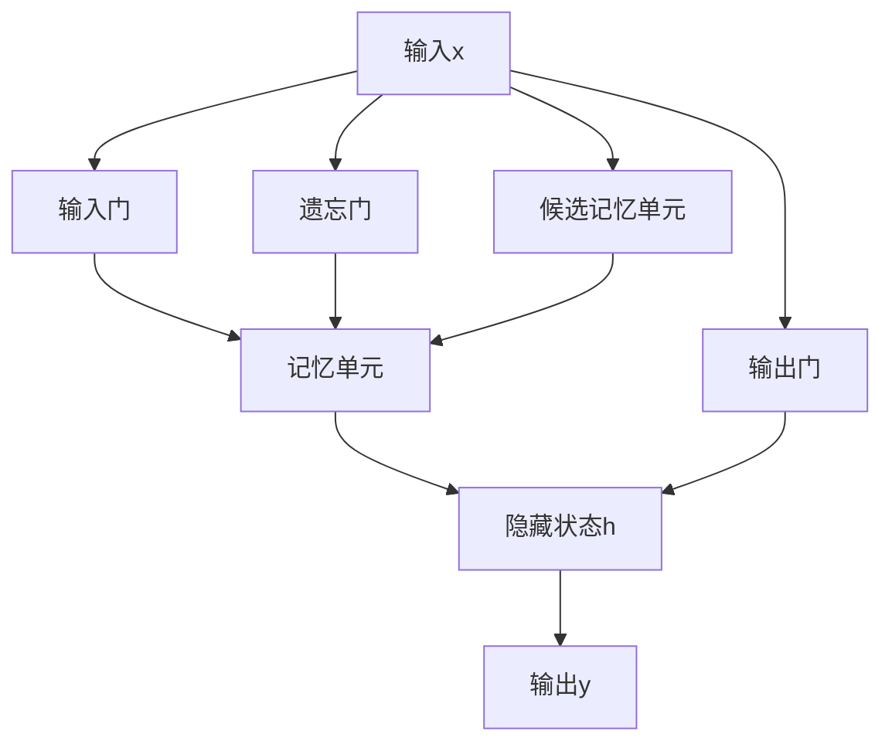

# 长短时记忆网络LSTM原理与代码实例讲解

## 1. 背景介绍
### 1.1 循环神经网络RNN的局限性
#### 1.1.1 长期依赖问题
#### 1.1.2 梯度消失和梯度爆炸问题
### 1.2 LSTM网络的提出
#### 1.2.1 LSTM的起源与发展
#### 1.2.2 LSTM的优势

## 2. 核心概念与联系
### 2.1 LSTM的基本结构
#### 2.1.1 输入门(Input Gate)
#### 2.1.2 遗忘门(Forget Gate) 
#### 2.1.3 输出门(Output Gate)
#### 2.1.4 单元状态(Cell State)
### 2.2 LSTM的变体
#### 2.2.1 Peephole LSTM
#### 2.2.2 Coupled LSTM
#### 2.2.3 Gated Recurrent Unit(GRU)

## 3. 核心算法原理具体操作步骤
### 3.1 LSTM前向传播
#### 3.1.1 输入门
#### 3.1.2 遗忘门
#### 3.1.3 输出门
#### 3.1.4 单元状态更新
#### 3.1.5 隐藏状态输出
### 3.2 LSTM反向传播
#### 3.2.1 损失函数定义
#### 3.2.2 时间反向传播BPTT
#### 3.2.3 梯度计算与参数更新

## 4. 数学模型和公式详细讲解举例说明
### 4.1 输入门
$$i_t=\sigma(W_i\cdot[h_{t-1},x_t]+b_i)$$
### 4.2 遗忘门
$$f_t=\sigma(W_f\cdot[h_{t-1},x_t]+b_f)$$
### 4.3 输出门 
$$o_t=\sigma(W_o\cdot[h_{t-1},x_t]+b_o)$$
### 4.4 单元状态
$$\tilde{C}_t=\tanh(W_C\cdot[h_{t-1},x_t]+b_C)$$
$$C_t=f_t*C_{t-1}+i_t*\tilde{C}_t$$
### 4.5 隐藏状态输出
$$h_t=o_t*\tanh(C_t)$$

## 5. 项目实践：代码实例和详细解释说明
### 5.1 Numpy实现LSTM前向传播
#### 5.1.1 初始化参数
#### 5.1.2 输入门、遗忘门、输出门
#### 5.1.3 候选记忆单元
#### 5.1.4 记忆单元
#### 5.1.5 隐藏状态
#### 5.1.6 输出层
### 5.2 Pytorch实现LSTM模型
#### 5.2.1 定义LSTM模型
#### 5.2.2 实例化LSTM模型
#### 5.2.3 训练LSTM模型
#### 5.2.4 评估LSTM模型

## 6. 实际应用场景
### 6.1 自然语言处理
#### 6.1.1 语言模型
#### 6.1.2 机器翻译
#### 6.1.3 情感分析
### 6.2 语音识别
### 6.3 时间序列预测
#### 6.3.1 股票价格预测
#### 6.3.2 交通流量预测
### 6.4 异常检测

## 7. 工具和资源推荐
### 7.1 深度学习框架
#### 7.1.1 Pytorch
#### 7.1.2 TensorFlow
#### 7.1.3 Keras
### 7.2 开源实现
#### 7.2.1 Pytorch-LSTM
#### 7.2.2 TensorFlow-LSTM 
### 7.3 数据集
#### 7.3.1 Penn Treebank (PTB)
#### 7.3.2 Wikipedia Language Modeling
#### 7.3.3 Amazon Reviews

## 8. 总结：未来发展趋势与挑战
### 8.1 LSTM的局限性
#### 8.1.1 计算效率
#### 8.1.2 解释性
### 8.2 未来研究方向
#### 8.2.1 记忆增强神经网络
#### 8.2.2 注意力机制
#### 8.2.3 外部记忆模型
### 8.3 LSTM与其他模型结合
#### 8.3.1 LSTM+CNN
#### 8.3.2 LSTM+Attention
#### 8.3.3 LSTM+强化学习

## 9. 附录：常见问题与解答
### 9.1 如何选择LSTM的隐藏单元数？
### 9.2 LSTM是否一定优于普通RNN?
### 9.3 LSTM能否处理非常长的序列？
### 9.4 如何避免LSTM的过拟合？
### 9.5 LSTM训练loss不下降怎么办？

LSTM作为循环神经网络的一种改进，通过引入门控机制和记忆单元，有效地解决了RNN面临的长期依赖和梯度消失/爆炸问题。LSTM巧妙地设计了三个门：输入门、遗忘门和输出门，分别控制信息的写入、遗忘和输出。同时引入了记忆单元，用于存储长期的信息状态。

LSTM的核心是门控单元。输入门控制新信息进入记忆单元的程度，遗忘门控制过去信息被遗忘的程度，输出门控制记忆单元信息输出到隐藏状态的程度。通过门的开关，LSTM能够自适应地选择性遗忘过去信息，选择性记忆新信息，从而更好地捕捉时间序列中的长距离依赖关系。

LSTM在前向传播时，首先根据当前输入和上一时刻隐藏状态，计算输入门、遗忘门、输出门的激活值以及候选记忆单元。然后利用遗忘门控制过去记忆的遗忘程度，利用输入门控制新记忆的写入程度，更新得到当前时刻的记忆单元。最后根据输出门和当前记忆单元计算得到隐藏状态输出。

反向传播时，LSTM采用时间反向传播BPTT的方式计算梯度。损失函数一般定义在输出层，然后逐步向前传播梯度，依次更新各个门和权重参数。由于LSTM内部门和记忆单元的存在，梯度在反向传播时能够较好地保留，避免了梯度消失问题。

LSTM在自然语言处理、语音识别、时间序列预测等领域取得了广泛的成功应用。如机器翻译、情感分析、股票预测等。此外，LSTM还可以与其他模型如CNN、Attention结合，形成更加强大的网络架构。

尽管LSTM取得了巨大成功，但它仍然存在一些局限性，如计算效率不高，可解释性差等。未来LSTM的研究方向包括记忆增强、注意力机制、外部记忆等，以进一步提升模型性能。

总之，LSTM作为一种经典的循环神经网络模型，通过巧妙的门控设计和记忆单元，有效解决了RNN的缺陷，在时间序列建模任务中表现优异。理解LSTM的原理，掌握其使用方法，对于从事相关领域的研究和应用有重要意义。

作者：禅与计算机程序设计艺术 / Zen and the Art of Computer Programming