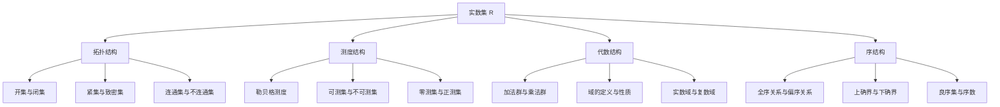

# 集合论导引：实数集可定义子集分析

## 1. 背景介绍
### 1.1 集合论的起源与发展
#### 1.1.1 康托尔的贡献
#### 1.1.2 现代集合论的形成
#### 1.1.3 集合论在数学中的地位
### 1.2 实数集的基本性质
#### 1.2.1 实数的定义
#### 1.2.2 实数集的基数
#### 1.2.3 实数集的完备性
### 1.3 可定义子集的概念
#### 1.3.1 可定义子集的定义
#### 1.3.2 可定义子集的重要性
#### 1.3.3 可定义子集与不可定义子集的区别

## 2. 核心概念与联系
### 2.1 实数集的拓扑结构
#### 2.1.1 开集与闭集
#### 2.1.2 紧集与致密集
#### 2.1.3 连通集与不连通集
### 2.2 实数集的测度结构
#### 2.2.1 勒贝格测度的定义
#### 2.2.2 可测集与不可测集
#### 2.2.3 零测集与正测集
### 2.3 实数集的代数结构
#### 2.3.1 加法群与乘法群
#### 2.3.2 域的定义与性质
#### 2.3.3 实数域与复数域
### 2.4 实数集的序结构
#### 2.4.1 全序关系与偏序关系
#### 2.4.2 上确界与下确界
#### 2.4.3 良序集与序数

## 3. 核心算法原理具体操作步骤
### 3.1 构造不可测集的方法
#### 3.1.1 维塔利集的构造
#### 3.1.2 哈梅尔基的构造
#### 3.1.3 超限递归法
### 3.2 构造不可定义集的方法 
#### 3.2.1 对角线法
#### 3.2.2 强制法
#### 3.2.3 选择公理的应用
### 3.3 构造连续统的方法
#### 3.3.1 戴德金分割
#### 3.3.2 康托尔-梅雷-史密斯构造
#### 3.3.3 超滤子极限

## 4. 数学模型和公式详细讲解举例说明
### 4.1 勒贝格测度的数学模型
#### 4.1.1 外测度的定义与性质
#### 4.1.2 可测集的刻画
#### 4.1.3 勒贝格积分与黎曼积分的关系
### 4.2 选择公理的数学模型
#### 4.2.1 良序原理
#### 4.2.2 佐恩引理
#### 4.2.3 极大链与哈乌斯道夫极大原理
### 4.3 超限递归的数学模型
#### 4.3.1 序数的运算与比较
#### 4.3.2 超限递归函数与层级
#### 4.3.3 构造模型与绝对

## 5. 项目实践：代码实例和详细解释说明
### 5.1 实数集的计算机表示
#### 5.1.1 浮点数系统
#### 5.1.2 有理数的二进制表示
#### 5.1.3 实数运算的误差分析
### 5.2 集合论算法的实现
#### 5.2.1 幂集的生成算法
#### 5.2.2 笛卡尔积的计算方法  
#### 5.2.3 康托尔集的构造算法
### 5.3 数值积分的计算方法
#### 5.3.1 梯形法则与辛普森法则
#### 5.3.2 自适应积分算法
#### 5.3.3 蒙特卡洛积分算法

## 6. 实际应用场景
### 6.1 实数完备性在数值分析中的应用
#### 6.1.1 插值与逼近理论
#### 6.1.2 常微分方程数值解
#### 6.1.3 最优化算法的收敛性
### 6.2 测度论在概率论中的应用
#### 6.2.1 概率空间的构造
#### 6.2.2 随机变量及其分布
#### 6.2.3 大数定律与中心极限定理
### 6.3 集合论在数据库系统中的应用
#### 6.3.1 关系代数与关系演算
#### 6.3.2 函数依赖与范式
#### 6.3.3 查询优化与索引技术

## 7. 工具和资源推荐
### 7.1 数学工具软件
#### 7.1.1 Mathematica
#### 7.1.2 MATLAB
#### 7.1.3 Maple
### 7.2 证明辅助工具
#### 7.2.1 Coq
#### 7.2.2 Isabelle
#### 7.2.3 Lean
### 7.3 在线学习资源
#### 7.3.1 MathWorld
#### 7.3.2 ProofWiki
#### 7.3.3 Stack Exchange

## 8. 总结：未来发展趋势与挑战
### 8.1 大基数集合论的发展
#### 8.1.1 巨基数公理与强制公理
#### 8.1.2 内模型理论与确定性原理
#### 8.1.3 集合论与数学基础的哲学思考
### 8.2 计算复杂性理论的挑战
#### 8.2.1 P vs NP 问题
#### 8.2.2 不可判定性与哥德尔不完备定理
#### 8.2.3 算法的下界与上界分析
### 8.3 人工智能的逻辑基础
#### 8.3.1 谓词逻辑与一阶逻辑
#### 8.3.2 模态逻辑与时态逻辑
#### 8.3.3 模糊逻辑与概率逻辑

## 9. 附录：常见问题与解答
### 9.1 实数系统的构造方法
#### 9.1.1 戴德金分割的极限构造
#### 9.1.2 康托尔实数的列构造
#### 9.1.3 超实数系统
### 9.2 公理化集合论的悖论
#### 9.2.1 罗素悖论
#### 9.2.2 布拉利-福尔蒂悖论
#### 9.2.3 康托尔悖论
### 9.3 连续统假设的独立性
#### 9.3.1 哥德尔构造模型
#### 9.3.2 柯恩构造模型
#### 9.3.3 连续统假设与选择公理

实数集是数学分析、拓扑学、测度论等诸多数学分支的研究对象。作为一个完备的序域，实数集具有丰富的结构，包括拓扑结构、测度结构、代数结构和序结构等。这些结构之间相互关联，构成了实数集的整体特征。

在拓扑结构方面，实数集可以划分为开集与闭集、紧集与致密集、连通集与不连通集等。开集与闭集刻画了实数集中点与集合的邻域关系，是拓扑学的基本概念。紧集可以看作有界闭集在拓扑空间中的推广，在泛函分析等领域有重要应用。连通性则刻画了实数集的"整体性"，即任意两点可以用线段连接。

测度结构赋予了实数集一种"长度"或"体积"的概念。勒贝格测度是一种重要的测度，可以定义实数集的子集是否可测，以及可测集的测度大小。在勒贝格测度下，实数集可以分为零测集和正测集。测度论与概率论有着密切联系，为现代概率论提供了坚实的数学基础。

代数结构主要指实数集构成域，即满足加法和乘法运算，且乘法对加法满足分配律。实数域是最重要的数域之一，其代数性质十分完善，是复数域的基础。群、环、域等代数结构在现代数学中有广泛应用。

序结构刻画了实数集元素之间的大小关系。实数集是全序集，任意两个实数都可以比较大小。同时，实数集也是连续统，具有最小上界性质。序数理论是集合论的重要分支，研究集合的序类型，与实数集的序结构密切相关。

综上所述，实数集的四大结构互为补充，构成了实数系统的核心内容。深入理解实数集的性质，对于学习现代数学具有重要意义。

在构造实数系统时，数学家们发明了多种方法，如戴德金分割、康托尔实数、超限递归等。同时，他们也发现了集合论中的一些悖论，如罗素悖论、康托尔悖论等，这促使数学家们重新审视集合论的基础，发展公理化集合论。选择公理、连续统假设等重要命题的提出，极大地推动了集合论的发展。

在实际应用中，实数集的计算机表示、集合论算法的设计与实现、数值计算与积分等，都与实数集的理论密切相关。实数完备性、测度论等在数值分析、概率论、数据库系统等领域有重要应用。

未来，随着大基数集合论、计算复杂性理论、人工智能等领域的发展，实数集的研究将面临新的机遇与挑战。内模型理论、算法复杂性、模糊逻辑等方向值得关注。同时，对于一些经典难题，如连续统假设的独立性等，仍需要数学工作者做出不懈努力。

总之，实数集作为数学的基石，其深刻内涵远未被完全挖掘。本文对实数集的可定义子集进行了分析，涉及了实数集的主要结构与性质，讨论了相关理论的应用与前景，提出了一些有待进一步探索的问题。通过对实数集的研究，我们可以加深对数学的理解，并将其应用于解决实际问题。数学的发展之路依然漫长，但我们相信，在前人的基础上，在集合论的指引下，定能不断取得新的进展，让数学这朵智慧之花绽放出更加绚丽的光彩。

作者：禅与计算机程序设计艺术 / Zen and the Art of Computer Programming