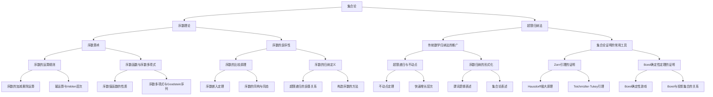

# 集合论导引：超限归纳法

## 1. 背景介绍
### 1.1 集合论的起源与发展
#### 1.1.1 康托尔的贡献
#### 1.1.2 悖论的发现与克服
#### 1.1.3 现代公理化集合论
### 1.2 超限归纳法的重要性
#### 1.2.1 在现代数学中的地位
#### 1.2.2 在集合论中的应用
#### 1.2.3 与数学基础的关系

## 2. 核心概念与联系
### 2.1 序数的概念
#### 2.1.1 良序集合与序数
#### 2.1.2 序数的运算
#### 2.1.3 序数的比较
### 2.2 超限归纳法的定义
#### 2.2.1 传统数学归纳法
#### 2.2.2 超限归纳法的形式化定义
#### 2.2.3 超限归纳法与序数的关系
### 2.3 超限递归的概念
#### 2.3.1 递归函数与序数递归
#### 2.3.2 超限递归的定义
#### 2.3.3 超限递归与超限归纳法的关系

## 3. 核心算法原理具体操作步骤
### 3.1 超限归纳法的一般步骤
#### 3.1.1 确定命题P(α)的形式
#### 3.1.2 证明P(0)成立
#### 3.1.3 假设P(β)对所有β<α成立,证明P(α)成立
### 3.2 常见的证明技巧
#### 3.2.1 反证法与超限归纳
#### 3.2.2 构造法与超限归纳
#### 3.2.3 分类讨论与超限归纳
### 3.3 经典例题解析
#### 3.3.1 Zorn引理的证明
#### 3.3.2 序数乘法交换律的证明
#### 3.3.3 Goodstein序列的收敛性证明

## 4. 数学模型和公式详细讲解举例说明 
### 4.1 序数算术基本公式
#### 4.1.1 序数加法的性质 $\alpha+\beta=\beta+\alpha$
#### 4.1.2 序数乘法的性质 $(\alpha\cdot\beta)\cdot\gamma=\alpha\cdot(\beta\cdot\gamma)$
#### 4.1.3 幂运算与Veblen层次 $\varphi_\alpha(\beta)=\gamma$
### 4.2 超限归纳法的形式化表述
#### 4.2.1 超限归纳法的谓词逻辑表达 $\forall \alpha((\forall \beta<\alpha \ P(\beta))\to P(\alpha))\to \forall \alpha \ P(\alpha)$
#### 4.2.2 超限归纳法的集合论表述 $\forall X((\forall \alpha\in X\ (\alpha\subset X))\to Ord\subseteq X)$
### 4.3 超限递归的数学模型
#### 4.3.1 序数递归的形式定义 $f(0)=a, f(\alpha+1)=h(f(\alpha)),f(\lambda)=\lim_{\xi<\lambda}f(\xi)$
#### 4.3.2 不动点定理与超限递归 $f(\Gamma_f)=\Gamma_f$
#### 4.3.3 超限递归与Borel可测层次 $\Delta^1_\alpha$

## 5. 项目实践：代码实例和详细解释说明
### 5.1 Python实现序数运算
#### 5.1.1 序数的表示方法
#### 5.1.2 序数的比较算法
#### 5.1.3 序数的四则运算
### 5.2 Coq验证超限归纳法证明
#### 5.2.1 Coq中的序数归纳
#### 5.2.2 Coq证明Zorn引理
#### 5.2.3 Coq证明序数乘法交换律
### 5.3 Haskell实现超限递归函数
#### 5.3.1 Haskell定义序数递归
#### 5.3.2 快速增长层次的Haskell实现
#### 5.3.3 Goodstein序列的Haskell计算

## 6. 实际应用场景
### 6.1 数学基础研究中的应用
#### 6.1.1 ZFC公理化集合论
#### 6.1.2 序数分析与二阶算术
#### 6.1.3 大基数假设与集合论模型
### 6.2 计算机科学中的应用
#### 6.2.1 验证超限归纳法证明的交互式定理证明器
#### 6.2.2 结合归纳与coinduction的程序验证
#### 6.2.3 基于序数索引的纳什均衡搜索算法
### 6.3 其他学科中的应用
#### 6.3.1 组合游戏理论与Conway 序数
#### 6.3.2 模态逻辑与Kripke结构的序数索引
#### 6.3.3 形式化验证领域的应用

## 7. 工具和资源推荐
### 7.1 学习资源推荐
#### 7.1.1 经典教材与论文
#### 7.1.2 视频公开课
#### 7.1.3 知名博客与网站
### 7.2 相关开源项目推荐
#### 7.2.1 定理证明辅助工具
#### 7.2.2 超限计算库
#### 7.2.3 序数运算与可视化工具
### 7.3 研究领域与前沿方向介绍
#### 7.3.1 逆序数学
#### 7.3.2 概率集合论
#### 7.3.3 Homotopy Type Theory

## 8. 总结：未来发展趋势与挑战
### 8.1 超限归纳法研究的意义
#### 8.1.1 对现代数学发展的推动作用
#### 8.1.2 对计算机科学的理论贡献
#### 8.1.3 对跨学科研究的启发
### 8.2 未来发展趋势展望
#### 8.2.1 大基数公理与集合论
#### 8.2.2 超限计算理论的深入
#### 8.2.3 与其他数学分支的结合
### 8.3 面临的主要挑战
#### 8.3.1 独立性难题与不可判定性
#### 8.3.2 计算资源的限制
#### 8.3.3 现实问题的抽象与建模

## 9. 附录：常见问题与解答
### 9.1 为什么引入超限归纳法?
### 9.2 超限归纳法的本质是什么?
### 9.3 超限归纳法与数学归纳法有何区别?
### 9.4 怎样利用超限归纳法进行证明?
### 9.5 超限归纳法有哪些经典应用?
### 9.6 如何直观理解序数和超限?
### 9.7 学习超限归纳法需要什么预备知识?
### 9.8 超限归纳法还有哪些推广?
### 9.9 超限归纳法与公理化集合论的关系是什么?
### 9.10 超限归纳法对构造主义数学有何启示?

作者：禅与计算机程序设计艺术 / Zen and the Art of Computer Programming