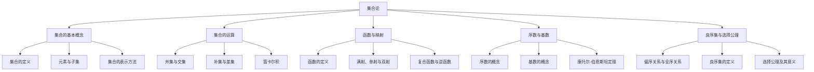

# 集合论导引：集合论上依定义扩充

## 1. 背景介绍
### 1.1 集合论的历史与发展
#### 1.1.1 康托尔的贡献
#### 1.1.2 悖论的发现与克服
#### 1.1.3 现代集合论的形成

### 1.2 集合论在数学中的地位
#### 1.2.1 作为数学基础的集合论
#### 1.2.2 集合论与数理逻辑的关系
#### 1.2.3 集合论在其他数学分支中的应用

### 1.3 本文的主要内容与目的
#### 1.3.1 集合论上的定义扩充
#### 1.3.2 本文的结构安排
#### 1.3.3 阅读本文的意义

## 2. 核心概念与联系
### 2.1 集合的基本概念
#### 2.1.1 集合的定义
#### 2.1.2 元素与子集
#### 2.1.3 集合的表示方法

### 2.2 集合的运算
#### 2.2.1 并集与交集
#### 2.2.2 补集与差集
#### 2.2.3 笛卡尔积

### 2.3 函数与映射
#### 2.3.1 函数的定义
#### 2.3.2 满射、单射与双射
#### 2.3.3 复合函数与逆函数

### 2.4 序数与基数
#### 2.4.1 序数的概念
#### 2.4.2 基数的概念
#### 2.4.3 康托尔-伯恩斯坦定理

### 2.5 良序集与选择公理
#### 2.5.1 偏序关系与全序关系
#### 2.5.2 良序集的定义
#### 2.5.3 选择公理及其意义



## 3. 核心算法原理具体操作步骤
### 3.1 集合论上依定义扩充的原理
#### 3.1.1 定义扩充的概念
#### 3.1.2 定义扩充的必要性
#### 3.1.3 定义扩充的可行性

### 3.2 集合论上依定义扩充的步骤
#### 3.2.1 确定原始集合系统
#### 3.2.2 引入新的定义
#### 3.2.3 验证新定义的合理性
#### 3.2.4 探讨新定义带来的结果

### 3.3 集合论上依定义扩充的实例
#### 3.3.1 自然数集的定义扩充
#### 3.3.2 实数集的定义扩充
#### 3.3.3 超限序数的定义扩充

## 4. 数学模型和公式详细讲解举例说明
### 4.1 ZFC公理化集合论
#### 4.1.1 ZFC公理系统介绍
#### 4.1.2 ZFC公理的形式化表述
#### 4.1.3 ZFC公理的相容性与独立性

### 4.2 序数算术
#### 4.2.1 序数算术的运算法则
#### 4.2.2 序数的顺序拓扑
#### 4.2.3 $\epsilon$ 归纳法

### 4.3 基数算术
#### 4.3.1 基数算术的运算法则
#### 4.3.2 阿列夫数系
#### 4.3.3 基数的可测性问题

### 4.4 集合代数
#### 4.4.1 集合代数的定义
#### 4.4.2 集合代数的基本定律
$$
\begin{aligned}
A \cup B &= B \cup A \\
A \cap B &= B \cap A \\
A \cup (B \cup C) &= (A \cup B) \cup C \\
A \cap (B \cap C) &= (A \cap B) \cap C \\
A \cup (B \cap C) &= (A \cup B) \cap (A \cup C) \\
A \cap (B \cup C) &= (A \cap B) \cup (A \cap C)
\end{aligned}
$$
#### 4.4.3 集合代数在命题逻辑中的应用

## 5. 项目实践：代码实例和详细解释说明
### 5.1 Python中的集合类型
#### 5.1.1 Python中集合的创建
```python
set1 = {1, 2, 3}
set2 = set([4, 5, 6])
```
#### 5.1.2 Python中集合的基本操作
```python
set1.add(4)
set1.remove(2)
set1.union(set2)
set1.intersection(set2)
set1.difference(set2)
```
#### 5.1.3 Python中集合的应用实例

### 5.2 C++中的STL集合容器
#### 5.2.1 C++中set和multiset容器
```cpp
#include <set>
std::set<int> set1 = {1, 2, 3};
std::multiset<int> mset1 = {1, 2, 2, 3};
```
#### 5.2.2 C++中unordered_set和unordered_multiset容器
```cpp
#include <unordered_set>
std::unordered_set<int> uset1 = {1, 2, 3};
std::unordered_multiset<int> umset1 = {1, 2, 2, 3};
```
#### 5.2.3 C++中集合容器的常用操作与应用

### 5.3 Java中的Set接口及其实现类
#### 5.3.1 Java中HashSet和TreeSet类
```java
Set<Integer> set1 = new HashSet<>(Arrays.asList(1, 2, 3));
Set<Integer> set2 = new TreeSet<>(Arrays.asList(4, 5, 6));
```
#### 5.3.2 Java中LinkedHashSet类
```java
Set<Integer> set3 = new LinkedHashSet<>(Arrays.asList(1, 2, 3));
```
#### 5.3.3 Java中Set接口的常用方法与应用

## 6. 实际应用场景
### 6.1 数据库中的集合操作
#### 6.1.1 SQL中的集合运算
#### 6.1.2 NoSQL数据库中的集合应用
#### 6.1.3 数据库查询优化中的集合理论

### 6.2 信息检索中的集合模型
#### 6.2.1 布尔检索模型
#### 6.2.2 向量空间模型
#### 6.2.3 概率检索模型

### 6.3 人工智能中的集合论应用
#### 6.3.1 知识表示中的集合论
#### 6.3.2 模糊集合理论
#### 6.3.3 粗糙集理论

### 6.4 其他领域中的集合论应用
#### 6.4.1 操作研究中的集合论
#### 6.4.2 电路设计中的集合论
#### 6.4.3 社会学中的集合论

## 7. 工具和资源推荐
### 7.1 集合论学习资源
#### 7.1.1 经典教材推荐
#### 7.1.2 在线课程与视频资源
#### 7.1.3 相关论文与研究资料

### 7.2 集合论研究工具
#### 7.2.1 数学软件与计算机代数系统
#### 7.2.2 定理证明辅助工具
#### 7.2.3 可视化与交互式演示工具

### 7.3 集合论相关的学术会议与期刊
#### 7.3.1 重要的集合论学术会议
#### 7.3.2 权威的集合论研究期刊
#### 7.3.3 集合论研究社区与组织

## 8. 总结：未来发展趋势与挑战
### 8.1 集合论研究的前沿领域
#### 8.1.1 大基数集合论
#### 8.1.2 描述集合论
#### 8.1.3 逆向数学

### 8.2 集合论面临的挑战与难题
#### 8.2.1 连续统假设的独立性问题
#### 8.2.2 无穷组合原理的应用与局限
#### 8.2.3 集合论悖论的新进展

### 8.3 集合论的未来发展方向
#### 8.3.1 集合论与计算机科学的融合
#### 8.3.2 集合论在人工智能中的新应用
#### 8.3.3 跨学科研究中集合论的作用

## 9. 附录：常见问题与解答
### 9.1 集合论的基础问题
#### 9.1.1 什么是集合？
#### 9.1.2 集合论中的悖论有哪些？
#### 9.1.3 ZFC公理系统是什么？

### 9.2 集合论的进阶问题
#### 9.2.1 什么是选择公理？它有什么作用？
#### 9.2.2 连续统假设是什么？它为什么重要？
#### 9.2.3 什么是康托尔-伯恩斯坦定理？

### 9.3 集合论的应用问题
#### 9.3.1 集合论在数学中有哪些应用？
#### 9.3.2 集合论在计算机科学中有哪些应用？
#### 9.3.3 集合论在其他学科中还有哪些应用？

作者：禅与计算机程序设计艺术 / Zen and the Art of Computer Programming