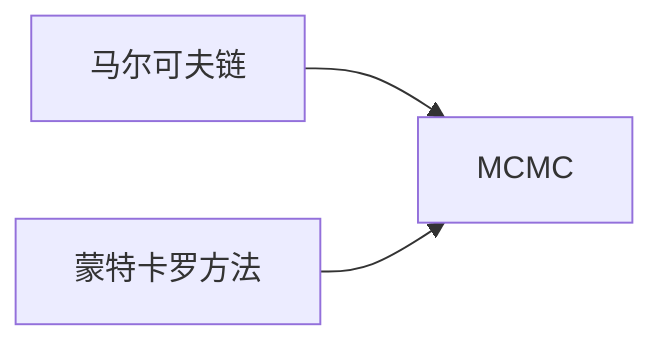
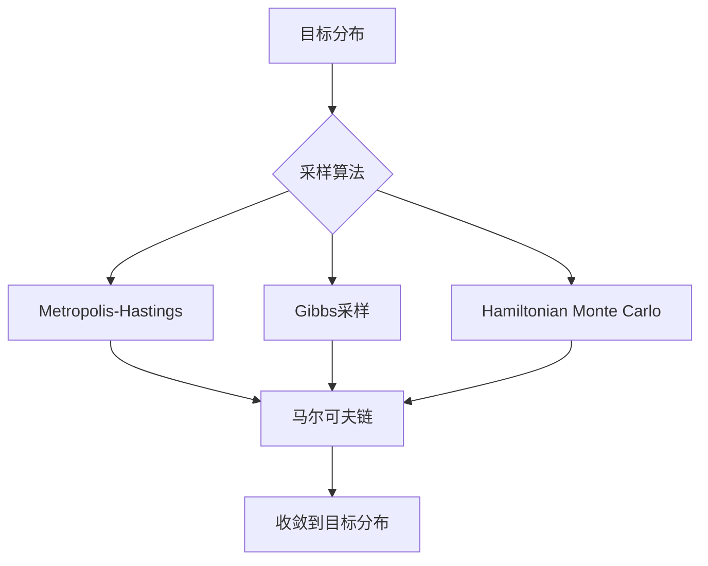

# 马尔可夫链蒙特卡罗(MCMC)原理与代码实战案例讲解

## 1. 背景介绍
### 1.1 MCMC的起源与发展
#### 1.1.1 MCMC的诞生
#### 1.1.2 MCMC在统计学中的应用
#### 1.1.3 MCMC在机器学习中的应用

### 1.2 MCMC的重要性
#### 1.2.1 解决高维复杂概率模型的推断问题
#### 1.2.2 在贝叶斯统计和机器学习中的广泛应用
#### 1.2.3 推动计算科学和人工智能的发展

## 2. 核心概念与联系
### 2.1 马尔可夫链
#### 2.1.1 马尔可夫性
#### 2.1.2 转移矩阵
#### 2.1.3 平稳分布

### 2.2 蒙特卡罗方法
#### 2.2.1 随机抽样
#### 2.2.2 重要性采样
#### 2.2.3 拒绝采样

### 2.3 MCMC的核心思想
#### 2.3.1 利用马尔可夫链构建采样过程
#### 2.3.2 通过蒙特卡罗方法估计概率分布
#### 2.3.3 收敛到目标分布的平稳态

## 3. 核心算法原理具体操作步骤
### 3.1 Metropolis-Hastings算法
#### 3.1.1 算法流程
#### 3.1.2 接受率的计算
#### 3.1.3 算法的收敛性

### 3.2 Gibbs采样
#### 3.2.1 完全条件分布
#### 3.2.2 坐标轮换采样
#### 3.2.3 算法的收敛性

### 3.3 Hamiltonian Monte Carlo (HMC)
#### 3.3.1 哈密顿动力学
#### 3.3.2 Leapfrog数值积分
#### 3.3.3 算法的优势与局限性

## 4. 数学模型和公式详细讲解举例说明
### 4.1 接受率的推导
#### 4.1.1 细致平稳条件
#### 4.1.2 Metropolis-Hastings算法的接受率
#### 4.1.3 Gibbs采样的接受率

### 4.2 收敛性分析
#### 4.2.1 遍历定理
#### 4.2.2 几何遍历性
#### 4.2.3 收敛速度的影响因素

### 4.3 案例分析：高斯混合模型
#### 4.3.1 模型定义与似然函数
#### 4.3.2 Gibbs采样的推导
#### 4.3.3 收敛性与结果分析

## 5. 项目实践：代码实例和详细解释说明
### 5.1 Metropolis-Hastings算法实现
#### 5.1.1 目标分布的设定
#### 5.1.2 提议分布的选择
#### 5.1.3 接受率的计算与决策
#### 5.1.4 完整的Python实现

### 5.2 Gibbs采样实现
#### 5.2.1 完全条件分布的推导
#### 5.2.2 坐标轮换采样的实现
#### 5.2.3 收敛性诊断与结果分析
#### 5.2.4 完整的Python实现

### 5.3 HMC算法实现
#### 5.3.1 哈密顿动力学的数值模拟
#### 5.3.2 Leapfrog积分的实现
#### 5.3.3 接受率的计算与决策
#### 5.3.4 完整的Python实现

## 6. 实际应用场景
### 6.1 贝叶斯参数估计
#### 6.1.1 先验分布与似然函数
#### 6.1.2 后验分布的MCMC采样
#### 6.1.3 参数估计与不确定性量化

### 6.2 隐马尔可夫模型
#### 6.2.1 模型定义与状态序列
#### 6.2.2 前向-后向算法与Baum-Welch算法
#### 6.2.3 MCMC在隐马尔可夫模型中的应用

### 6.3 主题模型
#### 6.3.1 潜在狄利克雷分配(LDA)模型
#### 6.3.2 Gibbs采样在LDA中的应用
#### 6.3.3 主题提取与文本分类

## 7. 工具和资源推荐
### 7.1 MCMC工具包
#### 7.1.1 PyMC3
#### 7.1.2 Stan
#### 7.1.3 JAGS与BUGS

### 7.2 可视化与诊断工具
#### 7.2.1 Matplotlib与Seaborn
#### 7.2.2 ArviZ
#### 7.2.3 MCMCDiagnostics

### 7.3 学习资源
#### 7.3.1 教材与书籍推荐
#### 7.3.2 在线课程与教程
#### 7.3.3 研究论文与综述

## 8. 总结：未来发展趋势与挑战
### 8.1 MCMC在大数据时代的机遇
#### 8.1.1 并行化与分布式计算
#### 8.1.2 随机梯度MCMC算法
#### 8.1.3 与深度学习的结合

### 8.2 MCMC的理论挑战
#### 8.2.1 收敛性诊断与评估
#### 8.2.2 高维数据的采样效率
#### 8.2.3 非参数与半参数模型的MCMC推断

### 8.3 MCMC在人工智能中的未来角色
#### 8.3.1 贝叶斯深度学习
#### 8.3.2 强化学习中的探索与利用
#### 8.3.3 因果推断与决策支持

## 9. 附录：常见问题与解答
### 9.1 MCMC与其他采样方法的比较
### 9.2 如何选择合适的MCMC算法
### 9.3 MCMC在高维数据中的应用建议
### 9.4 MCMC的收敛性诊断方法
### 9.5 MCMC在实际项目中的注意事项

作者：禅与计算机程序设计艺术 / Zen and the Art of Computer Programming