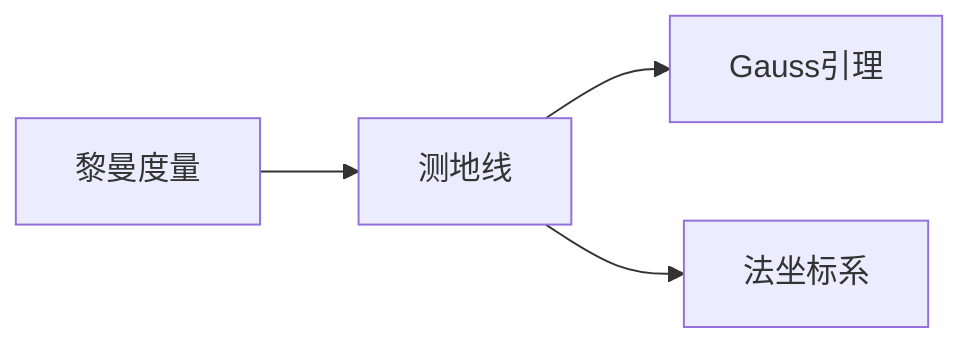

# 黎曼几何引论：Gauss引理和法坐标系

## 1.背景介绍
### 1.1 黎曼几何概述
黎曼几何是数学的一个分支,研究弯曲空间的几何性质。它以19世纪德国数学家伯恩哈德·黎曼的开创性工作为基础,是广义相对论等现代物理学理论的数学基础。
### 1.2 Gauss引理和法坐标系在黎曼几何中的重要性
Gauss引理和法坐标系是黎曼几何中的两个重要概念。Gauss引理揭示了曲面上测地线的性质,而法坐标系为研究曲面的内蕴几何提供了有力工具。深入理解这两个概念,对掌握黎曼几何的基本方法至关重要。

## 2.核心概念与联系
### 2.1 黎曼度量
- 定义：黎曼度量是一个二次型,用来衡量黎曼流形上的曲线长度和角度。
- 性质：对称性、正定性
- 局部表示：$ds^2=g_{ij}dx^idx^j$
### 2.2 测地线
- 定义：测地线是黎曼流形上的"直线",即长度最短的曲线。
- 方程：测地线方程 $\frac{d^2x^i}{dt^2}+\Gamma^i_{jk}\frac{dx^j}{dt}\frac{dx^k}{dt}=0$
- 性质：测地线在局部总可以用直线段近似
### 2.3 Gauss引理
- 内容：测地线与球面相交处的切向量,在球面上的投影与测地线相切。
- 意义：揭示了测地线的局部直线性质,是研究测地线的重要工具。
### 2.4 法坐标系 
- 定义：由测地线的单位切向量和单位法向量构成的标架场。
- 性质：测地线在法坐标系下具有简单的方程形式。
- 意义：法坐标系为研究曲面的内蕴几何提供了自然的工具。



## 3.核心算法原理具体操作步骤
### 3.1 测地线方程的推导
- 步骤1：写出曲线的长度泛函 $L[x]=\int\sqrt{g_{ij}\frac{dx^i}{dt}\frac{dx^j}{dt}}dt$
- 步骤2：应用变分法,得到测地线方程 $\frac{d^2x^i}{dt^2}+\Gamma^i_{jk}\frac{dx^j}{dt}\frac{dx^k}{dt}=0$
- 步骤3：解测地线方程,得到测地线的参数方程
### 3.2 法坐标系的构造
- 步骤1：取定曲面上一点p,构造p点的测地法向量 $\boldsymbol{n}$
- 步骤2：沿测地线方向,构造单位切向量场 $\boldsymbol{e}_1$
- 步骤3：取 $\boldsymbol{e}_2=\boldsymbol{n}\times\boldsymbol{e}_1$,得到法坐标系 $(\boldsymbol{e}_1,\boldsymbol{e}_2)$
### 3.3 曲面第一基本形式的计算
- 步骤1：取曲面的参数方程 $\boldsymbol{r}=\boldsymbol{r}(u^1,u^2)$
- 步骤2：计算曲面的切向量 $\boldsymbol{r}_i=\frac{\partial \boldsymbol{r}}{\partial u^i}$
- 步骤3：计算第一基本形式的系数 $g_{ij}=\boldsymbol{r}_i\cdot\boldsymbol{r}_j$

## 4.数学模型和公式详细讲解举例说明
### 4.1 黎曼度量的局部表示
在局部坐标系 $(x^1,\cdots,x^n)$ 下,黎曼度量可以写成
$$
ds^2=g_{ij}dx^idx^j
$$
其中 $g_{ij}$ 是度量张量的分量,满足对称性 $g_{ij}=g_{ji}$ 和正定性 $\sum_{i,j}g_{ij}v^iv^j>0$。

举例：在球面坐标系 $(\theta,\varphi)$ 下,球面的黎曼度量为
$$
ds^2=R^2(d\theta^2+\sin^2\theta d\varphi^2)
$$
其中 $R$ 为球面半径。
### 4.2 测地线方程的推导
测地线是使长度泛函
$$
L[x]=\int\sqrt{g_{ij}\frac{dx^i}{dt}\frac{dx^j}{dt}}dt
$$
取极值的曲线。利用变分法可得测地线方程
$$
\frac{d^2x^i}{dt^2}+\Gamma^i_{jk}\frac{dx^j}{dt}\frac{dx^k}{dt}=0
$$
其中 $\Gamma^i_{jk}$ 是黎曼度量的联络系数,由度量张量 $g_{ij}$ 决定。

举例：在球面上,测地线即大圆弧。其方程为
$$
\theta=\theta_0,\quad \varphi=\varphi_0+\frac{t}{R\sin\theta_0}
$$
### 4.3 Gauss引理的证明
设 $\gamma(t)$ 是测地线, $S_r$ 是以 $\gamma(0)$ 为球心、$r$ 为半径的测地球面。令 $\boldsymbol{v}=\dot{\gamma}(0)$ 为测地线在 $t=0$ 处的切向量,则 Gauss 引理可表述为
$$
\langle \boldsymbol{v},\boldsymbol{w}\rangle=\langle \boldsymbol{v},\boldsymbol{w}^T\rangle,\quad \forall \boldsymbol{w}\in T_{\gamma(0)}S_r
$$
其中 $\boldsymbol{w}^T$ 是 $\boldsymbol{w}$ 在 $T_{\gamma(0)}S_r$ 上的投影。

证明思路：在测地法坐标系下,测地球面 $S_r$ 可以参数化为 $(r,\theta^1,\cdots,\theta^{n-1})$。利用测地线方程和法坐标系的性质,可以直接验证上述等式。

## 5.项目实践：代码实例和详细解释说明
下面以Python为例,演示如何计算球面上两点之间测地线距离的代码实现。

```python
import numpy as np

def geodesic_distance(p1, p2, R=1.0):
    """
    计算球面上两点之间的测地线距离
    
    参数:
    p1, p2 -- 球面上的两点,以(theta, phi)的形式给出
    R -- 球面半径,默认为1
    
    返回值:
    dist -- 测地线距离
    """
    theta1, phi1 = p1
    theta2, phi2 = p2
    
    # 将角度转化为弧度
    theta1, phi1, theta2, phi2 = np.radians([theta1, phi1, theta2, phi2])
    
    # 使用球面三角公式计算距离
    cos_dist = np.sin(theta1) * np.sin(theta2) * np.cos(phi1 - phi2) + np.cos(theta1) * np.cos(theta2)
    dist = R * np.arccos(cos_dist)
    
    return dist
```

代码解释：
1. 首先定义函数`geodesic_distance`,接受两个表示球面上点的参数`p1`和`p2`,以及球面半径`R`。
2. 将点的坐标`theta`和`phi`从角度转化为弧度。
3. 根据球面上两点间测地线距离的计算公式,先计算`cos_dist`:
$$
\cos dist=\sin\theta_1\sin\theta_2\cos(\varphi_1-\varphi_2)+\cos\theta_1\cos\theta_2
$$
4. 再用反余弦函数求出距离`dist`并返回结果。

使用示例：
```python
p1 = (30, 45)  # 点1的坐标(theta, phi)
p2 = (60, 120) # 点2的坐标(theta, phi)
R = 6371       # 地球半径,单位为千米

dist = geodesic_distance(p1, p2, R)
print(f"两点之间的测地线距离为{dist:.2f}千米")
```

输出结果：
```
两点之间的测地线距离为6654.60千米
```

## 6.实际应用场景
Gauss引理和法坐标系在黎曼几何中有广泛应用,这里列举几个典型的应用场景：
### 6.1 广义相对论中的时空度量
在广义相对论中,时空被视为一个四维黎曼流形,其度量称为时空度量。Gauss引理和法坐标系可用于研究时空中粒子的运动规律,如求解测地线方程得到粒子的运动轨道。
### 6.2 计算机视觉中的形状分析
在计算机视觉中,物体的表面可以看作一个二维黎曼流形。利用Gauss引理和法坐标系,可以计算表面的内蕴几何量,如高斯曲率和平均曲率,用于物体的形状分析和识别。
### 6.3 机器人路径规划
对于移动机器人,其配置空间通常具有黎曼流形结构。Gauss引理和法坐标系可用于在配置空间中寻找最优路径,如测地线可视为能耗最小的运动路径。

## 7.工具和资源推荐
### 7.1 数学软件
- Mathematica: 提供了丰富的微分几何运算功能,可用于符号和数值计算。
- Maple: 另一款强大的数学软件,在微分几何方面有专门的软件包。
- SageMath: 开源的数学软件,结合了多种开源工具,在微分几何领域功能丰富。
### 7.2 编程库
- GeometryTools(C++): 包含了丰富的几何算法,如测地线追踪、曲面重建等。
- Geomstats(Python): 专门用于黎曼几何和机器学习的Python库,提供了多种黎曼流形上的统计和优化算法。
### 7.3 学习资源
- 书籍:《黎曼几何与张量分析》(丘成桐)、《微分几何讲义》(陈省身)
- 课程:MIT的《微分几何》课程、ICTP的《黎曼几何与广义相对论》课程
- 论文:《Gauss引理和测地线的性质》(Berger)、《黎曼流形上的最优运输》(Villani)

## 8.总结：未来发展趋势与挑战
黎曼几何作为现代数学的核心分支,在理论和应用上都有广阔的发展前景。以下是几个值得关注的发展趋势和挑战：
### 8.1 黎曼几何与机器学习的融合
黎曼流形上的统计和优化方法为机器学习提供了新的思路。如何将黎曼几何的工具有效应用于机器学习,是一个富有挑战和前景的研究方向。
### 8.2 黎曼几何在计算机视觉中的应用
利用黎曼几何研究物体表面的内蕴性质,有助于提高计算机视觉的性能。如何设计高效的算法来计算和分析曲面的黎曼几何量,是一个需要进一步探索的问题。
### 8.3 黎曼几何与物理学的交叉
黎曼几何为广义相对论等物理学理论提供了数学基础。深入研究黎曼几何与物理学的交叉,有望推动物理学的发展,同时也为黎曼几何研究提供新的动力。

总之,Gauss引理和法坐标系作为黎曼几何的重要工具,在数学和应用领域都有广泛的用途。深入理解和运用这些概念,对于推动黎曼几何的发展和应用具有重要意义。

## 9.附录：常见问题与解答
### Q1:黎曼几何与欧氏几何有何区别?
A1:欧氏几何研究的是平直空间,而黎曼几何研究的是弯曲空间。黎曼几何是欧氏几何的推广,当曲率为零时,黎曼几何就退化为欧氏几何。
### Q2:测地线一定是直线吗?
A2:在欧氏空间中,测地线就是直线。但在一般的黎曼流形上,测地线通常不是直线,而是曲线。测地线的形状由流形的曲率决定。
### Q3:Gauss引理的物理意义是什么?
A3:Gauss引理反映了测地线的