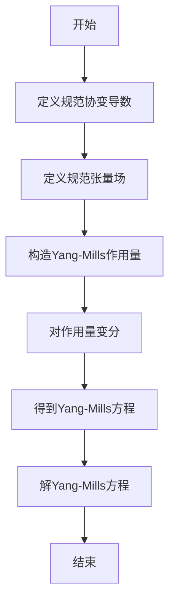

# 黎曼几何引论：Yang-Mills 场简介

## 1. 背景介绍

### 1.1 广义相对论与几何化引力

爱因斯坦的广义相对论是现代物理学的一个里程碑,它将引力几何化,将曲率空间时间与物质能量的分布联系起来。这一理论的核心是爱因斯坦场方程:

$$
R_{\mu\nu} - \frac{1}{2}g_{\mu\nu}R = \frac{8\pi G}{c^4}T_{\mu\nu}
$$

其中,左边是关于度规张量 $g_{\mu\nu}$ 的几何项,描述了时空的曲率;右边是物质的能量动量张量 $T_{\mu\nu}$。这个方程揭示了物质决定时空几何,而时空几何又决定物质的运动,二者相互作用、相辅相成。

### 1.2 规范场理论与 Yang-Mills 场

规范场理论是描述基本相互作用的一类理论,包括了量子电动力学、量子色动力学等。在这些理论中,相互作用通过规范场来传递,规范场满足一定的规范对称性。Yang-Mills 理论就是描述非阿贝尔规范场的一类理论。

## 2. 核心概念与联系

### 2.1 黎曼几何

黎曼几何是研究曲面和更一般的流形的内禀几何性质的数学分支。在黎曼流形上,我们可以定义张量场、曲率等概念,并研究它们的性质。广义相对论中的时空就是一个四维黎曼流形。

### 2.2 规范理论与规范场

在规范理论中,我们考虑一个内禀对称性,即在规范变换下,理论的形式保持不变。为了实现这一对称性,需要引入规范场。规范场的变换规则由规范对称性决定,从而使整个理论在规范变换下保持协变性。

### 2.3 Yang-Mills 场

Yang-Mills 场是描述非阿贝尔规范场的理论。在这里,规范群是一个非阿贝尔 Lie 群,例如 SU(N)。Yang-Mills 场的动力学由类似于麦克斯韦方程的 Yang-Mills 方程给出。这些方程在数学上与黎曼几何密切相关。

## 3. 核心算法原理具体操作步骤

Yang-Mills 理论的核心是 Yang-Mills 作用量和 Yang-Mills 方程。我们将逐步介绍它们的推导过程。

### 3.1 规范协变导数

在规范理论中,我们需要定义一个协变导数,使其在规范变换下也保持协变性。对于一个矢量场 $\psi$,其规范协变导数定义为:

$$
D_\mu \psi = \partial_\mu \psi - i g A_\mu \psi
$$

其中 $A_\mu$ 是规范场,称为 Yang-Mills 场;$g$ 是耦合常数。

### 3.2 规范张量

我们可以定义规范张量场的规范协变导数,例如对于一个规范张量场 $F_{\mu\nu}$,其协变导数为:

$$
D_\lambda F_{\mu\nu} = \partial_\lambda F_{\mu\nu} - i g [A_\lambda, F_{\mu\nu}]
$$

这里的括号表示对应的 Lie 代数算子的对易算子。

### 3.3 Yang-Mills 作用量

Yang-Mills 作用量是一个关于规范场 $A_\mu$ 的函数,定义为:

$$
S = \int \mathcal{L} d^4 x, \quad \mathcal{L} = -\frac{1}{4}F_{\mu\nu}^a F^{a\mu\nu}
$$

这里 $F_{\mu\nu}^a$ 是规范张量场的规范协变导数:

$$
F_{\mu\nu}^a = \partial_\mu A_\nu^a - \partial_\nu A_\mu^a + g f^{abc} A_\mu^b A_\nu^c
$$

其中 $f^{abc}$ 是规范群的结构常数。

### 3.4 Yang-Mills 方程

对 Yang-Mills 作用量变分,可以得到 Yang-Mills 方程:

$$
D_\mu F^{a\mu\nu} = J^{a\nu}
$$

这里 $J^{a\nu}$ 是源项,描述了与规范场耦合的物质场。当 $J^{a\nu}=0$ 时,我们得到无源 Yang-Mills 方程:

$$
D_\mu F^{a\mu\nu} = 0
$$

这个方程描述了规范场 $A_\mu^a$ 的动力学行为。

### 3.5 算法流程图

下面是 Yang-Mills 理论核心算法的流程图:



## 4. 数学模型和公式详细讲解举例说明

在这一部分,我们将详细解释 Yang-Mills 理论中的一些关键数学模型和公式。

### 4.1 Lie 代数和 Lie 群

Yang-Mills 理论中的规范群是一个非阿贝尔 Lie 群,例如 SU(N) 群。与每个 Lie 群相关联的是一个 Lie 代数,其中的元素是该群的无穷小生成元。

对于 SU(N) 群,其 Lie 代数由 N×N 的反迷射、无迹矩阵生成。我们可以选取一组基矢 $\{T^a\}$,使得:

$$
[T^a, T^b] = i f^{abc} T^c
$$

这里 $f^{abc}$ 是结构常数,满足某些代数性质。

### 4.2 规范变换

规范变换是 Yang-Mills 理论中的一个关键概念。对于一个复数值矢量场 $\psi$,其规范变换定义为:

$$
\psi \rightarrow U \psi = e^{i\alpha^a(x) T^a} \psi
$$

这里 $\alpha^a(x)$ 是任意的规范变换函数,而 $U$ 是一个规范群元素。

为了使理论在规范变换下保持协变性,我们需要引入规范场 $A_\mu$,其变换规则为:

$$
A_\mu \rightarrow U A_\mu U^{-1} - \frac{i}{g}(\partial_\mu U)U^{-1}
$$

### 4.3 规范张量场

在 Yang-Mills 理论中,我们定义了一个反对易的规范张量场:

$$
F_{\mu\nu}^a = \partial_\mu A_\nu^a - \partial_\nu A_\mu^a + g f^{abc} A_\mu^b A_\nu^c
$$

这个张量场在规范变换下也保持协变性:

$$
F_{\mu\nu} \rightarrow U F_{\mu\nu} U^{-1}
$$

$F_{\mu\nu}$ 可以看作是 Yang-Mills 场的"曲率",类似于广义相对论中的黎曼曲率张量。

### 4.4 Yang-Mills 作用量

Yang-Mills 作用量是一个关于规范场 $A_\mu$ 的函数,定义为:

$$
S = \int \mathcal{L} d^4 x, \quad \mathcal{L} = -\frac{1}{4}F_{\mu\nu}^a F^{a\mu\nu}
$$

这个作用量在规范变换下是invariant的,因此保持了规范对称性。通过变分原理,我们可以从这个作用量导出 Yang-Mills 方程。

### 4.5 Yang-Mills 方程

对 Yang-Mills 作用量变分,可以得到 Yang-Mills 方程:

$$
D_\mu F^{a\mu\nu} = J^{a\nu}
$$

这里 $J^{a\nu}$ 是源项,描述了与规范场耦合的物质场。当 $J^{a\nu}=0$ 时,我们得到无源 Yang-Mills 方程:

$$
D_\mu F^{a\mu\nu} = 0
$$

这个方程描述了规范场 $A_\mu^a$ 的动力学行为,类似于麦克斯韦方程描述电磁场的行为。

## 5. 项目实践:代码实例和详细解释说明

在这一部分,我们将给出一个使用 Python 编程语言实现 Yang-Mills 理论数值求解的示例项目。该项目基于有限元方法,可以求解无源 Yang-Mills 方程在给定边界条件下的数值解。

### 5.1 项目概述

该项目的主要目标是编写一个 Python 程序,使用有限元方法求解无源 Yang-Mills 方程在给定计算域和边界条件下的数值解。程序将输出规范场 $A_\mu^a$ 在计算域内的数值解析解。

该项目包含以下主要模块:

1. `mesh_generator.py`: 生成计算域的网格划分
2. `fe_assembly.py`: 组装有限元矩阵和向量
3. `solver.py`: 求解线性代数方程组
4. `visualization.py`: 可视化数值解
5. `main.py`: 主程序入口

### 5.2 网格生成

我们使用 `gmsh` 这一开源网格生成器生成计算域的三角形网格。`mesh_generator.py` 模块包装了 `gmsh` 的 Python API,用于生成网格文件。

```python
import gmsh

gmsh.initialize()

# 定义计算域几何
gmsh.model.add("Yang-Mills")
gmsh.model.geo.addPoint(0, 0, 0, 1)
gmsh.model.geo.addPoint(1, 0, 0, 2)
...

# 生成网格
gmsh.model.mesh.generate(2)

# 写入网格文件
gmsh.write("mesh.msh")

gmsh.finalize()
```

### 5.3 有限元组装

`fe_assembly.py` 模块实现了有限元矩阵和向量的组装过程。我们使用最简单的线性有限元基函数,并基于 Yang-Mills 作用量的变分形式进行组装。

```python
import numpy as np
from scipy.sparse import csr_matrix

def assemble_matrix(mesh):
    ...
    for cell in mesh.cells:
        # 计算元素矩阵
        Ke = compute_element_matrix(cell)
        
        # 组装到全局矩阵
        for i in range(3):
            for j in range(3):
                I = cell.nodes[i]
                J = cell.nodes[j]
                K[I, J] += Ke[i, j]
    
    return csr_matrix(K)

def assemble_vector(mesh, boundary_conditions):
    ...
```

### 5.4 线性代数求解器

`solver.py` 模块使用 SciPy 的稀疏线性代数求解器来求解有限元方程组。我们可以使用不同的求解算法,如共轭梯度法或直接求解器。

```python
from scipy.sparse.linalg import spsolve

def solve(A, b, boundary_conditions):
    # 应用边界条件
    ...
    
    # 求解线性代数方程组
    x = spsolve(A, b)
    
    return x
```

### 5.5 可视化

`visualization.py` 模块使用 `matplotlib` 库对数值解进行可视化。我们可以绘制规范场 $A_\mu^a$ 在计算域内的分布图。

```python
import matplotlib.pyplot as plt

def visualize(mesh, solution):
    # 绘制网格
    ...
    
    # 绘制数值解
    for cell in mesh.cells:
        ...
        plt.tripcolor(x, y, solution[cell.nodes])
    
    plt.colorbar()
    plt.show()
```

### 5.6 主程序

`main.py` 是整个项目的主程序入口,它将调用上述各个模块完成整个计算过程。

```python
from mesh_generator import generate_mesh
from fe_assembly import assemble_matrix, assemble_vector
from solver import solve
from visualization import visualize

# 生成网格
mesh = generate_mesh()

# 组装矩阵和向量
A = assemble_matrix(mesh)
b = assemble_vector(mesh, boundary_conditions)

# 求解线性代数方程组
solution = solve(A, b, boundary_conditions)

# 可视化数值解
visualize(mesh, solution)
```

通过这个示例项目,我们可以看到如何使用 Python 编程语言实现 Yang-Mills 理论的数值求解。虽然这只是一个简单的示例,但它展示了有限元方法在求解偏微分方程时的基本思路和实现过程。

## 6. 实际应用场景

Yang-Mills 理论在粒子物理学和量子场论中扮演着重要角色,描述了强相互作用和电弱相互作用的基本规律。它在以下领域有着广泛的应用:

### 6.1 量子色动力学

量子色动力学 (QCD) 是描述强相互作用