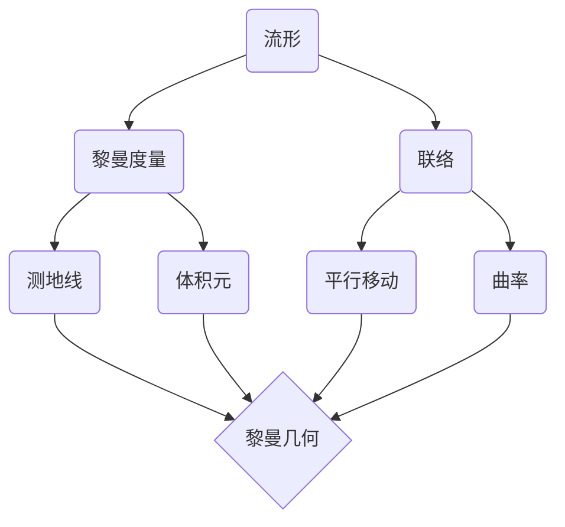

# 黎曼几何引论：空间形式

## 1. 背景介绍
### 1.1 黎曼几何的历史渊源
### 1.2 黎曼几何的基本思想
### 1.3 黎曼几何在现代科学中的地位

## 2. 核心概念与联系
### 2.1 流形
#### 2.1.1 流形的定义
#### 2.1.2 流形的例子
#### 2.1.3 流形的性质
### 2.2 黎曼度量  
#### 2.2.1 黎曼度量的定义
#### 2.2.2 黎曼度量的性质
#### 2.2.3 黎曼度量的例子
### 2.3 联络
#### 2.3.1 联络的定义 
#### 2.3.2 联络的性质
#### 2.3.3 联络的例子
### 2.4 曲率
#### 2.4.1 曲率的定义
#### 2.4.2 曲率的性质 
#### 2.4.3 曲率的例子

## 3. 核心算法原理具体操作步骤
### 3.1 测地线方程的推导
### 3.2 黎曼曲率张量的计算
### 3.3 黎曼流形上的积分定理

## 4. 数学模型和公式详细讲解举例说明 
### 4.1 黎曼度量张量
#### 4.1.1 黎曼度量张量的定义
$$
g = g_{ij}dx^i \otimes dx^j
$$
其中$g_{ij}$是度量张量的分量，$dx^i$是切向量的对偶基。
#### 4.1.2 黎曼度量张量的例子
在欧氏空间$\mathbb{R}^n$中，标准度量为
$$
g = \sum_{i=1}^n dx^i \otimes dx^i
$$
### 4.2 测地线方程
#### 4.2.1 测地线方程的定义
设$\gamma: [a,b] \to M$是流形$M$上的一条曲线，如果$\gamma$满足方程
$$
\frac{D}{dt}\dot{\gamma}^k + \Gamma_{ij}^k\dot{\gamma}^i\dot{\gamma}^j = 0
$$
其中$\Gamma_{ij}^k$是联络的Christoffel符号，则称$\gamma$是一条测地线。
#### 4.2.2 测地线方程的例子
在欧氏空间中，测地线就是直线。设$\gamma(t) = (x^1(t),\cdots,x^n(t))$是欧氏空间中的一条曲线，则$\gamma$是测地线当且仅当对每个分量$x^i(t)$都满足
$$
\frac{d^2x^i}{dt^2} = 0
$$
即每个分量都是一个线性函数。

## 5. 项目实践：代码实例和详细解释说明
### 5.1 用Python计算黎曼曲率张量
```python
import sympy as sp 

def curvature_tensor(g, c):
    n = len(c)
    R = sp.zeros(n,n,n,n)
    for i in range(n):
        for j in range(n): 
            for k in range(n):
                for l in range(n):
                    term1 = 0
                    term2 = 0
                    for m in range(n):
                        term1 += g[i,m]*(sp.diff(c[m,k,l],c[j]) - sp.diff(c[m,j,l],c[k]))
                        for p in range(n):
                            term2 += c[i,m,p]*c[p,k,l] - c[i,k,p]*c[p,m,l]
                    R[i,j,k,l] = term1 + term2
    return R
```
其中`g`是度量张量，`c`是联络的Christoffel符号，函数返回黎曼曲率张量在给定坐标系下的表达式。

### 5.2 用Mathematica绘制双曲面
```mathematica
ParametricPlot3D[
 {Cos[u] Cosh[v], Sin[u] Cosh[v], Sinh[v]}, 
 {u, 0, 2 Pi}, {v, -2, 2}, 
 PlotStyle -> Opacity[0.8], Mesh -> None, 
 PlotPoints -> 50, MaxRecursion -> 4, 
 Boxed -> False, Axes -> False
]
```
这段代码绘制了双曲面$\mathbb{H}^2$在$\mathbb{R}^3$中的图像。双曲面是黎曼几何中的一个重要例子。

## 6. 实际应用场景
### 6.1 广义相对论中的时空几何
### 6.2 流形学习在机器学习中的应用
### 6.3 黎曼几何在计算机视觉中的应用

## 7. 工具和资源推荐
### 7.1 学习黎曼几何的书籍推荐
- John M. Lee, Introduction to Riemannian Manifolds
- Manfredo P. do Carmo, Riemannian Geometry  
- Jurgen Jost, Riemannian Geometry and Geometric Analysis
### 7.2 黎曼几何计算软件推荐 
- Mathematica的微分几何包
- Sage的微分几何功能
- GeometricTools的C++几何算法库

## 8. 总结：未来发展趋势与挑战
### 8.1 黎曼几何与人工智能的结合
### 8.2 黎曼几何在理论物理中的新进展
### 8.3 计算黎曼几何的新算法与新技术

## 9. 附录：常见问题与解答
### 9.1 如何直观理解黎曼度量？
### 9.2 测地线有什么物理意义？
### 9.3 黎曼曲率张量的对称性有哪些？



以上是对黎曼几何基本概念之间逻辑关系的一个总结。黎曼几何以流形为研究对象，流形上的黎曼度量给出了测地线的概念和体积元的定义，而联络则给出了向量平行移动的规则和曲率的定义。测地线、体积元、平行移动和曲率共同构成了黎曼几何的核心内容。黎曼几何不仅是现代微分几何的基础，也是广义相对论等物理学理论的数学语言，在当代科学中有着广泛而深刻的应用。

作者：禅与计算机程序设计艺术 / Zen and the Art of Computer Programming