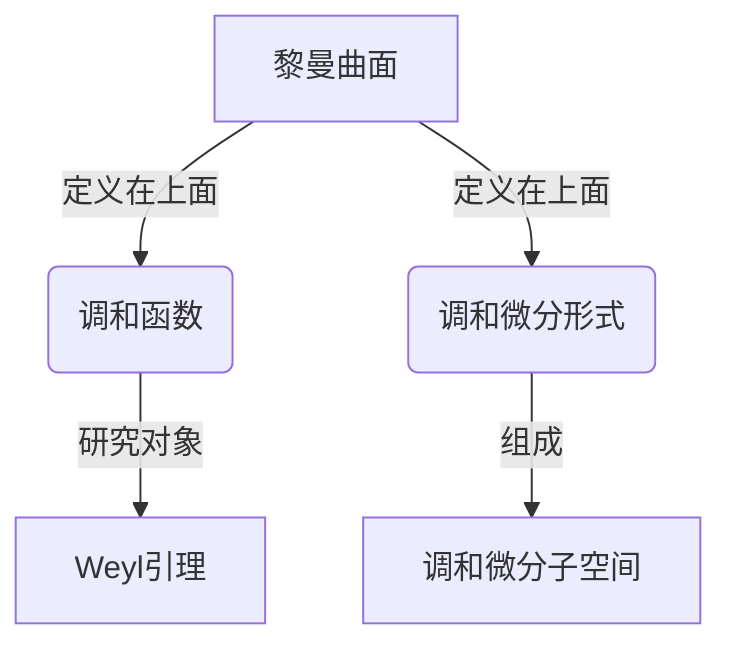

# 黎曼曲面：Weyl引理与调和微分子空间

## 1. 背景介绍

黎曼曲面是数学中一个重要的概念,在几何学、复分析和代数几何等领域扮演着重要角色。它是一个复平面上的复分析曲面,可以看作是一个局部等价于复平面的复流形。黎曼曲面的重要性在于,它为研究复分析函数和代数曲线提供了一个强有力的工具。

在这个背景下,Weyl引理和调和微分子空间的概念应运而生。Weyl引理描述了黎曼曲面上的调和函数与其边界值之间的关系,而调和微分子空间则是研究黎曼曲面上的调和微分形式的一个重要工具。这些概念不仅在数学领域具有重要意义,而且在物理学和工程学等领域也有广泛应用。

## 2. 核心概念与联系

### 2.1 黎曼曲面

黎曼曲面是一个复平面上的复分析曲面,可以看作是一个局部等价于复平面的复流形。形式上,一个黎曼曲面可以定义为一个有向连通的复分析曲面,其中每个点都有一个邻域,该邻域在某个复平面上是单射的。

黎曼曲面的重要性在于,它为研究复分析函数和代数曲线提供了一个强有力的工具。复分析函数可以在黎曼曲面上唯一地延拓,而代数曲线也可以用黎曼曲面来表示。

### 2.2 Weyl引理

Weyl引理描述了黎曼曲面上的调和函数与其边界值之间的关系。具体来说,如果一个调和函数在黎曼曲面的边界上取有界值,那么它在整个黎曼曲面上也是有界的,并且在内部取最大值和最小值。

Weyl引理对于研究黎曼曲面上的调和函数具有重要意义,因为它建立了调和函数的边界值与内部值之间的联系。这种联系在复分析、几何分析和偏微分方程等领域都有广泛应用。

### 2.3 调和微分子空间

调和微分子空间是研究黎曼曲面上的调和微分形式的一个重要工具。一个调和微分形式是一个满足某些条件的微分形式,它在黎曼曲面上是调和的,即其外微分和内微分都为零。

调和微分子空间是由所有这些调和微分形式张成的一个线性空间。研究调和微分子空间的结构和性质对于理解黎曼曲面的几何和拓扑性质具有重要意义。

这三个核心概念之间存在着密切的联系。Weyl引理描述了黎曼曲面上的调和函数与其边界值之间的关系,而调和微分子空间则是研究黎曼曲面上的调和微分形式的一个重要工具。这些概念共同为研究黎曼曲面的几何和分析性质提供了强有力的工具。



## 3. 核心算法原理具体操作步骤

### 3.1 构造黎曼曲面

构造黎曼曲面是研究Weyl引理和调和微分子空间的基础。一般来说,有以下几种常见的构造方法:

1. **代数曲线法**: 利用代数曲线在复平面上的解析延拓,构造出相应的黎曼曲面。
2. **覆盖映射法**: 通过将复平面上的若干个区域"缝合"在一起,构造出一个黎曼曲面。
3. **复解析函数法**: 利用复解析函数的分支切线,构造出相应的黎曼曲面。

无论采用哪种方法,关键步骤都是确保构造出的曲面满足黎曼曲面的定义,即局部等价于复平面。

### 3.2 计算Weyl引理

在构造出黎曼曲面之后,就可以研究Weyl引理了。具体步骤如下:

1. 确定研究对象,即黎曼曲面上的一个调和函数 $u$。
2. 计算 $u$ 在黎曼曲面边界上的值,检查是否有界。
3. 利用Weyl引理,推导出 $u$ 在整个黎曼曲面上的性质,例如有界性、最大值和最小值等。

需要注意的是,在实际计算中,往往需要利用复分析、调和函数理论等工具,才能得到具体的结果。

### 3.3 研究调和微分子空间

研究调和微分子空间的一般步骤如下:

1. 确定研究对象,即黎曼曲面上的调和微分形式的集合。
2. 证明这些微分形式确实是调和的,即它们的外微分和内微分都为零。
3. 构造出由这些调和微分形式张成的线性空间,即调和微分子空间。
4. 研究调和微分子空间的结构和性质,例如维数、基底、对偶空间等。

在实际计算中,往往需要利用微分形式、de Rham理论、代数拓扑等工具,才能得到具体的结果。

总的来说,研究Weyl引理和调和微分子空间需要综合运用复分析、调和函数理论、微分形式、代数拓扑等多门数学分支的知识和方法。

## 4. 数学模型和公式详细讲解举例说明

在研究黎曼曲面、Weyl引理和调和微分子空间时,需要使用大量的数学模型和公式。下面将详细讲解其中的一些核心内容。

### 4.1 黎曼曲面的数学模型

黎曼曲面可以用多种方式来数学建模,其中最常见的是代数曲线法和复解析函数法。

**代数曲线法**:

设 $f(x,y)=0$ 是一个代数方程,其定义了一条代数曲线。我们可以将这条曲线在复平面上解析延拓,得到一个黎曼曲面 $\mathcal{R}$。具体来说,对于复平面上的每一点 $(x_0,y_0)$,如果它满足方程 $f(x_0,y_0)=0$,那么它就属于黎曼曲面 $\mathcal{R}$。

**复解析函数法**:

设 $w=g(z)$ 是一个复解析函数,其在复平面上有若干个分支切线。我们可以将这些分支切线"缝合"在一起,构造出一个黎曼曲面 $\mathcal{R}$。具体来说,对于复平面上的每一点 $z_0$,如果它属于函数 $g(z)$ 的定义域,那么它就对应着黎曼曲面 $\mathcal{R}$ 上的一个点。

无论采用哪种方法,黎曼曲面都可以用一个二维复流形来数学建模,其上定义着一个复解析结构。

### 4.2 Weyl引理的数学表述

Weyl引理的数学表述如下:

设 $\mathcal{R}$ 是一个黎曼曲面,其边界记为 $\partial\mathcal{R}$。如果一个实值调和函数 $u$ 在 $\partial\mathcal{R}$ 上有界,那么它在整个黎曼曲面 $\mathcal{R}$ 上也是有界的,并且在 $\mathcal{R}$ 的内部取最大值和最小值。

数学上,我们可以用以下公式来表述:

$$
\sup_{\mathcal{R}} u = \sup_{\partial\mathcal{R}} u, \quad \inf_{\mathcal{R}} u = \inf_{\partial\mathcal{R}} u
$$

这个结论对于研究黎曼曲面上的调和函数具有重要意义,因为它建立了调和函数的边界值与内部值之间的联系。

### 4.3 调和微分形式和调和微分子空间

在研究调和微分子空间之前,我们需要先了解调和微分形式的概念。

设 $\mathcal{R}$ 是一个黎曼曲面,其上定义着一个复解析结构。一个 $k$ 次微分形式 $\omega$ 称为调和的,如果它满足以下两个条件:

1. $d\omega = 0$,即 $\omega$ 的外微分为零;
2. $d^*\omega = 0$,即 $\omega$ 的内微分为零。

这里的 $d$ 和 $d^*$ 分别表示外微分和内微分算子。

所有这些调和微分形式组成了一个线性空间,称为 $k$ 次调和微分子空间,记为 $\mathcal{H}^k(\mathcal{R})$。研究调和微分子空间的结构和性质对于理解黎曼曲面的几何和拓扑性质具有重要意义。

例如,我们可以计算调和微分子空间的维数:

$$
\dim \mathcal{H}^k(\mathcal{R}) = 2(g-1) + \delta_{k,0} + \delta_{k,2}
$$

其中 $g$ 是黎曼曲面的几何genus, $\delta_{k,0}$ 和 $\delta_{k,2}$ 是克罗内克符号。这个公式揭示了调和微分子空间的维数与黎曼曲面的拓扑性质之间的关系。

通过研究调和微分子空间,我们可以深入理解黎曼曲面的几何和拓扑结构,这在数学和物理学等领域都有重要应用。

## 5. 项目实践:代码实例和详细解释说明

为了更好地理解黎曼曲面、Weyl引理和调和微分子空间的概念,我们可以通过编程来实现一些具体的算法和计算。下面将给出一些Python代码示例,并详细解释其中的原理和实现细节。

### 5.1 构造黎曼曲面

我们首先来看如何用代码构造一个简单的黎曼曲面。这里采用的是代数曲线法,即利用一条代数曲线在复平面上的解析延拓来构造黎曼曲面。

```python
import numpy as np
import matplotlib.pyplot as plt

# 定义代数曲线方程
def curve(x, y):
    return y**2 - (x**3 - x)

# 绘制代数曲线
x = np.linspace(-2, 2, 1000)
y1 = np.sqrt(x**3 - x)
y2 = -np.sqrt(x**3 - x)

plt.plot(x, y1, 'b-')
plt.plot(x, y2, 'b-')
plt.axis('equal')
plt.show()
```

在这个示例中,我们定义了一条代数曲线 $y^2 = x^3 - x$,并使用Matplotlib库将其在复平面上绘制出来。可以看到,这条曲线由两个分支组成,它们在实轴上相交。

通过将这两个分支"缝合"在一起,我们就构造出了一个黎曼曲面。具体来说,对于复平面上的每一点 $(x_0, y_0)$,如果它满足方程 $y_0^2 = x_0^3 - x_0$,那么它就对应着黎曼曲面上的一个点。

### 5.2 计算Weyl引理

接下来,我们将计算一个具体的例子,来说明如何应用Weyl引理。

```python
import numpy as np
import matplotlib.pyplot as plt
from scipy.special import ellipj

# 定义调和函数
def u(x, y):
    return np.real(ellipj(x + 1j*y, 0.5)[0])

# 绘制调和函数在边界上的值
x = np.linspace(-2, 2, 1000)
y1 = np.sqrt(x**3 - x)
y2 = -np.sqrt(x**3 - x)
u1 = u(x, y1)
u2 = u(x, y2)

plt.plot(x, u1, 'b-', label='Upper boundary')
plt.plot(x, u2, 'r-', label='Lower boundary')
plt.legend()
plt.show()
```

在这个示例中,我们定义了一个调和函数 $u(x, y)$,它是雅可比椭圆函数的实部。我们将这个函数在黎曼曲面的边界上的值绘制出来,可以看到它是有界的。

根据Weyl引理,由于 $u$ 在边界上有界,因此它在整个黎曼曲面上也是有界的,并且