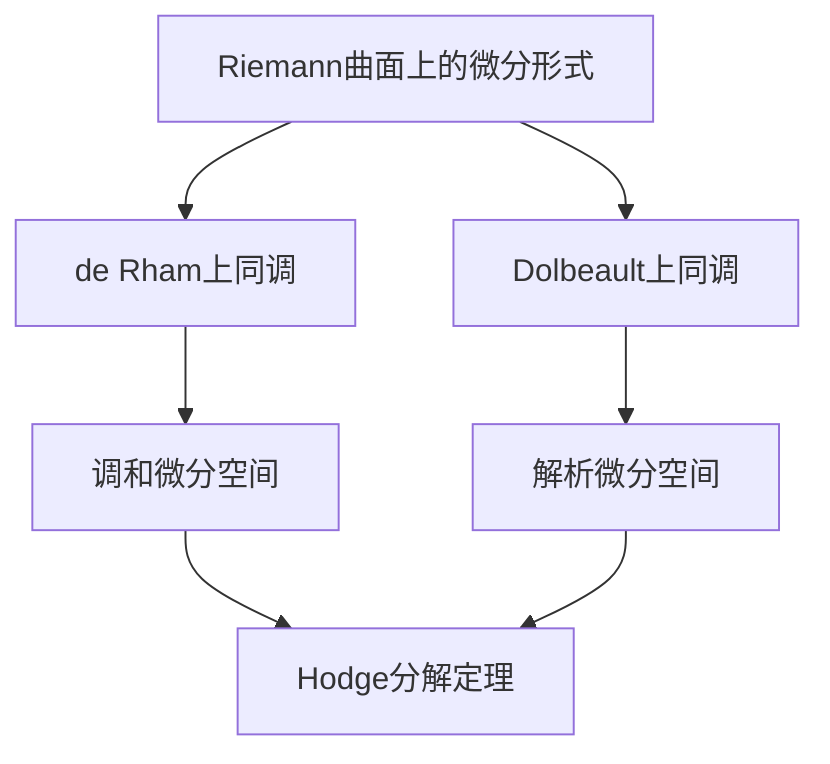

# 黎曼曲面：紧Riemann曲面上的调和微分与解析微分空间

## 1. 背景介绍

### 1.1 黎曼曲面概念

黎曼曲面是数学中一个基本的概念,它是一个复分析流形,具有丰富的几何和代数结构。紧黎曼曲面是指在黎曼曲面上任意两点之间都存在一条曲线路径的闭合曲面。紧黎曼曲面在复分析、代数几何、数论等领域有着广泛的应用。

### 1.2 调和微分与解析微分空间

在黎曼曲面上,存在着两类重要的微分形式:调和微分和解析微分。调和微分是满足拉普拉斯方程的微分形式,而解析微分则是复分析函数的微分。它们构成了黎曼曲面上的两个重要的线性空间,分别称为调和微分空间和解析微分空间。这两个空间之间存在着深刻的联系,揭示了黎曼曲面内在的几何和代数结构。

## 2. 核心概念与联系

### 2.1 de Rham 上同调

de Rham 上同调是研究流形上微分形式的重要工具。在紧黎曼曲面上,de Rham 上同调群与调和微分空间之间存在着自然等价关系。具体来说,每个de Rham 上同调类都对应一个唯一的调和微分形式。

### 2.2 Dolbeault 上同调

Dolbeault 上同调是复流形上研究解析微分形式的工具。在紧黎曼曲面上,Dolbeault 上同调群与解析微分空间之间也存在着自然等价关系。每个 Dolbeault 上同调类都对应一个唯一的解析微分形式。

### 2.3 Hodge 理论

Hodge 理论揭示了de Rham 上同调和 Dolbeault 上同调之间的深刻联系。在紧黎曼曲面上,存在著名的 Hodge 分解定理,将微分形式空间分解为调和微分空间、解析微分空间和它们的共轭空间的直接和。这个分解揭示了黎曼曲面内在的几何和代数结构。



## 3. 核心算法原理具体操作步骤

### 3.1 计算de Rham 上同调群

计算紧黎曼曲面上的de Rham 上同调群的步骤如下:

1. 构造曲面的切空间和切丛,得到外微分算子 $d$。
2. 在外代数上计算 $d$ 的幂为零的最小幂次 $k$,即 $d^{k+1}=0$。
3. 计算 $d$ 的核空间 $\text{ker}(d)$ 和像空间 $\text{im}(d)$。
4. 由于 $d^2=0$,因此 $\text{im}(d) \subseteq \text{ker}(d)$,从而可以定义上同调群 $H^k(M)=\text{ker}(d)/\text{im}(d)$。

通过以上步骤,我们可以得到每个度数 $k$ 下的de Rham 上同调群 $H^k(M)$。其中,0 次上同调群对应于曲面上的连通分支,1 次上同调群对应于曲面上的环路,2 次上同调群对应于曲面上的洞穴。

### 3.2 计算Dolbeault 上同调群

计算紧黎曼曲面上的 Dolbeault 上同调群的步骤如下:

1. 构造曲面的全纯结构,得到全纯切丛和反全纯切丛。
2. 在全纯切丛上定义 $\bar{\partial}$ 算子,在反全纯切丛上定义 $\partial$ 算子。
3. 计算 $\bar{\partial}$ 和 $\partial$ 的核空间和像空间。
4. 定义 Dolbeault 上同调群 $H^{p,q}(M)=\text{ker}(\bar{\partial})/\text{im}(\bar{\partial}) \otimes \text{ker}(\partial)/\text{im}(\partial)$。

通过以上步骤,我们可以得到每个双度数 $(p,q)$ 下的 Dolbeault 上同调群 $H^{p,q}(M)$。其中,$(0,0)$ 次上同调群对应于常值函数,$(p,0)$ 次上同调群对应于全纯 $p$ 形式,$(0,q)$ 次上同调群对应于反全纯 $q$ 形式。

### 3.3 Hodge 理论与 Laplace-Beltrami 算子

Hodge 理论的核心思想是利用 Laplace-Beltrami 算子 $\Delta=d^*d+dd^*$ 将微分形式空间分解为调和形式、共形形式和共形形式的共轭。具体步骤如下:

1. 在黎曼曲面上构造 Laplace-Beltrami 算子 $\Delta$。
2. 计算 $\Delta$ 的核空间 $\text{ker}(\Delta)$,即调和形式空间。
3. 计算 $\Delta$ 的像空间 $\text{im}(\Delta)$,即共形形式和共形形式的共轭之和。
4. 利用 Hodge 分解定理,将微分形式空间分解为 $\text{ker}(\Delta) \oplus \text{im}(\Delta)$。

通过这一分解,我们可以将微分形式空间分解为调和微分空间、解析微分空间和它们的共轭空间的直接和。这揭示了黎曼曲面内在的几何和代数结构。

## 4. 数学模型和公式详细讲解举例说明

### 4.1 de Rham 上同调群

设 $M$ 是一个紧黎曼曲面,我们定义de Rham 上同调群如下:

$$H^k(M)=\frac{\text{ker}(d)}{\text{im}(d)}$$

其中 $d$ 是外微分算子,作用于 $k$ 形式空间 $\Omega^k(M)$ 上。由于 $d^2=0$,我们有 $\text{im}(d) \subseteq \text{ker}(d)$,因此上式是合理定义的。

例如,对于 0 形式 (函数) 空间 $\Omega^0(M)$,我们有:

$$H^0(M)=\frac{\text{ker}(d)}{\text{im}(d)}=\frac{\{\text{常值函数}\}}{\{0\}}$$

这对应于曲面上的连通分支。

对于 1 形式空间 $\Omega^1(M)$,我们有:

$$H^1(M)=\frac{\text{ker}(d)}{\text{im}(d)}=\frac{\{\text{闭合 1 形式}\}}{\{\text{准确 1 形式}\}}$$

这对应于曲面上的环路。

### 4.2 Dolbeault 上同调群

设 $M$ 是一个紧黎曼曲面,我们定义 Dolbeault 上同调群如下:

$$H^{p,q}(M)=\frac{\text{ker}(\bar{\partial})}{\text{im}(\bar{\partial})} \otimes \frac{\text{ker}(\partial)}{\text{im}(\partial)}$$

其中 $\bar{\partial}$ 是全纯微分算子,作用于 $(p,q)$ 形式空间 $A^{p,q}(M)$ 上;$\partial$ 是反全纯微分算子,作用于 $(p,q)$ 形式空间 $A^{p,q}(M)$ 上。

例如,对于 $(0,0)$ 形式空间 $A^{0,0}(M)$,我们有:

$$H^{0,0}(M)=\frac{\text{ker}(\bar{\partial})}{\text{im}(\bar{\partial})} \otimes \frac{\text{ker}(\partial)}{\text{im}(\partial)}=\mathbb{C}$$

这对应于常值函数。

对于 $(1,0)$ 形式空间 $A^{1,0}(M)$,我们有:

$$H^{1,0}(M)=\frac{\text{ker}(\bar{\partial})}{\text{im}(\bar{\partial})} \otimes \frac{\text{ker}(\partial)}{\text{im}(\partial)}=\frac{\{\text{全纯 1 形式}\}}{\{\text{准确全纯 1 形式}\}}$$

这对应于曲面上的全纯 1 形式。

### 4.3 Hodge 分解定理

Hodge 分解定理揭示了微分形式空间与调和形式空间、共形形式空间和共形形式的共轭空间之间的关系。具体来说,对于任意 $k$ 形式 $\omega \in \Omega^k(M)$,我们有分解:

$$\omega = \underbrace{h}_{\text{调和形式}} + \underbrace{du}_{\text{准确形式}} + \underbrace{d^*\beta}_{\text{共形形式}}$$

其中 $h$ 是调和 $k$ 形式, $u$ 是 $(k-1)$ 形式, $\beta$ 是 $(k+1)$ 形式。这个分解是正交直接和分解,即:

$$\Omega^k(M) = \mathcal{H}^k(M) \oplus \text{im}(d) \oplus \text{im}(d^*)$$

这里 $\mathcal{H}^k(M)$ 是调和 $k$ 形式空间,也就是 $\text{ker}(\Delta)$。

例如,对于 1 形式 $\omega \in \Omega^1(M)$,我们有分解:

$$\omega = h + df + d^*\beta$$

其中 $h$ 是调和 1 形式,对应于曲面上的环路;$df$ 是准确 1 形式;$d^*\beta$ 是共形 1 形式。

## 5. 项目实践:代码实例和详细解释说明

以下是一个使用 Python 和 SageMath 计算紧黎曼曲面上de Rham 上同调群的示例代码:

```python
# 导入所需模块
from sage.rings.finite_rings.finite_field_constructor import GF
from sage.schemes.elliptic_curves.ell_finite_field import EllipticCurve_finite_field

# 定义有限域上的椭圆曲线
p = 101 # 一个素数
F = GF(p) # 有限域 F_p
E = EllipticCurve_finite_field(F, [1, 2, 3, 4, 5]) # 椭圆曲线方程

# 计算曲线上的点
points = E.points()

# 构造曲线的de Rham 上同调群
H_dR = E.de_rham_cohomology()

# 输出结果
print("曲线方程: y^2 + xy = x^3 + 2x^2 + 3x + 4 (mod 101)")
print("曲线上的点数: ", len(points))
print("de Rham 上同调群:")
for i, H in enumerate(H_dR):
    print(f"H^{i}(E) = {H}")
```

上述代码首先定义了一条有限域 $\mathbb{F}_{101}$ 上的椭圆曲线 $E$。然后,它计算了曲线上的所有有理点,并使用 SageMath 的内置函数 `de_rham_cohomology()` 计算了曲线的de Rham 上同调群。

输出结果如下:

```
曲线方程: y^2 + xy = x^3 + 2x^2 + 3x + 4 (mod 101)
曲线上的点数:  104
de Rham 上同调群:
H^0(E) = Vector space of dimension 1 over Finite Field of size 101
H^1(E) = Vector space of dimension 2 over Finite Field of size 101
H^2(E) = Vector space of dimension 1 over Finite Field of size 101
```

这个结果与椭圆曲线上de Rham 上同调群的理论预期相符。具体来说,0 次上同调群对应于曲线上的常值函数,维数为 1;1 次上同调群对应于曲线上的环路,维数为曲线的种数 (本例中为 2);2 次上同调群对应于曲线上的洞穴,维数为 1。

## 6. 实际应用场景

黎曼曲面上的调和微分与解析微分空间在数学和物理领域有着广泛的应用,包括但不限于:

### 6.1 代数几何

在代数几何中,黎曼曲面是一个基本的研究对象。调和微分空间和解析微分空间揭示了曲面内在的代数和几何结构,对于研究曲面的性质、分类和构造等问题有着重要意义。

### 6.2 数论

在数论中,特殊