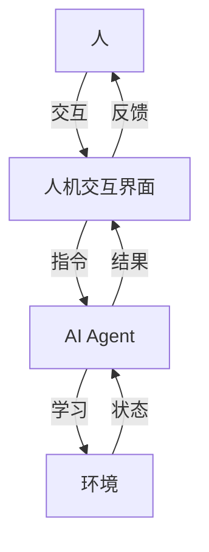

# AI Agent: AI的下一个风口 人机协同的方法和框架

## 1. 背景介绍
### 1.1 人工智能发展历程
#### 1.1.1 人工智能的起源与发展
#### 1.1.2 人工智能的三次浪潮
#### 1.1.3 人工智能的现状与挑战

### 1.2 人机协同的兴起
#### 1.2.1 人机协同的概念
#### 1.2.2 人机协同的必要性
#### 1.2.3 人机协同的优势

## 2. 核心概念与联系
### 2.1 AI Agent的定义
#### 2.1.1 Agent的概念
#### 2.1.2 AI Agent的特点
#### 2.1.3 AI Agent与传统AI的区别

### 2.2 人机协同的核心要素
#### 2.2.1 人的作用
#### 2.2.2 机器的作用 
#### 2.2.3 人机交互界面

### 2.3 AI Agent与人机协同的关系
#### 2.3.1 AI Agent是人机协同的关键
#### 2.3.2 人机协同促进AI Agent的发展
#### 2.3.3 AI Agent与人机协同的协同效应

## 3. 核心算法原理具体操作步骤
### 3.1 基于强化学习的AI Agent
#### 3.1.1 强化学习的基本原理
#### 3.1.2 基于值函数的方法
#### 3.1.3 基于策略梯度的方法

### 3.2 基于深度学习的AI Agent
#### 3.2.1 深度学习的基本原理  
#### 3.2.2 卷积神经网络（CNN）
#### 3.2.3 循环神经网络（RNN）

### 3.3 基于进化算法的AI Agent
#### 3.3.1 进化算法的基本原理
#### 3.3.2 遗传算法（GA）
#### 3.3.3 进化策略（ES）

## 4. 数学模型和公式详细讲解举例说明
### 4.1 马尔可夫决策过程（MDP）
#### 4.1.1 MDP的定义
$$
M=\langle S,A,P,R,\gamma \rangle
$$
其中，$S$是状态空间，$A$是动作空间，$P$是状态转移概率矩阵，$R$是奖励函数，$\gamma$是折扣因子。

#### 4.1.2 MDP的贝尔曼方程
$$
V^\pi(s)=\sum_{a\in A}\pi(a|s)\sum_{s'\in S}P(s'|s,a)[R(s,a,s')+\gamma V^\pi(s')]
$$

#### 4.1.3 MDP在强化学习中的应用

### 4.2 深度Q网络（DQN）
#### 4.2.1 Q学习的基本原理
$$
Q(s_t,a_t) \leftarrow Q(s_t,a_t)+\alpha[r_{t+1}+\gamma \max_aQ(s_{t+1},a)-Q(s_t,a_t)]
$$

#### 4.2.2 DQN的网络结构
#### 4.2.3 DQN的损失函数
$$
L(\theta)=\mathbb{E}_{(s,a,r,s')\sim D}[(r+\gamma \max_{a'}Q(s',a';\theta^-)-Q(s,a;\theta))^2]
$$

### 4.3 演化算法
#### 4.3.1 适应度函数
#### 4.3.2 选择算子
#### 4.3.3 交叉算子与变异算子

## 5. 项目实践：代码实例和详细解释说明
### 5.1 基于OpenAI Gym的强化学习Agent
#### 5.1.1 环境搭建
#### 5.1.2 DQN算法实现
#### 5.1.3 训练与测试

### 5.2 基于TensorFlow的CNN图像分类Agent
#### 5.2.1 数据集准备
#### 5.2.2 CNN模型构建 
#### 5.2.3 训练与评估

### 5.3 基于NEAT的进化Agent
#### 5.3.1 NEAT算法原理
#### 5.3.2 NEAT-Python库的使用
#### 5.3.3 实验结果分析

## 6. 实际应用场景
### 6.1 智能客服
#### 6.1.1 客服机器人的现状
#### 6.1.2 基于AI Agent的智能客服系统
#### 6.1.3 人机协同在客服领域的应用

### 6.2 自动驾驶
#### 6.2.1 自动驾驶的发展现状
#### 6.2.2 基于AI Agent的自动驾驶系统
#### 6.2.3 人机协同在自动驾驶领域的应用

### 6.3 智能制造
#### 6.3.1 工业4.0与智能制造
#### 6.3.2 基于AI Agent的智能生产系统
#### 6.3.3 人机协同在智能制造领域的应用

## 7. 工具和资源推荐
### 7.1 开源框架
#### 7.1.1 TensorFlow
#### 7.1.2 PyTorch
#### 7.1.3 Keras

### 7.2 开发平台
#### 7.2.1 OpenAI Gym
#### 7.2.2 Unity ML-Agents
#### 7.2.3 DeepMind Lab

### 7.3 学习资源
#### 7.3.1 在线课程
#### 7.3.2 书籍推荐
#### 7.3.3 研究论文

## 8. 总结：未来发展趋势与挑战
### 8.1 AI Agent的发展趋势
#### 8.1.1 多智能体协同
#### 8.1.2 跨领域融合
#### 8.1.3 人机共生

### 8.2 人机协同的未来展望
#### 8.2.1 人机协同的新模式
#### 8.2.2 人机协同的新应用
#### 8.2.3 人机协同的新挑战

### 8.3 AI Agent与人机协同的挑战与机遇
#### 8.3.1 技术挑战
#### 8.3.2 伦理挑战
#### 8.3.3 发展机遇

## 9. 附录：常见问题与解答
### 9.1 AI Agent与人工智能的区别是什么？
### 9.2 人机协同与人机交互有何不同？
### 9.3 如何评估AI Agent的性能？
### 9.4 人机协同会取代人类吗？
### 9.5 AI Agent的发展对就业有何影响？

AI Agent 是人工智能领域的新兴方向，它强调智能体与环境的交互，通过不断的感知、决策和行动来优化自身的策略，从而完成特定的任务。与传统的人工智能相比，AI Agent 更加注重自主性、适应性和连续性，能够在动态变化的环境中持续学习和优化。

人机协同是指人与智能机器在完成任务的过程中相互配合、协作，发挥各自的优势，以达到"1+1>2"的效果。在人机协同中，人的作用主要体现在提供领域知识、制定目标、监督决策等方面；机器的作用主要体现在数据处理、优化计算、自动执行等方面；而人机交互界面则是连接人和机器的纽带，负责信息交换和指令传递。

AI Agent 与人机协同有着紧密的联系。一方面，AI Agent 是实现人机协同的关键技术，它能够感知人的需求，理解人的意图，执行人的指令，从而实现人机之间的无缝衔接；另一方面，人机协同为 AI Agent 的发展提供了广阔的应用空间和实践场景，推动 AI Agent 向着更加智能、更加人性化的方向发展。二者相辅相成，共同促进人工智能的进步。

在 AI Agent 的算法原理方面，主要包括基于强化学习、深度学习和进化算法三大类方法。强化学习通过 Agent 与环境的交互，不断尝试和优化策略，以获得最大的累积奖励；深度学习利用神经网络强大的表示能力，从海量数据中提取特征和规律，实现端到端的学习；进化算法则模拟生物进化的过程，通过种群的迭代和优胜劣汰，搜索最优的问题解。

在数学建模方面，马尔可夫决策过程（MDP）是强化学习的理论基础，它用一个五元组 $\langle S,A,P,R,\gamma \rangle$ 来描述 Agent 与环境的交互过程，其中 $S$ 表示状态空间，$A$ 表示动作空间，$P$ 表示状态转移概率矩阵，$R$ 表示奖励函数，$\gamma$ 表示折扣因子。MDP 的最优策略可以通过值迭代或策略迭代等动态规划算法求解。

深度 Q 网络（DQN）是将深度学习引入强化学习的代表性工作。它使用神经网络来逼近 Q 函数，即状态-动作值函数，通过最小化时序差分（TD）误差来更新网络参数。DQN 在 Atari 游戏、围棋等领域取得了突破性的进展，展示了深度强化学习的巨大潜力。

演化算法是一类启发式优化算法，它借鉴了生物进化的思想，通过选择、交叉、变异等操作来不断改进种群的适应度。遗传算法（GA）和进化策略（ES）是两种常见的演化算法，前者主要用于组合优化问题，后者主要用于连续优化问题。演化算法在机器人控制、参数调优等领域有广泛的应用。

在项目实践方面，OpenAI Gym 提供了一个标准化的强化学习环境，包括 Atari 游戏、机器人控制等多个领域的任务。基于 Gym 环境，可以方便地实现和测试各种强化学习算法，如 DQN、A3C、PPO 等。TensorFlow 和 PyTorch 是两个主流的深度学习框架，它们提供了丰富的 API 和工具，支持快速搭建和训练神经网络模型。NEAT（NeuroEvolution of Augmenting Topologies）是一种基于进化算法的神经网络优化方法，它能够同时优化网络的结构和权重，在 Agent 控制等任务中表现出色。

人机协同在智能客服、自动驾驶、智能制造等领域有广泛的应用前景。在智能客服方面，AI Agent 可以与人工客服协同工作，自动回答常见问题，分析用户意图，提供个性化服务，大大提高客服效率和质量。在自动驾驶方面，AI Agent 可以与人类驾驶员协同，处理复杂的交通场景，确保行车安全，实现人车和谐共处。在智能制造方面，AI Agent 可以与工人协同，优化生产排程，监控设备状态，预测质量问题，推动制造业向智能化、数字化转型。

展望未来，AI Agent 将向着多智能体协同、跨领域融合、人机共生的方向发展。多个 AI Agent 之间可以通过协商、博弈等机制来实现分工与合作，解决复杂的系统优化问题。AI Agent 将与其他学科如认知科学、社会学等深度融合，模拟人类的思维和行为，拓展人工智能的边界。人机协同将成为人机关系的新常态，人类和智能机器将在更广泛的领域实现互补与共赢。

当然，AI Agent 和人机协同的发展也面临着诸多挑战。在技术方面，如何设计安全可靠的 AI Agent，如何实现人机之间的自然交互，如何处理任务的不确定性和动态性等，都需要进一步攻关。在伦理方面，如何避免 AI Agent 的误用和滥用，如何保障人类的主体地位和控制权，如何建立人机协同的行为规范等，也需要各界的共同努力。

总之，AI Agent 是人工智能的一个充满想象力和创造力的新领域，人机协同则是 AI Agent 的一个重要应用方向和实现路径。二者的结合，必将推动人工智能从感知智能、认知智能走向协同智能，开启人机协同的新时代。让我们携手探索 AI Agent 和人机协同的美好未来，让智能科技更好地造福人类社会。

作者：禅与计算机程序设计艺术 / Zen and the Art of Computer Programming