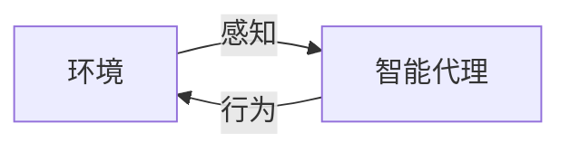
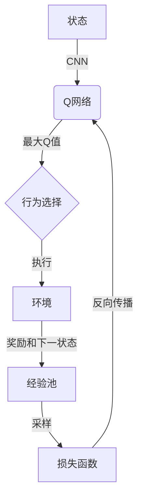

# AI Agent: AI的下一个风口 如何改变用户体验

## 1. 背景介绍

### 1.1 人工智能的发展历程

人工智能(Artificial Intelligence, AI)是当代科技发展的重要领域之一,自20世纪50年代问世以来,经历了起起落落的发展历程。早期的人工智能主要集中在专家系统、机器学习等领域,取得了一些初步成果。进入21世纪后,benefiting from大数据、强大计算能力和新兴算法(如深度学习)的驱动,人工智能技术突飞猛进,在计算机视觉、自然语言处理、决策控制等多个领域取得了突破性进展。

### 1.2 AI Agent的兴起

随着人工智能技术的不断发展和应用场景的日益丰富,AI Agent(智能代理)应运而生。AI Agent是一种软件实体,能够根据环境状态自主地感知、计划和执行行动,以实现特定目标。它集成了人工智能的多项核心技术,如机器学习、自然语言处理、计算机视觉等,并将这些技术应用于实际场景中。

### 1.3 AI Agent的重要性

AI Agent的出现为人机交互注入了新的活力。传统的人机交互方式往往是被动的、单向的,而AI Agent则能主动与人类进行双向交互,更好地理解和响应用户需求。同时,AI Agent还能帮助自动化完成一些重复性、规则性的任务,大大提高了工作效率。可以说,AI Agent正在改变着人类与数字世界的交互方式,给用户体验带来全新的提升。

## 2. 核心概念与联系

### 2.1 智能代理(Intelligent Agent)

智能代理是AI Agent的核心概念。根据Russell和Norvig在《人工智能:一种现代的方法》一书中的定义,智能代理是感知环境并根据这些感知采取行动的任何事物。智能代理需要具备以下几个关键特征:

1. 自主性(Autonomy):能够在无人监督的情况下独立运行
2. 反应性(Reactivity):能够感知环境并相应做出反应
3. 主动性(Pro-activeness):不仅被动响应,还能主动采取行动以实现目标
4. 持续时间(Temporally Continuous):不是一次性的计算,而是持续运行并学习

### 2.2 智能代理与环境的交互

智能代理与环境之间存在着动态的交互关系,可以用下图来描述:



智能代理通过感知器获取环境状态,然后基于内部状态决策下一步的行为,并通过执行器对环境产生影响。这种持续的感知-行为循环使得智能代理能够适应动态变化的环境。

### 2.3 智能代理的构成

一个完整的智能代理通常包括以下几个核心模块:

1. **感知模块**:获取环境信息,如视觉、语音、文本等
2. **状态表示模块**:将感知信息转化为内部可操作的状态表示
3. **决策模块**:根据当前状态和目标,决策下一步的行为
4. **执行模块**:执行决策的行为,对环境产生影响
5. **学习模块**:根据反馈,持续优化状态表示和决策策略

## 3. 核心算法原理具体操作步骤  

### 3.1 马尔可夫决策过程(Markov Decision Process, MDP)

马尔可夫决策过程是描述智能代理与环境交互的数学框架,也是设计和分析智能代理决策算法的基础。一个MDP可以用元组<S,A,T,R>来表示:

- S:状态集合(State Space)
- A:行为集合(Action Space) 
- T:状态转移概率函数(Transition Probability)
- R:奖励函数(Reward Function)

MDP的核心思想是通过最大化预期累积奖励,找到一个最优策略(Optimal Policy),指导智能代理在每个状态下选择行为。

### 3.2 强化学习算法

强化学习是训练智能代理决策策略的主要方法,其基本思路是:

1. 初始化一个策略(通常是随机的)
2. 让智能代理与环境交互,获得状态、行为、奖励序列
3. 根据这些数据,更新策略使得预期累积奖励最大化
4. 重复2-3步骤,直到策略收敛

常见的强化学习算法包括Q-Learning、Sarsa、Policy Gradient等。以Q-Learning为例,其核心更新公式为:

$$Q(s_t,a_t) \leftarrow Q(s_t,a_t) + \alpha[r_t + \gamma\max_aQ(s_{t+1},a) - Q(s_t,a_t)]$$

其中$\alpha$是学习率,$\gamma$是折现因子。通过不断更新Q值函数,最终可以得到一个最优的行为策略。

### 3.3 深度强化学习

传统强化学习算法存在一些局限性,如需要手工设计状态特征、无法处理高维数据等。深度强化学习通过将深度神经网络与强化学习相结合,能够自动从原始数据中提取特征,从而显著提升了算法的性能和泛化能力。

以Deep Q-Network(DQN)为例,其将Q函数用一个卷积神经网络来拟合,输入是当前状态,输出是各个行为对应的Q值。在训练时,通过经验回放的方式,将过往的<状态,行为,奖励,下一状态>的转换存入经验池,然后从中采样数据进行Q网络的训练。DQN在多个复杂的Atari游戏中表现出超越人类的能力。



## 4. 数学模型和公式详细讲解举例说明

### 4.1 马尔可夫决策过程的形式化描述

马尔可夫决策过程(MDP)是一个离散时间的随机控制过程,可以用元组<S, A, P, R, \gamma>来表示:

- S是有限的状态集合
- A是有限的行为集合
- P是状态转移概率函数,定义为$P(s'|s,a)=Pr(S_{t+1}=s'|S_t=s,A_t=a)$
- R是奖励函数,定义为$R(s,a)=\mathbb{E}[R_{t+1}|S_t=s,A_t=a]$
- $\gamma \in [0,1)$是折现因子,用于权衡当前奖励和未来奖励的权重

MDP的目标是找到一个最优策略$\pi^*$,使得预期的累积折现奖励最大化:

$$\pi^* = \arg\max_\pi \mathbb{E}_\pi[\sum_{t=0}^\infty \gamma^t R(S_t, A_t)]$$

其中$\pi$是一个映射函数,将状态映射到行为:$\pi: S \rightarrow A$。

### 4.2 Q-Learning算法

Q-Learning是一种常用的无模型强化学习算法,它不需要事先知道MDP的转移概率和奖励函数,而是通过与环境交互来学习一个行为价值函数Q。

对于任意的状态-行为对(s,a),其行为价值函数定义为:

$$Q(s,a) = \mathbb{E}_\pi[\sum_{k=0}^\infty \gamma^k R_{t+k+1}|S_t=s, A_t=a]$$

也就是在状态s执行行为a后,按照策略$\pi$可以获得的预期累积折现奖励。

Q-Learning的更新规则为:

$$Q(s_t,a_t) \leftarrow Q(s_t,a_t) + \alpha[r_t + \gamma\max_a Q(s_{t+1},a) - Q(s_t,a_t)]$$

其中$\alpha$是学习率。通过不断更新Q值,最终可以收敛到最优的Q函数,对应的贪婪策略就是最优策略。

以下是一个简单的Q-Learning实例:

```python
import numpy as np

# 定义环境
WORLD_SIZE = 5
A_NUMS = 4 # up, down, left, right
        
def step(state, action):
    i, j = state
    if action == 0 and i > 0: # up
        new_state = [i - 1, j]
    elif action == 1 and i < WORLD_SIZE - 1: # down 
        new_state = [i + 1, j]
    elif action == 2 and j > 0: # left
        new_state = [i, j - 1]
    elif action == 3 and j < WORLD_SIZE - 1: # right
        new_state = [i, j + 1]
    else:
        new_state = state
        
    reward = -1
    if new_state == [0, 0]:
        reward = 0
        
    return new_state, reward

# Q-Learning算法
Q = np.zeros([WORLD_SIZE, WORLD_SIZE, A_NUMS])
learning_rate = 0.1
discount = 0.9

for episode in range(1000):
    state = [WORLD_SIZE - 1, WORLD_SIZE - 1] 
    while state != [0, 0]:
        action = np.argmax(Q[state[0], state[1], :])
        new_state, reward = step(state, action)
        
        Q[state[0], state[1], action] += learning_rate * \
            (reward + discount * np.max(Q[new_state[0], new_state[1], :]) - \
             Q[state[0], state[1], action])
             
        state = new_state
        
print(Q[WORLD_SIZE-1, WORLD_SIZE-1, :])
```

上述代码中,我们定义了一个$5\times5$的网格世界,智能体的目标是从(4,4)到达(0,0)。通过Q-Learning算法学习到的最优Q值为:

```
[ 0.  0.  0. -6.6]
```

因此最优策略是一直向左移动。

### 4.3 Deep Q-Network (DQN)

传统的Q-Learning算法存在一些局限性,如需要手工设计状态特征、无法处理高维观测数据等。Deep Q-Network (DQN)通过使用深度神经网络来拟合Q函数,可以直接从原始高维数据(如图像)中学习,从而大大提高了算法的表现力和泛化能力。

DQN的核心思想是使用一个卷积神经网络来近似Q函数:

$$Q(s,a;\theta) \approx Q^*(s,a)$$

其中$\theta$是网络参数。在训练过程中,我们最小化损失函数:

$$L(\theta) = \mathbb{E}_{(s,a,r,s')\sim D}\left[(r + \gamma \max_{a'} Q(s',a';\theta^-) - Q(s,a;\theta))^2\right]$$

其中$D$是经验回放池,包含之前的<状态,行为,奖励,下一状态>转换;$\theta^-$是目标网络参数,用于估计$\max_{a'} Q(s',a';\theta^-)$,以提高训练稳定性。

DQN算法的伪代码如下:

```
初始化Q网络参数$\theta$和目标网络参数$\theta^-$
初始化经验回放池D
for episode:
    初始化状态s
    while not terminated:
        选择行为a = argmax_a Q(s,a;\theta)
        执行行为a,获得奖励r和下一状态s'
        存储转换(s,a,r,s')到D
        从D中采样批量转换
        计算损失L
        用梯度下降更新$\theta$
        每隔一定步数将$\theta^-$更新为$\theta$
```

DQN在多个复杂的Atari游戏中表现出超越人类的能力,标志着深度强化学习的重大突破。

## 5. 项目实践:代码实例和详细解释说明

这里我们将基于OpenAI Gym环境,使用PyTorch实现一个简单的DQN算法,并在经典的CartPole控制任务中进行测试。

### 5.1 环境介绍

CartPole是一个经典的控制系统问题,目标是通过施加左右力,使一根杆保持直立并使小车在轨道上平衡。具体而言,环境状态由4个变量表示:小车位置、小车速度、杆角度和杆角速度。每个时间步,智能体可以选择向左或向右施力。如果小车离开轨道或杆倾斜超过一定角度,则一个回合结束。智能体的目标是最大化每个回合的存活时间步数。

### 5.2 DQN代码实现

```python
import gym
import torch
import torch.nn as nn